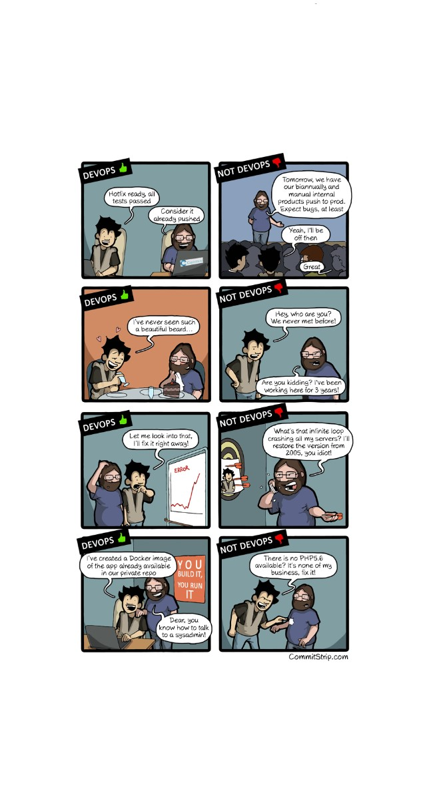
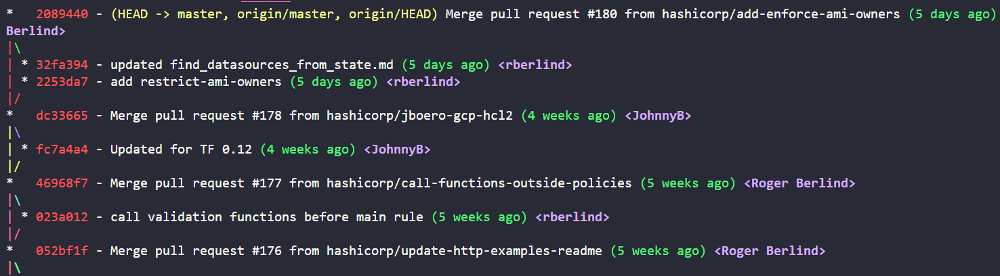

name: Intro-to-Terraform-Cloud
class: center,middle,title-slide
count: false
<br><br>

<br><br>
# Terraform Cloud on AWS

???
**Welcome to the Terraform Cloud on AWS workshop. This is a one day workshop that introduces free and paid features of Terraform Cloud (also Enterprise) using an AWS-based application for the tech labs. If you're brand new to Terraform you should try the Introduction to Terraform OSS on AWS Instruqt track before this one.**

**Terraform Cloud and Terraform Enterprise have almost identical feature sets so we'll be using Terraform Cloud as our training environment today.**

INSTRUCTOR GUIDE LINK: https://github.com/hashicorp/field-workshops-terraform/blob/master/instructor-guides/all_terraform_cloud_INSTRUCTOR_GUIDE.md

INSTRUCTOR NOTE: Welcome to Terraform Cloud on AWS. This slide deck is written entirely in Markdown language, which means you can make edits or additions then submit a pull request to add your changes to the main branch. To make edits to the slide deck simply fork this repository, edit the Markdown file(s), and submit a pull request with your changes. You can easily test a local copy of the slide deck with this python one-liner:

```
python -m SimpleHTTPServer
```

The Markdown content is contained in the docs/slides subdirectories.

Here are some helpful keyboard shortcuts for the instructor or participant:

⬆ ⬇ ⬅ ➡   - Navigate back and forth
P         - Toggle presenter view
C         - Pop an external window for presentation

Instructor notes are included in plain text, narrative parts are in **bold**. You can use the narrative quotes or change them to suit your own presentation style.

Lab exercises are conducted on the Instruqt (www.instruqt.com) platform. You can learn all about Instruqt here:
https://hashicorp.atlassian.net/wiki/spaces/SE/pages/511574174/Instruqt+and+Remark+Contributor+Guide

---
layout: true

.footer[
- Copyright © 2020 HashiCorp
- 
]

---
name: Introductions
# Introductions
- Your Name
- Job Title
- Automation Experience
- Favorite Text Editor

???
**Let's start with introductions. Give us your name, job title, any automation experience, and finally your favorite text editor. There are no wrong answers here. Except for Notepad. Notepad++ is ok though.**

If your audience is less than 25 people you can quickly go through the room and ask everyone to introduce themselves. The text editor question is a fun ice breaker, and it also gives you a quick barometer on how skilled your students will be at writing and editing code.

**You don't need to be an expert at vi to use Terraform. Today during the hands-on labs we'll be using Visual Studio Code or vim to edit some files.**

Now introduce yourself, tell a story, give the audience something to think about. If you don't have a story borrow someone else's: https://www.youtube.com/watch?v=h970ZBgKINg

---
name: tfc-link-to-slide-deck
# The Slide Deck
<br><br><br>
.center[
Follow along on your own computer at this link:

# https://git.io/JeA7Q
]

???
**The first question we usually hear during these workshops is "Can we have the slide deck?" The answer is YES, and we've made it really easy to download. In fact, it's just a website. Open this link and you can follow along on your own laptop. Just use the arrow keys to navigate.**

---
name: Table-of-Contents
class: col-2
# Table of Contents

<div>
1. OSS to Cloud/Enterprise<br>
🌥️ Terraform Cloud Overview<br>
👨🏽‍🏫 Review the Basics<br>
🔗 Configure Remote State<br>
<hr>
2. Security and RBACs<br>
🔐 Protect Sensitive Variables<br>
🛡️ Work With Access Controls<br>
<hr>
3. VCS & Policy Enforcement<br>
🕸️ Connect to VCS<br>
👬 Collaboration with VCS<br>
👮 Sentinel Policy Enforcement<br>
<hr>
4. Terraform Modules & API<br>
⚙️ Private Module Registry<br>
🏗️ API Driven Workflows<br>
<hr>
5. Extra Resources<br>
⚗️ Bonus Lab<br>
🌐 Useful Links
</div>

???
**This is our table of contents. We have a lot of ground to cover today. The workshop will alternate between lecture and lab exercise so we don't get bored and fall asleep. We'll be taking breaks roughly every 90 minutes, with a 45 minute break for lunch.**

Make sure your EAM or sponsor have arranged for lunch if presenting this as a full-day workshop.

---
name: TFE-Chapter-1
class: title

# Chapter 1
## Terraform OSS, Cloud and Enterprise

???
**In the first chapter we'll cover Terraform open source and some of the differences between OSS and Cloud and Enterprise.**

---
name: terraform-user-journey
# The Terraform User Journey
.center[
<iframe width="560" height="315" src="https://www.youtube.com/embed/FWpCQar9dYg" frameborder="0" allow="accelerometer; autoplay; encrypted-media; gyroscope; picture-in-picture" allowfullscreen></iframe>
]

https://www.hashicorp.com/resources/terraform-adoption-journey

???
**Let's start with a typical Terraform User Journey. Our CTO Armon Dadgar will explain what the stages of Terraform adoption look like.**

If you have a good sound setup, you can simply play Armon's video for your audience. Alternatively you should watch the video and learn how to do this whiteboard talk yourself.

---
name: infrastructure-as-code
class: col-2
# Infrastructure as Code

* Terraform code is written in HCL
* Stop building things by hand
* Put everything into repeatable Terraform configuration
* All build steps are now expressed as code
* If you ever have to rebuild something, it's much easier!


???
**At the core of Terraform is this idea of Infrastructure as Code. Instead of building things as a series of manual steps, or error-prone shell scripts that may or may not be tested and up to date, you express all your infrastructure build steps in this simple Domain Specific Language, or terraform. The official name for the Terraform config syntax is HashiCorp Config Language, or HCL. This language is easy for beginners and powerful for experts. Think of it as the DNA of your infrastructure.**

This slide is here in case you have any brand new, or non-technical people who have never seen a terraform resource before.

---
name: multi-platform-compliance
# Manage All Your Infrastructure
.center[

]

Terraform also integrates with on premise VMs or platform services.

???
**Terraform Cloud and Enterprise can be used to build VMs in your data center, or AWS instances in the cloud, or both. You won't have to maintain two sets of tools to build on your hybrid cloud platforms.**

---
name: self-service-infra
# Self-Service Infrastructure

.center[

]

Enable users to build what they need without running up a huge bill or putting your organization at risk.

???
**Terraform Cloud encourages safe provisioning via reusable modules and policy enforcement. Now users can build exactly what they need to do their jobs without breaking things or putting your organization at risk. A slow and cumbersome approval process is no longer required because the automation enforces best practices without manual code reviews.**

---
name: terraform-cloud-what-is-it
# Terraform Cloud - The Big Picture

.center[

]

???
**This slide shows the end state of our workshop. Over on the left our infrastructure folks have created some reusable modules that the rest of our users can implement in their own terraform code. These modules ensure that infrastructure components like networks and VMs get built correctly every time, and they also make it easy for the user to build the "right stuff" on their own.**

**In the next stage our user is writing terraform code and checking it into a Version Control System. This ensures that each and every change meant for production is recorded and reviewed. This is so important. It requires discipline and cooperation from all of your devops and infrastructure admins. When new code is committed to the master branch it triggers a plan in Terraform Cloud (or Enterprise)**

**Think of Terraform Cloud as a remote execution and state management platform for Terraform. Now you're not running terraform on your laptop like it's the wild west of cloud provisioning; instead all terraform runs happen in secure docker containers that run on our SaaS platform, or in your own data center. This allows you to encrypt and secure all your API keys, variables, and terraform state files. Access is granted only to authorized users.**

**All your terraform state files are safely stored and encrypted on the server side. Any time you need to make a change to any of your infrastructure, Terraform knows the last state it was in and can build incrementally based on what has changed. Need to add more instances to a cluster? No problem, terraform can do that for you without a complete tear-down and rebuild.**

**Before every terraform apply, you can run Sentinel policy checks against the proposed infrastructure plan to catch any policy violations. For example you might not want the devs creating super XL instances that cost a lot of money to run. You can write a simple rule that restricts developer workspaces to only using m3.medium sized instances, unless they get special permission for more.**

**Role-based access controls allow different types of users to interact with Terraform cloud according to their level of access. You might have super admins who can control everything in the organization, then regular users who can run terraform but only in dev environments. Another group might be able to push changes to production, while some users may have read-only access. Terraform Cloud/Enterprise is a true multi-tenant application.**

---
name: why-tfc-1
class: img-right
# Terraform Cloud


Terraform Cloud/Enterprise is an application that provides the following features:

???
**Let's go through a quick bullet list of Terraform Cloud features and why they matter.**

---
name: why-tfc-2
class: img-right
# Terraform Cloud


Terraform Cloud/Enterprise is an application that provides the following features:

* UI integration with VCS

???
**As your organization begins to standardize on Terraform, you'll have different types of users. Most of you will become terraform experts, but there may be others who just want to build things. They can use the terraform code that folks like you have written. To make this process easy, we have a web application. You log on, click a button, and out pops your infrastructure.**

---
name: why-tfc-3
class: img-right
# Terraform Cloud


Terraform Cloud/Enterprise is an application that provides the following features:

* UI integration with VCS
* API driven workflows

???
**For our more advanced users we have a fully featured RESTful API. This is useful for programmatic access to terraform features. You can drive terraform plan and apply commands using an API interface. If you have a CI/CD pipeline you can automate your terraform builds as part of your process.**

**APIs are the building blocks of any modern cloud automation system. By using standard, well defined APIs you ensure that your infrastructure pipelines will be ready to adapt to any future changes.**

---
name: why-tfc-4
class: img-right
# Terraform Cloud


Terraform Cloud/Enterprise is an application that provides the following features:

* UI integration with VCS
* API driven workflows
* Central state management

???
**Terraform enterprise also provides safe and secure storage for your state files. Instead of having that important state file stored on someone's laptop, now it is safely stored in the Terraform Cloud application. Only those who need access to the state file can see it, and it is protected from being overwritten or corrupted.**

---
name: why-tfc-5
class: img-right
# Terraform Cloud


Terraform Cloud/Enterprise is an application that provides the following features:

* UI integration with VCS
* API driven workflows
* Central state management
* Private Module Registry

???
**Eventually you'll have a library of Terraform code that you might like to share and publish for other users and teams in your company. The private module registry makes this easy. You build reusable modules that build infrastructure according to standards, and then publish them for your users. This can help with enforcing security policies and build standards.**

---
name: why-tfc-6
class: img-right
# Terraform Cloud


Terraform Cloud/Enterprise is an application that provides the following features:

* UI integration with VCS
* API driven workflows
* Central state management
* Private Module Registry
* Sentinel policy enforcement

???
**TFE also comes with a policy enforcement engine that can ensure that your users don't build things they shouldn't build, or configure them in the wrong way. For example, you might wish to prevent users from opening network ports to the internet, or from building too many virtual machines. All of these types of rules can be expressed using our Sentinel policy enforcement engine. Sentinel policies prevent users from doing bad things, *before* they provision to the cloud.**

---
name: why-tfc-7
class: img-right
# Terraform Cloud


Terraform Cloud/Enterprise is an application that provides the following features:

* UI integration with VCS
* API driven workflows
* Central state management
* Private Module Registry
* Sentinel policy enforcement
* Single Sign-On (on-prem Terraform Enterprise only)

???
**Terraform Enterprise also supports single sign-on using your own SAML provider. This allows you to quickly map users into your organization's teams and workspaces so they can become productive right away. This feature is only available for private Terraform Enterprise installations. We won't be covering SAML or single sign-on in today's workshop.**

---
name: why-tfc-8
class: img-right
# Terraform Cloud


Terraform Cloud/Enterprise is an application that provides the following features:

* UI integration with VCS
* API driven workflows
* Central state management
* Private Module Registry
* Sentinel policy enforcement
* Single Sign-On (on-prem Terraform Enterprise only)
* Secure API credentials

???
**Terraform enterprise can store and encrypt your cloud credentials, passwords or any other sensitive data. These credentials are stored safely inside of a Vault instance that runs inside of TFE.**

---
name: terraform-cloud-enterprise
# Terraform Cloud or Terraform Enterprise?
**[Terraform Cloud](https://app.terraform.io/signup)** is a hosted application that provides features like remote state management, API driven runs, policy management and more. Many users prefer a cloud based SaaS solution because they don't want to maintain the infrastructure to run it.

**[Terraform Enterprise](https://www.hashicorp.com/go/terraform-enterprise)** is the same application, but it runs in your cloud environment or data center. Some users require more control over the Terraform Cloud application, or wish to run it in restricted networks behind corporate firewalls.

The feature list for these two offerings is nearly identical. We will be using Terraform Cloud accounts for our lab exercises today.

???
**If you're curious which one of these your company should adopt, the answer is Terraform Enterprise. Terraform Cloud, while convenient, is not suitable to high-volume environments or private data center infrastructure. We're using it for training because the feature set is nearly identical. In other words, everything you learn today will apply in your own Terraform Enterprise environment.**

Be well versed on the feature list and differences between cloud and enterprise. In particular, remember that TF Cloud limits you to one single concurrent terraform run, and it also can't reach into your private data center or cloud account.

---
name: live-demo
class: title, smokescreen, shelf
background-image: url(images/live_demo.jpg)
# Live Demo
## Terraform Cloud in Action

???
INSTRUCTOR NOTE: You can use the same instruqt track that the students will be using to do this demo. Make sure you've gone through the entire track yourself and have your own organization, fork of the hashicat-aws repo, and sentinel policy in place. Once you have done these steps it's easy to create a new demo:

1. Start your own copy of the Terraform Cloud on AWS track
2. Echo out your AWS credentials and set them as environment variables in TFC:
```
echo $AWS_ACCESS_KEY_ID
echo $AWS_SECRET_ACCESS_KEY
```
3. Open a browser tab to your fork of the hashicat-aws git repo. Edit the main.tf file and make sure your aws_instance resource is missing the `Department` and `Billable` tags.
4. Make sure you remove the VPC file (vpc.tf) from your hashicat-aws repo. This will make the demo take longer and may break if the regions aren't set up right.
5. Begin your demo dialog:

**This is a brief demo showing off some of the features of Terraform cloud. You'll get to work with all these features during the hands-on labs today.**

**Pretend I'm a brand new developer and I want to spin up a copy of my company's web application that I can use for testing. I have my own fork of the code here on github. This is the hashicat-aws application. Like the name implies, it provides kittens as a service. You give it a placeholder URL, a height, and a width, and you get a cat. Neat huh?**

**Let's hop over to Terraform Cloud and take a look at my workspace. Here you can see the most recent terraform runs and their status, along with the exact git commit hash that led to each run being triggered. All changes are recorded, and only code that passes our sentinel policies is allowed to run.**

**Before I build anything I might want to configure some variables to adjust my infrastructure settings. Here you can see some terraform variables, prefix and region. These will determine the names of my resources and the region they will be deployed in.**

**Down bottom you see the Environment Variables. These are system shell variables that are injected into the terraform cloud container at runtime. You can optionally encrypt sensitive environment variables such as these AWS keys. Note that these are write-only. Once you encrypt a variable by marking it sensitive, you won't see it here in plaintext again. These are dynamic AWS credentials that are good for only a few hours. You can paste them in manually or use the API to auto-populate them from HashiCorp Vault.**

**New and advanced users can utilize the GUI to trigger infrastructure builds. Let's do that now by clicking on this Queue Plan button. I'm going to put "new dev environment" down as the reason for the build. Now notice that a new terraform plan has kicked off. This is the dry run. terraform is figuring out if any of the infrastructure already exists from a previous run, and then it will build or change everything to match what's in the code. That is, unless we fail a sentinel policy...**

**Oh dear it looks like we have some non-compliant terraform code that has blocked the build. This is Sentinel. Sentinel can inspect every terraform plan to ensure that users don't break the rules or build things that they shouldn't. In this case we have forgotten to tag our AWS instances with the mandatory tags, "Billable" and "Department". Since this is a hard-mandatory policy, we can't override it. We have to fix our code and get it compliant in order to proceed.**

**We'll go back over to our github repo and edit the main.tf file. In the real world you probably won't be editing files directly on the master branch of your repo, what you'd do is test this change in a branch first, have someone review the change, and then merge the change to master. But for a demo it's fine.**

INSTRUCTOR NOTE: Have your code commented and ready to go like this. That way you can quickly uncomment the required tags and save the file.

```
  tags = {
    Name = "${var.prefix}-hashicat-instance"
#     Department = "devops team"
#     Billable = "true"
  }
```

**Now if I pop back over to Terraform Cloud you can see that a new run has triggered based on the change I just made. Terraform Cloud watches that master branch for any changes and automatically picks them up. I still have a chance to review the run in the UI here. You can see that my policy check is now passing, which will make the finance people happy, and I can continue building my dev environment.**

**I'll click Confirm & Apply and we'll start building.**

If you want you can paste an emoji in along with your confirm message. Have fun with it.

**And away we go. Terraform is building a bunch of network infrastructure and deploying my hashicat application onto a new aws instance in {REGION}. This application has been specially customized for training; it takes about 3-4 minutes to run the first time, then subsequent terraform apply commands only take 15-20 seconds. You might not use terraform this way in the real world but it's great for workshops because you can get a lot of terraform runs done in a short time without tearing down and rebuilding everything.**

**Oh look, our apply looks like it's finished. Let's see what we built.**

INSTRUCTOR NOTE: You might have to queue another plan here to get the app URL to refresh. This is normal, and if anyone asks you can say it's because the website re-provisions itself on every terraform run (which is not the default or how you'd do it in production.) Just wave your hand slowly and say "This is not the URL you're looking for."

**Ok let's try a re-provision and see if the app loads this run. Ah, much better! Look at these cat(s). Now I can run terraform over and over again with different variables to make changes to the dev environment. For example, if we go into the variables and set the placeholder to placedog.net, let's see what we get...**

Create a new variable called `placeholder` and set it to `placedog.net`. Queue up another run and approve it.

**Note that the terraform run goes pretty quickly now. This is because we're running a custom provisioner that kicks off on every single run. If I reload the page I now get a picture of a dog instead of a cat.**

**This has been a brief demo of a simple infrastructure as code workflow that you can use to get started with Terraform. We'll take a short break and when we return you'll get to do some hands on exercises in the first lab.**

---
name: review-the-basics
class: title, smokescreen, shelf
background-image: url(images/terraform_scifi.jpg)
# Review the Basics
## A Terraform OSS Refresher

???
**This section is a quick review of terraform open source usage.**

---
name: review-basic-terraform-commands
# Terraform Command Review

Let's review some of the most useful terraform commands:

```bash
terraform init    # Initialize the current directory
terraform plan    # Dry run to see what Terraform will do
terraform apply   # Apply the Terraform code and build stuff
terraform destroy # Destroy what was built by Terraform
terraform refresh # Refresh the state file
terraform output  # View Terraform outputs
terraform graph   # Create a DOT-formatted graph
```

Need a refresher? Try the [Intro to Terraform on AWS](https://instruqt.com/hashicorp/tracks/terraform-build-aws) lab exercises.

???
Depending on the maturity of your audience you might take a detour back to the Intro to Terraform track. Ideally everyone in the workshop has already completed this or has equivalent experience with Terraform OSS.

---
name: what-is-a-workspace
# Terraform Workspaces
.center[
]

.center[
.small[https://www.terraform.io/docs/cloud/workspaces/]
]


???
**A Terraform workspace is a managed unit of infrastructure. On your laptop or local workstation, the terraform workspace is simply a directory full of terraform code and variables. This code is also ideally stored in a git repository. In the cloud the workspace takes on some extra roles. In Terraform Cloud and Enterprise your workspace is still where you execute terraform runs but there are extra features like access controls, secure variables and policy management. Terraform is only run from secure docker containers that you control. (There is one exception to this and that is when you run terraform locally, but only store the state in Terraform Cloud). Your local workspace, or copy of a git repo, generally maps 1:1 with your terraform workspace.**

**What should I put in a workspace? We recommend infrastructure that should be managed together as a unit be placed into the same workspace. Who has to manage it, how often does it change, does it have external dependencies that we can't control. Ask these questions. Think about what happens when you run `terraform apply`. You should be able to describe what you just built, and what outputs it provides, who this infrastructure is for, and how to utilize it.**

**Terraform forces us to adopt the correct behavior which is to create a contract with our code. The terraform configuration agrees to build X, Y, and Z infrastructure, and to hand off some responsibilities to (Chef|Puppet|Ansible) for application configuration and deployment.**

**A workspace could be: An entire application stack from network on up. Great for dev environments that you want to be completely self-contained. Or it could be a workspace that builds core network infrastructure and nothing else. Maybe the network team has to manage that. They get to be the lords of the network and provide terraform outputs to those who need a VPC or subnet. You can also use workspaces to deploy platform services like Kubernetes. Terraform can even manage IAM policies and roles, so that you can stand up an entire AWS account from scratch using only code. (Which is exactly what you're about to do in the labs...)**

---
name: what-is-an-organization
# Terraform Organizations
.center[
]
.center[
.small[https://www.terraform.io/docs/cloud/users-teams-organizations/organizations.html]
]

???
**Organizations are shared spaces where users become members of teams and collaborate on workspaces. An organization can have hundreds or thousands of workspaces, and multiple teams with different levels of access. Users may belong to multiple organizations and teams.**

---
name: what-is-a-team
# Terraform Teams
.center[
]
.center[
.small[https://www.terraform.io/docs/cloud/users-teams-organizations/teams.html]
]

???
**Teams are groups of users within an organization. Access rights to workspaces are granted at the team level. So for instance you might want to have an admins team, a managers team, and a developers team like you see here.**

---
name: our-application
# HashiCat Application - Kittens as a Service

.center[]

???
**This will be our application for the training today. We've already written all the Terraform code for you. This app will help us learn how different features work. Hashicat should be familiar if you've already been through Intro to Terraform on AWS. This is also the same app we used during the demo earlier.**

---
name: terraform-state
class: title, smokescreen, shelf
background-image: url(images/checklist.jpg)
# Terraform State
## Infrastructure Lifecycle Management

---
name: tf-state-file
# Terraform State
```tex
  "primary": {
      "id": "i-0413fe5b4509d65b1",
      "attributes": {
          "ami": "ami-06f2f779464715dc5",
```

Terraform stores information about the resources it has built in a **state file**. This important file contains all of the data that Terraform needs to change, update, and delete infrastructure.

By default, the state file is stored in your local workspace.

???
**Can anyone tell me why the state file is so important? Have you ever lost your state file? What was that like? I can tell you from experience it's not fun. You have to go and clean up or delete everything you built by hand instead of simply running `terraform destroy`. Recovering from a lost or corrupted state file is possible but painful and time consuming.**

**Also, sometimes sensitive data can leak to the state file. We do our best to prevent this but the safest solution is to encrypt and store the entire state file in a safe place.**

---
name: why-not-local-state
class: img-left-full
# Oops, I Lost My State File


The local state file has some disadvantages:

* Sometimes contains secrets or sensitive data
* Can't collaborate because the file is on someone's laptop
* Risk of losing or deleting the state file
* No centralized record keeping

???
**Let's not be the dog at my homework kid. There's no excuse for losing your state file because you can easily store it for free in your Terraform Cloud account.**

---
name: tfcloud-remote-state
# Terraform Cloud Remote State
Terraform Cloud Remote State is free and available to all users. The requirements to get it set up and working are below.

* Free or paid Terraform Cloud account
* A **`.terraformrc`** (Unix/Linux) or **`terraform.rc`** (Windows) config file
* User access token stored in your config file
* Remote backend config file. We name it **`remote_backend.tf`** for consistency.

**WARNING** - do not copy your Terraform Cloud API token to github!

https://www.terraform.io/docs/backends/types/remote.html

???
**Please raise your right hand and repeat after me:**

**"I will never store credentials in my terraform workspace."**

The reason for the stern warning is because users have been copying this .terraformrc file to github during training workshops. Don't do it. Edit the file once, put your token in, and leave it alone. dot-files are hidden for a reason.

---
name: lab-exercise-0
# 👩‍💻 Getting Started with Instruqt
<br><br>
[Instruqt](https://instruqt.com) is the HashiCorp training platform. Visit the link below for a short tutorial, or if you're already familiar with Instruqt you can skip to the next slide.

[https://instruqt.com/instruqt/tracks/getting-started-with-instruqt](https://instruqt.com/instruqt/tracks/getting-started-with-instruqt)

???
**That brings us to the first lab exercise. If you've worked with Instruqt before you can skip this lab. Or if it's your first time do this 10 minute track to get familiar with the lab environment.**

---
name: lab-exercise-1
# 👩‍💻 Lab Exercise: Configure Remote State
<br><br>
In this lab you'll set up a free Terraform Cloud account and configure your account for remote execution of Terraform commands.

Your instructor will provide the URL for the first lab environment.

🛑 **STOP** after you complete the first quiz.

???
**And finally we are ready for The Unicorn Project. It's a devops story where you play the lead role. Here is the link to your lab environment. The lab environment runs in your browser. If you want to save your progress make sure you create an Instruqt account. Go ahead and work through the first part of the track until you reach the first quiz. When you complete the quiz stop and take a break until the next lecture.**

Give the private instruqt track link to your participants. You can create new invites in the instruqt control panel. Ask in #proj-instruqt on Slack if you need help with this part.

---
name: TFE-Chapter-2
class: title
# Chapter 2
## Security and Role-Based Access Controls

???
**Welcome back, you made it through Chapter 1. Next we're going to look at secure variables and role based access controls or RBACs.**

---
name: securing-sensitive-vars
class: title, smokescreen, shelf
background-image: url(images/secure_lock.jpg)
# Sensitive Variables
## A Secure Place for API Credentials

???
**First let's talk about sensitive variables, specifically API keys. Every time you build infrastructure on AWS you need an access key pair. The key pair includes the Access Key Id, and the Secret Access Key. These two strings paired together, with an optional time-based token, allow you to make requests to AWS API endpoints. Amazon spins up the resources and begins billing you for usage. These keys, especially if they are created by an account admin, are very powerful. The default setting in AWS is to grant admin-level access to the user. Let's look at how this can be a major problem...**

---
name: Security-and-Compliance
# Did you know?
Thousands of API and cryptographic keys are leaked to GitHub every day!

https://nakedsecurity.sophos.com/2019/03/25/thousands-of-coders-are-leaving-their-crown-jewels-exposed-on-github/

>"I think efforts like GitHub’s Token Scanning project should be applauded, but they are only effective once a leak has already occurred. This problem also is likely not isolated to GitHub – it will affect any publicly available code. We need more research to develop systems that help developers avoid this mistake in the first place."

???
**This is from a recent article about a study Sophos did on credentials stored on GitHub. They used a free API key and simple search algorithm to crawl through github and what they found was very disturbing. Hundreds of thousands of API keys, passwords and other sensitive strings were found.**

**If you've never seen it in action this is what usually happens. The attacker takes control of your AWS account and begins spinning up an enormous cryptocurrency farm with the maximum number of instances allowed. Then you have to get AWS support to help you untangle the mess. It's not fun. You really, really want to protect those API keys.**

---
name: Protecting-Sensitive-Variables
class: img-right-full
# Protecting Sensitive Variables


* Cloud API Keys
* Passwords
* SSH private keys
* SSL certificates
* Any sensitive text or data

???
**Terraform Cloud has built in support for encryption and storage of any short string of text. This allows you to safely use these credentials during the provisioning process without exposing them in plaintext or storing them on someone's laptop.**

---
name: where-are-your-creds
# Where Are Your API Keys?
Terraform requires credentials in order to communicate with your cloud provider's API.

These API keys should **never** be stored directly in your terraform code.

Config files and environment variables are a better option, but the credentials still live on your workstation, usually stored in plaintext.

???
**In case we weren't clear earlier, do not ever store credentials in your terraform code. Don't do it.**

---
name: a-better-way-creds
# A Better Way to Store Sensitive Data

Terraform Cloud can safely store your credentials and encrypt them for you. You can use this encrypted storage for passwords, TLS Certificates, SSH keys or anything else that should not be lying around in plain text.

.center[]

???
**Here's an example of storing AWS credentials safely so that we can use them inside of a workspace. The user doesn't have to manage these once they are set.**

---
name: terraform-teams
class: title, smokescreen, shelf
background-image: url(images/teamwork.png)
# Terraform Cloud Teams
## Role-Based Access Controls (RBAC)

???
**This section is about teams and role based access controls.**

---
name: terraform-rbac-2
class: img-right
# Teams for Terraform Collaboration


Teams are used to grant different levels of access to different parts of your Terraform infrastructure, depending on the user's role.

Workspaces access levels include read, plan, write, and admin. Super users can also be granted organization wide permissions for managing policies and VCS settings.

???
**You'll probably start out with a few admins, but as your terraform usage grows more and more users and applications will need different levels of access.**

---
name: lab-exercise-2
# 👩‍💻 Lab Exercise: Secure Variables and RBACs
<br><br>
In this lab you'll learn how to store and encrypt sensitive variables and set up role-based access controls (RBACs).

Continue the lab exercises from where you left off.

🛑 **STOP** after you complete the second quiz.

???
**And that brings us to the second lab, where you'll tackle the Secure Variables and RBAC challenges. Once you've made it past the second quiz you can take a break until Chapter 3.**

---
name: TFE-Chapter-3
class: title

# Chapter 3
## Version Control and Sentinel Policies

???
**Now we're getting into slightly more advanced territory. It is also very cool territory because you can start to drive automation with code. We're going to cover VCS integration and Sentinel policies. The reason we cover VCS before Sentinel is because you'll want to define all your policy as code too!**

---
name: version-control-title
class: title, smokescreen, shelf
background-image: url(images/git_log.png)
# Terraform With VCS
## Version Control Systems

???
**Version control systems have been around for at least a few decades. Can anyone name a few?**

Common answers might be RCS, SVN (Subversion).

**And what's the world's most popular distributed version control system? That's right, it's git. Git was invented by Linus Torvalds, the same gent who created Linux.**

---
name: whats-a-vcs
class: img-right
# What is a Version Control System (VCS)?


Version control systems are applications that allow users to store, track, test, and collaborate on changes to their infrastructure and applications.

Terraform Cloud integrates with most common Version Control Systems.

???
**Make sure you don't confuse git (the version control system) with GitHub (a web-based application containing the world's largest collection of git repositories). What are some other flavors of git? Bitbucket, GitLab are both also supported in Terraform Cloud. Today you'll be working with GitHub but you can integrate with any of the major git vendor software.**

---
name: tfc-infra-as-code-workflow
class: img-left
# VCS Integration with Terraform Cloud


Terraform Cloud can directly integrate with source code repos in GitHub Enterprise, Gitlab, and Bitbucket. This allows you to build simple DevOps workflows with code reviews, testing and approvals.

https://xkcd.com/1597/

For this workshop you'll only need four or five git commands.

???
**If you've never used git before, don't worry. We are only going to be using four or five basic commands. And as our friends at XKCD have pointed out, you can always wipe everything clean and clone a fresh copy of the code.**

---
name: multi-user-collaboration
class: img-right-full
# User Collaboration

Users from different teams or departments can all benefit from centralized infrastructure as code.

Infrastructure changes are no longer created in isolated silos.

Each team can contribute or consume Terraform code according to their needs.

.small[http://www.commitstrip.com/en/2015/02/02/is-your-company-ready-for-devops/]

???
**When you store all your terraform code in git repos, you unlock some extra features like user collaboration. This is a funny comic called CommitStrip where dev and ops try to learn to work together. Terraform Cloud helps bring these teams closer in a more productive way.**

---
name: vcs-driven-workflow
# Automated Test Pipelines
.center[]

When your Terraform code is stored in a version control system, you unlock extra features like pull requests, code reviews and testing. Here's an example showing some tests that run on our training lab repo.

???
**Storing your code in VCS also enables you to build automated test pipelines and conduct code reviews to approve any pending changes. Multiple users can build and contribute changes to the same infrastructure as code base without stepping on one another's toes.**

---
name: everything-is-recorded
# No More Untracked Changes
.center[]

Every infrastructure change is recorded and tracked in the git log. You will always know exactly who made a change, what was changed, who approved the change, and when and why the change was made.

???
**Your auditors and security folks will like this because every change is tracked. No more mystery changes or wondering if something broke because of an untracked change.**

---
name: sentinel-policy-enforcement
class: title, smokescreen, shelf
background-image: url(images/security_lasers.jpg)
# Sentinel
## Policy Enforcement for Terraform

???
**Sentinel is the HashiCorp policy enforcement language and it is only available in terraform cloud or enterprise.**

---
name: what-is-sentinel
# What is Sentinel?
```hcl
# Restricting region in AWS
aws_region_valid = rule {
  all region_values as rv {
	rv == "us-east-1"
  }
}
```

Sentinel is HashiCorp's policy enforcement language. Sentinel policies are checked after **`terraform plan`** is run. Sentinel will intercept bad configurations *before* they go to production, not after.

???
**As the saying goes, an ounce of prevention is worth a pound of cure. Sentinel helps you catch misconfigurations and bad behavior before the infrastructure is deployed, not after.**

---
name: what-can-sentinel-do
# Example Uses for Sentinel
* Enforce owner allow list on aws_ami data source
* Enforce mandatory tags on instances
* Restrict availability zones
* Disallow 0.0.0.0/0 CIDR blocks
* Restrict instance types of EC2 instances
* Require VPCs to be tagged and have DNS hostnames enabled

You can implement these rules and many more using Sentinel.

???
**Sentinel is flexible and can be used to detect almost any kind of compliance or security violation.**

---
name: sentinel-enforcement-levels
# Sentinel Enforcement Levels
⏰ **Advisory** - Issues a warning to the user when they trigger a plan that violates the policy.

⚠️ **Soft-Mandatory** - Blocks regular users from deploying the non-compliant infrastructure. Only admins can override.

🛑 **Hard-Mandatory** - Blocks all users and apps from deploying the non-compliant infrastructure.

???
**There are three enforcement levels. You might start with everything set to Advisory to give your users a warning. Then you could set a date to start enforcing soft and hard mandatory rules for some or all workspaces in your organization.**

---
name: org-or-workspace
# Apply to Organization or Workspaces
.center[]

???
**You can be very specific or very broad with your policy enforcement. Organization-wide policies can be implemented to ensure that basic security rules are always followed everywhere.**

---
name: lab-exercise-3
# 👩‍💻 Lab Exercise: Version Control and Sentinel
<br><br>
In this lab we'll cover Version Control System (VCS) integration and Sentinel Policy Enforcement.

Continue the lab exercises from where you left off.

🛑 **STOP** after you complete the third quiz.

???
**This lab is a bit more challenging so take your time and read the notes carefully. I will be around along with your TA to answer questions if you get stuck. Stop after the third quiz.**

---
name: TFE-Chapter-4
class: title
# Chapter 4
## Modules and API Automation

???
**This is the final content chapter where we'll cover the private module registry and API automation.**

---
name: private-module-registry
class: title, smokescreen, shelf
background-image: url(images/lego_wallpaper.jpg)
# Terraform Modules
## Reusable Infrastructure as Code

???
**First let's take a look at modules. Modules are fun, like these LEGO bricks.**

---
name: what-even-is-module
# What is a Terraform Module?
.center[]

Modules are reusable units of Terraform code that hide unnecessary complexity from the user. This one creates a standard VPC configuration with only 8 variables.

???
**You'll get to use this module in the lab. If you've ever built out a VPC by hand you know that it's not a super simple process. You need to configure the correct network routes, set up your subnets, internet gateways and a bunch of other settings to get it right. This VPC module is meant to give you a standard set of inputs that you can use to configure a best-practice VPC with public and/or private subnets. This saves you the trouble of having to go write all that terraform code yourself.**

---
name: how-modules-configured
# How are Terraform Modules Configured?
Creating Terraform Modules in 3 easy steps:

1. Write some Terraform code, configuring inputs and outputs.
2. Store the Terraform code somewhere your workstation can access it.
3. Reference your modules by file path or source URL.

Sounds easy right?

What if you had to manage dozens or hundreds of modules, with different versions of each?

???
**Think of a terraform module like a black box. Variables (inputs) go in one side, and outputs come out the other side. What happens in the middle is really none of the user's business, as long as they get what they wanted from the module. This lets you control what users are able to build, and guide them to the right path by putting guard rails around them. You can hide variables and settings that the user should not tinker with, and this also keeps things simpler for the end user who just wants their VPC to work so they can build some instances.**

**The challenge is when you start having dozens or hundreds of modules and lots of users consuming them...you really need a centralized way to manage this stuff, which brings us to...**

---
name: private-module-registry
class: img-right
# Private Module Registry


Terraform modules are reusable packages of Terraform code that you can use to build your infrastructure.

Terraform Cloud includes a Private Module Registry where you can store, version, and distribute modules to your organizations and teams.

???
**This is just like the public module registry but it runs inside your own Terraform Organization where only your users can access it. This way you can share private or confidential code, or even take the public modules and fork them for your own use.**

---
name: api-driven-workflows
class: title, smokescreen, shelf
background-image: url(images/enter_the_matrix.jpg)
# Terraform Cloud API
## Automate Everything

???
**This section will give us a small sample of what's possible using the Terraform Cloud API to build automation. APIs provide a clear and well understood method for interacting with Terraform Cloud, even from systems that have no native Terraform support or integrations.**

---
name: whats-an-api
# Application Programming Interface
```ruby
curl -s -H "Accept: application/json" https://icanhazdadjoke.com

{
  "id": "jyPCYTKuskb",
  "joke": "How did Darth Vader know what Luke was getting for
           Christmas? He felt his presents.",
  "status": 200
}
```
APIs are the default language of the Internet. According to Akamai research 83% of Internet traffic is made up of API calls (JSON/XML).
.center[.small[https://www.akamai.com/us/en/about/news/press/2019-press/state-of-the-internet-security-retail-attacks-and-api-traffic.jsp]]

???
**There are APIs for all kinds of stuff! Even Dad Jokes!**

---
name: terraform-cloud-api
# Terraform Cloud API - How It Works
```bash
# Create a workspace using the API
curl --header "Authorization: Bearer $TOKEN" --header \
"Content-Type: application/vnd.api+json" --request POST \
--data @/tmp/create_workspace.json \
https://app.terraform.io/api/v2/organizations/$ORG/workspaces
```

1. Applications and tools authenticate to the API with a token.
2. JSON payloads determine which knobs and buttons to push.
3. The JSON payloads are submitted to different API endpoints depending on what you're doing.

Most programming languages have helper libraries for working with APIs.

???
**During the lab we'll be using the Unix cURL command. Curl is like a swiss army knife for talking to APIs and websites.**

---
name: api-use-cases
# Terraform Cloud API - Use Cases

* Continuous Integration test pipelines
* Connect with workflow management systems
* External systems that need to query Terraform state for data
* Self-service portal with Terraform on the backend
* Custom command line scripts for specific needs

???
**Here are just a few of the things you might build with the Terraform Cloud API.**

---
name: lab-exercise-4
# 👩‍💻 Lab Exercise: Modules and API Automation
<br><br>
In this lab we'll cover the Private Module Registry and API Automation with Terraform Cloud.

Continue the lab exercises from where you left off.

🛑 **STOP** after you complete the fourth quiz.

???
This is the last official lab; the bonus lab will be stored in a separate track.

---
name: TFE-Chapter-5
class: title

# Chapter 5
## Bonus Lab & Extra Resources

---
name: bonus-lab

# Bonus Lab
## 🦄 The Gauntlet 🏆

If you have completed all the workshop content and would like to try the bonus lab, your instructor can provide you with an invite.

???
This bonus lab can be used with any of the three Terraform Cloud workshops. Create an invite if you'd like to share it with your students.

https://instruqt.com/hashicorp/tracks/terraform-cloud-bonus-lab

---
name: additional-resources-tfe
# Additional Resources
If you'd like to learn more about Terraform Enterprise or Terraform Cloud visit the links below:

Terraform Enterprise Product Page
https://www.hashicorp.com/products/terraform/

Why Consider Terraform Enterprise Over Open Source?
https://www.hashicorp.com/resources/why-consider-terraform-enterprise-over-open-source

Terraform AWS Provider Documentation
https://www.terraform.io/docs/providers/aws/

---
name: Feedback-Survey
# Workshop Feedback Survey
<br><br>
.center[
Your feedback is important to us!

The survey is short, we promise:

# https://bit.ly/hashiworkshopfeedback
]

---
name: the-end
class: img-caption

# Congratulations, you completed the workshop!

