name: Intro-to-hcp-terraform
class: center, middle, title-slide, no-footer
count: true

# HCP Terraform on Azure

???
# HCP Terraform on Azure workshop
## Getting started
This is a half-day workshop that introduces HCP Terraform using an Azure-based application for the Instruqt labs. If you're brand new to Terraform you should try the Introduction to Terraform Community Edition on Azure Instruqt track before this one.

The instructions on how to conduct a workshop are in the standard [instructor's guide](https://github.com/hashicorp/field-workshops-terraform/blob/main/instructor-guides/all_hcp_terraform_INSTRUCTOR_GUIDE.md).

## Navigation

Here are some helpful keyboard shortcuts for the instructor:

- Use your keyboard ⬅ ➡ to navigate back and forth
- Use `P` to toggle presenter view and notes
- Use `C` to detach an external window for presentation

**Note** - We disabled navigating using mouse gestures and scrolling. Most instructors at HashiCorp use Macbooks, and with Apple Magic Mouse or Magic Trackpad the swipe gesture can inadvertedly move the slides backwards or fowards, loosing control of the presentation.

## Customization

This slide deck is written entirely in Markdown language, which means you can make edits by submitting a pull request to add your changes to the main branch. To make edits to the slide deck, fork this repository, edit the Markdown file(s), and submit a pull request with your changes. When editing, you can test a local copy of the slide deck with this Python one-liner:

```
python3 -m http.server
```
---
layout: true

.footer[
- Copyright © 2023 HashiCorp
- 
]

---
name: Workshop Objectives
class: minimal
# Workshop Objectives
- **Run infrastructure as code remotely**

Store state and execute Terraform runs in a SOC2-compliant and reliable environment

- **Establish Cloud compliance and management**
  
Set up permissions and governance features across any resource managed by Terraform, and add capabilities for policy enforcement

- **Create self-service infrastructure with a private registry**
  
Standardize infrastructure across your provisioning processes using your private registry

???
# Workshop Objectives

## Introductions
1. Introduce yourself. Let people know:
   - Your Name
   - Your Title
   - Your tenure with Hashicorp
   - Optionally provide an ice breaker 
   
2. If your audience is less than 20 people you have the option to quickly go through the room and ask everyone to introduce themselves if they wish to participate.

## Goals for the workshop
1. Launch a deployment to  using HCP Terraform using VCS workflows
2. Explore management and configuration options with team permissions and deployment policies
3. Test the Terraform Private Registry and some API functions

---
name: Table-of-Contents
class: col-2, top, minimal-list, minimal-toc
# Table of Contents

**1- Infrastructure Automation**
* Terraform Adoption Journey
* Terraform Editions
* HCP Terraform

<hr>

**2- Terraform Workflow**
* Code and workspaces
* Data protection and access control
* Team collaboration

<hr>

**3- VCS and Governance**
* Using Version Control
* Policy Validation
* Automated Testing

<hr>

**4- Terraform Modules & API**
* Terraform Private Registry
* API Driven Workflows
* CI/CD Integration

???
# Table of Contents
## Organization
- There are four sections. 
- The workshop alternates between lecture and lab exercise. 
- We'll be taking at least two breaks in between.

## Timing
- Lecture 20 minutes
- Related Lab 20 minutes

**INSTRUCTOR NOTE**: 

- The suggested timing arrangement leads to about 160 minutes of time for lectures and lab; that is just under three (3) hours of __on-air__ work to complete the exercise not including breaks. 

- Please work with your sponsor to arrange sufficient time. 

- For instance, four (4) hours is very comfortable, while three (3) hours is tight.

---
name: Lab Organization
class: table-exercises
# Lab Exercises
  <table>
  <tr>
    <td>
      <p><strong>Part 1</strong></p>
      <ul>
        <li>Getting Started - Explore the Lab</li>
        <li>HCP Terraform Setup</li>
        <li>Safekeeping your Terraform State</li>
        <li>Quiz 1: Terraform Remote State</li>
      </ul>
    </td>
    <td>
      <p><strong>Part 2</strong></p>
      <ul>
        <li>Workspace variables</li>
        <li>Working with Teams in HCP Terraform</li>
        <li>Quiz 2: Secure Variables</li>
      </ul>
    </td>
  </tr>
  <tr>
    <td>
      <p><strong>Part 3</strong></p>
      <ul>
        <li>Versioned Controlled Infrastructure</li>
        <li>Collaborating with VCS</li>
        <li>Terraform Compliance with Sentinel</li>
        <li>Quiz 3: Version Control and Terraform</li>
      </ul>
    </td>
    <td>
      <p><strong>Part 4</strong></p>
      <ul>
        <li>Terraform Private Registry</li>
        <li>API Driven Workflows</li>
        <li>Quiz 4: Terraform Private Registry</li>
      </ul>
    </td>
  </tr>
</table>

???
# Lab Exercises

## Lab organization
- Lab exercises are conducted on the [Instruqt](https://instruqt.com) platform. 
- To join the lab, each participant needs to register an account with [Instruqt](https://play.instruqt.com/signup).
- The instructor must provide an Instruqt Invite link so the audience can join the lab.
- For each section, point out to the participant that they can pause, and return to the lecture, after each section's Quiz.

**INSTRUCTOR NOTE**: Make a shortened version of the Instruqt Invite link and paste in the [Instruct Invite](#instruqt-invite) slide.

## More information
- You can learn all about Instruqt in this [HashiCorp Wiki page](https://hashicorp.atlassian.net/wiki/spaces/IL/pages/2364835720/Creating+Slide+Shows+with+Remark).

**INSTRUCTOR NOTE**: If pressed for time, the instructor can guide the participants so they complete the very last challenge, `API Driven Workflows` on their own time.

---
name: participant-requirements
class: col-3, header-adjust, minimal-list
# Participant Requirements
### HCP Terraform
- HCP Terraform account (free)

- Terraform "___Plus Tier___" Trial

- HCP Terraform personal access token 

### GitHub
- Personal account
  
- GitHub personal access token (classic)

- ~ five (5) GitHub Actions minutes (optional)

### Instruqt Account

- Free to sign up

- HashiCorp private invite link (your instructor will provide)


???
# Participant Requirements

- The requirements for the lab exercises are described in detail in the workshop

- The lab exercises make allowences for sign up and set up of these accounts

- The required experience level is **beginner**

---
name: TFE-Chapter-1
class: title, no-footer

# Chapter 1
## Infrastructure Automation

???
# Chapter 1: Infrastructure Automation

## Organization
This chapter is organized in three sections:
1. Terraform Adoption Journey

   - Explain the maturiy lifecle from individuals, to teams, and to organizations in the adoption of Infrastucture-as-Code with Terraform

2. Terraform Editions

   - Understand Terraform Community Edition and the differences between Community Edition, HCP Terraform, and Terraform Enterprise

3. Benefits of using HCP Terraform

   - Hightlight the key benefits of using HCP Terraform to 

     - Build infrastructure, 
     - Standardize best practices, and 
     - Integrating into CI/CD pipelines

**INSTRUCTOR NOTE**: Emphasize how the benefits reflect the objectives for the workshop. 

---
name: terraform-adoption-journey-individual
class: col-2, minimal-list
# Terraform Adoption Journey: Individual

A Terraform deployment usually starts with an individual practitioner and a prescriptive workflow

1. Write a Terraform configuration file or "infrastructure-as-code"
     
2. Iterate to make the plan correct, then apply the plan

3. As needs change, modify the configuration file and repeat the plan-and-apply process


???
# Terraform Adoption Journey: Individual

- A HashiCorp Terraform deployment usually starts with an individual practitioner who writes a Terraform configuration file ("infrastructure as code").
  
- The individual practitioner iterates to make the plan correct, then applies the plan. 

- As needs change, they modify the the configuration file and repeat the plan-and-apply process.

**INSTRUCTOR NOTE**: Highlight potential vulnerabilities:

1. The individual practitioner is responsible for the Terraform State 

2. The individual practitioner also needs to manage and secure credentials to the target environment

3. The individual practitioner manages the properties of the deployment

4. It is not ideal for collaboration 

---
name: terraform-adoption-journey-teams
class: col-2, minimal-list
# Terraform Adoption Journey: Teams (1/2)

With teams, the process is fundamentally the same, but there should be a version control system to provide a single source of truth

1. With a version control system, there is only one change at a time
   
2. Teams apply changes to the infrastructure from that single source of truth


???
# Terraform Adoption Journey: Teams (1/2)

- If there's a team collaborating to use Terraform, rather than just one individual, the process is basically the same.

- They should use some sort of version-control to provide a single source of truth.

**INSTRUCTOR NOTE**: Highlight the following:

1. Teams are responsible for the Terraform State. Don't put it in VCS.

2. Teams need coordinate and secure credentials to the target environment

3. VCS reduces collisions by centralizing the desired properties of the deployment as written in the IaC collection.

---
name: terraform-adoption-journey-multiple-teams
class: col-2, minimal-list
# Terraform Adoption Journey: Teams (2/2)

With several teams involved, it is best to decompose the infrastructure hierarchically

1. Each team becomes responsible for a functional part of the infrastructure
   
2. The Terraform configuration components decompose into separate workspaces
   
3. Each workspace should have role-based access control to differentiate producers and consumers


???
# Terraform Adoption Journey: Teams (2/2)

- But as we go to many teams this starts to become impractical. There's too much coordination required and the configuration becomes overly complex.

- Instead, what we'd like to do is hierarchically decompose our infrastructure. We might say we have one team that focuses on the underlying network typology and cloud configuration.

- For instance, we might have a series of middleware—a middleware tier. This might look at different things:
  
  - We might have a central solution for logging,
  - We might have a central monitoring solution,
  - Maybe we have security appliances that we share between applications.

**INSTRUCTOR NOTE**: Highlight the following:

1. You may introduce the concept of producers and consumers.

2. How do we organize a common pattern around publishers and consumers?

---
name: terraform-adoption-journey-organization
class: col-2, minimal-list
# Terraform Adoption Journey: Organization

Most organizations have a few publishers and many consumers working against a central registry

1. A central registry consists of pre-approved templates with configurable properties

2. Catalogue items are governed by policies that reflect technical, security and compliance guidelines

3. Self-service infrastructure must fall within the "sandbox" model 


???
# Terraform Adoption Journey: Organization

- In some organizations, there are many users, most of whom are not trained on Terraform, and it wouldn't be practical to train them all. 

- One common pattern is to have a few producers (publishers) and a large number of consumers all working against a central registry. 

- Organizations can also use HashiCorp Sentinel to define and maintain a **sandbox**, which polices what consumers can and cannot do ("Policy-as-Code").

**INSTRUCTOR NOTE**: What is that sandbox model?

1. A sandbox is a metaphor to define a safe deployment boundary. Instead of redifining deployment standards for every request, a sandox says: "**You're allowed to do any type of infrastructure change you want inside of a sandbox**."
   
2. Policies define the sandbox. Deployments that comply with policies are on the inside, vs. things that violate the policies are on the outside and are rejected.

3. For instance, we don't want teams to open up the firewall and allow all traffic to come in, or set their S3 bucket to the universe and expose data.


---
name: terraform-adoption-journey
class: center
# Video from our CTO
[](https://www.youtube.com/embed/FWpCQar9dYg)

Blog: [Terraform Adoption Journey](https://www.hashicorp.com/resources/terraform-adoption-journey)
???
# Video from our CTO
- HashiCorp's CTO, Armon Dadgar, explains the stages of Terraform adoption.
  
- Direct the audience to optionally play Armon's video during the breaks.

- The video is just under 12 minutes long and it describes very eloquently the stages of the Terraform adoption journey.

- The Blog link also provides an excellent breakdown of the same content.

---
name: terraform-editions
class: col-3, header-adjust, header-adjust-minimal-list
# Terraform Editions

### Terraform Community
* Adopt infrastructure as code and use a standard configuration language
* Store configuration files in a version control system
* Manually pull and commit the most up-to-date version to perform Terraform operations
* Use and publish public modules as infrastructure templates

### HCP Terraform
* Integrate HCP Terraform into your existing workflows
* Ensure that only approved teams can access, edit, and provision infrastructure
* Publish configuration modules in a private registry to define approved infrastructure patterns
* Enforce best practices and security rules with policy as code framework

### Terraform Enterprise
* Set up a private instance of HCP Terraform with dedicated support from HashiCorp
* Accommodate advanced security and compliance requirements

???
# Terraform Editions
## Terraform Community Edition
- A.K.A. Terraform

- Terraform is a sophisticated technology used to deploy infrastructure

- Terraform contains everything you need to configure, plan and deploy 

## HCP Terraform
- HCP Terraform is a SOC2-compliant cloud service to manage the lifecycle of infrastructure deployments with Terraform

- HCP Terraform provides features to manage user access, assign team permissions, automate integrations, host private resources, enforce policies, conduct audit, etc.

## Terraform Enteprise
- Terraform Enterprise is private instance of HCP Terraform deployed in a private environment with dedicated support from HashiCorp.

- Terraform Enterprise appeals to security conscious organizations that must accommodate advanced security and compliance requirements.
---
name: hcp-terraform
class: col-2, header-adjust, minimal-list
# HCP Terraform
### Single control plane for provisioning

* Fully-managed, infrastructure-as-code cloud service
  
* Provision and manage any infrastructure with one workflow

* Self-Service infrastructure to provision infrastructure on-demand from a private registry
  
* Enterprise features to provide advanced security, compliance and governance 


???
# HCP Terraform

## Why HCP Terraform?

- HCP Terraform enables infrastructure automation for provisioning, compliance, and management of any cloud, datacenter, and service.

- HCP Terraform provides infrastructure automation as a service, is free to get started, and has an in-place upgrade to paid option.

- HCP Terraform is not the same as Terraform Community Edition. HCP Terraform is a cloud service, and Terraform Community Edition is the technology used to provision infrastructure.

---
name: hcp-terraform-build
class: col-2, header-adjust, minimal-paragraph
# Build infrastructure remotely with your team

###Remote state storage
Store and dynamically update your Terraform state file securely with encryption at rest

###Version control (VCS) integration
Manually approve changes or automate a run as soon as a pull request merges into a main branch

###Flexible workflows
Run Terraform from the CLI, a UI, version control, or the API

###Collaborate on infrastructure changes
Review and comment on plans before executing any change to infrastructure

???
# Build infrastructure remotely with your team
- This slide is about **`team collaboration`** across an organization.

- HCP Terraform provides a number of features for teams to collaborate with a common purpose.

**INSTRUCTOR NOTE**: Please do not read the bullets. Instead, choose a story that fits your narrative. For example:

1. **Remote state storage**: Remove a vulnerable part of the process by storing the deployment state in HCP Terraform, where it is stored in an encrypted format at rest.

2. **Flexible workflows**: Allow practitioners to use the apprach that works best for their situation. 

3. **Version control (VCS) integration**: One approval to make a final commit and deploy automatically. This removes collisions and enforces code reviews.

4. **Collaborate on infrastructure changes**: Each team is responsible for their domain of expertise.

---
name: hcp-terraform-standard
class: col-3, header-adjust, minimal-list
# Standardize best practices 
###Private registry
- Create sets of modules and providers for your infrastructure that promote best practices across your teams

###Custom workspace permissions
- Set up different access levels for administrators, operators, and developers

###Policy as code
- Create security and compliance guidelines for any Terraform run with Sentinel or third-party tools

???
# Standardize best practices
- This slide is about **`business calibration`** when adopting a service for deployment automation.

- HCP Terraform introduces workflow features for teams to support typical enterprise requirements.

**INSTRUCTOR NOTE**: Please do not read the bullets. Instead, choose a point that fits your narrative. For example:

1. **Private registry**: Use controlled templates to accelerate delivery, and build a catalogue of standard private services.

2. **Custom workspace permissions**: Allow practitioners and teams to use the service based on their working roles, not individual identities. 

3. **Policy as code**: Remove risk with standard deployments, avoiding common misconfigurations, maintaining security standards and confirming compliance requirements.
   
---
name: hcp-terraform-cicd
class: col-2, header-adjust, minimal-paragraph
# Integrating into your CI/CD pipelines 
###CI/CD integration
Integrate Terraform runs into your existing toolchain for improved automation

###API-driven Operations
Build HCP Terraform into your existing automation workflows

###Concurrent runs
Increase your team’s velocity by adding concurrent runs to your plan

###Private datacenter connectivity
Execute Terraform runs from behind your firewall or connect to other private resources
???
# Standardize best practices
- This slide is about **`process optimization`** in service delivery.

- HCP Terraform integrates in various forms to enhance existing service delivery models.

**INSTRUCTOR NOTE**: Please do not read the bullets. Instead, choose a point that fits your narrative. For example:

1. **CI/CD integration**: Inject automation into your service delivery practice, where HCP Terraform works alongside your service management requests and fullfilment channels.

2. **Concurrent runs**: Accelerate delivery and control the rate of deployments; support seasonal, high-intensity service delivery workloads. 

3. **API-driven Operations**: Support an API-first methodology and align with your existing service management practices. HCP Terraform offers multiple API-driven methods to complement the chain of operations in existing automation workflows.

4. **Private datacenter connectivity**: Extend HCP Terraform features and workflow steps to private networks that include Cloud and traditional datacenter environments.

---
name: lab-guidance-01
class: col-2, adjust-minimal-sub-list
# Workshop - Part One


1. Getting Started - Explore the Lab
  * Get to know Instruqt
  * Set up Code Editor
  * Try out Terraform commands    

1. HCP Terraform Setup
  * Sign-up or log in to HCP Terraform
  * Create a Plus Tier trial organization
  * Generate a personal HCP Terraform token

1. Safekeeping Your Terraform State
  * Deploy a working app environment in Azure
  * Use HCP Terraform to manage Terraform state

- Quiz 1 - Terraform Remote State
???
# Workshop - Part One

|           |                       |
| :-------- | --------------------- |
| Duration: | 20 min.               |
| Content:  | 3 challenges + 1 Quiz |

## Requirements
- Lab exercises are conducted on the [Instruqt](https://instruqt.com) platform.
  
- To join the lab, each participant needs to register an account with [Instruqt](https://play.instruqt.com/signup).

- Ask participants to stop after "`Quiz 1 - Terraform Remote State`"

---
name: instruqt-invite
class: title, no-footer, title-light, with-invitation
# Instruqt invite:
### REPLACE THIS TEXT WITH INVITE LINK
???
# Instruqt invite
- Make a shortened version of the Instruqt Invite link and paste in this slide. 

- Click on the line with "`REPLACE THIS TEXT WITH INVITE LINK`" and replace the content with your link.

- Creating an Instruqt Invite is a 5-minute task. The procedure is well documented on the [Instruqt Docs](https://docs.instruqt.com/how-to-guides/build-tracks/track-invite-links).

- You can learn all about Instruqt in this [HashiCorp Wiki page](https://hashicorp.atlassian.net/wiki/spaces/IL/pages/2364835720/Creating+Slide+Shows+with+Remark).

**INSTRUCTOR NOTE**: Pasting your link in the active slide does not replace it for everyone. It is a local copy of the slides and it is only available to you and your display.
---
name: chapter-1-review
class: review, no-footer
# Chapter 1 review

1. The adoption journey of infrastructure-as-code with Terraform includes phases of maturity for individuals, groups, and organizations

2. HCP Terraform is a SOC2-compliant cloud service to manage the lifecycle of infrastructure deployments

???
# Chapter 1 review

1. The adoption patterns we see, both among our large-scale users as well as individual contributors, involve multiple adaptive stages. The central idea remains uniform in that automation should be standardized as shared practice, and that governance guidelines are needed to support emerging requirements.

2. HCP Terraform is not the same as Terraform Community Edition. HCP Terraform is a cloud service, and Terraform Community Edition is the technology used to provision infrastructure. We use HCP Terraform to manage the lifecyle of infrastructure deployemnts using Terraform [Community]. 
---
name: Access-Control
class: title, no-footer
# Chapter 2
## Access Control

???
# Chapter 2: Access Control

## Organization
This chapter is organized in three sections:
1. The Core Terraform Workflow

   - Review the benefits of the Core Terraform Workflow with HCP Terraform

2. Shared Resources in HCP Terraform 

   - Projects and Workspaces
   - Deployment State
   - Deployment Variables

3. Team Collaboration

   - Hightlight how teams access shared resources in HCP Terraform
   - How to apply the resources in a typical project lifecycle

**INSTRUCTOR NOTE**: Remind the audience the topics above are showcased in the lab portion.
---
name: infrastructure-as-code
class: col-2, minimal-list, constrain-image
# The Core of Infrastructure as Code

With HashiCorp Configuration Language (HCL), infrastructure and services from any provider can be provisioned in a codified, secure, and automated fashion.
* HCL is human-readable and machine-executable
* Declarative, Turing-complete language
* Engineered for automation and collaboration 


???
# The Core of Infrastructure as Code
- At the core of Infrastructure as Code is the industry de facto technology, Terraform.

- Instead of building things as a series of manual steps, or error-prone shell scripts that may or may not be tested and up to date, you express all your infrastructure build steps in this simple Domain Specific Language, or terraform. 

- The official name for the Terraform config syntax is HashiCorp Config Language, or HCL. This language is easy for beginners and powerful for experts. Think of it as the DNA of your infrastructure.

- This code snippet is here in case you have any brand new, or non-technical people who have never seen a terraform resource before.


---
name: core-terraform-workflow
class: col-3, header-adjust, header-adjust-minimal-list
# The Core Terraform Workflow

### Write
* Author infrastructure as code
* You write Terraform configuration just like you write code
* It parallels working on application code as an individual

### Plan
* Preview changes before applying
* When the feedback loop of the Write step has yielded a change that looks good, commit your work and review the final plan

### Apply
* Provision reproducible infrastructure
* Instruct Terraform to provision real infrastructure
???
# The Core Terraform Workflow

- There are three stages on the Core Terraform Workflow: Write, Plan and Apply
  
- This parallels the first stage on the Terraform Adoption Journey, where 
  
  - individuals work through the details of a deployment on their own
  - individuals are responsible for the overall management of their deployment properties
  - individuals or robots trigger manual runs of deployments

- This workflow is apt for most small projects where a single person or group can manage the overall context in a smallish scale


---
name: core-terraform-workflow-with-hcp-terraform
class: col-3, header-adjust, header-adjust-minimal-list
# The Core Terraform Workflow and HCP Terraform

### Write
* Author infrastructure as code and maintain in VCS
* Team members work on authoring config until it is ready to propose changes via a pull request
* HCP Terraform secures state, input variables, and authorized access
  
<br>

### Plan
* Automated, speculative plans review changes before applying so team members can quickly analyze the full plan details
* HCP Terraform estimates monthly costs of deployment
* HCP Terraform evaluates policies against the plan to determine compliance with policy-as-code logic

### Apply
* Team members trigger __apply__ directives via CLI, API or VCS change control
* Authorized HCP Terraform users can approve or reject deployments 
* HCP Terraform can integrate third-party tools and services to manage cost, security, and compliance; Or, to enhance your workflow with custom logic
???
# The Core Terraform Workflow and HCP Terraform

- There are still only three stages on the Core Terraform Workflow, but there are significant improvements in the approach to manage deployments. For instance:

  - With Terrafom Cloud, the immediate change is the intentional positioning for collaboration

  - Teams tend to focus on the centralization of IaC in VCS for formal contribution

  - Teams grant authorized platform capabilities to administrators, IaC producers and IaC consumers

  - Teams make an emphasis on integrating third-party tooling for testing, validation and ongoing maintenance


---
name: hcp-terraform-workspaces
class: col-2, minimal-list
# Projects and Workspaces

- HCP Terraform organizes infrastructure collections with projects and workspaces that align to teams

- A project is a logical grouping of HCP Terraform workspaces 

- Workspaces contain everything Terraform needs to manage a given collection of infrastructure, and separate workspaces function like completely separate working entities


???
# Projects and Workspaces

- As teams move through the adoption cycle, they need structure to organize their IaC materials 

- Project are important for coordinating related content with context. For example:
  
  - Grouping deployment types by application
  - Grouping deployment types by Cloud provider
  - Grouping deployment types by department
  - Grouping deployment types by team

- Workspaces fit into Projects to execute on the actual deployments. Each workspace follows logic for execution and access rules, policies, resources, integrations, etc. are inherent from the project or HCP Terraform organization.
---
name: hcp-terraform-state
class: col-2, minimal-list
# Deployment State

- HCP Terraform retains historical state versions, available for analysis of infrastructure changes over time

- Authorized users can download and manipulate state to manually import, taint, move, or rename existing resources to match a drift in configuration

- Authorized users can roll back to a previous state version with the UI

- HCP Terraform uses state to measure drift with automated Health Assessments


???
# Deployment State
- State is important because it provides an inventory of the IaC deployment. When changes are needed, Terraform knows exactly what to change and the dependencies associated.

- Every IaC deployment has a corresponding state, and historic versions are maintained for the lifecycle of a deployment.
  
- Authorized users have full control of state to make updates, manage drift, import new entries, etc.

- All state information is fully encrypted at rest, where each object is encrypted with a unique encryption key.
---
name: hcp-terraform-variables
class: col-2, minimal-list
# Deployment Variables

- HCP Terraform supports a global scope with **variable sets**. These can be exposed globaly or to select workspaces

- HCP Terraform workspaces use local variables - may override variable sets

- Variable subsets include
  <table>
  <tr>
    <td>Environment variables to store provider credentials or Terraform's default behaviours</td>
  </tr>
  <tr>
    <td>Terraform variables for dynamic input parameters used to configure properties in a deployment</td>
  </tr>
</table>

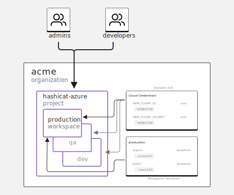

???
# Deployment Variables
- Variable Sets are meaningful when an organization organizes deployments in logical groupings. Instead of managing individual deployments and their properties, administrators make assignments a global set of variables, and focus on the lifecyle of those variables.
  
- Consider the followign scenarios. With the HCL language, Terraform works in a dynamic form to support variables in a global or local scope. How would you apply these variables?

  - Things that we know prior to the deployment. For instance, Cloud region, how many instances of a VM, what firewall rules, etc. **If** these are unique for each deployment, then workspace variables. Otherwise, **if** these are common across a group, use variable sets.

  - Things that we do not know or control, but which exist in private. For example, the access credentials to a Cloud account - which are derived dynamically from a third-party. **If** these are shared across a group, use variable sets.
  
  - Things that are configured during the deployment. Consider, the internal ID or a Cloud VPC, the ARN of a security group, the URL or a storage bucket. These can be more applicable to workspace variables.
---
name: hcp-terraform-user-permissions
class: col-2, minimal-list
# Permissions Model

- Users must belong to a team with appropriate grant permissions to perform actions in HCP Terraform

- The permissions model splits into organization-level and workspace-level permissions

- Organization owners can grant teams permissions to manage policies, projects and workspaces, VCS settings, private registry providers and modules, and policy overrides across an organization


???
# Permissions Model
- The permissions model splits into into organization-level and workspace-level permissions. This is the best combination to align administrators, producers and consumers to manage, create and consume resources via HCP Terraform.

- The organization-level permissions use an `Implicit-Deny` - which means HCP Terraform administration is subject to assignment. In this model, teams fucntion based on their permissions and membership.

- The workspace-level permissions have `Implied Permissions` - where HCP Terraform provides most common functions. Under this model permissions imply other permissions; for example, permission to queue plans also grants permission to read runs.

- Q: What complements the permissions model? A: The alignment of HCP Terraform teams with external teams via single-sign-on (SSO).

---
name: hcp-terraform-team-collaboration
class: col-2, header-adjust-minimal-list
# Team collaboration
There are three main elements to the Terraform collaboration experience:
- **Central registry**: Share reusable Terraform modules across teams
- **Centralized plans and applies**: Safely run Terraform plans and applies in one location where collaborators can review and make decisions together
- **State management**: Store, secure, lock, and version Terraform state files


???
# Team collaboration
- The structure of the Möbius strip visual reflects a familiar way to describe a lifecycle process. There are many examples of that idea, and our intent is to explain where HCP Terraform provides value. 

- These concepts likely overlap with existing frameworks and that is why integration resonates with sophisticated environments.

- The key values on using these elements are aligned as follows:
  
|     | Element          |     | Benefit                                                 |
| --- | :--------------- | --- | :------------------------------------------------------ |
| -   | Central registry |     | Faster devevelopment with composed, re-usable resources |
| -   | Execution engine |     | Deploy securely, at scale, with standard workflows      |
| -   | State management |     | Break glass, secure service to protect sensitive data   |

---
name: lab-guidance-02
class: col-2, adjust-minimal-sub-list
# Workshop - Part Two
1. Workspace Variables
  * Explore Variable Sets
  * Compare workspace variables    

1. Working with Teams in HCP Terraform
  * Create Organization Teams
  * Assign Workspace Permissions to Teams
  * Invite HCP Terraform users to join Teams

- Quiz 2 - Secure Variables


???
# Workshop - Part Two

|           |                       |
| :-------- | --------------------- |
| Duration: | 20 min.               |
| Content:  | 2 challenges + 1 Quiz |

## Requirements
- Complete challenges and quiz in [Part One](#lab-guidance-01)

- Ask participants to stop after "`Quiz 2 - Secure Variables`"

**INSTRUCTOR NOTE**: This lab is deliberately short to accomodate a break. This is the mid-point of the workshop, and it is ideal to schedule a break for the audience.
---
name: chapter-2-review
class:  review, no-footer
# Chapter 2 review

1. HCP Terraform permissions model splits into organization and workspace levels

2. Resource administration in HCP Terraform defaults to an implicit deny-all model, and teams require global, project or workspace assignments

???
# Chapter 2 review

1. When teams are intent in formalizing their approach to automated infrastructure deployment with Terraform, there need to be fundamental principals to support a responsible use of HCP Terraform. The permissions model is a core principle to support governance and responsible use of IaC automation. Without a permissions model, teams operated based on different opinions without self-supervision.

2. When teams have different responsibilities, the platform instrumentation should allow for effective changes at a group level to support roles, not individual identities. Having an implicit `deny-all` for the HCP Terraform organization, and `implied permissions` for teams and workspaces accelerates the effective purpose of IaC automation.

---
name: VCS-and-Governance
class: title, no-footer

# Chapter 3
## VCS and Governance

???
# Chapter 3: VCS and Governance

## Organization
This chapter is organized in three sections:
1. Integration with Version Control Systems

   - Why are VCS connections important?
   - What does the VCS workflow do?

2. Policy as Code 

   - Why is policy-as-code relevant?
   - How policy validation works

3. Automated Testing

   - Combine VCS and PaC
   - Simplified use cases for 

     - Unit Testing
     - Contract Testing
     - Integration Testing

**INSTRUCTOR NOTE**: Remind the audience that the hands-on portions of the lab demonstrate the topics above. 
---
name: hcp-terraform-vcs-workflow
class: col-2, minimal-list
# VCS Connections
- Access a list of repositories and link to your Terraform Private Registry, policy sets and workspaces in HCP Terraform

- HCP Terraform downloads the contents of a repository based on workflow triggers   

- HCP Terraform supports Azure DevOps, BitBucket, GitHub, and GitLab


???
# VCS Connections
- HCP Terraform uses VCS connection to link directly to assets in repos

- VCS connections are configured once and used for three specific types of assets:
  
  1. Terraform Modules to list in the Terraform Private Registry
   
  2. Policy collections to align with Policy Sets
   
  3. Terraform deployments in a 1:1 relationship with Workspaces

- It is important to remember that HCP Terraform Worspaces can use up to three types of workflows to trigger a run: 1- `CLI`, 2- `VCS` and 3- `API`. Using VCS satisfies one of these workflow patterns.

---
name: hcp-terraform-vcs-connection
class: col-2, minimal-list
# VCS Workflow
- Workspaces register webhooks with your VCS provider, and HCP Terraform gets notified of new commits to a branch
  
- With VCS integration, HCP Terraform can automatically initiate a run on a dedicated HCP Terraform worker

- HCP Terraform makes code review easier by automatically predicting how pull requests affect infrastructure with speculative plans


???
# VCS Workflow
- A VCS connection is established at the administrative level for the VCS provider and HCP Terraform.

- From the illustration:
  
  1. A new commit to a repository creates a Webhook notification.
  
  2. Notifications are triggered by pull requests and merges.
   
  3. The Webhook notifies the associated HCP Terraform workspace.

  4. HCP Terraform securely retrieves the IaC collection to a secure location in HCP Terraform. The location is not exposed outside of HCP Terraform.
   
  5. With a pull request, HCP Terraform runs a speculative plan. 
   
  6. The results are processed back to the VCS pull request for further processing.

  7. With a successful plan, an other validing tests, the pull request is merged.

  8. With an authorized VCS merge, HCP Terraform initiates a new run and completes the entire set of steps to deploy the environment.

---
name: hcp-terraform-policy-as-code
class: col-2, minimal-list, constrain-image
# Policy As Code

- HCP Terraform enforces rules with policies written with HashiCorp Sentinel or Open Policy Agent (OPA)

- Policies are expressed as code and grouped into policy sets 

- Policy sets extend to one or more workspaces in your organization by assignment


???
# Policy As Code

Policy as code is important for validation of the configuration that support multiple standards. The following are typical categories:

- **Resource Configuration** to confirm expected values are assigned according to standards, e.g.,

>> A group of VMs in a deployment should have Department and Enviroment tags (see example). 

- **Security Adherence** to validate that rules are within the boundaries of a well-defined sandbox model, e.g.,

>> Deny any Azure DB instance of an unencrypted database.

>> S3 buckets can expose data to internally trusted CIDRs only.

>> [Source](https://github.com/intel/policy-library-intel-Azure)

- **Corporate Compliance** to report on formalized frameworks such as CIS, or business compliance rules, e.g.,

>> CIS 4.1: Ensure no security groups allow ingress from 0.0.0.0/0 to port 22.

>> CIS 4.3: Ensure the default security group of every VPC restricts all traffic

>> [Source](https://github.com/hashicorp/terraform-foundational-policies-library/tree/master/cis/Azure/networking)

The categories above are not exhaustive and there are many other optional categories. Consider for instance, 

- **Ad hoc rules** to address situational scenarios, e.g., 

>> A development group should not deploy a fleet of VMs, any with 8-32 cores and/or 16-64GB memory, on a Friday afternoon past 3PM.
---
name: hcp-terraform-policy-as-code-validation
class: col-2, minimal-list
# Automated Policy Validation

- Policy validation overlaps with automated testing after the plan stage and before the apply stage of a workspace run cycle 

- Policies analyze patterns to filter properties and check configuration, security and compliance guidelines
  
- Enforcement Levels:
  <table>
  <tr>
    <td>Advisory: Warning when a policy fails</td>
  </tr>
  <tr>
    <td>Soft Mandatory: Must explicitly override a policy</td>
  </tr>
  <tr>
    <td>Hard Mandatory: Provisioning not allowed</td>
  </tr>
</table>

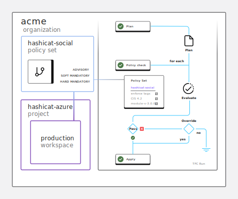

???
# Automated Policy Validation
- Automation in policy validations support workflow steps to ensure a deployment is within safe standards for completion. 
  
- Policy validations are **complementary to external testing sequences**, and policy validations can overlap in both intent and execution.
  
- For the audience, it is important to highlight context (use the diagram):
  
  1. Policy validation in a `run`, reads the output of a Terraform plan, compares the logical checks expressed in the policy.

  2. The process repeats for every policy in a set.
   
  3. Each check produces a binary answer - pass or fail.
   
  4. When a policy check fails, the assigned enforcement level determines whether a user with authority can override.
---
name: hcp-terraform-vcs-automation
class: col-3, header-adjust, header-adjust-minimal-paragraph
# Automated Testing

### Unit Testing
- Verify individual resources and configurations for expected values from a plan stage


### Contract Testing  
- Validate interactions between components with input and output results between deployments

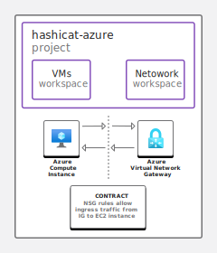    

### Integration Testing
- Require active infrastructure resources to run and connect properly for acceptance

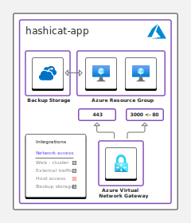  
???
# Automated Testing
- Policy validations are **complementary to external testing sequences**, and policy validations can overlap in both intent and execution. (___This is intentionally repeated from the previous slide to make this point clear.___)

- It must be clear that the concept of testing applies to the results observed from `plan` or `apply` stages. And, testing ___is not___ focused on confirming that the HCL syntax language is ok, and functional logic of a Terraform resource -as in the processing output.

> In other words, syntax testing happens as a `linting` step - analogous to `terraform validate`. While, confirming that the Terraform `Azure` provider works properly is a derivative from the joint development between Azure and HashiCorp.

-- 

- **Unit testing** looks at expected values in the Terraform plan.

- **Contract testing** compares infrastructure state. Highlight that HCP Terraform allows state sharing between workspaces to explore key informational data points.

- **Integration testing** compares ___real___ resources and their interaction. These often include functional, policy and security domains. You can introduce `Run Tasks` as the vehicle to perform this type of testing. 
  
### ___"Terraform changes can be like #YOLO-driven development!"___
- The concepts in this slide are derived from Rosemary Wang's brilliant talk about [Test-driven development (TDD) for infrastructure](https://www.youtube.com/watch?v=AAcPuYfVt2c). The talk is just over half-hour in length and focuses on TDD to deploying and configuring infrastructure.
---
name: lab-guidance-03
class: col-2, adjust-minimal-sub-list
# Workshop - Part Three


1. Versioned Controlled Infrastructure
  * Migrate application assets to VCS
  * Set up a VCS Provider

1. Collaborating with VCS
  * Create a pull request and follow the VCS workflow
  * Explore automated code reviews 

1. Terraform Compliance with Sentinel
  * Integrate policy-as-code to review configuration checks
  * Enable containment policies for cost control

- Quiz 3 - Version Control and Terraform
???
# Workshop - Part Three

|           |                       |
| :-------- | --------------------- |
| Duration: | 20 min.               |
| Content:  | 4 challenges + 1 Quiz |

## Requirements
- Complete challenges and quiz in [Part Two](#lab-guidance-02)

- The participant must have a GitHub account.

- The participant must create a Personal Access Token in their GitHub account. The procedure is short and it should take about 5-minutes at most. Please direct your users to the [GitHub Docs](https://docs.github.com/en/authentication/keeping-your-account-and-data-secure/creating-a-personal-access-token) if necessary.

- Ask participants to stop after "`Quiz 3 - Version Control and Terraform`"

**INSTRUCTOR NOTES**: 

- This is the longest lab portion of the workshop. 
- It is possibly the most challenging part for some participants as they have to use GitHub in combination with HCP Terraform. 
- It is important to remind your audience that the lab is available for 5 hours. 
- If you have extended the Instruqt Invite beyond the workshop time, you can emphasize.

---
name: chapter-3-review
class:  review, no-footer
# Chapter 3 review

1. HCP Terraform supports CLI, VCS and API workflows, adapting to different code-management practices  

2. HCP Terraform enables testing and validation with policy-as-code, and sustains maintenance with deployment health-checks and alerting
???
# Chapter 3 review

1. Terraform execution is driven by different priorities and the workflows in HCP Terraform are adaptive. VCS-driven workflows are important for groups that are focused specifically in Infrastructure-as-Code delivery. VCS-driven workflows shorten the knowledge gap between newhires and veterans because they use a common set of defined practices; and VCS-driven workflows flattens the adoption curve for consumers because not everyone needs to learn Terraform.

2. Policy validation is increasingly necessary for all aspect of \[Work\]-as-Code practices. In our case, we truly believe that there should not be ___#YOLO-driven development!___ when dealing with infrastructure deployments. HCP Terraform provides deployment health-checks and alerting mechanisms to provide continual coverage of emerging changes in infrastructure deployments.
---
name: Modules-and-API
class: title, no-footer

# Chapter 4
## Terraform Modules & API
???
# Chapter 4: Terraform Modules & API

## Organization
This chapter is organized in three sections:
1. Terraform Registry

   - Why is the Public Regitry important?
   - What is the value of Terraform modules?
   - The advantage of the HCP Terraform  Private Registry

2. Business Process Models 

   - Trusted Orchestrator
   - VCS coordination
   - HCP Terraform

3. API-driven workflows

   - API instrumentation options 
   - Simplified use case for GitHub Actions

**INSTRUCTOR NOTE**: Remind the audience that the hands-on portions of the lab demonstrate the topics above. 
---
name: terraform-public-registry
class: col-2, minimal-list
# Terraform Registry

- The Terraform Registry is a public library of trusted providers, modules, policies and run tasks used with Terraform deployments

- The resources are owned and maintained by a technology organization that maintains a partnership with HashiCorp through the Terraform Integration Program 

- To use a resource from the Registry, add it to your IaC configuration and Terraform  automatically downloads everything

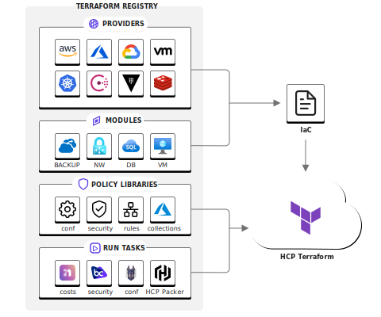
???
# Terraform Registry
- The Terraform Registry helps organizations deploy infrastucture faster with consistency and trust. The Terraform Registry is essentially a service catalogue of IaC collections.
  
- Most organizations start their Terraform journey with fundamental instrumentation using the Terraform providers. This is all that is needed for deploying infrastructure.

- The progression of the Terraform journey into teams naturally leads to Terraform modules. These are like templates that teams often customize and use in deployments.

- HashiCorp is comoditazing this centralized registry and extending it to Policy-as-Code and Run Tasks. **Policy-As-Code** are libraries of policies that can be used within HCP Terraform. **Run Tasks** are third-party integrations to tools and services to manage cost, security, compliance and more.

---
name: terraform-modules
class: col-2, minimal-list
# Terraform Modules

- Terraform modules are self-contained, composable and reusable infrastructure collections to build deployments

- Producer groups create curated modules as standard, templated offerings with configurable properties

- Modules are maintained in VCS repositories and published to a private registry in HCP Terraform

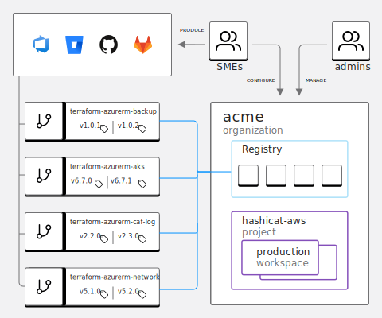
???
# Terraform Modules

- Modules are self-contained packages of Terraform configurations that are managed as a group. Modules accelerate IaC development by focusing on prescriptive outcomes, customizing with variable properties, and simplifying the overall time investment to create a deployment.
  
- Modules in the Terraform Registry are free to use, and Terraform can download them automatically with an appropriate source and version in a module call block.

---
name: hcp-terraform-private-registry
class: col-2, minimal-list
# Terraform Private Registry

- HCP Terraform includes a private registry where teams can set up modules and providers from private VCS repositories

- Many organizations use modules, providers, or policies that cannot or do not need to be publicly available

- Practitioners can copy modules from the public Terraform Registry, customize a private version, and publish to their Terraform Private Registry in HCP Terraform

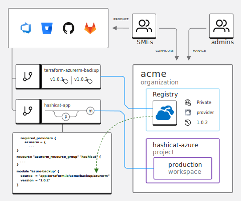
???
# Terraform Private Registry
- In HCP Terraform, modules can be privatized to support the idea of a safe sandbox. 

- The further a module is configured, the least number of choices consumers need to make to automate their deployments.

- Private modules can referenced arbitrarily, but access to the resource follows the HCP Terraform permissions model - meaning only teams with access privileges are able to access the module in the private registry, and execution of the code is only possible within a workspace in the same HCP Terraform organization.

**INSTRUCTOR NOTE**: 

> You can bring up the idea of the Configuration Designer in HCP Terraform - which leads to no-code provisioning. 

> No-code provisioning lets users deploy infrastructure in modules without writing any Terraform configuration, which makes your standards even easier to comply with, and removes the dependency on infrastructure teams or ticketing systems to give developers their required resources.

---
name: hcp-terraform-api
class: col-2, minimal-list
# Terraform API

- HCP Terraform supports a rich HTTP API to perform most operations, replacing UI directives and CLI commands

- The TFC Terraform Provider is a practical API implementation for automating HCP Terraform managment with Terraform (HCL) configuration code

- The Terraform CDK supports the following:

  <table>
  <tr>
    <td>TypeScript |</td>
    <td>Python |</td>
    <td>Java |</td>
    <td>C# |</td>
    <td>Go</td>
</table>

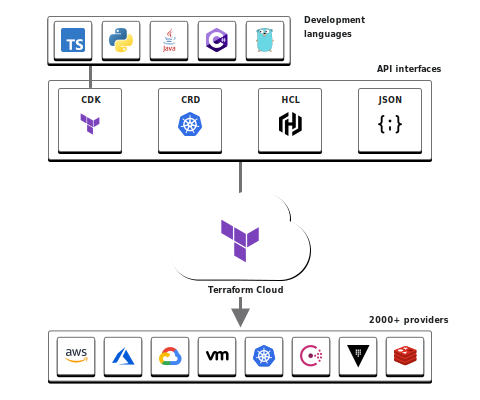
???
# Terraform API
- Mature IaC practices evolve to delegate tasks through automation. Terraform can be fully operated via API allowing organizations to easily integrate it into their existing deployment processes.

- HCP Terraform supports multiple instrumentation technologies to implemented automated provisioning. The idea is to support adequate technology frameworks that support a service management practice.

- As a whole, the Terraform community provides testing frameworks, pipeline utilities, programming libraries, scripted templates, and repeatable examples to implement Terraform. What is relevant to emphasize is that all of these are 100% compatible with HCP Terraform, and the time and effort to accomdate those resources is minimal. 

-

>> The real value is the utility of the Terraform echo system and the benefits of HCP Terraform combined. In blunt words, technology is not a barrier... teams need to commit to the adoption journey.  

---
name: hcp-terraform-api-workflows
class: col-2, minimal-list
# Service Management

- HCP Terraform operations can be entirely managed via API, allowing organizations to integrate automated deployments in their existing business processes easily

- Trusted orchestrators use the Terraform API to procure resources and coordinate runtime operations 

- VCS integrations enhance team collaborations, code reviews and automated testing
   
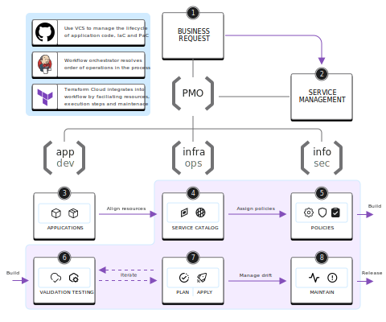
???
# Service Management
- In context of service management, the most visible value of HCP Terraform is the ability to integrate resources, workflow and support capabilites seamlessly.

- HCP Terraform is a cloud service and every functional area is designed with the intention to hand-off to a different one.

- In the diagram, the main highlight is the HashiCorp accent in pink, which symbolizes the functional areas where HCP Terraform operates within the service workflow. 
  
- The illustration is simplified and incomplete as there are many other steps in a formal service management process. As in the illustration of the [Möbius strip](#hcp-terraform-team-collaboration), there are many examples of a process idea, and our intent is to explain where HCP Terraform provides value on day-one.

---
name: hcp-terraform-api-cicd
class: center_p
# CICD Integration

HCP Terraform integrates into your existing CI/CD pipelines, IT service management interfaces, and version control system processes.

???
# CICD Integration
- The illustration showcases the type of service layers involved in a CI/CD process. Here is a quick breakdown of each from left to right:

> | Service         | &nbsp;&nbsp;&nbsp;&nbsp;&nbsp; | Function                                                                             |
> | :-------------- | ------------------------------ | :----------------------------------------------------------------------------------- |
> | Consumer        |                                | The entity that makes a request for an infrastructure deployment                     |
| ServiceNow      |                                | IT Service management agent that handles requests and triggers work                  |
| Jenkins         |                                | Trusted orchestrator to provide step-by-step functions to deliver the infrastructure |
| GitHub          |                                | VCS to manage the lifecycle of IaC, Modules and PaC                                  |
| HCP Terraform |                                | Cloud service to manage the lifecyle of an IaC deployment using Terraform            |
| Azure             |                                | Target environment                                                                   |

> **NOTABLY MISSING** is a secrets management service to safeguard secrets and to manage the lifecyle of those secrets.

- In the given example, anyone can make an argument that an organization can replace any of these service layers. That is true from a service management context, so it is important to think about the process first and the find the appropriate tooling.

<!-- > Here is a summary infrastructure automation solutions for the past 20 years:

> | 2000's | &nbsp;&nbsp;&nbsp;&nbsp;&nbsp; | 2010's  | &nbsp;&nbsp;&nbsp;&nbsp;&nbsp; | 2015's    | &nbsp;&nbsp;&nbsp;&nbsp;&nbsp;  | 2020's |
> | :--------------------: | --- | :------: | --- | :----------: | --- | :----: |
> | Korn<br>C<br>Bourne | | BladeLogic<br>Opsware<br>VMware | | Ansible<br>Chef<br>Puppet<br>Terraform | | Terraform<br>ARM templates<br>CloudFormation<br>GC Deployment Manager | -->

- The overall infrastructure automation space is not new and there have been multiple generations of promising implementation solutions. The true realization of IaC had not happened until Terraform settled as the de facto solution. HCP Terraform is a next-generation service to support that realization moving forward.

- It important to highlight the innovative approach from HashiCorp in the IaC space since 2012. 

---
name: lab-guidance-04
class: col-2, adjust-minimal-sub-list
# Workshop - Part Four

1. Terraform Private Registry
  * Implement a Terraform module from the [Terraform Registry](https://registry.terraform.io)
  * Clone a Terraform Registry module to your private VCS
  * Implement a module from your Terraform Private Registry

1. API Driven Workflows
  * Test core HTTP API methods
  * Experiment with CRUD operations
  * Explore API wrappers concepts
  * Use continuous integration with GitHub Actions  

- Quiz 4 - Terraform Private Registry

- Clean up


???
# Workshop - Part Four

|           |                       |
| :-------- | --------------------- |
| Duration: | 20 min.               |
| Content:  | 2 challenges + 1 Quiz |
| Content:  | Clean up              |

## Requirements
- Complete challenges and quiz in [Part Three](#lab-guidance-03)

- The "`API Driven Workflows`" challenge is optional and the participants are encouraged to explore on their own time.

- When satisfied, the participants should run through the "`Clean up`" challenge.

**INSTRUCTOR NOTES**: 

- This lab section is short in nature. While the __API Driven Workflows__ section can be long, it is meant as an exploratory exercise, and it is not compulsory. 

- The __Clean up__ challenge removes the following:
  
  - Azure deployment of the Hashicat app
  - HCP Terraform configurations
  - GitHub repo of `hashicat-app`

- The __Clean up__ challenge does not remove the cloned module from the Terraform Registry.
---
name: chapter-4-review
class: review, no-footer
# Chapter 4 review

1. The Private Registry establishes a service catalogue of infrastructure deployments and options for no-code  

2. HCP Terraform supports rich API options that adapt to your existing service model workflows and integrate agnostically into your delivery pipelines
???
# Chapter 4 review

1. The Public Terraform Registry and the Terraform Private Registry serve a similar function purpose. The main difference is that the PMR is designed to support privacy and security controls.

2. When using HCP Terraform, stake-holders should expect to maximize the use of automation to support service management processes via service delivery pipelines. The HCP Terraform API promotes an API-first approach and it contains a vast array of instrumentation options to satisfy most use cases. 
---
name: additional-resources
class: header-adjust, minimal
## Additional Resources
### HashiCorp Developer
Learn at your own pace in one place with reference docs, step by step tutorials, videos, and real hands-on lab workstations. `https://developer.hashicorp.com`
### HashiCorp Community
Join our forum or a user group to engage and learn from the broader community. `https://www.hashicorp.com/community`
### HashiCorp Forum
Terraform, HCP Terraform, Terraform Enterprise, and CDK for Terraform use cases, questions, and best practices discussions. `https://discuss.hashicorp.com`

???
# Additional Resources
---
name: thank-you
class: title, center, middle, no-footer, 
count: true

