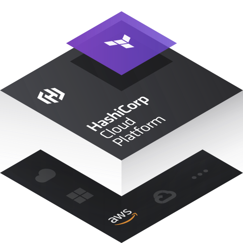
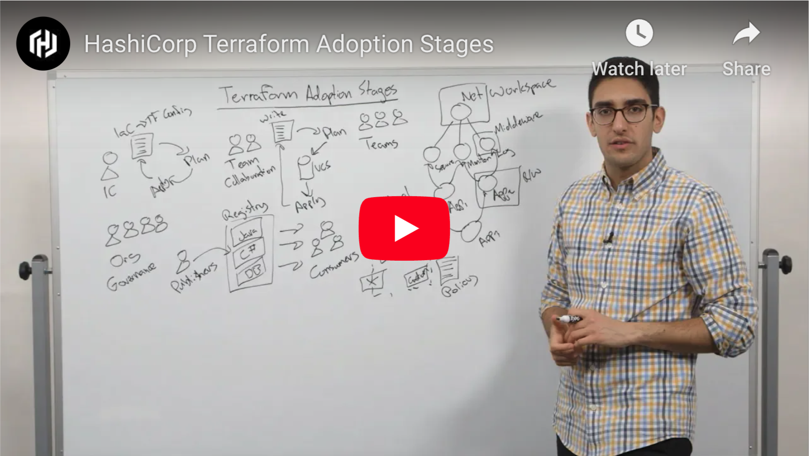
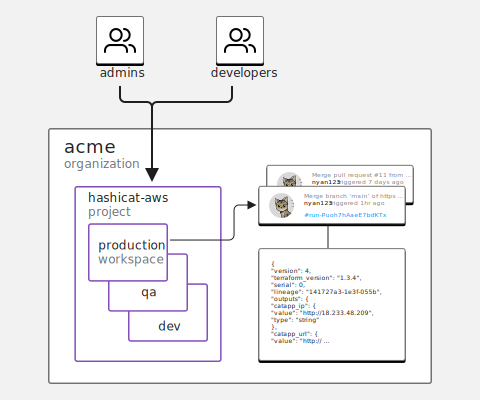
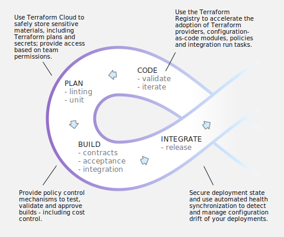
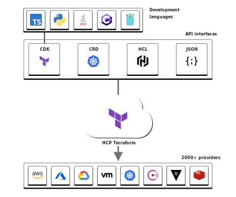
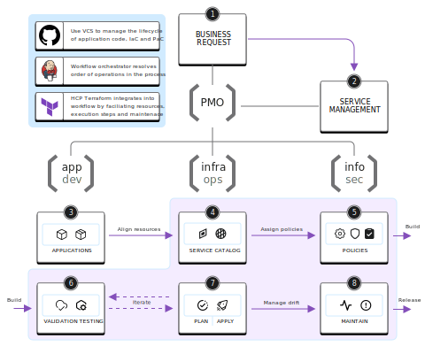

name: Intro-to-hcp-terraform
class: center, middle, title-slide, no-footer
count: true

# HCP Terraform on AWS

???
# HCP Terraform on AWS workshop
## Getting started
반나절 동안 진행되는 이 워크샵은 Instruqt 실습을 위해 AWS 기반 애플리케이션을 사용하여 HCP Terraform를 소개합니다. Terraform을 처음 사용하시는 분은 이 세션에 앞서 AWS Instruqt의 Terraform Community Edition 소개 트랙을 먼저 수강해 보시기 바랍니다.


워크샵 진행 방법에 대한 지침은 표준 [instructor's guide](https://github.com/hashicorp/field-workshops-terraform/blob/main/instructor-guides/all_hcp_terraform_INSTRUCTOR_GUIDE.md).에 나와 있습니다.

## Navigation

Here are some helpful keyboard shortcuts for the instructor:

- Use your keyboard ⬅ ➡ to navigate back and forth
- Use `P` to toggle presenter view and notes
- Use `C` to detach an external window for presentation

**Note** - We disabled navigating using mouse gestures and scrolling. Most instructors at HashiCorp use Macbooks, and with Apple Magic Mouse or Magic Trackpad the swipe gesture can inadvertedly move the slides backwards or fowards, loosing control of the presentation.

## Customization

This slide deck is written entirely in Markdown language, which means you can make edits by submitting a pull request to add your changes to the main branch. To make edits to the slide deck, fork this repository, edit the Markdown file(s), and submit a pull request with your changes. When editing, you can test a local copy of the slide deck with this Python one-liner:

```
python3 -m http.server
```
---
layout: true

.footer[
- Copyright © 2023 HashiCorp
- 
]

---
name: Workshop Objectives
class: minimal
# Workshop Objectives
- **원격에서 코드로 인프라 실행**

SOC2를 준수하고 신뢰할 수 있는 환경에서 State 저장 및 Terraform runs 실행

- **클라우드 규정 준수 및 관리 설정**
  
Terraform에서 관리하는 모든 리소스에서 권한 및 거버넌스 기능을 설정하고 정책 시행을 위한 기능을 추가

- **프라이빗 레지스트리로 셀프 서비스 인프라 생성**
  
프라이빗 레지스트리를 사용하여 프로비저닝 프로세스 전반에서 인프라 표준화

???
# 워크샵 목표

## 소개
1. Introduce yourself. Let people know:
   - Your Name
   - Your Title
   - Your tenure with Hashicorp
   - Optionally provide an ice breaker 
   
2. If your audience is less than 20 people you have the option to quickly go through the room and ask everyone to introduce themselves if they wish to participate.

## 워크샵의 목표
1. Launch a deployment to AWS using HCP Terraform using VCS workflows
2. Explore management and configuration options with team permissions and deployment policies
3. Test the Terraform Private Registry and some API functions

---
name: Table-of-Contents
class: col-2, top, minimal-list, minimal-toc
# 목차

**1- 인프라 자동화**
* Terraform Adoption Journey
* Terraform Editions
* HCP Terraform

<hr>

**2- Terraform 워크플로우**
* Code and workspaces
* Data protection and access control
* Team collaboration

<hr>

**3- VCS & 거버넌스**
* Using Version Control
* Policy Validation
* Automated Testing

<hr>

**4- Terraform 모듈 & API**
* Terraform Private Registry
* API Driven Workflows
* CI/CD Integration

???
# Table of Contents
## Organization
- There are four sections. 
- The workshop alternates between lecture and lab exercise. 
- We'll be taking at least two breaks in between.

## Timing
- Lecture 20 minutes
- Related Lab 20 minutes

**INSTRUCTOR NOTE**: 

- The suggested timing arrangement leads to about 160 minutes of time for lectures and lab; that is just under three (3) hours of __on-air__ work to complete the exercise not including breaks. 

- Please work with your sponsor to arrange sufficient time. 

- For instance, four (4) hours is very comfortable, while three (3) hours is tight.

---
name: Lab Organization
class: table-exercises
# Lab Exercises
  <table>
  <tr>
    <td>
      <p><strong>파트 1</strong></p>
      <ul>
        <li>시작하기 - 실습 살펴보기</li>
        <li>HCP Terraform 설정</li>
        <li>Terraform State 안전하게 보관하기</li>
        <li>Quiz 1: Terraform Remote State</li>
      </ul>
    </td>
    <td>
      <p><strong>파트 2</strong></p>
      <ul>
        <li>워크스페이스 변수</li>
        <li>HCP Terraform에서 팀과 작업하기</li>
        <li>Quiz 2: Secure Variables</li>
      </ul>
    </td>
  </tr>
  <tr>
    <td>
      <p><strong>파트 3</strong></p>
      <ul>
        <li>버전 관리되는 인프라</li>
        <li>VCS로 협업하기</li>
        <li>Cost Estimation을 통한 비용 관리</li>
        <li>Sentinel을 통한 Terraform 규정준수(Complicance)</li>
        <li>Quiz 3: Version Control and Terraform</li>
      </ul>
    </td>
    <td>
      <p><strong>파트 4</strong></p>
      <ul>
        <li>프라이빗 모듈 저장소(Registry)</li>
        <li>API 기반의(Driven) 워크플로우</li>
        <li>Quiz 4: Terraform Private Registry</li>
      </ul>
    </td>
  </tr>
</table>

???
# Lab Exercises

## Lab organization
- Lab exercises are conducted on the [Instruqt](https://instruqt.com) platform. 
- To join the lab, each participant needs to register an account with [Instruqt](https://play.instruqt.com/signup).
- The instructor must provide an Instruqt Invite link so the audience can join the lab.
- For each section, point out to the participant that they can pause, and return to the lecture, after each section's Quiz.

**INSTRUCTOR NOTE**: Make a shortened version of the Instruqt Invite link and paste in the [Instruct Invite](#instruqt-invite) slide.

## More information
- You can learn all about Instruqt in this [HashiCorp Wiki page](https://hashicorp.atlassian.net/wiki/spaces/IL/pages/2364835720/Creating+Slide+Shows+with+Remark).

**INSTRUCTOR NOTE**: If pressed for time, the instructor can guide the participants so they complete the very last challenge, `API Driven Workflows` on their own time.

---
name: participant-requirements
class: col-3, header-adjust, minimal-list
# 참석자 요구 사항
### HCP Terraform
- HCP Terraform 계정 (free)

- Terraform "___Team & Governance Plan___" Trial

- HCP Terraform 개인 액세스(Personal Access) 토큰

### GitHub
- 개인 계정
  
- GitHub 개인 액세스(Personal Acces)토큰 (classic)

- ~ five (5) GitHub Actions minutes (optional)

### Instruqt Account

- 무료 가입

- HashiCorp 비공개 초대 링크(강사가 제공)


???
# Participant Requirements

- 실습에 대한 요구 사항은 워크샵에 자세히 설명되어 있습니다.

- 실습을 통해 다음 계정을 가입하고 설정할 수 있습니다.

- 필요한 경험 수준은 **초급**입니다.

---
name: TFE-Chapter-1
class: title, no-footer

# Chapter 1
## Infrastructure Automation

???
# Chapter 1: Infrastructure Automation

## Organization
This chapter is organized in three sections:
1. Terraform Adoption Journey

   - Explain the maturiy lifecle from individuals, to teams, and to organizations in the adoption of Infrastucture-as-Code with Terraform

2. Terraform Editions

   - Understand Terraform Community Edition and the differences between Community Edition, HCP Terraform, and Terraform Enterprise

3. Benefits of using HCP Terraform

   - Hightlight the key benefits of using HCP Terraform to 

     - Build infrastructure, 
     - Standardize best practices, and 
     - Integrating into CI/CD pipelines

**INSTRUCTOR NOTE**: Emphasize how the benefits reflect the objectives for the workshop. 

---
name: terraform-adoption-journey-individual
class: col-2, minimal-list
# 테라폼 도입 여정: 개인

Terraform 배포는 일반적으로 개인 실무자와 규범적인(prescriptive) 워크플로우에서 시작됩니다.

1. Terraform 구성 파일 또는 "코드형 인프라"를 작성합니다.
     
2. 계획(Plan)을 올바르게 만들기 위해 반복한 다음 계획(Plan)을 배포합니다.

3. 요구 사항이 변경되면 구성 파일을 수정하고 계획(Plan)-배포(Apply) 프로세스를 반복합니다.



???
# Terraform Adoption Journey: Individual

- A HashiCorp Terraform deployment usually starts with an individual practitioner who writes a Terraform configuration file ("infrastructure as code").
  
- The individual practitioner iterates to make the plan correct, then applies the plan. 

- As needs change, they modify the the configuration file and repeat the plan-and-apply process.

**INSTRUCTOR NOTE**: Highlight potential vulnerabilities:

1. The individual practitioner is responsible for the Terraform State 

2. The individual practitioner also needs to manage and secure credentials to the target environment

3. The individual practitioner manages the properties of the deployment

4. It is not ideal for collaboration 

---
name: terraform-adoption-journey-teams
class: col-2, minimal-list
# 테라폼 도입 여정: 팀 (1/2)

팀의 경우 프로세스는 기본적으로 동일하지만, 단일 소스 원천을 제공하기 위한 버전 관리 시스템이 있어야 합니다.

1. 버전 제어 시스템을 사용하면 한 번에 하나의 변경만 가능합니다.
   
2. 팀은 단일 진실 소스에서 인프라에 변경 사항을 적용합니다.


???
# Terraform Adoption Journey: Teams (1/2)

- If there's a team collaborating to use Terraform, rather than just one individual, the process is basically the same.

- They should use some sort of version-control to provide a single source of truth.

**INSTRUCTOR NOTE**: Highlight the following:

1. Teams are responsible for the Terraform State. Don't put it in VCS.

2. Teams need coordinate and secure credentials to the target environment

3. VCS reduces collisions by centralizing the desired properties of the deployment as written in the IaC collection.

---
name: terraform-adoption-journey-multiple-teams
class: col-2, minimal-list
# Terraform Adoption Journey: Teams (2/2)

여러 팀이 참여하는 경우 인프라를 계층적으로 분리하는 것이 가장 좋습니다.

1. 각 팀은 인프라의 기능적인 부분을 담당합니다.
   
2. Terraform 구성 구성 요소는 별도의 workspaces로 분리됩니다.
   
3. 각 workspace에는 생산자와 소비자를 구분하기 위한 역할 기반 액세스 제어(RBAC)가 있어야 합니다.


???
# Terraform Adoption Journey: Teams (2/2)

- But as we go to many teams this starts to become impractical. There's too much coordination required and the configuration becomes overly complex.

- Instead, what we'd like to do is hierarchically decompose our infrastructure. We might say we have one team that focuses on the underlying network typology and cloud configuration.

- For instance, we might have a series of middleware—a middleware tier. This might look at different things:
  
  - We might have a central solution for logging,
  - We might have a central monitoring solution,
  - Maybe we have security appliances that we share between applications.

**INSTRUCTOR NOTE**: Highlight the following:

1. You may introduce the concept of producers and consumers.

2. How do we organize a common pattern around publishers and consumers?

---
name: terraform-adoption-journey-organization
class: col-2, minimal-list
# Terraform Adoption Journey: Organization

대부분의 조직은 소수의 개발자(publishers)와 다수의 소비자(consumers)가 중앙 레지스트리에 대해 작업합니다.

1. 중앙 레지스트리는 구성 가능한 속성이 있는 사전 승인된 템플릿으로 구성됩니다.

2. 카탈로그 항목은 기술, 보안 및 규정 준수 지침을 반영하는 정책의 적용을 받습니다.

3. 셀프 서비스 인프라는 "샌드박스" 모델에 속해야 합니다.


???
# Terraform Adoption Journey: Organization

- In some organizations, there are many users, most of whom are not trained on Terraform, and it wouldn't be practical to train them all. 

- One common pattern is to have a few producers (publishers) and a large number of consumers all working against a central registry. 

- Organizations can also use HashiCorp Sentinel to define and maintain a **sandbox**, which polices what consumers can and cannot do ("Policy-as-Code").

**INSTRUCTOR NOTE**: What is that sandbox model?

1. A sandbox is a metaphor to define a safe deployment boundary. Instead of redifining deployment standards for every request, a sandox says: "**You're allowed to do any type of infrastructure change you want inside of a sandbox**."
   
2. Policies define the sandbox. Deployments that comply with policies are on the inside, vs. things that violate the policies are on the outside and are rejected.

3. For instance, we don't want teams to open up the firewall and allow all traffic to come in, or set their S3 bucket to the universe and expose data.


---
name: terraform-adoption-journey
class: center
# Video from our CTO
[](https://youtu.be/BlFKzTyjaTI)

Blog: [Terraform Adoption Journey](https://www.hashicorp.com/resources/terraform-adoption-journey)
???
# Video from our CTO
- HashiCorp's CTO, Armon Dadgar, explains the stages of Terraform adoption.
  
- Direct the audience to optionally play Armon's video during the breaks.

- The video is just under 12 minutes long and it describes very eloquently the stages of the Terraform adoption journey.

- The Blog link also provides an excellent breakdown of the same content.

---
name: terraform-editions
class: col-3, header-adjust, header-adjust-minimal-list
# Terraform Editions

### Terraform Community Edition
* 인프라를 코드로 적용하고 표준 구성 언어 사용
* 버전 관리 시스템에 구성 파일 저장
* 최신 버전을 수동으로 가져와서 커밋하여 Terraform 작업 수행
* 인프라 템플릿으로 퍼블릭 모듈 사용 및 게시

### HCP Terraform
* 기존 워크플로우에 HCP Terraform 통합
* 승인된 팀만 인프라에 액세스, 편집 및 프로비저닝할 수 있도록 보장
* 승인된 인프라 패턴을 정의하기 위해 비공개 레지스트리에 구성 모듈 게시
* Policy as Code 프레임워크를 사용하여 모범 사례 및 보안 규칙 적용

### Terraform Enterprise
* HashiCorp 전문 지원을 통해 HCP Terraform의 프라이빗 인스턴스를 설정
* 고급 보안 및 규정 준수 요구 사항 수용

???
# Terraform Editions
## Terraform Community Edition
- A.K.A. Terraform

- Terraform is a sophisticated technology used to deploy infrastructure

- Terraform contains everything you need to configure, plan and deploy 

## HCP Terraform
- HCP Terraform is a SOC2-compliant cloud service to manage the lifecycle of infrastructure deployments with Terraform

- HCP Terraform provides features to manage user access, assign team permissions, automate integrations, host private resources, enforce policies, conduct audit, etc.

## Terraform Enteprise
- Terraform Enterprise is private instance of HCP Terraform deployed in a private environment with dedicated support from HashiCorp.

- Terraform Enterprise appeals to security conscious organizations that must accommodate advanced security and compliance requirements.
---
name: hcp-terraform
class: col-2, header-adjust, minimal-list
# HCP Terraform
### 프로비저닝을 위한 단일 컨트롤 플레인

* 완전 관리형(Fully-managed), 코드형 인프라(infrastructure-as-code) 클라우드 서비스
  
* 하나의 워크플로우로 모든 인프라 프로비저닝 및 관리

* 프라이빗 레지스트리에서 온디맨드 방식으로 인프라를 프로비저닝하는 셀프 서비스 인프라
  
* 고급 보안, 규정 준수 및 거버넌스를 제공하는 엔터프라이즈 기능


???
# HCP Terraform

## Why HCP Terraform?

- HCP Terraform는 모든 클라우드, 데이터센터 및 서비스의 프로비저닝, 규정 준수 및 관리를 위한 인프라 자동화를 지원합니다.
HCP Terraform enables infrastructure automation for provisioning, compliance, and management of any cloud, datacenter, and service.

- HCP Terraform provides infrastructure automation as a service, is free to get started, and has an in-place upgrade to paid option.
HCP Terraform는 인프라 자동화를 서비스로 제공하며, 무료로 시작할 수 있고, 제자리에서(in-place) 유료로 업그레이드할 수 있는 옵션이 있습니다.

- HCP Terraform is not the same as Terraform Community Edition. HCP Terraform is a cloud service, and Terraform Community Edition is the technology used to provision infrastructure.
HCP Terraform는 Terraform Community Edition와 동일하지 않습니다. HCP Terraform는 클라우드 서비스이며, Terraform Community Edition는 인프라를 프로비저닝하는 데 사용되는 기술입니다.

---
name: hcp-terraform-build
class: col-2, header-adjust, minimal-paragraph
# Build infrastructure remotely with your team

###원격 상태(State) 저장소
저장된 상태(State) 파일을 암호화하여 안전하게 저장하고 동적으로 업데이트합니다.

###버전 제어(VCS) 통합
풀 리퀘스트가 메인 브랜치에 병합되는 즉시 수동으로 변경 사항을 승인하거나 실행을 자동화합니다.

###유연한 워크플로우
CLI, UI, 버전 제어 또는 API에서 Terraform을 실행할 수 있습니다.

###인프라 변경에 대한 협업
인프라 변경을 실행하기 전에 계획 검토하고 의견을 제시합니다.

???
# Build infrastructure remotely with your team
- This slide is about **`team collaboration`** across an organization.

- HCP Terraform provides a number of features for teams to collaborate with a common purpose.

**INSTRUCTOR NOTE**: Please do not read the bullets. Instead, choose a story that fits your narrative. For example:

1. **Remote state storage**: Remove a vulnerable part of the process by storing the deployment state in HCP Terraform, where it is stored in an encrypted format at rest.

2. **Flexible workflows**: Allow practitioners to use the apprach that works best for their situation. 

3. **Version control (VCS) integration**: One approval to make a final commit and deploy automatically. This removes collisions and enforces code reviews.

4. **Collaborate on infrastructure changes**: Each team is responsible for their domain of expertise.

---
name: hcp-terraform-standard
class: col-2, header-adjust, minimal-paragraph
# Standardize best practices 
###프라이빗 레지스트리
팀 전체에 모범 사례(best practices)를 권장하는 인프라를 위한 모듈 및 프로아비더 세트를 만듭니다.

###비용 견적(estimation)
인프라 변경 사항을 적용하기 전에 비용을 계산하고 정책을 코드로 사용하여 제어하빈다.

###워크스페이스 권한 사용자화
관리자, 운영자, 개발자를 위해 서로 다른 액세스 수준을 설정합니다.

###Policy as code
Sentinel 또는 3rd party 도구로 실행되는 모든 Terraform에 대한 보안 및 규정 준수 지침을 생성합니다.

???
# Standardize best practices
- This slide is about **`business calibration`** when adopting a service for deployment automation.

- HCP Terraform introduces workflow features for teams to support typical enterprise requirements.

**INSTRUCTOR NOTE**: Please do not read the bullets. Instead, choose a point that fits your narrative. For example:

1. **Private registry**: Use controlled templates to accelerate delivery, and build a catalogue of standard private services.

2. **Custom workspace permissions**: Allow practitioners and teams to use the service based on their working roles, not individual identities. 

3. **Cost estimation**: Control the rate of deployments based on sound financial check points.

4. **Policy as code**: Remove risk with standard deployments, avoiding common misconfigurations, maintaining security standards and confirming compliance requirements.
   
---
name: hcp-terraform-cicd
class: col-2, header-adjust, minimal-paragraph
# Integrating into your CI/CD pipelines 
###CI/CD 통합
테라폼 실행(runs)을 기존 툴체인에 통합하여 자동화를 개선합니다.

###API 기반 작업
기존 자동화 워크플로에 HCP Terraform를 빌드합니다.

###동시 실행
계획(plan)에 동시(concurrent) 실행(runs)을 추가하여 팀의 속도를 높입니다.

###사설 데이터 센터 연결
방화벽 뒤에서 Terraform을 실행하거나 다른 프라이빗 리소스에 연결합니다.
???
# Standardize best practices
- This slide is about **`process optimization`** in service delivery.

- HCP Terraform integrates in various forms to enhance existing service delivery models.

**INSTRUCTOR NOTE**: Please do not read the bullets. Instead, choose a point that fits your narrative. For example:

1. **CI/CD integration**: Inject automation into your service delivery practice, where HCP Terraform works alongside your service management requests and fullfilment channels.

2. **Concurrent runs**: Accelerate delivery and control the rate of deployments; support seasonal, high-intensity service delivery workloads. 

3. **API-driven Operations**: Support an API-first methodology and align with your existing service management practices. HCP Terraform offers multiple API-driven methods to complement the chain of operations in existing automation workflows.

4. **Private datacenter connectivity**: Extend HCP Terraform features and workflow steps to private networks that include Cloud and traditional datacenter environments.

---
name: lab-guidance-01
class: col-2, adjust-minimal-sub-list
# Workshop - Part One


1. 시작하기 - 실습 랩 둘러보기
   * Instruqt 알아보기
   * 코드 에디터 설정
   * Terraform 명령 사용해 보기

2. Terraform 클라우드 설정
   * HCP Terraform에 가입 또는 로그인
   * 팀 & 거버넌스 평가판으로 업그레이드
   * 개인용 HCP Terraform 토큰 생성

3. Terraform State 보호
   * AWS에서 작동하는 앱 환경 배포
   * HCP Terraform를 사용하여 Terraform State 관리

- Quiz 1 - Terraform Remote State
???
# Workshop - Part One

|           |                       |
| :-------- | --------------------- |
| Duration: | 20 min.               |
| Content:  | 3 challenges + 1 Quiz |

## Requirements
- Lab exercises are conducted on the [Instruqt](https://instruqt.com) platform.
  
- To join the lab, each participant needs to register an account with [Instruqt](https://play.instruqt.com/signup).

- Ask participants to stop after "`Quiz 1 - Terraform Remote State`"

---
name: instruqt-invite
class: title, no-footer, title-light, with-invitation
# Instruqt invite:
### REPLACE THIS TEXT WITH INVITE LINK
???
# Instruqt invite
- Make a shortened version of the Instruqt Invite link and paste in this slide. 

- Click on the line with "`REPLACE THIS TEXT WITH INVITE LINK`" and replace the content with your link.

- Creating an Instruqt Invite is a 5-minute task. The procedure is well documented on the [Instruqt Docs](https://docs.instruqt.com/how-to-guides/build-tracks/track-invite-links).

- You can learn all about Instruqt in this [HashiCorp Wiki page](https://hashicorp.atlassian.net/wiki/spaces/IL/pages/2364835720/Creating+Slide+Shows+with+Remark).

**INSTRUCTOR NOTE**: Pasting your link in the active slide does not replace it for everyone. It is a local copy of the slides and it is only available to you and your display.
---
name: chapter-1-review
class: review, no-footer
# Chapter 1 review

1. Terraform을 사용한 코드형 인프라의 도입 여정에는 개인, 그룹 및 조직의 성숙 단계가 포함됩니다.

2. HCP Terraform는 인프라 배포의 수명 주기를 관리하는 SOC2 호환 클라우드 서비스입니다.

???
# Chapter 1 review

1. The adoption patterns we see, both among our large-scale users as well as individual contributors, involve multiple adaptive stages. The central idea remains uniform in that automation should be standardized as shared practice, and that governance guidelines are needed to support emerging requirements.

2. HCP Terraform is not the same as Terraform Community Edition. HCP Terraform is a cloud service, and Terraform Community Edition is the technology used to provision infrastructure. We use HCP Terraform to manage the lifecyle of infrastructure deployemnts using Terraform [Community Edition]. 
---
name: Access-Control
class: title, no-footer
# Chapter 2
## Access Control

???
# Chapter 2: Access Control

## Organization
This chapter is organized in three sections:
1. The Core Terraform Workflow

   - Review the benefits of the Core Terraform Workflow with HCP Terraform

2. Shared Resources in HCP Terraform 

   - Projects and Workspaces
   - Deployment State
   - Deployment Variables

3. Team Collaboration

   - Hightlight how teams access shared resources in HCP Terraform
   - How to apply the resources in a typical project lifecycle

**INSTRUCTOR NOTE**: Remind the audience the topics above are showcased in the lab portion.
---
name: infrastructure-as-code
class: col-2, minimal-list, constrain-image
# Infrastructure as Code의 핵심

HashiCorp Configuration Language(HCL)를 사용하면 모든 프로바이더의 인프라와 서비스를 코드화되고 안전하며 자동화된 방식으로 프로비저닝할 수 있습니다.
* HCL은 사람이 읽을 수 있고 기계가 실행할 수 있음
* 선언적, 튜링 완전(Turing-complete) 언어
* 자동화 및 협업을 위해 설계됨


???
# The Core of Infrastructure as Code
- At the core of Infrastructure as Code is the industry de facto technology, Terraform.

- Instead of building things as a series of manual steps, or error-prone shell scripts that may or may not be tested and up to date, you express all your infrastructure build steps in this simple Domain Specific Language, or terraform. 

- The official name for the Terraform config syntax is HashiCorp Config Language, or HCL. This language is easy for beginners and powerful for experts. Think of it as the DNA of your infrastructure.

- This code snippet is here in case you have any brand new, or non-technical people who have never seen a terraform resource before.


---
name: core-terraform-workflow
class: col-3, header-adjust, header-adjust-minimal-list
# 핵심 Terraform 워크플로우

### Write
* 인프라를 코드로(IaC) 작성
* 코드를 작성하는 것처럼 Terraform 구성을 작성
* 개인으로서 애플리케이션 코드를 작업하는 것과 유사

### Plan
* 적용하기 전에 변경 사항 미리보기
* 쓰기(Write) 단계의 피드백 루프를 통해 보기 좋은 변경 사항이 도출되면, 작업을 커밋하고 최종 계획(Plan)을 검토

### Apply
* 재현 가능한(reproducible) 인프라 프로비저닝
* 실제 인프라를 프로비저닝하도록 Terraform에 지시(Instruct)
???
# The Core Terraform Workflow

- There are three stages on the Core Terraform Workflow: Write, Plan and Apply
  
- This parallels the first stage on the Terraform Adoption Journey, where 
  
  - individuals work through the details of a deployment on their own
  - individuals are responsible for the overall management of their deployment properties
  - individuals or robots trigger manual runs of deployments

- This workflow is apt for most small projects where a single person or group can manage the overall context in a smallish scale


---
name: core-terraform-workflow-with-hcp-terraform
class: col-3, header-adjust, header-adjust-minimal-list
# The Core Terraform Workflow and HCP Terraform

### Write
* 인프라를 코드로(IaC) 작성하고 VCS에서 유지 관리
* 팀원들은 풀 리퀘스트(PR)를 통해 변경 사항을 제안할 준비가 될 때까지 구성 작성 작업을 수행
* HCP Terraform는 안전한 상태관리(State), 입력 변수 및 승인된 액세스를 제공
  
<br>

### Plan
* 자동화된 예측(speculative) 계획(plans)은 적용하기 전에 변경 사항을 검토하므로 팀원이 전체 계획 세부 정보를 빠르게 분석할 수 있음
* HCP Terraform는 월별 배포 비용을 예측할 수 있음
* HCP Terraform는 계획에 대해 정책을 평가하여 코드형 정책(policy-as-code) 로직의 준수 여부를 판단

### Apply
* 팀 구성원은 CLI, API 또는 VCS 변경 제어를 통해 __apply__ 지시문(directives)을 트리거
* 권한이 부여된 HCP Terraform 사용자는 배포를 승인하거나 거부할 수 있음
* HCP Terraform는 3rd Party 도구와 서비스를 통합하여 비용, 보안 및 규정 준수를 관리하거나 사용자 정의 로직으로 워크플로우를 개선할 수 있음
???
# The Core Terraform Workflow and HCP Terraform

- There are still only three stages on the Core Terraform Workflow, but there are significant improvements in the approach to manage deployments. For instance:

  - With Terrafom Cloud, the immediate change is the intentional positioning for collaboration

  - Teams tend to focus on the centralization of IaC in VCS for formal contribution

  - Teams grant authorized platform capabilities to administrators, IaC producers and IaC consumers

  - Teams make an emphasis on integrating third-party tooling for testing, validation and ongoing maintenance


---
name: hcp-terraform-workspaces
class: col-2, minimal-list
# Projects and Workspaces

- HCP Terraform는 팀에 맞는 프로젝트 및 워크스페이스로 인프라 컬렉션을 구성

- 프로젝트(Project)는 HCP Terraform 워크스페이스의 논리적 그룹

- 워크스페이스에는 지정된 인프라 모음(collection)을 관리하는 데 필요한 모든 것이 포함되며, 별도의 워크스페이스는 완전히 별개의(separate) 작업 개체처럼 작동합니다.


???
# Projects and Workspaces

- As teams move through the adoption cycle, they need structure to organize their IaC materials 

- Project are important for coordinating related content with context. For example:
  
  - Grouping deployment types by application
  - Grouping deployment types by Cloud provider
  - Grouping deployment types by department
  - Grouping deployment types by team

- Workspaces fit into Projects to execute on the actual deployments. Each workspace follows logic for execution and access rules, policies, resources, integrations, etc. are inherent from the project or HCP Terraform organization.
---
name: hcp-terraform-state
class: col-2, minimal-list
# Deployment State

- HCP Terraform는 시간 경과에 따른 인프라 변경 사항을 분석하는 데 사용할 수 있도록 과거 상태(state) 버전을 유지함

- 권한이 부여된 사용자는 상태(state)를 다운로드하고 조작하여 구성의 변동에 맞게 기존 리소스를 수동으로 가져오거나, 테인트(taint)하거나, 이동하거나, 이름을 바꿀 수 있음

- 권한이 부여된 사용자는 UI를 통해 이전 상태(state) 버전으로 롤백할 수 있음

- 테라폼 클라우드는 상태를 사용하여 자동화된 상태(state) 평가로 드리프트(drift)를 측정


???
# Deployment State
- State is important because it provides an inventory of the IaC deployment. When changes are needed, Terraform knows exactly what to change and the dependencies associated.

- Every IaC deployment has a corresponding state, and historic versions are maintained for the lifecycle of a deployment.
  
- Authorized users have full control of state to make updates, manage drift, import new entries, etc.

- All state information is fully encrypted at rest, where each object is encrypted with a unique encryption key.
---
name: hcp-terraform-variables
class: col-2, minimal-list
# Deployment Variables

- HCP Terraform는 **변수 세트(variable sets)**를 글로벌 범위로 지원합니다. 이러한 변수는 전역적으로 노출되거나 일부 워크스페이스에 노출될 수 있음

- HCP Terraform 워크스페이스는 로컬 변수를 사용하며 변수 세트를 재정의할 수 있음

- 변수 하위 집합(subsets)에는 다음이 포함
  <table>
  <tr>
    <td>프로바이더 자격 증명 또는 Terraform의 기본 동작을 저장하는 환경 변수</td>
  </tr>
  <tr>
    <td>배포에서 속성(properties)를 구성하는 데 사용되는 동적 입력 매개변수(dynamic input parameters)를 위한 Terraform 변수</td>
  </tr>
</table>


???
# 배포 변수(Deployment Variables)
- Variable Sets are meaningful when an organization organizes deployments in logical groupings. Instead of managing individual deployments and their properties, administrators make assignments a global set of variables, and focus on the lifecyle of those variables.
  
- Consider the followign scenarios. With the HCL language, Terraform works in a dynamic form to support variables in a global or local scope. How would you apply these variables?

  - Things that we know prior to the deployment. For instance, Cloud region, how many instances of a VM, what firewall rules, etc. **If** these are unique for each deployment, then workspace variables. Otherwise, **if** these are common across a group, use variable sets.

  - Things that we do not know or control, but which exist in private. For example, the access credentials to a Cloud account - which are derived dynamically from a third-party. **If** these are shared across a group, use variable sets.
  
  - Things that are configured during the deployment. Consider, the internal ID or a Cloud VPC, the ARN of a security group, the URL or a storage bucket. These can be more applicable to workspace variables.
---
name: hcp-terraform-user-permissions
class: col-2, minimal-list
# 권한 모델(Permissions Model)

- 사용자는 적절한 부여(grant) 권한이 있는 팀에 소속되어 있어야 HCP Terraform에서 작업을 수행할 수 있음

- 권한 모델은 조직 수준(organization-level)과 워크스페이스 수준(workspace-level) 권한으로 분류됨

- 조직(Organization) 소유자는 팀에 정책, 프로젝트 및 워크스페이스, VCS 설정, 개인 레지스트리 프로바이더 및 모듈, 조직 전반의 정책 재정의 관리 권한을 부여할 수 있음


???
# Permissions Model
- The permissions model splits into into organization-level and workspace-level permissions. This is the best combination to align administrators, producers and consumers to manage, create and consume resources via HCP Terraform.

- The organization-level permissions use an `Implicit-Deny` - which means HCP Terraform administration is subject to assignment. In this model, teams fucntion based on their permissions and membership.

- The workspace-level permissions have `Implied Permissions` - where HCP Terraform provides most common functions. Under this model permissions imply other permissions; for example, permission to queue plans also grants permission to read runs.

- Q: What complements the permissions model? A: The alignment of HCP Terraform teams with external teams via single-sign-on (SSO).

---
name: hcp-terraform-team-collaboration
class: col-2, header-adjust-minimal-list
# 팀 협업(Team collaboration)
Terraform 협업 환경에는 세 가지 주요 요소가 있습니다:
- **중앙 레지스트리(Central registry)**: 팀 간에 재사용 가능한 Terraform 모듈 공유
- **중앙 집중식 계획 및 적용(Centralized plans and applies)**: 협력자들이 함께 검토하고 의사 결정을 내릴 수 있는 한 곳에서 Terraform 계획(plans) 및 적용(applys)을 안전하게 실행합니다.
- **상태 관리(State management)**: Terraform 상태 파일의 저장, 보안, 잠금 및 버전 관리



???
# Team collaboration
- The structure of the Möbius strip visual reflects a familiar way to describe a lifecycle process. There are many examples of that idea, and our intent is to explain where HCP Terraform provides value. 

- These concepts likely overlap with existing frameworks and that is why integration resonates with sophisticated environments.

- The key values on using these elements are aligned as follows:
  
|     | Element          |     | Benefit                                                 |
| --- | :--------------- | --- | :------------------------------------------------------ |
| -   | Central registry |     | Faster devevelopment with composed, re-usable resources |
| -   | Execution engine |     | Deploy securely, at scale, with standard workflows      |
| -   | State management |     | Break glass, secure service to protect sensitive data   |

---
name: lab-guidance-02
class: col-2, adjust-minimal-sub-list
# Workshop - Part Two
1. 워크스페이스 변수(Workspace Variables)
  * Variable Sets 살펴보기
  * Workspace variables 비교하기

1. Working with Teams in HCP Terraform
  * Organization Teams 생성하기
  * Teams에 워크스페이스 권한(Workspace Permissions) 할당하기
  * HCP Terraform 사용자를 Teams에 초대하기

- Quiz 2 - Secure Variables


???
# Workshop - Part Two

|           |                       |
| :-------- | --------------------- |
| Duration: | 20 min.               |
| Content:  | 2 challenges + 1 Quiz |

## Requirements
- Complete challenges and quiz in [Part One](#lab-guidance-01)

- Ask participants to stop after "`Quiz 2 - Secure Variables`"

**INSTRUCTOR NOTE**: This lab is deliberately short to accomodate a break. This is the mid-point of the workshop, and it is ideal to schedule a break for the audience.
---
name: chapter-2-review
class:  review, no-footer
# Chapter 2 리뷰

1. 조직(organization) 및 워크스페이스(workspace) 수준으로 분할되는 HCP Terraform 권한 모델을 알아보았습니다.

2. HCP Terraform의 리소스 관리(Resource administration)는 기본적으로 암시적 거부(implicit deny-all) 모델을 사용하며, 팀은 글로벌, 프로젝트 또는 워크스페이스 할당이 필요합니다.

???
# Chapter 2 review

1. When teams are intent in formalizing their approach to automated infrastructure deployment with Terraform, there need to be fundamental principals to support a responsible use of HCP Terraform. The permissions model is a core principle to support governance and responsible use of IaC automation. Without a permissions model, teams operated based on different opinions without self-supervision.

2. When teams have different responsibilities, the platform instrumentation should allow for effective changes at a group level to support roles, not individual identities. Having an implicit `deny-all` for the HCP Terraform organization, and `implied permissions` for teams and workspaces accelerates the effective purpose of IaC automation.

---
name: VCS-and-Governance
class: title, no-footer

# 챕터 3
## VCS와 거버넌스

???
# 챕터3: VCS와 거버넌스 

## 조직 (Organization)
해당 챕터는 세개의 섹션으로 구성되어 있습니다:
1. 버전 관리 시스템(VSC)과의 통합

   - VCS 연결이 중요한 이유는 무엇인가요?
   - VCS 워크플로우는 어떤 기능을 하나요?

2. Policy as Code 

   - Policy-as-code (코드로서의 정책)이 중요한 이유는 무엇인가요?
   - 정책 유효성 검사(Policy Validation)의 작동 방식

3. 자동화된 테스트 

   - VCS와 PaC 결합
   - 사용 사례 

     - Unit Testing
     - Contract Testing
     - Integration Testing

*INSTRUCTOR NOTE*: Remind the audience that the hands-on portions of the lab demonstrate the topics above. 
---
name: hcp-terraform-vcs-workflow
class: col-2, minimal-list
# VCS 연결
- Access a list of repositories and link to your Terraform Private Registry, policy sets and workspaces in HCP Terraform

- HCP Terraform downloads the contents of a repository based on workflow triggers   

- HCP Terraform supports Azure DevOps, BitBucket, GitHub, and GitLab


???
# VCS 연결 
- HCP Terraform는 VCS 연결을 사용하여 리포지토리에 있는 에셋에 직접 연결합니다.

- VCS 연결은 한 번 구성되며 세 가지 특정 유형의 에셋에 사용됩니다:
  
  1. 비공개 HCP Terraform 레지스트리에 나열할 Terraform 모듈
   
  2. 정책 세트에 맞게 조정할 정책 컬렉션
   
  3. 워크스페이스와 1:1 관계의 Terraform 배포

- It is important to remember that HCP Terraform Worspaces can use up to three types of workflows to trigger a run: 1- `CLI`, 2- `VCS` and 3- `API`. Using VCS satisfies one of these workflow patterns.

---
name: hcp-terraform-vcs-connection
class: col-2, minimal-list
# VCS Workflow
- 워크스페이스가 VCS 제공업체에 웹훅을 등록하면 HCP Terraform가 브랜치에 대한 새로운 커밋에 대한 알림을 받습니다.
  
- VCS 통합을 통해 HCP Terraform는 전용 HCP Terraform 워커에서 자동으로 실행을 시작할 수 있습니다.

- HCP Terraform는 풀 리퀘스트가 추측 계획(speculative plans)으로 인프라에 어떤 영향을 미치는지 자동으로 예측하여 코드 검토를 더 쉽게 만듭니다. 


???
# VCS Workflow
- A VCS connection is established at the administrative level for the VCS provider and HCP Terraform.

- From the illustration:
  
  1. A new commit to a repository creates a Webhook notification.
  
  2. Notifications are triggered by pull requests and merges.
   
  3. The Webhook notifies the associated HCP Terraform workspace.

  4. HCP Terraform securely retrieves the IaC collection to a secure location in HCP Terraform. The location is not exposed outside of HCP Terraform.
   
  5. With a pull request, HCP Terraform runs a speculative plan. 
   
  6. The results are processed back to the VCS pull request for further processing.

  7. With a successful plan, an other validing tests, the pull request is merged.

  8. With an authorized VCS merge, HCP Terraform initiates a new run and completes the entire set of steps to deploy the environment.

---
name: hcp-terraform-policy-as-code
class: col-2, minimal-list, constrain-image
# Policy As Code

- HCP Terraform는 해시코프 센티널 또는 오픈 정책 에이전트(OPA)로 작성된 정책으로 규칙을 적용합니다.

- 정책은 코드로 표현되고 정책 세트로 그룹화됩니다. 

- 정책 세트는 할당에 따라 조직 내 하나 이상의 워크스페이스로 확장됩니다.


???
# Policy As Code

Policy as code is important for validation of the configuration that support multiple standards. The following are typical categories:

- *Resource Configuration* to confirm expected values are assigned according to standards, e.g.,

>> A group of VMs in a deployment should have Department and Enviroment tags (see example). 

- *Security Adherence* to validate that rules are within the boundaries of a well-defined sandbox model, e.g.,

>> Deny any AWS DB instance of an unencrypted database.

>> S3 buckets can expose data to internally trusted CIDRs only.

>> [Source](https://github.com/intel/policy-library-intel-aws)

- *Corporate Compliance* to report on formalized frameworks such as CIS, or business compliance rules, e.g.,

>> CIS 4.1: Ensure no security groups allow ingress from 0.0.0.0/0 to port 22.

>> CIS 4.3: Ensure the default security group of every VPC restricts all traffic

>> [Source](https://github.com/hashicorp/terraform-foundational-policies-library/tree/master/cis/aws/networking)

The categories above are not exhaustive and there are many other optional categories. Consider for instance, 

- *Ad hoc rules* to address situational scenarios, e.g., 

>> A development group should not deploy a fleet of VMs, any with 8-32 cores and/or 16-64GB memory, on a Friday afternoon past 3PM.
---
name: hcp-terraform-policy-as-code-validation
class: col-2, minimal-list
# Automated Policy Validation

- 정책 유효성 검사는 계획 단계 이후 및 워크스페이스 실행 주기의 적용 단계 전에 자동화된 테스트와 중복됩니다. 

- 정책은 패턴을 분석하여 속성을 필터링하고 구성, 보안 및 규정 준수 지침을 확인합니다.
  
- Enforcement Levels:
  <table>
  <tr>
    <td>Advisory: 정책 실패 시 경고</td>
  </tr>
  <tr>
    <td>Soft Mandatory: 정책을 명시적으로 재정의해야 함</td>
  </tr>
  <tr>
    <td>Hard Mandatory: 프로비저닝 허용되지 않음</td>
  </tr>
</table>


???
# Automated Policy Validation
- Automation in policy validations support workflow steps to ensure a deployment is within safe standards for completion. 
  
- Policy validations are *complementary to external testing sequences*, and policy validations can overlap in both intent and execution.
  
- For the audience, it is important to highlight context (use the diagram):
  
  1. Policy validation in a `run`, reads the output of a Terraform plan, compares the logical checks expressed in the policy.

  2. The process repeats for every policy in a set.
   
  3. Each check produces a binary answer - pass or fail.
   
  4. When a policy check fails, the assigned enforcement level determines whether a user with authority can override.
---
name: hcp-terraform-vcs-automation
class: col-3, header-adjust, header-adjust-minimal-paragraph
# 자동화된 테스트

### Unit Testing
- 플랜 단계에서 예상 값에 대한 개별 리소스 및 구성을 확인합니다.


### Contract Testing  
- 배포 간 입력 및 출력 결과를 통해 컴포넌트 간의 상호 작용을 검증합니다.

    

### Integration Testing
- 수락을 위해 활성 인프라 리소스를 실행하고 제대로 연결해야 합니다.

  
???
# Automated Testing
- Policy validations are *complementary to external testing sequences*, and policy validations can overlap in both intent and execution. (__This is intentionally repeated from the previous slide to make this point clear.__)

- It must be clear that the concept of testing applies to the results observed from `plan` or `apply` stages. And, testing __is not__ focused on confirming that the HCL syntax language is ok, and functional logic of a Terraform resource -as in the processing output.

> In other words, syntax testing happens as a `linting` step - analogous to `terraform validate`. While, confirming that the Terraform `aws` provider works properly is a derivative from the joint development between AWS and HashiCorp.

-- 

- *Unit testing* looks at expected values in the Terraform plan.

- *Contract testing* compares infrastructure state. Highlight that HCP Terraform allows state sharing between workspaces to explore key informational data points.

- *Integration testing* compares __real__ resources and their interaction. These often include functional, policy and security domains. You can introduce `Run Tasks` as the vehicle to perform this type of testing. 
  
### _"Terraform changes can be like #YOLO-driven development!"_
- The concepts in this slide are derived from Rosemary Wang's brilliant talk about [Test-driven development (TDD) for infrastructure](https://www.youtube.com/watch?v=AAcPuYfVt2c). The talk is just over half-hour in length and focuses on TDD to deploying and configuring infrastructure.
---
name: lab-guidance-03
class: col-2, adjust-minimal-sub-list
# Workshop - Part Three


1. Versioned Controlled Infrastructure
  * 애플리케이션 자산을 VCS로 마이그레이션
  * VCS 프로바이더 설정

1. VCS와 협업하기
  * 풀 리퀘스트 생성 및 VCS 워크플로우 따르기
  * 자동화된 코드 리뷰 살펴보기  

1. 비용 추정을 통한 비용 관리
  * 비용 추정 활성화 및 테스트  

1. Sentinel을 통한 Terraform 규정 준수
  * 코드형 정책을 통합하여 구성 검사 검토 
  * 비용 제어를 위한 격리 정책 활성화

- Quiz 3 - Version Control and Terraform
???
# Workshop - Part Three

|           |                       |
| :-------- | --------------------- |
| Duration: | 20 min.               |
| Content:  | 4 challenges + 1 Quiz |

## Requirements
- Complete challenges and quiz in [Part Two](#lab-guidance-02)

- The participant must have a GitHub account.

- The participant must create a Personal Access Token in their GitHub account. The procedure is short and it should take about 5-minutes at most. Please direct your users to the [GitHub Docs](https://docs.github.com/en/authentication/keeping-your-account-and-data-secure/creating-a-personal-access-token) if necessary.

- Ask participants to stop after "`Quiz 3 - Version Control and Terraform`"

**INSTRUCTOR NOTES**: 

- This is the longest lab portion of the workshop. 
- It is possibly the most challenging part for some participants as they have to use GitHub in combination with HCP Terraform. 
- It is important to remind your audience that the lab is available for 5 hours. 
- If you have extended the Instruqt Invite beyond the workshop time, you can emphasize.

---
name: chapter-3-review
class:  review, no-footer
# Chapter 3 review

1. HCP Terraform supports CLI, VCS and API workflows, adapting to different code-management practices  

2. HCP Terraform enables testing and validation with policy-as-code, and sustains maintenance with deployment health-checks and alerting
???
# Chapter 3 review

1. Terraform execution is driven by different priorities and the workflows in HCP Terraform are adaptive. VCS-driven workflows are important for groups that are focused specifically in Infrastructure-as-Code delivery. VCS-driven workflows shorten the knowledge gap between newhires and veterans because they use a common set of defined practices; and VCS-driven workflows flattens the adoption curve for consumers because not everyone needs to learn Terraform.

2. Policy validation is increasingly necessary for all aspect of \[Work\]-as-Code practices. In our case, we truly believe that there should not be ___#YOLO-driven development!___ when dealing with infrastructure deployments. HCP Terraform provides deployment health-checks and alerting mechanisms to provide continual coverage of emerging changes in infrastructure deployments.
---
name: Modules-and-API
class: title, no-footer

# Chapter 4
## Terraform Modules & API
???
# Chapter 4: Terraform Modules & API

## Organization
This chapter is organized in three sections:
1. Terraform Registry

   - Why is the Public Regitry important?
   - What is the value of Terraform modules?
   - The advantage of the HCP Terraform Private Registry

2. Business Process Models 

   - Trusted Orchestrator
   - VCS coordination
   - HCP Terraform

3. API-driven workflows

   - API instrumentation options 
   - Simplified use case for GitHub Actions

**INSTRUCTOR NOTE**: Remind the audience that the hands-on portions of the lab demonstrate the topics above. 
---
name: terraform-public-registry
class: col-2, minimal-list
# Terraform Registry

- 테라폼 레지스트리는 테라폼 배포에 사용되는 신뢰할 수 있는 프로바이더, 모듈, 정책 및 실행 작업(run tasks)의 공개 라이브러리

- 이 리소스는 Terraform Integration Program을 통해 HashiCorp와 파트너십을 유지하는 기술 조직이 소유하고 유지 관리함

- 레지스트리의 리소스를 사용하려면, 해당 리소스를 IaC 구성에 추가하면 Terraform이 모든 것을 자동으로 다운로드함


???
# Terraform Registry
- The Terraform Registry helps organizations deploy infrastucture faster with consistency and trust. The Terraform Registry is essentially a service catalogue of IaC collections.
  
- Most organizations start their Terraform journey with fundamental instrumentation using the Terraform providers. This is all that is needed for deploying infrastructure.

- The progression of the Terraform journey into teams naturally leads to Terraform modules. These are like templates that teams often customize and use in deployments.

- HashiCorp is comoditazing this centralized registry and extending it to Policy-as-Code and Run Tasks. **Policy-As-Code** are libraries of policies that can be used within HCP Terraform. **Run Tasks** are third-party integrations to tools and services to manage cost, security, compliance and more.

---
name: terraform-modules
class: col-2, minimal-list
# Terraform Modules

- Terraform 모듈은 배포를 구축하기 위한 독립적(self-contained)이고 구성 가능하며(composable) 재사용 가능한(reusable) 인프라 모음

- 생산자(Producer) 그룹은 구성 가능한 속성을 갖춘 표준 템플릿 제안(offerings)으로 선별된(curated) 모듈을 생성

- 모듈은 VCS 리포지토리에서 유지 관리되고 HCP Terraform의 프라이빗 레지스트리에 게시됨


???
# Terraform Modules

- Modules are self-contained packages of Terraform configurations that are managed as a group. Modules accelerate IaC development by focusing on prescriptive outcomes, customizing with variable properties, and simplifying the overall time investment to create a deployment.
  
- Modules in the Terraform Registry are free to use, and Terraform can download them automatically with an appropriate source and version in a module call block.

---
name: hcp-terraform-private-registry
class: col-2, minimal-list
# Terraform Private Registry

- HCP Terraform에는 팀이 프라이빗 VCS 리포지토리에서 모듈과 프로바이더를 설정할 수 있는 프라이빗 레지스트리가 포함되어 있음

- 많은 조직에서 공개적으로 사용할 수 없거나 공개할 필요가 없는 모듈, 프로바이더 또는 정책을 사용

- 실무자(Practitioners)는 퍼블릭 Terraform 레지스트리에서 모듈을 복사하고, 비공개 버전을 사용자 지정하고, HCP Terraform의 프라이빗 모듈 레지스트리에 게시할 수 있음


???
# Terraform Private Registry
- In HCP Terraform, modules can be privatized to support the idea of a safe sandbox. 

- The further a module is configured, the least number of choices consumers need to make to automate their deployments.

- Private modules can referenced arbitrarily, but access to the resource follows the HCP Terraform permissions model - meaning only teams with access privileges are able to access the module in the private registry, and execution of the code is only possible within a workspace in the same HCP Terraform organization.

**INSTRUCTOR NOTE**: 

> You can bring up the idea of the Configuration Designer in HCP Terraform - which leads to no-code provisioning. 

> No-code provisioning lets users deploy infrastructure in modules without writing any Terraform configuration, which makes your standards even easier to comply with, and removes the dependency on infrastructure teams or ticketing systems to give developers their required resources.

---
name: hcp-terraform-api
class: col-2, minimal-list
# Terraform API

- HCP Terraform는 대부분의 작업을 수행할 수 있는 풍부한 HTTP API를 지원하여 UI 지시문(directives)과 CLI 명령을 대체함

- TFC Terraform Provider는 Terraform(HCL) 구성 코드로 HCP Terraform 관리를 자동화하기 위한 실용적인 API 구현입니다.

- Terraform CDK는 다음 언어를 지원합니다:

  <table>
  <tr>
    <td>TypeScript |</td>
    <td>Python |</td>
    <td>Java |</td>
    <td>C# |</td>
    <td>Go</td>
</table>


???
# Terraform API
- Mature IaC practices evolve to delegate tasks through automation. Terraform can be fully operated via API allowing organizations to easily integrate it into their existing deployment processes.

- HCP Terraform supports multiple instrumentation technologies to implemented automated provisioning. The idea is to support adequate technology frameworks that support a service management practice.

- As a whole, the Terraform community provides testing frameworks, pipeline utilities, programming libraries, scripted templates, and repeatable examples to implement Terraform. What is relevant to emphasize is that all of these are 100% compatible with HCP Terraform, and the time and effort to accomdate those resources is minimal. 

-

>> The real value is the utility of the Terraform echo system and the benefits of HCP Terraform combined. In blunt words, technology is not a barrier... teams need to commit to the adoption journey.  

---
name: hcp-terraform-api-workflows
class: col-2, minimal-list
# Service Management

- HCP Terraform 운영은 API를 통해 완전히 관리할 수 있으므로 조직은 기존 비즈니스 프로세스에 자동화된 배포를 쉽게 통합할 수 있음

- 신뢰할 수 있는 오케스트레이터는 Terraform API를 사용하여 리소스를 조달(coordinate)하고 런타임 작업을 조율함

- VCS 통합으로 팀 협업, 코드 검토 및 자동화된 테스트 향상
   

???
# Service Management
- In context of service management, the most visible value of HCP Terraform is the ability to integrate resources, workflow and support capabilites seamlessly.

- HCP Terraform is a cloud service and every functional area is designed with the intention to hand-off to a different one.

- In the diagram, the main highlight is the HashiCorp accent in pink, which symbolizes the functional areas where HCP Terraform operates within the service workflow. 
  
- The illustration is simplified and incomplete as there are many other steps in a formal service management process. As in the illustration of the [Möbius strip](#hcp-terraform-team-collaboration), there are many examples of a process idea, and our intent is to explain where HCP Terraform provides value on day-one.

---
name: hcp-terraform-api-cicd
class: center_p
# CI/CD 통합(Integration)

HCP Terraform는 기존 CI/CD 파이프라인, IT 서비스 관리 인터페이스 및 버전 제어 시스템 프로세스에 통합됩니다.


???
# CI/CD 통합(Integration)
- The illustration showcases the type of service layers involved in a CI/CD process. Here is a quick breakdown of each from left to right:

> | Service         | &nbsp;&nbsp;&nbsp;&nbsp;&nbsp; | Function                                                                             |
> | :-------------- | ------------------------------ | :----------------------------------------------------------------------------------- |
> | Consumer        |                                | The entity that makes a request for an infrastructure deployment                     |
| ServiceNow      |                                | IT Service management agent that handles requests and triggers work                  |
| Jenkins         |                                | Trusted orchestrator to provide step-by-step functions to deliver the infrastructure |
| GitHub          |                                | VCS to manage the lifecycle of IaC, Modules and PaC                                  |
| HCP Terraform |                                | Cloud service to manage the lifecyle of an IaC deployment using Terraform            |
| AWS             |                                | Target environment                                                                   |

> **NOTABLY MISSING** is a secrets management service to safeguard secrets and to manage the lifecyle of those secrets.

- In the given example, anyone can make an argument that an organization can replace any of these service layers. That is true from a service management context, so it is important to think about the process first and the find the appropriate tooling.

<!-- > Here is a summary infrastructure automation solutions for the past 20 years:

> | 2000's | &nbsp;&nbsp;&nbsp;&nbsp;&nbsp; | 2010's  | &nbsp;&nbsp;&nbsp;&nbsp;&nbsp; | 2015's    | &nbsp;&nbsp;&nbsp;&nbsp;&nbsp;  | 2020's |
> | :--------------------: | --- | :------: | --- | :----------: | --- | :----: |
> | Korn<br>C<br>Bourne | | BladeLogic<br>Opsware<br>VMware | | Ansible<br>Chef<br>Puppet<br>Terraform | | Terraform<br>ARM templates<br>CloudFormation<br>GC Deployment Manager | -->

- The overall infrastructure automation space is not new and there have been multiple generations of promising implementation solutions. The true realization of IaC had not happened until Terraform settled as the de facto solution. HCP Terraform is a next-generation service to support that realization moving forward.

- It important to highlight the innovative approach from HashiCorp in the IaC space since 2012. 

---
name: lab-guidance-04
class: col-2, adjust-minimal-sub-list
# Workshop - Part Four

1. 프라이빗 모듈 레지스트리
  * [Terraform Registry](https://registry.terraform.io)에서 테라폼 모듈을 구현
  * Terraform Registry 모듈을 프라이빗 VCS에 복제
  * 프라이빗 모듈 레지스트리에서 모듈을 구현

1. API 중심(Driven) 워크플로우
  * 핵심(Core) HTTP API 메서드 테스트
  * CRUD 작업 실험
  * API 래퍼 개념 살펴보기
  * GitHub Actions와 지속적 통합 사용

- Quiz 4 - Terraform Private Registry

- Clean up


???
# Workshop - Part Four

|           |                       |
| :-------- | --------------------- |
| Duration: | 20 min.               |
| Content:  | 2 challenges + 1 Quiz |
| Content:  | Clean up              |

## Requirements
- Complete challenges and quiz in [Part Three](#lab-guidance-03)

- The "`API Driven Workflows`" challenge is optional and the participants are encouraged to explore on their own time.

- When satisfied, the participants should run through the "`Clean up`" challenge.

**INSTRUCTOR NOTES**: 

- This lab section is short in nature. While the __API Driven Workflows__ section can be long, it is meant as an exploratory exercise, and it is not compulsory. 

- The __Clean up__ challenge removes the following:
  
  - AWS deployment of the Hashicat app
  - HCP Terraform configurations
  - GitHub repo of `hashicat-app`

- The __Clean up__ challenge does not remove the cloned module from the Terraform Registry.
---
name: chapter-4-review
class: review, no-footer
# Chapter 4 review

1. Private Registry는 인프라 배포의 서비스 카탈로그와 **no-code**을 위한 옵션을 설정(establishes)

2. HCP Terraform는 기존 서비스 모델 워크플로우에 맞게 적용(adapt)하고 배포 파이프라인에 불가지론적으로(agnostically) 통합할 수 있는 다양한 API 옵션을 지원
???
# Chapter 4 review

1. The Public Terraform Registry and the Terraform Private Registry serve a similar function purpose. The main difference is that the PMR is designed to support privacy and security controls.

2. When using HCP Terraform, stake-holders should expect to maximize the use of automation to support service management processes via service delivery pipelines. The HCP Terraform API promotes an API-first approach and it contains a vast array of instrumentation options to satisfy most use cases. 
---
name: additional-resources
class: header-adjust, minimal
## 추가 리소스(Additional Resources)
### HashiCorp Developer
참조 문서, 단계별 자습서, 비디오 및 실제 핸즈온 워크스테이션을 통해 한 곳에서 원하는 속도로 학습하세요. `https://developer.hashicorp.com`
### HashiCorp Community
포럼이나 사용자 그룹에 가입하여 더 넓은 커뮤니티에 참여하고 학습하세요. `https://www.hashicorp.com/community`
### HashiCorp Forum
Terraform 사용 사례, 질문 및 모범 사례 토론을 위한 Terraform, HCP Terraform, Terraform Enterprise 및 CDK를 확인하세요. `https://discuss.hashicorp.com`

???
# Additional Resources
---
name: thank-you
class: title, center, middle, no-footer, 
count: true

