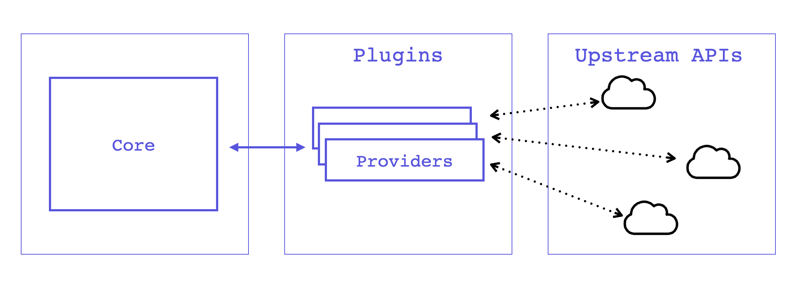
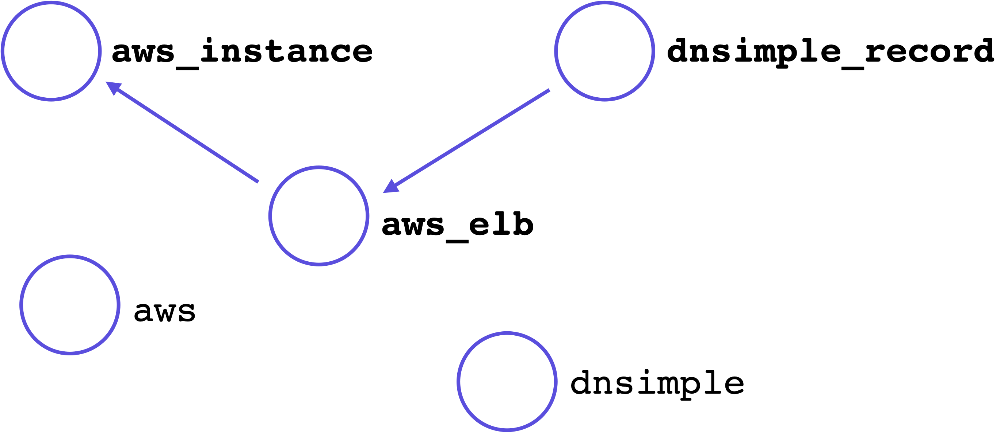
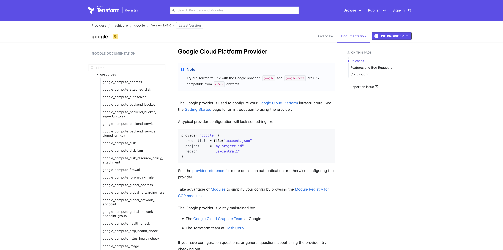
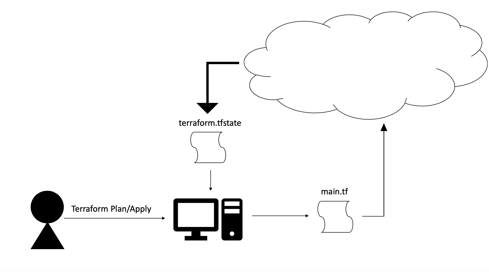
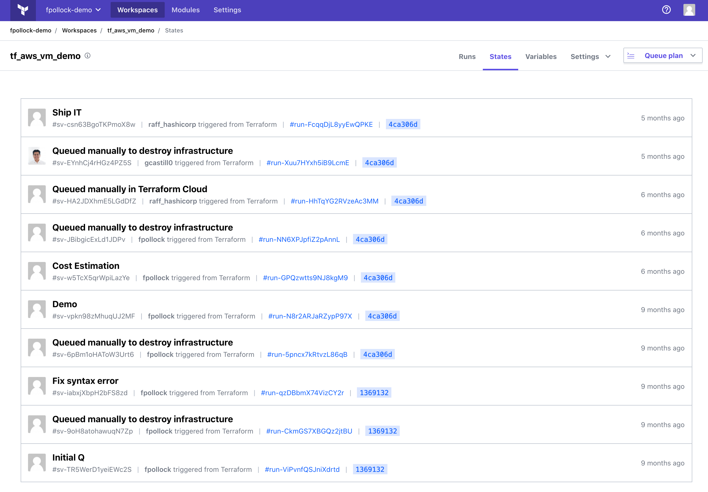

name: tf-foundations-2
class: title, smokescreen, shelf
background-image: url(https://hashicorp.github.io/field-workshops-assets/assets/bkgs/HashiCorp-Title-bkg.jpeg)
count: false

# TFE Technical Enablement
## Terraform Foundations - 2


---
layout: true

background-image: url(../images/bkgs/HashiCorp-Content-bkg.png)
background-size: cover

.footer[

- Copyright © 2021 HashiCorp
]

---
exclude: true
name: slide-deck
class: img-left-full


<br><br><br>
.center[
Follow along at this link:

## https://hashicorp.github.io/field-workshops-terraform/slides/multi-cloud/hcp-terraform/how-tf-works/
]

---
class: title, smokescreen, shelf
background-image: url(https://hashicorp.github.io/field-workshops-assets/assets/bkgs/HashiCorp-Title-bkg.jpeg)
count: false

# Terraform Foundations
## How Terraform Works


---
name: agenda

# Table of Contents

<div>
1. <b>Terraform Architecture</b><br>
2. <b>Providers</b><br>
3. <b>State</b><br>
4. <b>Terraform Workflow</b><br>
</div>

---
name: terraform-arch
class: compact
# Terraform Architecture

Terraform is built on a plugin-based architecture. All providers and provisioners are plugins. Users are able to write new plugins in order to support new functionality in Teraform.



---
name: terraform-arch
class: compact
# Terraform Internals : Core Concepts

## **Config:** <ins>Target</ins> Reality<br>
## **State:** <ins>Current</ins> Reality<br>
## **Diff:** {Config - State}<br>
## **Plan:** <ins>Presents</ins> Diff<br>
## **Apply:** <ins>Resolves</ins> Diff<br>

???
Here's a quick overview of the core concepts that we deal with in Terraform's core. The config is a user provided representation of a desired state. The state records what currently exists. The diff is the difference between the config and the state. The plan is a presentation of this diff. And Apply is the command that makes changes to resolve the diff.

---
name: resource-graph
class: compact
# Resource Graph

The resource graph is an internal representation of all resources and their dependencies.

```JSON
resource "google_compute_instance" "server" {
  name         = "server"
  machine_type = "g1-small"
  zone         = "us-central1-a"

  disk {
   image = "ubuntu-1404-trusty-v20160114e"
  }
}

resource "dnsimple_record" "hello" {
  domain = "example.com"
  name   = "server"
  value  = "${google_compute_instance.server.network_interface.0.address}"
  type   = "A"
}
```

???
Think back to our comparison of Infrastructure as Code to an Entity Relationship Database. Terraform's syntax is intended to be very human-friendly, but under the hood it builds a very powerful resource graph. When resources are created they expose a number of relevant properties. In this case, our DNSimple record is referencing the public IP address of the EC2 instance allowing web.hashicorp.com to resolve to that instance.

---
name: resource-graph
class: compact
# Resource Graph


???
Because you’ve defined your infrastructure in code, we can build a data structure around it and then work with it.

Our graph might look something like this. Some of these nodes depend on data from other nodes which need to be spun up first. Others might be disconnected or isolated.

---
name: resource-graph
class: compact
# Resource Graph


???
The result might look something like this - the green arrows show the dependencies and order of operations.

---
name: resource-graph
class: compact
# Resource Graph


???
This root node will be the starting point for the walk.

---
name: resource-graph
class: compact
# Walking the Graph


???
Terraform walks the graph several times: to collect user input, to validate the config, to generate a plan, and to apply a plan.

Terraform can determine which nodes need to be created sequentially and which can be created in parallel.

---
name: providers
class: compact
# Terraform Providers

A provider is a logical abstraction of an upstream API. They are responsible for understanding API interactions and exposing resources.

Most providers configure a specific infrastructure platform (either cloud or self-hosted).

Providers can also offer local utilities for tasks like generating random numbers for unique resource names.

---
name: providers-2
class: compact
# Terraform Providers

There are 2000+ providers for Terraform


???
There are over 2000 providers for Terraform covering cloud vendors (AWS, GCP, Azure, etc.), SaaS (DataDog, Splunk, GitHub), and on-premise (VMware, Cisco, etc.).

---
name: provider-docs
class: compact
# Provider Documentation
Each provider includes documentation which describes the resource types and data sources and their arguments.


---
name: provider-aws
class: compact
# AWS Provider
There are multiple ways to configure the AWS Provider. In the lab we will use environment variables to allow Terraform to authenticate to AWS. Review the documentation for other options.

provider "aws" {
  region     = "us-west-2"
}


---
name: what-is-state
class: compact
# What is State

State is a stored configuration used by Terraform to
 - map real world resources to your configuration
 - keep track of metadata
 - improve performance for large infrastructures
.center[

]

???
Terraform must store state about your managed infrastructure and configuration.

This state is used by Terraform to map real world resources to your configuration, keep track of metadata, and to improve performance for large infrastructures.

---
name: what-is-state-cont
class: compact
# What is State continued...

- This state is stored by default in a local file named "terraform.tfstate", but it can also be stored remotely, which works better in a team environment.

- Terraform uses this local state to create plans and make changes to your infrastructure.

```JSON
  "version": 4,
  "terraform_version": "0.12.5",
  "serial": 9,
  "lineage": "871f33e8-2c57-ac81-a9db-05eb0d161f83",
  "outputs": {
    }
  }
```

---
name: change-existing-infra
class: compact
# Changing Existing Infrastructure

Whenever you run a plan or apply, Terraform reconciles three different data sources:

1.  What you wrote in your code
2.  The state file
3.  What actually exists

Terraform does its best to add, delete, change, or replace existing resources based on what is in your *.tf files. Here are the four different things that can happen to each resource during a plan/apply:

```tex
+   create
-   destroy
-/+ replace
~   update in-place
```

---
name: state-quiz
class: compact
# Terraform State Quiz
| Configuration           | State                   | Reality                 | Operation |
| ----------------------- | ----------------------- | ----------------------- |:---------:|
| google_compute_instance |                         |                         |    ???    |
| google_compute_instance | google_compute_instance |                         |    ???    |
| google_compute_instance | google_compute_instance | google_compute_instance |    ???    |
|                         | google_compute_instance | google_compute_instance |    ???    |
|                         |                         | google_compute_instance |    ???    |
|                         | google_compute_instance |                         |    ???    |


???
What happens in each scenario? Discuss.

---
name: state-quiz-answers
class: compact
# Terraform State Quiz
| Configuration           | State                   | Reality                 | Operation    |
| ----------------------- | ----------------------- | ----------------------- |:------------:|
| google_compute_instance |                         |                         | create       |
| google_compute_instance | google_compute_instance |                         | create       |
| google_compute_instance | google_compute_instance | google_compute_instance | no-op        |
|                         | google_compute_instance | google_compute_instance | delete       |
|                         |                         | google_compute_instance | no-op        |
|                         | google_compute_instance |                         | update state |


???
What happens in each scenario? Discuss.

---
name: tf-resolves-state
class: compact
# Terraform Resolves State With These Operations

.center[

]

???
Here is another visualization of how Terraform resolves state.

---
name: what-is-remote-storage
# What is Remote Storage

- By default, Terraform stores state locally in a file named terraform.tfstate.

- When working with Terraform in a team, using a local file makes Terraform usage complicated.

- Each user must make sure they always have the latest state data before running Terraform and make sure that nobody else runs Terraform at the same time.

---
name: what-is-remote-storage-2
# What is Remote Storage Cont...

- With remote state, Terraform writes the state data to a remote data store, which can then be shared between all members of a team

- Terraform natively supports storing state in HCP Terraform.

.center[

]

---
name: why-use-remote-storage
# Why Do I Need Remote State?

- Remote state gives you more than just easier version control and safer storage. It also allows you to delegate the outputs to other teams. This allows your infrastructure to be more easily broken down into components that multiple teams can access.
- Put another way, remote state also allows teams to share infrastructure resources in a read-only way without relying on any additional configuration store.
- For example, a core infrastructure team can handle building the core machines, networking, etc. and can expose some information to other teams to run their own infrastructure.

???

**As a more specific example with AWS: you can expose things such as VPC IDs, subnets, NAT instance IDs, etc. through remote state and have other Terraform states consume that.**

---
name: lab
class: title, smokescreen, shelf
background-image: url(https://hashicorp.github.io/field-workshops-assets/assets/bkgs/HashiCorp-Title-bkg.jpeg)
count: false

# Lab 1


---
name: lab-one

# Lab 1 - Overview

We will use the Instruqt training platform for this workshop. The instructor will provide a link to the exercise.

In the first lab we will familarize ourselves with Terraform by digging into the documentation and writing some code. The instructions in the lab will walk through each step and provide links to documentation.

???
We are now going to move to Instruqt to start the first lab. I have sent out the link to the lab.

---
name: lab-one-overview

# Lab 1 - Tips

For the first lab we will have multiple tabs in the Instruqt window:

- Code Editor tab - for this lab we will be using Visual Studio Code (VSCode).
- Terminal Tab - this tab will be used to run our Terraform commands
- Slides - this slideshow provided for additional reference
- Documentation - we have provided relevant links that will help with completing the lab exercises.

???
For this Workshop you will have multiple tabs in the Instruqt window. The default Code Editor tab that is currently displayed is Visual Studio Code, or VSCode for short.

---
name: lab-one-instructions

# Lab 1 - Instructions

In this lab we will write and deploy our resouces with Terraform. We have provided the template to write your first Terraform code.

- In the code editor, open the tflabs folder and click on main.tf
- Main.tf contains comments, one provider block (AWS), and one resource block (aws_vpc)
- Review the AWS provider documentation to fill in the missing required attribute - **region**
- Review the AWS VPC resource documentation to fill in the required attribute - **cidr_block**

---
name: lab-one-instructions-2

# Lab 1 - Instructions

- Run ```terraform init``` from the termnal tab to initialize your directory
- Run ```terraform plan``` to review what Terraform plans to add, remove, or change
- Run ```terraform apply``` to build the resources in AWS
- Use the AWS CLI to review what we built with Terraform
