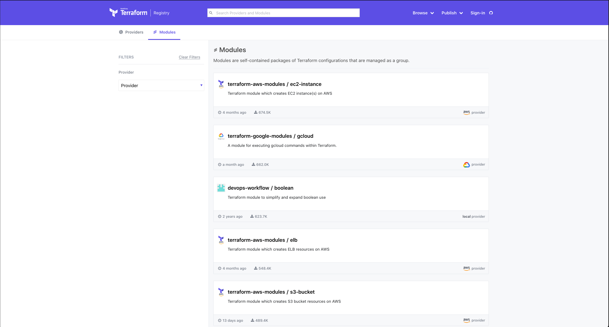

name: tf-foundations-5
class: title, smokescreen, shelf
background-image: url(https://hashicorp.github.io/field-workshops-assets/assets/bkgs/HashiCorp-Title-bkg.jpeg)
count: false

# TFE Technical Enablement
## Terraform Foundations - 4


---
layout: true

background-image: url(../images/bkgs/HashiCorp-Content-bkg.png)
background-size: cover

.footer[

- Copyright © 2021 HashiCorp
]

---
exclude: true
name: slide-deck
class: img-left-full


<br><br><br>
.center[
Follow along at this link:

## https://hashicorp.github.io/field-workshops-terraform/slides/multi-cloud/hcp-terraform/tf-intermediate/
]

---
class: title, smokescreen, shelf
background-image: url(https://hashicorp.github.io/field-workshops-assets/assets/bkgs/HashiCorp-Title-bkg.jpeg)
count: false

# Terraform Foundations
## Terrraform Intermediate


---
name: agenda

# Table of Contents

<div>
1. <b>Modules</b><br>
2. <b>Functions</b><br>
3. <b>Locals</b><br>
</div>

---
name: what-even-is-module
# What is a Terraform Module?
.center[]

Modules are reusable units of Terraform code that hide unnecessary complexity from the user. This one creates a standard network configuration on Google Cloud Platform.

???
**You'll get to use this module in the lab. If you've ever built out a VPC by hand you know that it's not a super simple process. You need to configure the correct network routes, set up your subnets, internet gateways and a bunch of other settings to get it right. This VPC module is meant to give you a standard set of inputs that you can use to configure a best-practice VPC with public and/or private subnets. This saves you the trouble of having to go write all that terraform code yourself.**

---
name: module-benefits
# Benefits of Modules

Modules provide many benefits and solve problems for complex Terraform configurations.

- Organization - easier to naviagate, understand, and update by grouping Terraform configuration into logical components
- Re-useability - easier to re-use configuration written by yourself, your teammates, or the Terraform community
- Consistency and best practices - ensure best practices are applied across configurations

???
placeholder...

---
name: how-modules-configured
# How are Terraform Modules Configured?
Creating Terraform Modules in 3 easy steps:

1. Write some Terraform code, configuring inputs and outputs.
2. Store the Terraform code somewhere your workstation can access it.
3. Reference your modules by file path or source URL.

Sounds easy right?

What if you had to manage dozens or hundreds of modules, with different versions of each?

???
**Think of a terraform module like a black box. Variables (inputs) go in one side, and outputs come out the other side. What happens in the middle is really none of the user's business, as long as they get what they wanted from the module. This lets you control what users are able to build, and guide them to the right path by putting guard rails around them. You can hide variables and settings that the user should not tinker with, and this also keeps things simpler for the end user who just wants their VPC to work so they can build some instances.**

**The challenge is when you start having dozens or hundreds of modules and lots of users consuming them...you really need a centralized way to manage this stuff, which brings us to...**

---
name: public-module-registry
class: img-right
# Public Module Registry


The Terraform Registry contains over 9000 examples of modules for a variety of providers.

[Terraform Registry](http://registry.teraform.io)

???

---
name: private-module-registry
class: img-right
# Terraform Private Registry


HCP Terraform and Enterprise include a Terraform Private Registry where you can store, version, and distribute modules to your organizations and teams.

???
**This is just like the public module registry but it runs inside your own Terraform Organization where only your users can access it. This way you can share private or confidential code, or even take the public modules and fork them for your own use.**

---
name: functions
# Functions

Terraform also includes a number of built-in functions that can be called from within expressions to transform and combine values.

- Numeric Functions - min, max, log, floor, ceil, etc.
- String Functions - join, lower, chomp, split, etc.
- Collection Functions - flatten, length, concat, merge, etc.
- Date/Time - timestamp, formatdate, timeadd
- Type Conversion - tobool, tolist, tomap, tostring, etc.

https://www.terraform.io/docs/configuration/functions.html

???
placeholder

---
name: meta-arguments
# Meta-Arguments

Meta-arguments allow for higher-level control flow and lifecycle management in Terraform
These don’t map directly to cloud resources or APIs, but help you control Terraform’s actions.

The next few slides cover some common meta-arguments.

???

---
name: count
# Count : Multiple Resource Instances By Count

The count argument allows for N number of identical resources to be created. This removes the need for iteration with "for" or "while" loops in many cases

```JSON
# ...

resource "aws_instance" "web" {
  count         = 2

  ami           = "ami-07669fc90e6e6cc47"
  instance_type = "t2.micro"

# ...
}
```
[Count](https://www.terraform.io/docs/configuration/resources.html#count-multiple-resource-instances-by-count)

???
Here's an example of the "count" meta-argument.
There may be a question here about "2" vs 2 - either is fine. Terraform will convert a string to a number when needed.

Once we add "count" to the resource, we need to be aware that aws_instance.web will now refer to multiple "real" resources - so aws_instance.web.public_ip refers to the public ips for all of our instances. using square brackets and the `count.index` value will let us specify the current instance.

---
name: for-each
# for_each : Multiple Resource Instances Defined by a Map, or Set of Strings
For_each provides the ability to manage serveral similar objects 

[for_each](https://www.terraform.io/docs/configuration/resources.html#for_each-multiple-resource-instances-defined-by-a-map-or-set-of-strings)

???

---
name: depends-on

# Depends On

The depends_on argument allows for declaration of explicit dependencies. This is useful where interpolation is not required, but explicit ordering is desired.

[Depends On](https://www.terraform.io/docs/configuration/resources.html#depends_on-explicit-resource-dependencies)

???
An example here is a database and application server. Your application may require the database be up-and-running prior to the application boot, but there's no infrastructure-level dependency. You can use an explicit depends_on to force that order of operations.

It is very rare to require depends_on, and it should only be used as a last resort.

---
name: locals
# Locals
A local value assigns a name to an expression, so you can use it multiple times without repeating it.

```JSON
locals {
  prefix = "${var.project_name}-${var.environment}
}
```

???

---
name: lab-4
class: title, smokescreen, shelf
background-image: url(https://hashicorp.github.io/field-workshops-assets/assets/bkgs/HashiCorp-Title-bkg.jpeg)
count: false

# Lab 4


---
name: lab-four-instructions
# Lab 4 - Instructions

In lab 4 we are going to look at some more advanced features of Terraform including modules. We have staged a new project in your instruqt workspace that puts the networking components we built earlier into a module.

- Review the networking components in main.tf in the **hashicat-aws** project
- Review main.tf in the **hashicat-modular-aws** project
- Go to HCP Terraform and review the new workspaces for the hashicat application

???
First take a look at the hashicat-aws project. This is the full application that we will use in this lab. Review the networking components that are required for this web application - VPC, subnet, security group, routing table, external ip, etc. Even though these components aren't complex, we want to be able to reuse them for other applications so we are going to create a networking module. 

Review the **main.tf in the hashicat-module-aws** project. Both of these projects have been added to your HCP Terraform organization.