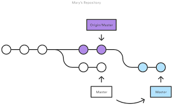
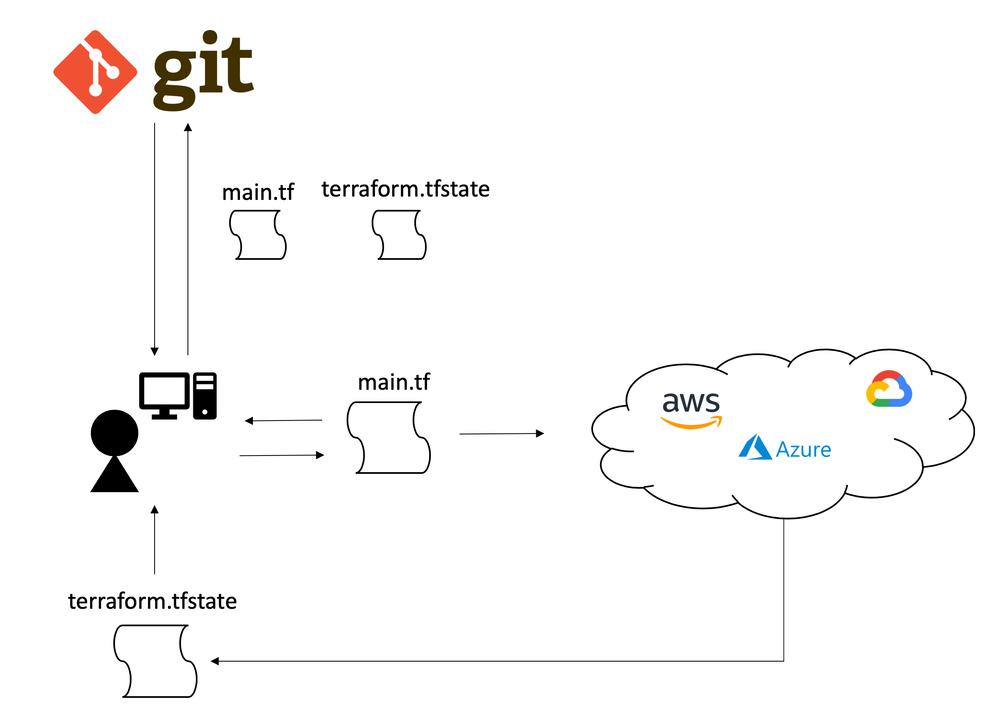
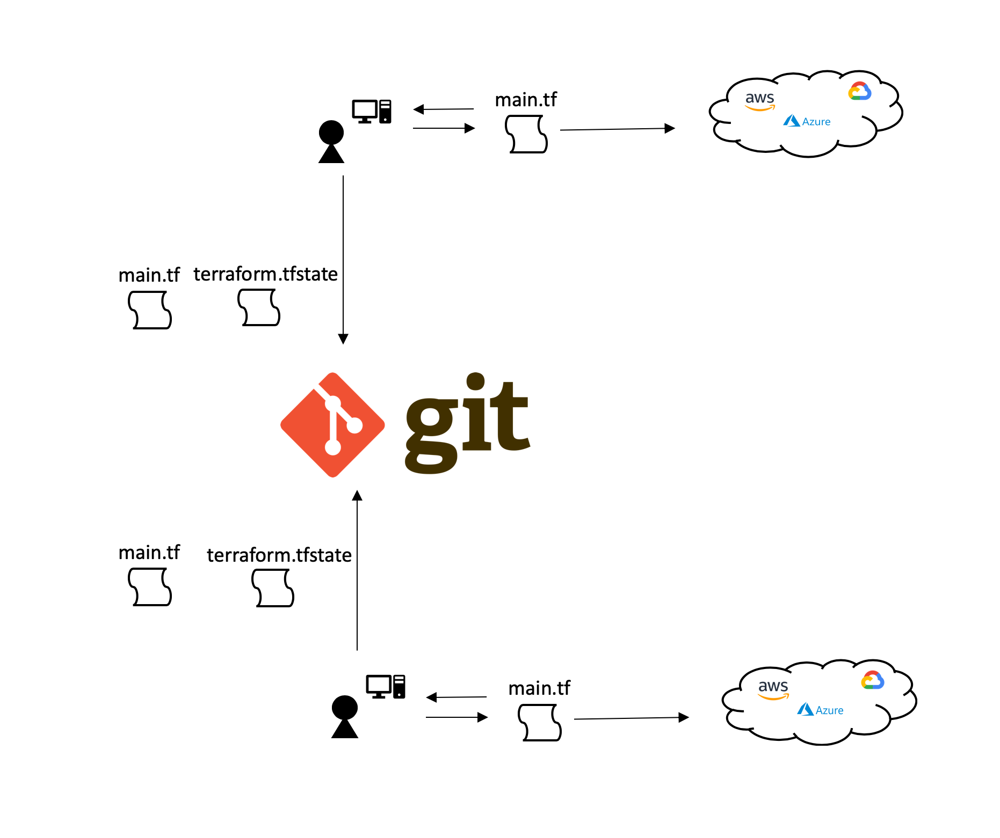
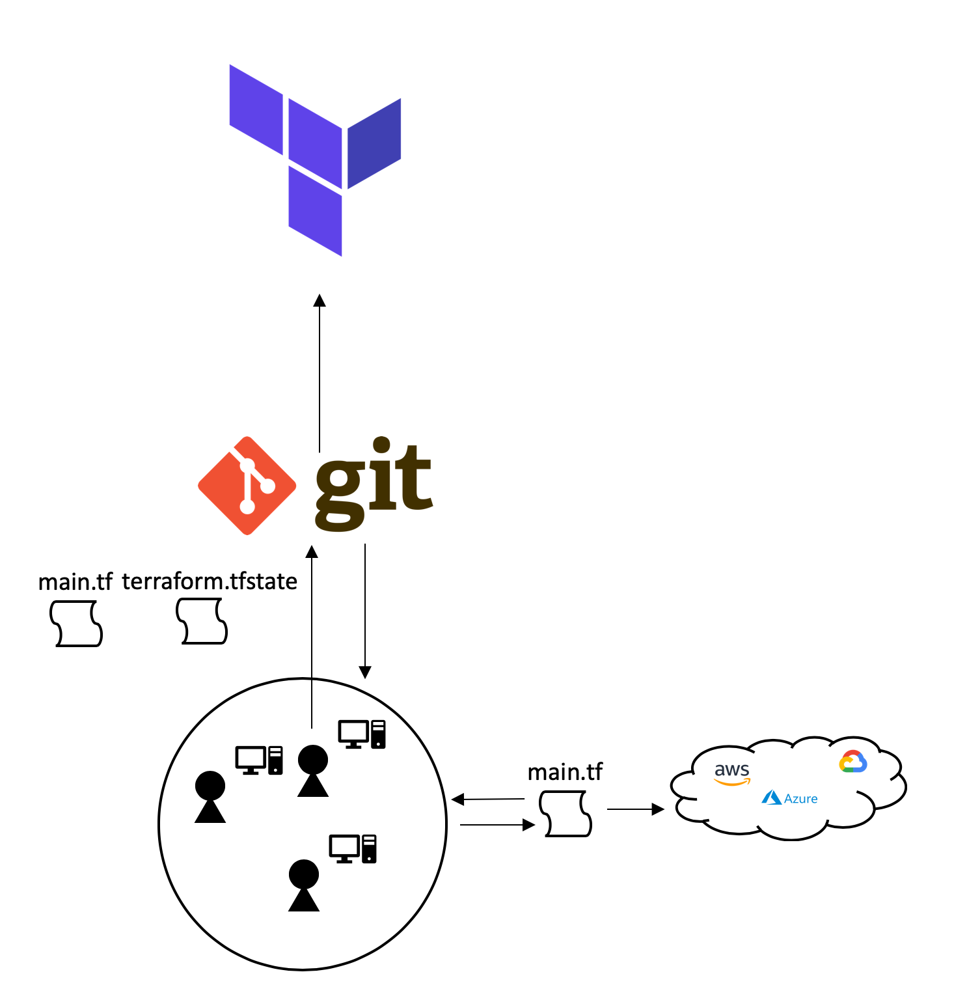

name: tf-foundations-6
class: title, smokescreen, shelf
background-image: url(https://hashicorp.github.io/field-workshops-assets/assets/bkgs/HashiCorp-Title-bkg.jpeg)
count: false

# HCP Terraform Technical Enablement
## Terraform Foundations - 5

---
layout: true

background-image: url(../images/bkgs/HashiCorp-Content-bkg.png)
background-size: cover

.footer[

- Copyright © 2021 HashiCorp
]

---
exclude: true
name: slide-deck
class: img-left-full

   
.center[
Follow along at this link:

## https://hashicorp.github.io/field-workshops-terraform/slides/multi-cloud/hcp-terraform/version-control/
]

---
class: title, smokescreen, shelf
background-image: url(https://hashicorp.github.io/field-workshops-assets/assets/bkgs/HashiCorp-Title-bkg.jpeg)
count: false

# Terraform Foundations
## Version Control and Terraform

---
name: agenda

# Table of Contents

1. <b>What is a Version Control System (VCS)?</b> 
2. <b>How does TFE use VCS?</b> 
3. <b>Collaboration with VCS</b> 

---
name: what-is-a-vcs
# What is a VCS

A component of software configuration management, version control, also known as revision control or
source control, is the management of changes to documents, computer programs, large web sites, and other collections of information.

Changes are usually identified by a number or letter code, termed the "revision number", "revision level", or simply "revision". For example, an initial set of files is "revision 1". When the first change is made, the resulting set is "revision 2", and so on. Each revision is associated with a timestamp and the person making the change. Revisions can be compared, restored, and with some types of files, merged.

---
name: what-is-a-vcs
# What is a VCS cont...

Simply put a version control solution assists in the management, versioning and identification of entities (builds) and the workflow around them.

.center[

]

---
name:
# Why Does TFC/E use a VCS

HCP Terraform is more powerful when you integrate it with your version control system (VCS) provider. Although you can use many of HCP Terraform's features without one, a VCS connection provides additional features and improved workflows.

- When workspaces are linked to a VCS repository, HCP Terraform can automatically initiate Terraform runs when changes are committed to the specified branch.
- HCP Terraform makes code review easier by automatically predicting how pull requests will affect infrastructure.
- Publishing new versions of a private Terraform module is as easy as pushing a tag to the module's repository.

---
name:
# What is the VCS Workflow

.center[

]

---
name: vsc-access-1
# How TFC/E uses VCS Access

Most workspaces in HCP Terraform are associated with a VCS repository, which provides Terraform configurations for that workspace.

To find out which repos are available, access their contents, and create webhooks, HCP Terraform needs access to your VCS provider.

---
name: vsc-access-2
class: compact
# How TFC/E uses VCS Access Continued...

Although HCP Terraform's API lets you create workspaces and push configurations to them without a VCS connection, the primary workflow expects every workspace to be backed by a repository.

To use configurations from VCS, HCP Terraform needs to do several things:

- Access a list of repositories, to let you search for repos when creating new workspaces.
- Register webhooks with your VCS provider, to get notified of new commits to a chosen branch.
- Download the contents of a repository at a specific commit in order to run Terraform with that code.

---
name: tfe-webhooks
class: compact
# TFC/E Webhooks on VCS

HCP Terraform uses webhooks to monitor new commits and pull requests.

- When someone adds new commits to a branch, any HCP Terraform workspaces based on that branch will begin a Terraform run.

- Usually a user must inspect the plan output and approve an apply, but you can also enable automatic applies on a per-workspace basis. You can prevent automatic runs by locking a workspace.

- When someone submits a pull request/merge request to a branch from another branch in the same repository, HCP Terraform performs a speculative plan with the contents of the request and links to the results on the PR's page.

  * This helps you avoid merging PR's that cause apply failures.

---
name: solo-collaboration-with-tfe
# Enabling the Collaboration Workflow
## Individuals

When Users start with Terraform Community Edition they follow a local development cycle that includes the following steps;

- Write initial Terraform Code
- `terraform plan`
- `terraform apply` -> target Cloud
- Once testing is completed, they commit their Terraform code and statefile to Version Control

---
name: solo-collaboration-with-tfe-diagram
# Enabling the Collaboration Workflow

.center[

]

---
name: team-collaboration-with-tfe
# Enabling the Team Collaboration Workflow

When Teams of Terraform Users want to collaborate and cooperate on code, they need to be aware of several key factors;

- When developing against the same infrastructure clobbering can occur
- Statefiles that are managed locally now need to be managed as part of the codebase
  * This issue is exasperated as more users contribute
  * Most organizations solve this by pushing infrastructure changes through a centralized **pipeline**
- Tracking and auditing changes is shifted into the Version Control System

---
name: team-collaboration-with-tfe-diagram
# Enabling the Team Collaboration Workflow

.center[

]

---
name: enterprise-collaboration-with-tfe
# Enabling the Enterprise Collaboration Workflow

Large scale Enterprises have unique needs and requirements when it comes to managing Infrastructure changes and this is where HCP Terraform excels.

---
name: enterprise-collaboration-with-tfe
# Enabling the Enterprise Collaboration Workflow
## VCS and TFE

.center[

]

???

**In this picture we have a group/team/enterprise making individual contributions and commits to the code base, we need to transform this workflow into a more collaborative streamlined approach

Several of the key issues here are;

- clobbering over each others code
- managing the artifacts and "delivering" them to production
- merging in the code base and allocating it to each of the required environments
- audit, etc
- enterprise feature set**

---
name: lab
class: title, smokescreen, shelf
background-image: url(https://hashicorp.github.io/field-workshops-assets/assets/bkgs/HashiCorp-Title-bkg.jpeg)
count: false

# Lab 5

---
name: lab-three-instructions
# Lab 5 - Instructions

Lab 5 introduces a Terraform workflow that is based around Version Control. For this lab we have created a local GitLab CE version control server. We have also connected the server to your HCP Terraform account.

- In the terminal tab, click on the url to log into the local GitLab server
- Review the projects that are staged in the VCS
- Follow the lab instructions to get familar with the GitLab interface
- Go to HCP Terraform and click on the new organization that has been created - Terraform-Foundations-<RandomString>
- Review the workspaces in the organization
- Return to GitLab and select the HashiCat AWS project development branch

---
name: lab-three-instructions-cont
# Lab 5 - Instructions Continued

- Modify the welcome message in the deploy_app.sh script
- Commit the changes into version control
- Review the Development workspace in HCP Terraform
- Review application welcome message changes
- Create merge request to promote changes to staging branch

