name: d1m5-sentinel-policy-enforcement
class: title, smokescreen, shelf
background-image: url(https://hashicorp.github.io/field-workshops-assets/assets/bkgs/HashiCorp-Title-bkg.jpeg)
count: false

# Sentinel for Terraform Workshop (v5)
## <Instructor>


---
name: tf-section
class: title, smokescreen, shelf
layout: true


background-image: url(https://hashicorp.github.io/field-workshops-assets/assets/bkgs/HashiCorp-Title-bkg.jpeg)
background-size: cover

.footer[

- Copyright © 2020 HashiCorp
]

---
layout: true

background-image: url(../images/bkgs/HashiCorp-Content-bkg.png)
background-size: cover

---
name: slide-deck
exclude: true
class: img-left-full


<br><br><br>
.center[
Follow along at this link:

## https://hashicorp.github.io/field-workshops-terraform/slides/sentinel/
]
---
name: agenda
class: compact
# Workshop Agenda

<b>
- Introduction to Sentinel Concepts
- How Sentinel Works
    - *Lab Challenge 1:* Using Sentinel CLI
    - *Lab Challenge 2:* Applying and Testing a Policy with the CLI
- First Sentinel Policy Overview
  - Imports (Modules and Functions)
  - Basic evaluation
  - Print
- Writing your own Policies Using **Common Functions** and Testing Them
  - Common Functions
- Writing your own Policies  **From Scratch**
  - Advanced Sentinel Language
- Advanced Techniques
  - _Lab Challenges 3-7: Sprinkled In_

</b>

---
class: title, smokescreen, shelf
background-image: url(https://hashicorp.github.io/field-workshops-assets/assets/bkgs/HashiCorp-Title-bkg.jpeg)
count: false

# Chapter 1 - Introduction to Sentinel Concepts


---
name: sentinel-overview
# What is Sentinel

- Sentinel is a **Policy As Code** framework to enable fine-grained, logic-based policies

  - *Sentinel is to a Policy Framework as Terraform is to Infrastructure as Code*


- It includes its own language and is embedded in HashiCorp’s Enterprise products.

- It supports fine-grained policies that use conditional logic.
  - For example - "Is this image in the supported images list?"

---
name: sentinel-overview2
# What is Sentinel

- Sentinel is enabled as part of your provisioning workflow, ensuring that policies are checked each time Terraform runs
  - It includes a CLI that allows you to test and run policies.
- Policy as Code takes your excel spreadsheets, legal, regulatory requirement documents and individual security best practice knowledge and turns it into Code.

.center[
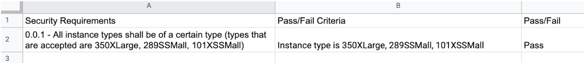
]

- (allowed_types = [”350xlarge”,”289ssmall”,”101xssmall”])

---
name: benefits-of-policy
# Benefits of Policy as Code


- All the same benefits of Infrastructure as Code!
  - Version History, Change Control, Collaboration

- Easily share-able and consumable across multiple organizations and teams in HCP Terraform

- Can be tested and iterated on in an automated fashion with real test data!
  - We'll discuss mock data and testing in this training!!!

???

Lorem ipsum dolor sit amet, consectetur adipiscing elit, sed do eiusmod tempor incididunt ut labore et dolore magna aliqua

---
name: customer-use-cases
# How Customers are Using Sentinel in Terraform

- HashiCorp customers are using Sentinel to enforce security standards:
  - Require all S3 buckets use the private ACL and be encrypted by KMS.
  - Restrict which roles the AWS provider can assume.
  - Prohibit specific resources, data sources, providers, or provisioners.

**# List of allowed providers** <br>
**allowed_list = ["aws", "local", "null", "random", "terraform", "tfe"]**

---
name: customer-use-cases2
# How Customers are Using Sentinel in Terraform

- HashiCorp customers are using Sentinel to avoid excessive costs:
  - Limit the sizes of VMs and Kubernetes clusters in public clouds
  - Limit the monthly spend of each Terraform workspace
- HashiCorp customers are using Sentinel to avoid enforce standards:
  - Enforce mandatory tags on resources provisioned by Terraform
  - Mandate that all modules come from a Terraform Private Registry

**# List of allowed resources** <br>
**allowed_list = ["aws_instance", "azurerm_virtualmachine", "google_compute_instance"]**

---
name: what-does-sentinel-not-do
# What Sentinel Does Not Do in Terraform

- Continually check infrastructure to validate compliance
- Remove existing resources that violate policies
- Ensure that resource attributes are valid
  - For instance, Sentinel can validate that a KMS key is specified for an S3 bucket, but not that it is a valid key
  - Can’t check if “SuperLargeBigInstance” is a valid type
- Analyze or limit runtime actions of deployed applications

---
name: where-is-sentinel-used
# Where is Sentinel Used in Terraform?

- **Sentinel Policies** are checked between the standard **plan** and **apply** steps of Terraform runs.
- Policies have different enforcement levels
- Sentinel policies can evaluate the **attributes** of existing and new resources based on information from the current run:
  - the plan, the configuration, the current state, and other run data including cost estimates
- This ensures that resources comply with all policies **before** they are provisioned.

---
name: without-sentinel
# Terraform Without Sentinel

<br>
.center[
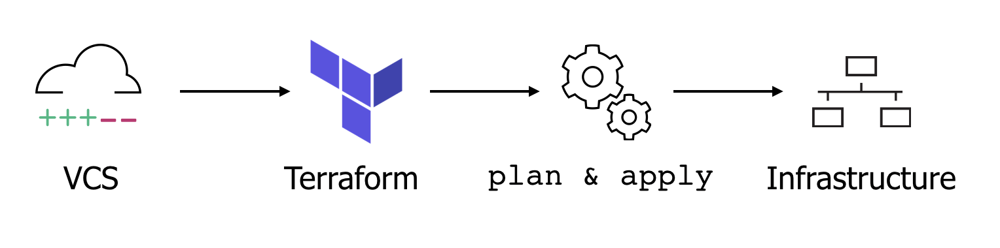
]

---
name: with-sentinel
# Terraform With Sentinel

.center[
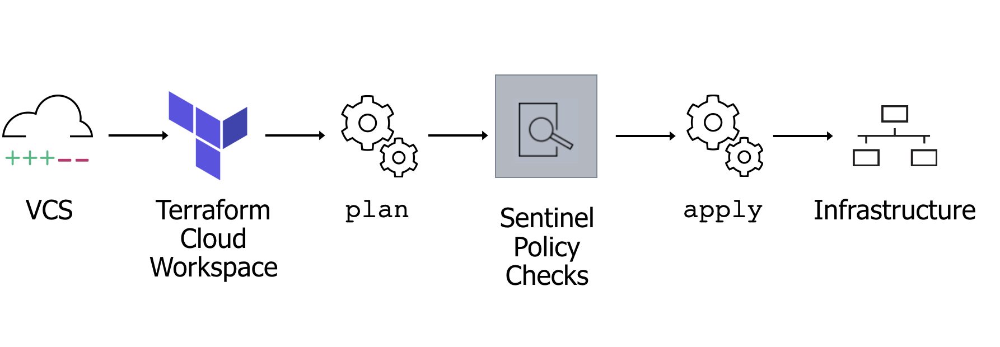
]

---
name: policys-passed
# All Policy Checks Passed

.center[
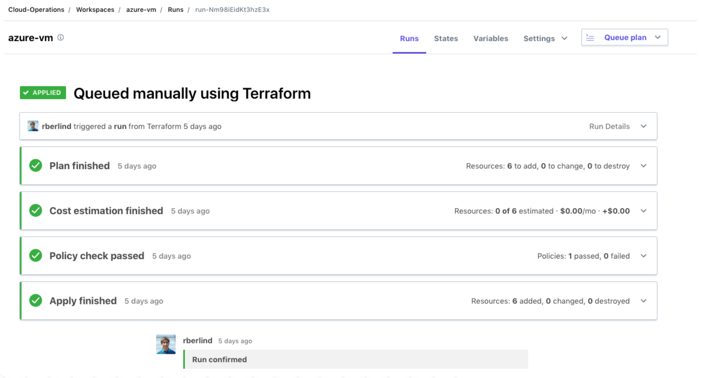
]

---
name: policys-passed2
# All Policy Checks Passed

.center[
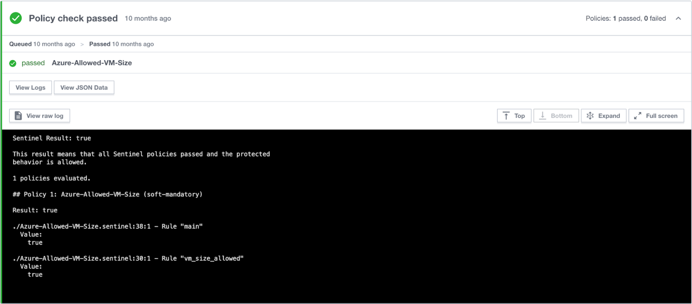
]

---
name: enforcement-levels
# Sentinel Policy Enforcement Levels

- **Advisory**
  - Only logs violations
- **Soft Mandatory**
  - Can be overriden by authorized users
- **Hard Mandatory**
  - Cannot be overriden by anyone
- Customers often create new Sentinel policies as Advisory, then transition to Soft Mandatory, and eventually to Hard Mandatory
- This gives Terraform coders time to adapt and modify their code

???

Fix later too annoying

---
name: soft-mandatory
# A Soft Mandatory Policy Check Was Overridden

.center[
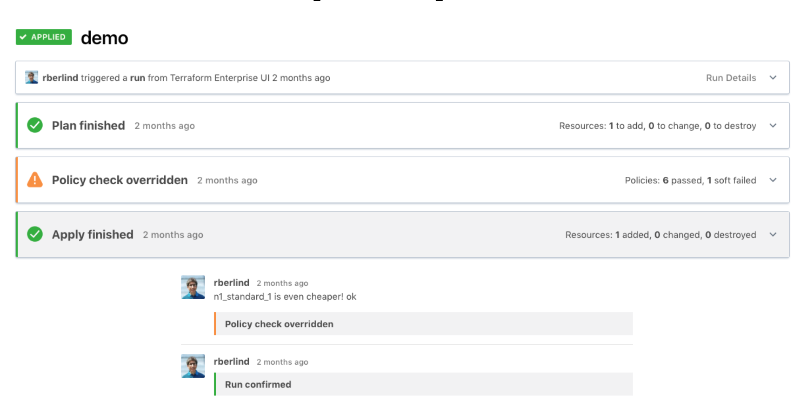
]

---
name: policy-sets
# Sentinel Policy Sets and Policies

- **Policy Sets** are groups of **Sentinel Policies** (and optionally Sentinel Modules)
  - They can be enforced on all workspaces or only on selected workspaces within one or more organizations.
- They are usually created in VCS repositories and then registered with organizations using the HCP Terraform UI or API.
- Additionally, **Parameters** can be added to policy sets allowing the secure introduction of credentials needed by API endpoints invoked with the Sentinel HTTP import.

---
name: chapter-summary
# Chapter Summary

- Sentinel is Policy as Code framework
- HCP Terraform automatically runs Sentinel checks between **plan and apply**
- Sentinel has different enforcement levels, **Advisory, Soft and Hard Mandatory**

---
class: title, smokescreen, shelf
background-image: url(https://hashicorp.github.io/field-workshops-assets/assets/bkgs/HashiCorp-Title-bkg.jpeg)
count: false

# Chapter 1 - Complete


---
name: c1-references
# References

- [Sentinel Documentation](https://docs.hashicorp.com/sentinel)
  - Basic introduction to documentation
- [Sentinel Overview](https://www.terraform.io/cloud-docs/sentinel)
  - High level overview of Sentinel and Terraform
- [Manage Policies](https://www.terraform.io/cloud-docs/sentinel/manage-policies)
  - Managing Policies in HCP Terraform
- [Enforcement Levels](https://www.terraform.io/cloud-docs/sentinel/enforce)
  - The various enforcement levels

???

Update to all same format please

---
class: title, smokescreen, shelf
background-image: url(https://hashicorp.github.io/field-workshops-assets/assets/bkgs/HashiCorp-Title-bkg.jpeg)
count: false

# Chapter 2 - How Sentinel Works


---
name: what-do
# What Does Sentinel DO in Terraform?

- Sentinel has the ability to “check” any resources inside Terraform
- Using the concept of ‘imports’ Sentinel can get data from;
  - A Terraform Plan
  - Terraform Config
      - Variables, data, etc
  - Terraform Run
  - Much much more!
      - HTTP Import can even call externally!!!

---

name: behind-the-scenes
# The Engine Behind the Scenes

.center[
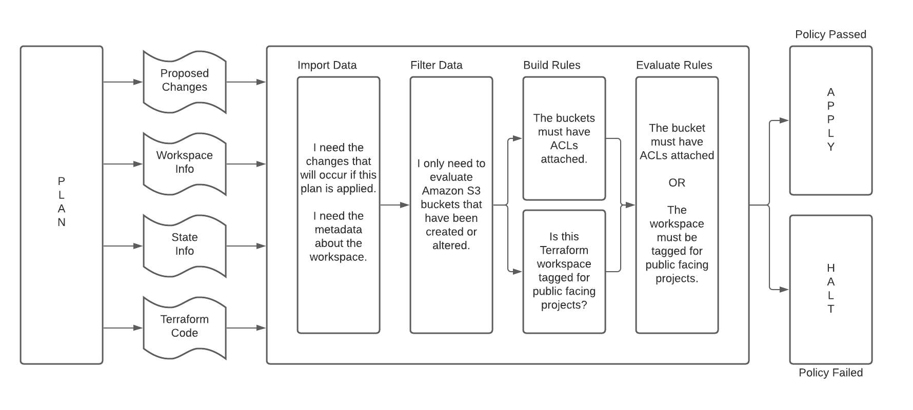
]

---
name: what-does-it-look-like
# What Does a Sentinel Check Look Like?

.center[
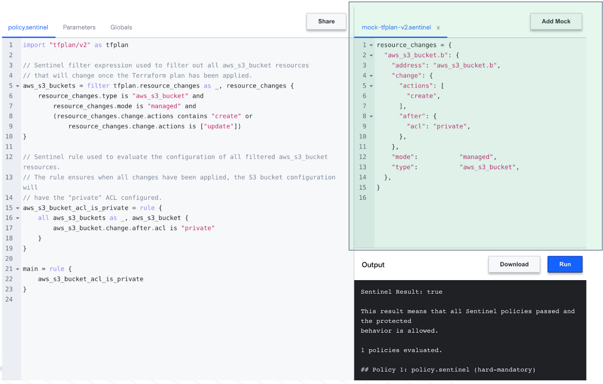
]

---
name: normal-view
# The UI View

.center[

]

---
name: lets-start
# How Can We Get Started?

- Sentinel supports a CLI for testing
  - It just needs some **mock data** somehow...
- Terraform has a plan method that let's you preview changes
  - That is our data!
- So let's mock some data and **'Get Started with Sentinel'**

---
name: mock-intro
# Let's Talk About Mocks

.center[
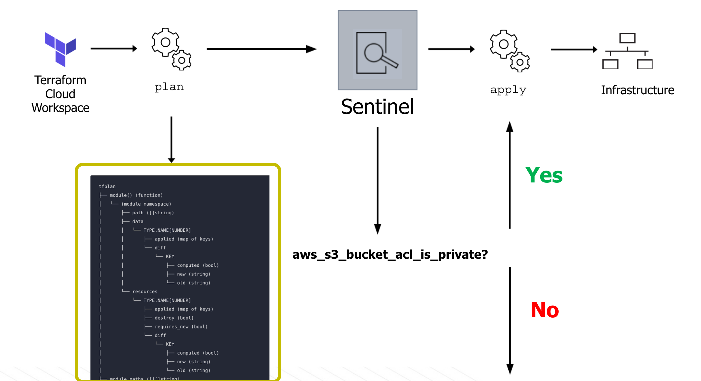
]

---
name: mock-intro
# Sentinel Mocks in Terraform

- Sentinel **Mocks** simulate the data from Terraform plans
  - They can be generated from HCP Terraform
- **Mocks** can be edited and modified to simulate other data
- Using the Sentinel CLI with mocks speeds up development of new policies since additional plans do not need to be run.

.center[
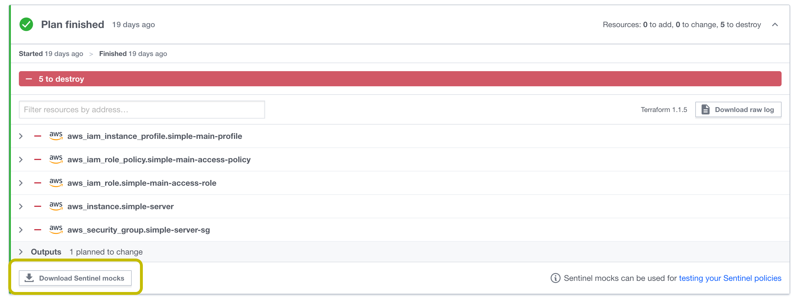
]

---
name: mock-preview
class: compact
# What a Mock looks like

```
terraform_version = "1.1.5"

planned_values = {
	"outputs":   {},
	"resources": {},
}

variables = {
	"aws_region": {
		"name":  "aws_region",
		"value": "us-east-1",
	},
	"instance_type": {
		"name":  "instance_type",
		"value": "t3.large",
	}
```

---
name: mock-preview
class: compact
# What a Mock looks like (2)

```
resource_changes = {
	"aws_iam_instance_profile.simple-main-profile": {
		"address": "aws_iam_instance_profile.simple-main-profile",
		"change": {
			"actions": [
				"delete",
			],
			"after":         null,
			"after_unknown": {},
			"before": {
				"arn":         "arn:aws:iam::711129375688:instance-profile/potato-access-profile",
				"create_date": "2022-02-03T16:27:32Z",
				"id":          "potato-access-profile",
				"name":        "potato-access-profile",
				"name_prefix": null,
				"path":        "/",
				"role":        "potato-access-role"
```

---
name: mocks-in-terraform
# Sentinel Mocks in Terraform

- **tfplan mock**
  - gives data generated from Terraform plans
- **tfconfig mock**
  - gives data about the Terraform configuration
- **tfstate mock**
  - gives data about the current state of a workspace
- **tfrun mock**
  - gives metadata for Terraform runs and their workspaces as well as cost estimate data
- **Some policies might use more than one of these imports.**

---
name: types-of-policies-0
# Types of Terraform Sentinel Policies (0)

There are essentially four types of Terraform Sentinel policies corresponding to the 4 Terraform Sentinel imports:
- Policies can use the **tfplan** import
  - restricts specific attributes of specific resources and data sources in the current Terraform plan.
      - `# Get all Azure Security Center Pricings allAzureSecCenterSubPricings = plan.find_resources("azurerm_security_center_subscription_pricing")`

---
name: types-of-policies-1
# Types of Terraform Sentinel Policies (1)

- Policies can use the **tfconfig** import
  - restricts the configuration of Terraform modules, variables, resources, data sources, providers, provisioners, and outputs.
      - `# List of allowed resources allowed_list = ["aws_instance", "azurerm_virtualmachine", "google_compute_instance"]`

---
name: types-of-policies-2
# Types of Terraform Sentinel Policies (2)

- Policies can use the tfstate import
  - checks whether previously provisioned resources or data sources have attributes with values that are no longer allowed.

---
name: types-of-policies-3
# Types of Terraform Sentinel Policies (3)

- Policies can use the tfrun import
  - checks workspace and run metadata and whether cost estimates for planned resources are within limits.
      - `# Determine proposed monthly cost proposed_cost = decimal.new(tfrun.cost_estimate.proposed_monthly_cost)`

---
name: chapter-summary
# Chapter Summary

- Sentinel can 'import' data from several sources in Terraform and HCP Terraform
  - The Terraform Plan, Config, State and Run Data!
- You can 'simulate' this life-cycle by using **Mocks**
  - Mocks can be generated from HCP Terraform
  - Mocks can then be tested with **Sentinel CLI**

---
class: title, smokescreen, shelf
background-image: url(https://hashicorp.github.io/field-workshops-assets/assets/bkgs/HashiCorp-Title-bkg.jpeg)
count: false

# Chapter 2 - Complete


---
name: chapter-2-references
class: compact
# References

- [Sentinel Imports](https://docs.hashicorp.com/sentinel/intro/getting-started/imports)
  - Imports enable Sentinel to access external data and functions
- [Generating Mock Data](https://www.terraform.io/cloud-docs/sentinel/mock)
  - [Basics of TF Config Import](https://www.terraform.io/cloud-docs/sentinel/import/tfconfig-v2)
      - Policies using the tfconfig import can access all aspects of the configuration: providers, resources, data sources, modules, and variables
  - [Basics of TF Plan Import](https://www.terraform.io/cloud-docs/sentinel/import/tfplan-v2)
      - The plan represents the changes that Terraform needs to make to infrastructure to reach the desired state represented by the configuration
  - [Basics of TF State Import](https://www.terraform.io/cloud-docs/sentinel/import/tfstate-v2)
      - The state is the data that Terraform has recorded about a workspace at a particular point in its lifecycle, usually after an apply
  - [Basics of TF Run Import](https://www.terraform.io/cloud-docs/sentinel/import/tfrun)
      - This import currently consists of run attributes, as well as namespaces for the organization, workspace and cost-estimate

---
class: title, smokescreen, shelf
background-image: url(https://hashicorp.github.io/field-workshops-assets/assets/bkgs/HashiCorp-Title-bkg.jpeg)
count: false

# Workshop 1: Using the Sentinel CLI


---
name: challenge-one
# Workshop 1: Using the Sentinel CLI

- The hands-on lab exercises of this workshop are done in an interactive learning platform Instruqt

- For this workshop, please use links provided by your instructor for these tracks:
  - Sentinel CLI Basics
  - Sentinel for Terraform v4

- In the first challenge of the first track, you'll learn how to run Sentinel CLI commands.

---
name: instruqt-basics
# Instruqt Basics

- The Instruqt platform organizes training content into Tracks consisting of multiple Challenges that must be solved in a specific order
- Each track launches one or more VMs and/or Docker containers and exposes terminals, file editors, and user interfaces on Tabs
- Information about each challenge is displayed on Note screens while it is loading. A Start Button will be shown when the challenge is ready.
- Detailed instructions are listed in an Assignment to the right of the tabs.
- You can click the Check Button to verify if you have completed the assignment. If you have, you will advance to the next challenge. Otherwise, you will be given a hint about what to do next.
- We recommend you review Instruqt's own tutorial track for more details

---
class: title, smokescreen, shelf
background-image: url(https://hashicorp.github.io/field-workshops-assets/assets/bkgs/HashiCorp-Title-bkg.jpeg)
count: false

# Workshop 2: Applying and Testing Policies


---
name: challenge-2
# Workshop 2: Applying and Testing Policies

- In the second challenge, you'll learn how to apply and test a simple Sentinel policy with the Sentinel CLI.

- Please continue in your running instance of the Sentinel CLI Basics track by clicking the green Check button.

---
class: title, smokescreen, shelf
background-image: url(https://hashicorp.github.io/field-workshops-assets/assets/bkgs/HashiCorp-Title-bkg.jpeg)
count: false

# Chapter 3 - Introducing a Policy


---
name: chapter3-intro
# Introducing Policies Agenda

- Discuss the common components of a Sentinel Policy
  - Imports (Modules and Functions)
  - Basic evaluation
  - Printing
- Writing your own Policies Using **Common Functions**
  - Common Functions
- Writing your own Policies **From Scratch**
  - Advanced Sentinel Language

---
name: policy-intro-0
# Your First Policy – Concepts

- Imports
  - Modules and Functions
- Declare criteria to evaluate against
  - Approved images, “Right” ports to use, “allowed” regions
- Find all resources in Terraform to evaluate against
  - Find all images, find all port configurations, find all regions
- Evaluate
- Test
- Print

---
name: policy-intro-1
# Your First Policy – Imports

.center[
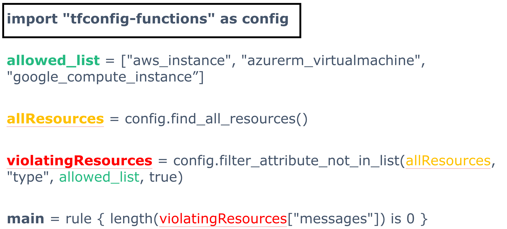
]

---
name: what-is-import
# What is an Import?

- You have already been introduced to a few different kinds of **imports** already!
  - Terraform Plan, Config and Run Mocks are examples of **imports**
- Imports in Sentinel are similair to those of other programming langauges
  - `import` enables a policy to access reusable libraries, external data and **functions**
- Sentinel ships with a set of standard imports to do basic functions
  - For example, the import:json capability allows you to parse and access a JSON document
  - Using import we can also consume **common functions** built by power users

---
name: sentinel-imports
# Standard Sentinel Imports

- Standard Imports
  - base64
  - decimal
  - **http**
  - json
  - runtime
  - sockaddr
  - **strings**
  - time
  - types
  - units
  - version

???

Highlighting 2 as they are the most important

---
name: example-operations
# Example Operations using Imported data

- Check if a string has a prefix:
  - **strings.has_prefix(s, prefix)**
- Check if a string has a suffix:
  - **strings.has_suffix(s, suffix)**
- Check the type of a Sentinel object:
  - **types.type_of(obj)**
- Make external calls to API endpoints:
  - **response = http.get("https://example.hashicorp.com")**
- Convert a JSON object to a Sentinel structure:
  - **json.unmarshal(response.body)**
  - **Most HashiCorp configuration and data is in JSON**

---
name: policy-intro-1
# Your First Policy – Imports: Functions

.center[

]

---
name: functions-intro
# What are Functions?

- Functions allow you to create reusable code to perform computations

- A Sentinel **Function** is declared with the **func** keyword.

```
find_resources = func(resource_type) {
  # Do something and use the parameter
  return true
}
```

---
name: functions-again
# What are Functions?

```
find_resources = func(resource_type) {
  # Do something and use the parameter
  return true
}
```
- Each function has a name such as **find_resources**.
- Each function can have zero or more parameters.
  - The function above has the single parameter, **resource_type**
- Every function must return a value such as **true**.
- A call to this function could look like:
  - **s3_buckets = find_resources("aws_s3_bucket")**

---
name: policy-deep-dive
class: compact
# What Does a Function Look Like?

A full function looks like this

```
Execute various statements and return a value.
### find_resources ###
	# Find all resources of a specific type using the tfplan/v2 import.
	# Include resources that are not being permanently deleted.
	# Technically, this returns a map of resource changes.
	find_resources = func(type) {
  	resources = filter tfplan.resource_changes as address, rc {
  		rc.type is type and
  		rc.mode is "managed" and
  		(rc.change.actions contains "create" or rc.change.actions contains "update" or
    	 rc.change.actions contains "read" or (rc.change.actions contains "no-op" and
     	rc.change.after is not null))
  	} return resources }
```

???

We wont teach writing functions in this class

---
name: functions-intro
# Importing Functions

- But when written once, you can just **Import** it repeatedly;
    - **import "tfconfig-functions" as config**
    - **Modules** allow you to re-use Sentinel code as an import*
- Writing your first function will take some time and effort
- To get started faster you can use some **[Common Functions](https://github.com/hashicorp/terraform-guides/tree/master/governance/third-generation/common-functions)**
  - Find all resources called "**foobar**"
  - Limit proposed monthly cost
  - Prevent destroy
  - MORE!!!

???

We won't discuss modules or the structure or writing of modules in this, all you need to know is functions come from modules

---
name: builtin-functions
# Builtin Functions

- Sentinel includes some useful **Builtin Functions:**
  - **append**		Appends a value to the end of a list
  - **delete**		Deletes an element from a map
  - **error**	Immediately exit with an error message
  - **keys**		Returns the keys of a map
  - **length**		Returns the length of a collection or string
  - **print**		Prints what you tell it to.  Always returns true.
  - **range**		Returns a list of numbers in a range.
  - **values**		Returns the values of a map.

---
name: policy-intro-2
# Sentinel Policy Introduction – Concepts (2)

.center[

]

---
name: policy-intro-3
# Sentinel Policy Introduction – Concepts (3)

.center[
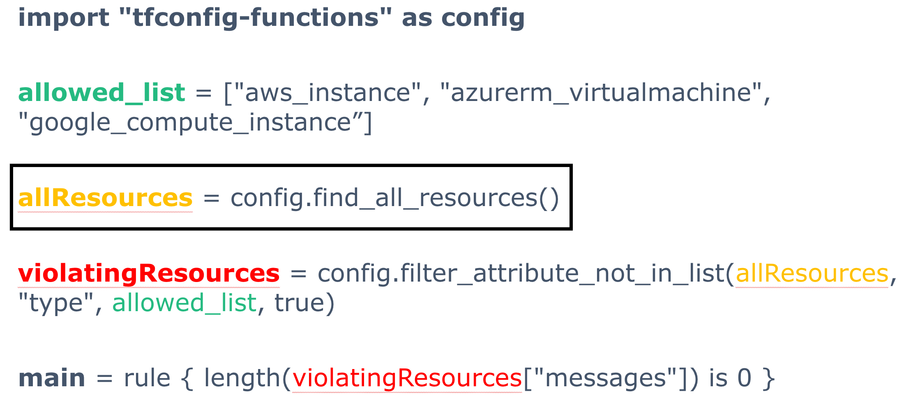
]

---
name: policy-intro-4
# Sentinel Policy Introduction – Concepts (4)

.center[
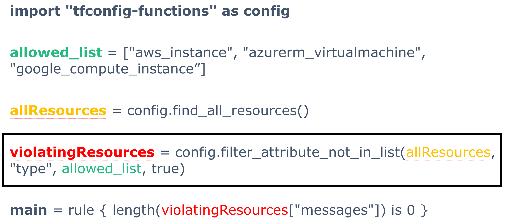
]

---
name: policy-intro-5
# Sentinel Policy Introduction – Concepts (5)

.center[
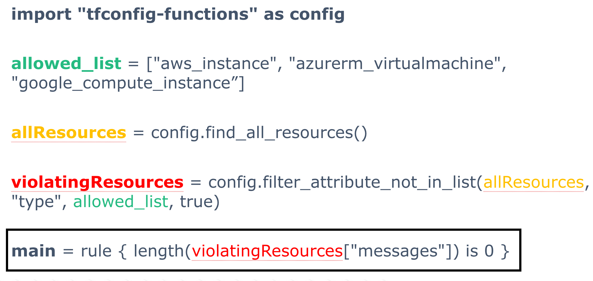
]

---
name: chapter-summary
# Chapter Summary

- A basic rule of thumb is that Sentinel policies contain;
  - Imports/Modules/Functions
  - Evaluation Criteria (**Negative or Positive**)
  - A ’Search’ for any resources to test
  - **ONE** main rule
    - **At least one, but could be many**
- Sentinel has built in functions
  - There’s also common functions you can consume!
- Remember that Sentinel is embedded across HashiCorp’s Enterprise tools
  - Cool hint: if you’re using more than one HashiCorp product you could get Sentinel data from them!

---
class: title, smokescreen, shelf
background-image: url(https://hashicorp.github.io/field-workshops-assets/assets/bkgs/HashiCorp-Title-bkg.jpeg)
count: false

# Chapter 3 - Complete


---
name: references
# References

- [Sentinel Built in Functions](https://docs.hashicorp.com/sentinel/language/functions)
  - Functions allow you to create reusable code to perform computations.
- Sentinel in HashiCorp Products
  - [Sentinel in Terraform](https://www.terraform.io/cloud-docs/sentinel)
  - [Sentinel in Vault](https://www.vaultproject.io/docs/enterprise/sentinel)
  - [Sentinel in Consul](https://docs.hashicorp.com/sentinel/consul)
- [Common Functions](https://github.com/hashicorp/terraform-guides/tree/master/governance/third-generation/common-functions)
  - A great resource to get started writing and consuming existing policies

---
class: title, smokescreen, shelf
background-image: url(https://hashicorp.github.io/field-workshops-assets/assets/bkgs/HashiCorp-Title-bkg.jpeg)
count: false

# Chapter 4 - Writing and Testing Sentinel Policies for Terraform


---
name: authoring-workflow
# Introducing the Sentinel Authoring Workflow

Developing and testing Sentinel policies follows a standard workflow.

You can use three different methods for testing your Terraform Sentinel policies:
  - You can manually test policies against actual Terraform code by using the Terraform UI or the Terraform CLI with the remote backend.
  - You can execute automated tests against actual Terraform code by using the Terraform API.
  - You can use the Sentinel Simulator with mocks generated from Terraform plans.

---
name: authoring-workflow
# Introducing the Sentinel Authoring Workflow

For the purpose of this course and as a general recommendation we suggest using the third method;

- Using the Sentinel Simulator with mocks generated from Terraform plans.

This allows a user to rapidly iterate, test and observe changes locally by simulating the process

---
name: methodology-0
# Introducing the Sentinel Authoring Workflow

- Writing and Testing Sentinel Policies involves Eight Steps;
1. Write Terraform code to create a resource
2. Create a workspace that uses your Terraform code
3. Start a plan in the workspace
4. `Download Sentinel mocks` in the workspace
5. Write a new Sentinel policy
  - **Or copy common functions and tests!!!**
6. Create positive and negative test cases, test them!
7. Iterate, Iterate, Iterate
8. Deploy your policy
  - _Secret Step 9, relax and enjoy automated policy enforcement_

---
name: authoring-workflow-diagram
#Authoring Workflow Diagram

.center[
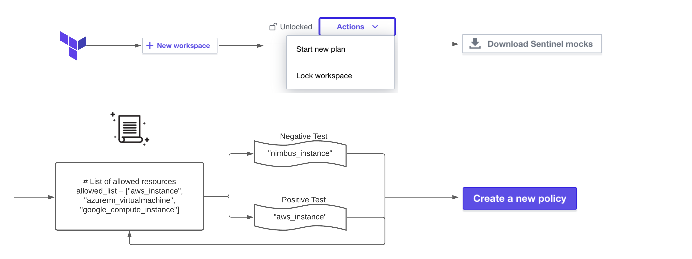
]

---
name: methodology-1
# Step 1 - Write Terraform Code

- Create a Terraform code that provisions at least one instance of the resource your policy will effect
  - For example I want to restrict AWS Instance Types, therefore I need a "aws_instance" to test
- Use Variables to set the values you want to test
  - `instance_type = "${var.instance_type}"`
- Bonus Tip
  - **Create more than one instance to test positive and negative**

---
name: methodology-1
# Create a Terraform Configuration: main.tf

```
variable "ami_id" {
  default = "ami-2e1ef954"
}

variable "instance_type" {
  default = "t2.micro"
}

resource "aws_instance" "ubuntu" {
  count         = 2
  ami           = "${var.ami_id}"
  instance_type = "${var.instance_type}"
}
```

---
name: methodology-2
# Terraform Terminology for Resources

```
resource "aws_instance" "ubuntu" {
  count         = 2
  ami           = "${var.ami_id}"
  instance_type = "${var.instance_type}"
}
```
- Remember for writing policies later!
  - "aws_instance" is the **Type** of the resource.
      - "ubuntu" is its **Name.**
  - Each occurrence of a resource is referred to as a **Resource Instance.**
  - This code will create two **Instances** of the resource since count was set to 2.

---
name: methodology-4
# Integrate with HCP Terraform

- In order to use the Remote Backend against a TFC/TFE server;
  - Authenticate to HCP Terraform `terraform login`
  - Configure your backend

```
terraform {
  backend "remote" {
    hostname = "<your_TFE_server>"
    organization = "<your_org>"

    workspaces {
      name = "<your_workspace>"
    }
  }
}
```

---
name: methodology-6
#  Step 2 - Create a Workspace in the TFC/TFE UI

.center[
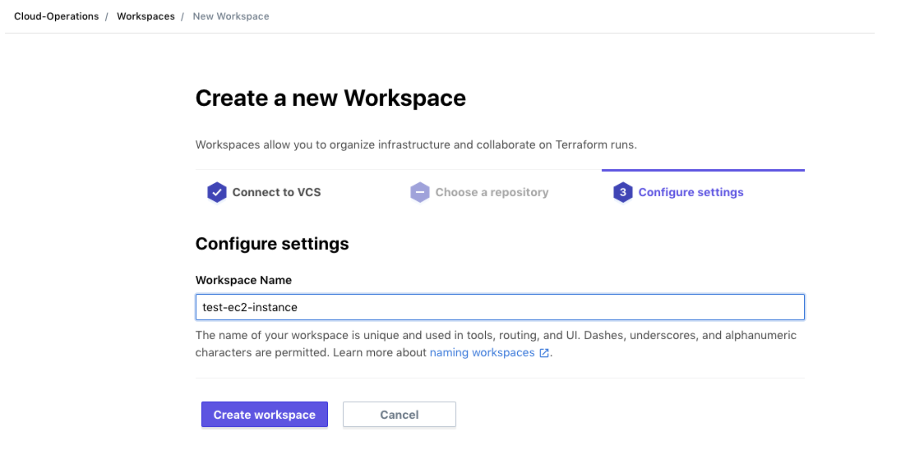
]

---
name: methodology-7
# Set Variables in Your Workspace

.center[
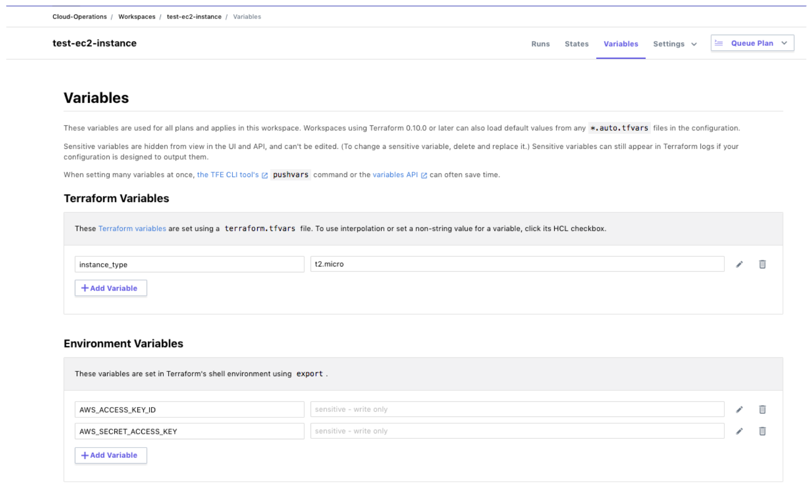
]

---
name: methodology-9
# Step 3 and 4 - Mock Against Your Plan

Start a Terraform Plan then get your Mocks!

.center[
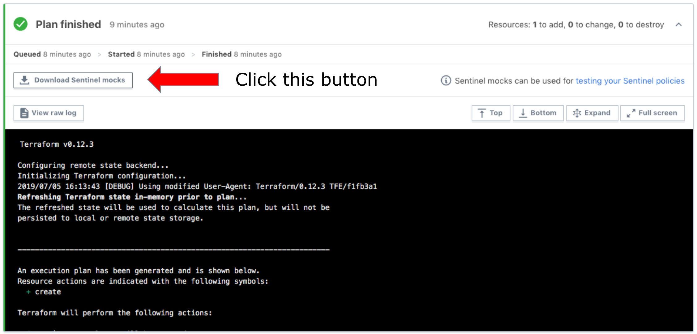
]

???

- From your local directory containing main.tf and backend.tf, run _terraform init_ to initialize your Terraform configuration.
- Then run terraform plan.
- The plan will run on the HCP Terraform server, but its results will be visible locally and in the HCP Terraform UI.
- To see the run in the HCP Terraform UI, copy the URL displayed near the top of the local version of the plan and navigate to it with a browser.
- To generate mocks against your plan, click the "Download Sentinel mocks" button.
- After a minute, a tar.gz file will be downloaded with 7 mocks.
- Extract the mock files from the tar.gz file.

---
name: methodology-9
# You are Here - Step 5

.center[
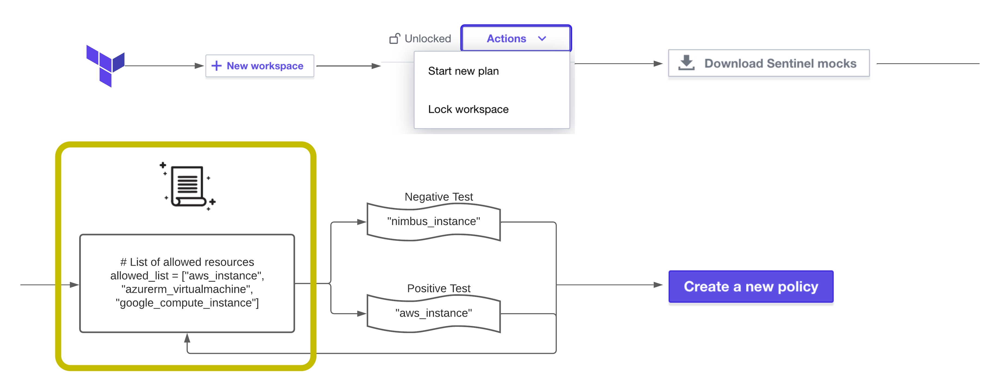
]

---
name: methodology-10
# Step 5 - Writing Sentinel Policies for TFC/TFE

- The next set of slides walks you through a Sentinel policy called **"restrict-ec2-instance-type.sentinel"** that restricts the allowed sizes of AWS EC2 instances.
- It breaks down the Sentinel code into smaller bites, clarifying what each section of the code is doing.

---
name: methodology-12
# Sentinel Import Declarations

```
# Import tfplan-functions.sentinel with alias "plan"
import "tfplan-functions" as plan
```

---
name: methodology-13
# List of Allowed Values

```
# Allowed EC2 Instance Types
allowed_types = ["t2.small", "t2.medium", "t2.large"]
```

---
name: methodology-14
# Call Sentinel Functions to Find and Filter Resources

```
# Get all EC2 instances
allEC2Instances = plan.find_resources("aws_instance")

# Filter to EC2 instances with violations
# The called function prints warnings for all violations
violatingEC2Instances = plan.filter_attribute_not_in_list(allEC2Instances, "instance_type", allowed_types, true)
```

---
name: methodology-15
# Calculate Boolean and Check it in Main Rule

```
# Count violations
# We determine length of the messages map within the
# violatingEC2Instances object
violations = length(violatingEC2Instances["messages"])

# Main rule
main = rule {
  violations is 0
}
```

---
name: common-functions
# Common Functions - Find

- Remember our introduction to functions?
  - Let's use some [common functions!](https://github.com/hashicorp/terraform-sentinel-policies/tree/main/common-functions)

- The policy we just started uses the following functions:
  - **find_resources(type)**
      - Simple, finds all resources by the type specified
      - **Remember we're looking for "aws_instance" as the Type**

---
name: common-functions
# Common Functions - Filter

- **filter_attribute_not_in_list(resources, attr, allowed, prtmsg)**
  - The filter functions print all violations if prtmsg is true.

- Additionally, the filter functions call a very useful function:
    - **evaluate_attribute(r, attribute)**
        - The filter functions all call the evaluate_attribute() function that recursively calls itself to evaluate attributes that can be deeply nested inside a resource or data source.

???

- This function has the following declaration:
- **evaluate_attribute = func(r, attribute)**
- The resource passed to the first call to the function should be in the form **rc.change.after** or just rc where rc is a resource change derived by applying filters to **tfplan.resource_changes.**
- The attribute should be given as a string delimited by "." in which indices of lists start with 0: "storage_os_disk.0.managed_disk_type".

---
name: find-all
# Function That Finds All Resources By Type

```
# Find all resources of a specific type from all modules
# Only include resources that are being created or updated
find_resources = func(type) {
  resources = filter tfplan.resource_changes as address, rc {
  	rc.type is type and
  	rc.mode is "managed" and
  	(rc.change.actions contains "create" or
	 rc.change.actions contains "update" or
       rc.change.actions contains "read" or
       rc.change.actions contains "no-op")
  }
  return resources
}
```

---
name: filter-resources
class: compact
# Function That Filters Resources

```
filter_attribute_not_in_list = func(resources, attr, allowed, prtmsg) {
  violators = {}
  messages = {}
  for resources as address, rc {
    v = evaluate_attribute(rc, attr) else null
    if v not in allowed {
      message = to_string(address) + " has " + to_string(attr) + " with value " + to_string(v) +
                " that is not in the allowed list: " + to_string(allowed)
      violators[address] = rc
      messages[address] = message
      if prtmsg {
        print(message)
      }
    } // end if
  } // end for
  return {"resources":violators,"messages":messages}
```

---
name: setup-test
# Step 6 - Set Up the Test Cases

- To test your policy with the Sentinel CLI, you first need to set up test cases
  - On your local PC, under the directory containing your policy, create a **test** directory.
      - Under the test directory, create a directory with the same name as your policy, but without the ".sentinel" extension.
- So, for our restrict-ec2-instance-type.sentinel policy:
  - create the **restrict-ec2-instance-type** directory under the test directory.

---
name: file-structure

.center[
  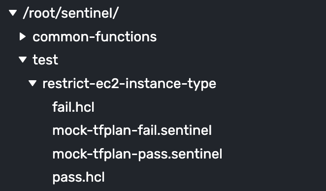
]

---
name: copy-mocks
# Copy Mocks and Create Test Cases

- Copy the mock-tfplan-v2.sentinel mock file that you downloaded and extracted from your workspace to this directory.
  - Change the name of the mock file to **mock-tfplan-pass.sentinel.**
  - Create a second copy of the file called **mock-tfplan-fail.sentinel.**
      - Create **pass.hcl** and **fail.hcl** files that have the text on the next two slides respectively.

---
name: pass-hcl
# The pass.hcl Test Case

```
module "tfplan-functions" {
  source = "../../../common-functions/tfplan-functions/tfplan-functions.sentinel"
}
mock "tfplan/v2" {
  module {
    source = "mock-tfplan-pass.sentinel"
  }
}
test {
  rules = {
    main = true
  }
}
```

---
name: fail-hcl
# The fail.hcl Test Case

```
module "tfplan-functions" {
  source = "../../../common-functions/tfplan-functions/tfplan-functions.sentinel"
}
mock "tfplan/v2" {
  module {
    source = "mock-tfplan-fail.sentinel"
  }
}
test {
  rules = {
    main = false
  }
}
```

---
name: pass-mock
# Create your Pass Mock

- Edit the mock-tfplan-pass.sentinel mock file
  - Make sure that all values of **instance_type** are set to a valid value
      - such as **"t2.small"** that is in the allowed_types list.

---
name: fail-mock
# Create your Fail Mock

- Edit the mock-tfplan-fail.sentinel mock file
  - Make sure that at least one value of **instance_type** is set to a invalid value
      - such as **"m5.large"** that is not in the allowed_types list.

---
name: pass-fail
# Testing Best Practices

- You should always have at least 1 fail and 1 pass test case.
- Sometimes, you will want multiple fail test cases and corresponding mocks.
- You might even want more than 1 pass test case and mock.

---
name: polcy-with-cli
# Test Your Policy with the CLI

- Now that you have set up your test cases you can test your policy with the Sentinel CLI.
  - Navigate back to the directory containing your policy.
  - Run the following command:
      - **sentinel test restrict-ec2-instance-type.sentinel**
  - To see the outputs of the print statements, change this to:
      - **sentinel test –verbose restrict-ec2-instance-type.sentinel**

---
name: policy-with-cli
# Test Your Policy with the CLI

- The first command gives:
```
PASS - restrict-ec2-instance-type.sentinel
  PASS - test/restrict-ec2-instance-type/fail.hcl
  PASS - test/restrict-ec2-instance-type/pass.hcl
```

---
name: policy-with-cli
# Test Your Policy with the CLI

- The second command gives:
```
PASS - restrict-ec2-instance-type.sentinel
  PASS - test/restrict-ec2-instance-type/fail.hcl
    logs:
       aws_instance.ubuntu[0] has instance_type t2.xlarge that is not in the allowed list:
       ["t2.small" "t2.medium" "t2.large"]
      restrict-ec2-instance-type.sentinel:24:1 - Rule "main
      	Description: Main rule Value: false
  PASS - test/restrict-ec2-instance-type/pass.json
     restrict-ec2-instance-type.sentinel:24:1 - Rule "main
      	Description: Main rule Value: true
```

---
name: testing-policy-loop
# Iteration Loop


.center[
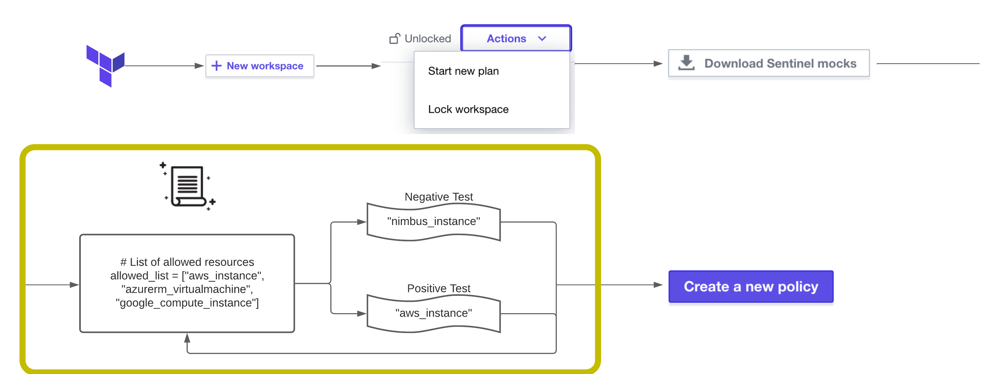
]

---
name: chapter-4-summary
# Chapter 4 Summary

- Writing policies is an iterative process
  - Write Terraform, generate mocks, test against Mocks, repeat!
- Remember [common functions](https://github.com/hashicorp/terraform-sentinel-policies/tree/main/common-functions) and [policy examples](https://github.com/hashicorp/terraform-sentinel-policies) exist!

- **Next Chapter - Final Step - Deploying Policies**

---
name: references
# References

- [Writing your first Policy](https://learn.hashicorp.com/tutorials/terraform/sentinel-policy)

- [The Legendary Roger Berlind's Guide on Writing and Testing Sentinel Policies](https://www.hashicorp.com/resources/writing-and-testing-sentinel-policies-for-terraform)

- [Video Guide](https://www.youtube.com/watch?v=z_m4fFYym30)

---
class: title, smokescreen, shelf
background-image: url(https://hashicorp.github.io/field-workshops-assets/assets/bkgs/HashiCorp-Title-bkg.jpeg)
count: false

# Chapter 4 - Complete


---
class: title, smokescreen, shelf
background-image: url(https://hashicorp.github.io/field-workshops-assets/assets/bkgs/HashiCorp-Title-bkg.jpeg)
count: false

# Chapter 5 - Using Sentinel in HCP Terraform and Terraform Enterprise


---
name: test-policies
# Testing Policies in HCP Terraform

- After successfully testing a policy with the CLI, you might also want to test it against actual Terraform code on a HCP Terraform or TFE server.
- When doing this, we suggest you follow these recommendations:
  - Put each new policy in a policy set that does not contain any other policies.
  - Assign the workspaces you will be using to test your policy to that policy set.
  - Do not assign any other workspaces to the policy set.
  - Set the policy enforcement level to **hard mandatory.**
- Following these recommendations will make your testing easier:
  - You won't see results from other policies.
  - You won't have to worry about overriding soft-mandatory failures.

---
name: creating-policies
# Creating Policy Sets with Policies

- **Policy Sets** are created in a VCS repository.
- Each policy set contains the policies and a configuration file called "sentinel.hcl" that lists the policies and their enforcement levels.
- The "sentinel.hcl" file can also specify Sentinel modules to load.
- Policies and Modules can be in any directory of the current repository and even in remote repositories.
- You then configure the policy set in the HCP Terraform UI by registering it, indicating the repository, branch, and policies path.
- You can specify **Parameters** for it including sensitive ones.
- You determine the workspaces it should be enforced on.

---
name: policy-sets

.center[
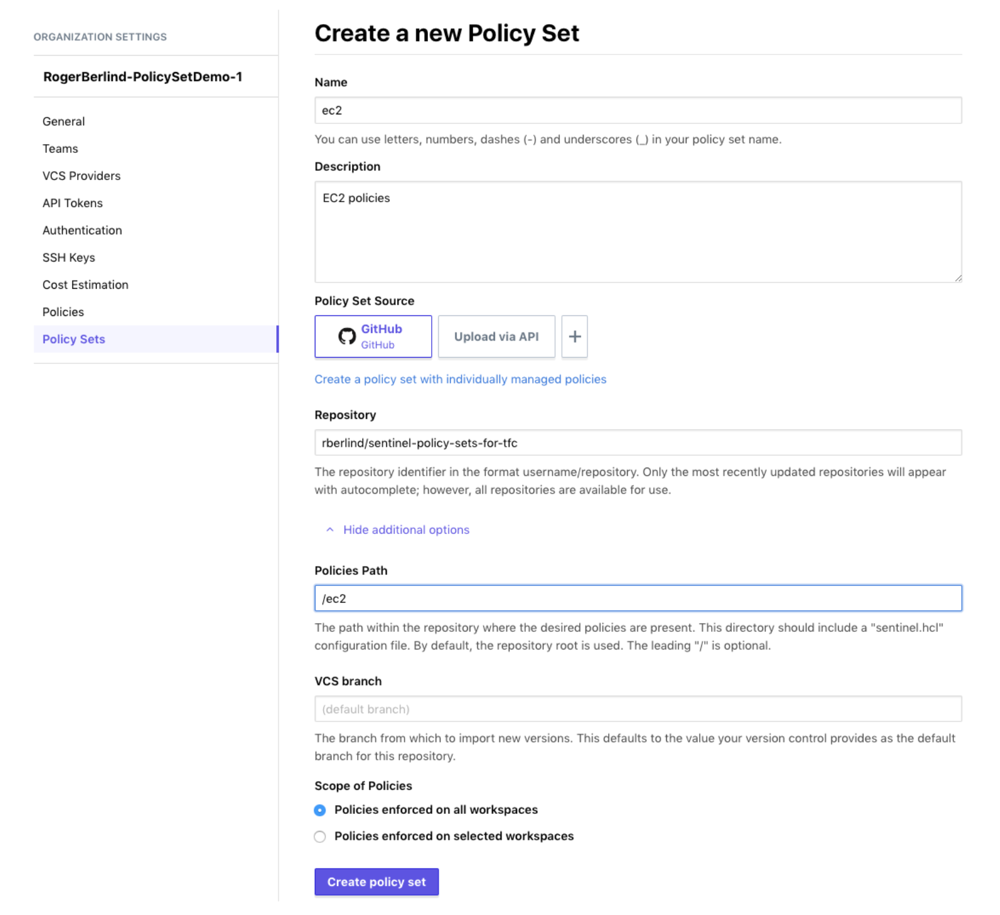
]

---
name: policy-sets
# Example Policy Set

- Here is an example policy set:

```
module "tfplan-functions" {
    source = "../common-functions/tfplan-functions/tfplan
		  -functions.sentinel"
}
policy "restrict-ec2-instance-type" {
    source = "./restrict-ec2-instance-type.sentinel"
    enforcement_level = "soft-mandatory"
}

```

---
name: policy-fails
# Sentinel Policy that Fails

.center[
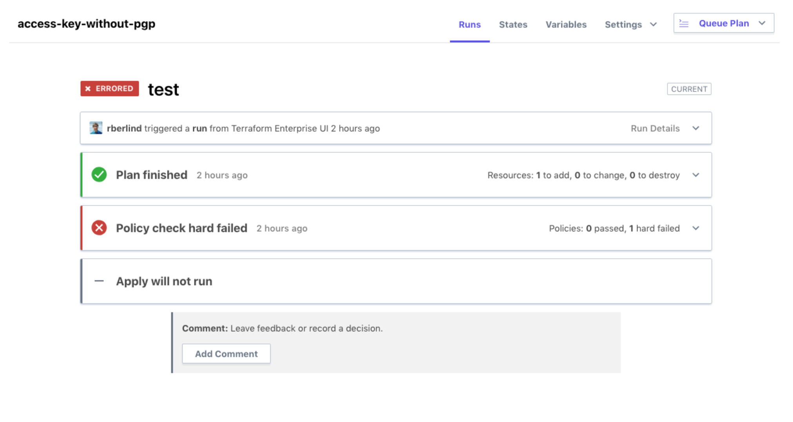
]

---
name: policy-fail-example
# Sentinel Policy that Fails

.center[
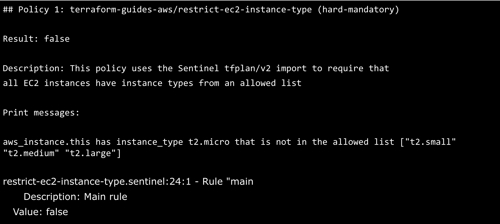
]

---
name: policy-pass
# Sentinel Policy that Passes

.center[
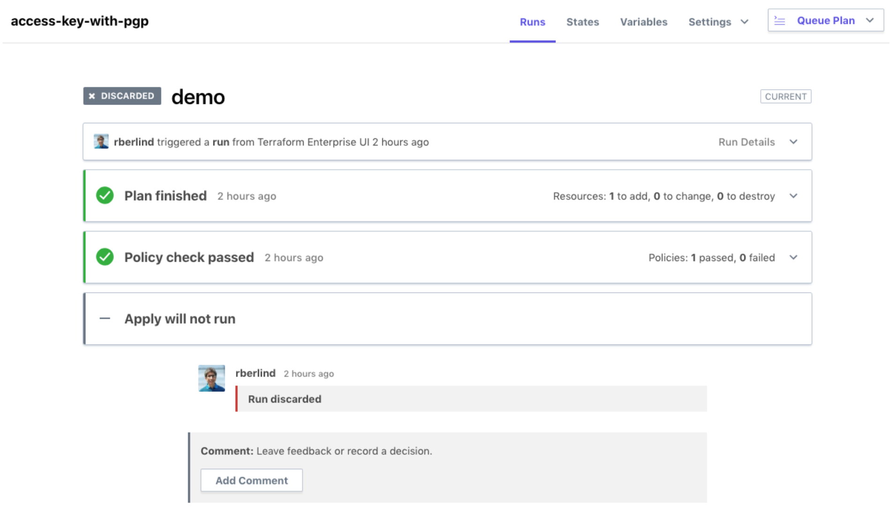
]

---
name: policy-pass-example
# Sentinel Policy that Passes

.center[
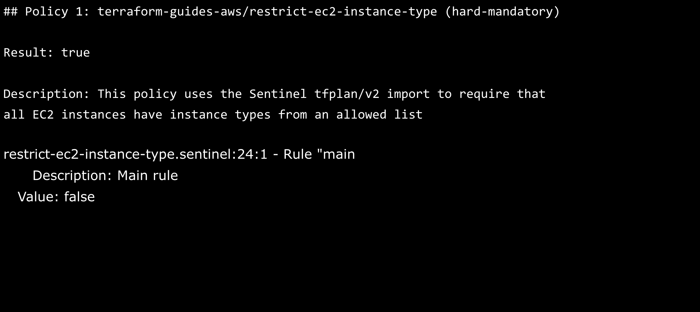
]

---
name: deploying
# Deploying Policies in HCP Terraform

- After successfully testing a policy with the CLI and possibly also on HCP Terraform itself, you will want to deploy it to your HCP Terraform organizations.
- If you have not already added the policy to a policy set in your organizations, do that at this time.
- Add the new policy to an existing policy set that is already applied against desired workspaces, or create a new policy set for the policy and apply that policy set to desired workspaces across your organizations.
- Also add any parameters the policy requires to your policy set.
- And add references to any Sentinel Modules that policies in it use.

---
class: title, smokescreen, shelf
background-image: url(https://hashicorp.github.io/field-workshops-assets/assets/bkgs/HashiCorp-Title-bkg.jpeg)
count: false

# Chapter 5 - Complete


---

class: title, smokescreen, shelf
background-image: url(https://hashicorp.github.io/field-workshops-assets/assets/bkgs/HashiCorp-Title-bkg.jpeg)
count: false

# Chapter 6 - Sentinel Language Advanced Concepts


---
name: language-const
# Key Sentinel Language Constructs (1)

- **Boolean Expressions:** Evaluate to true, false, or undefined.
  - They use logical, comparison, set, and other **Operators.**
  - (5*2 == 10) and (7 in [ 2, 3, 5, 7, 11, 13, 17, 19])
- **Rules:** Evaluate a single expression which could be the result of calling a single function.
- **Main Rule:** Every Sentinel policy must have a rule called main.
  - The result of a policy is the value returned by its main rule.
- **Statements:** Execute procedural logic.
- **Functions:** Execute various statements and return a value.
- **Variables:** Store values for use by rules and functions.
- **Parameters:** Accept inputs passed to policies.

---
name: language-const-2
# Key Sentinel Language Constructs (2)

- **Types:** boolean, integer, float, string, list, map
  - A **List** is a collection of zero or more items
  - A **Map** is a collection of zero or more key/value pairs
- **Operators:** Arithmetic, Logical, Comparison, Set, Matches, Else
- **Assignments:** Set the value of variables.
- **If/Else and Case Statements:** Specify conditional execution of different logic within a function.
- **For Loops:** Repeat statements while iterating over a map or list.
  - Frequently used inside functions
  - **break** and **continue** statements can alter loop execution.
- The **Filter** quantifier expression that returns a subset of a collection.
- **Imports:** Reusable libraries of Sentinel functions.

---
name: pre-clared
class: col-2
# Sentinel Pre-declared Identifiers
Constants:
- false
- true
- null
- undefined

</br>
Type Conversion Functions:
- bool
- float
- int
- string

???
fix later

---
name: reserved-words
class: col-2
# Sentinel Keywords

- all
- any
- as
- break
- case
- continue
- else
- filter
- for
- func
</br>
</br>
</br>
</br>
- if
- is
- import
- map
- param
- return
- rule
- when

???

fix later
---
name: logic-operators
# Sentinel Numerical and Logical Operators

- **Arithmetic:** +, -, *, /, and % (remainder)
- **p and q**	p and q must both be true
- **p or q**	at least one of them must be true
- **p xor q**	exactly one of them must be true
- **!p**		p is false
- **not p**		p is false

---
name: comparison
# Sentinel Comparison Operators

- **==**		equal to
- **!=**		not equal to
- **<**		less than
- **<=**		less than or equal to
- **>**		greater than
- **>=**		greater than or equal to
- **is**		equal to
- **is not**	not equal to

Note that maps and lists are comparable!

---
name: short-circuit
# Sentinel's Short-Circuit Logic

- Sentinel applies Short-Circuit Logic for compound boolean expressions like p and q and (a and b) or c:
- This means that Sentinel does not evaluate all conditions further to the right if it already knows the final answer.
  - So, if p is false, it does not evaluate q since p and q is already false.
  - If a and b are both true, it does not evaluate c since (a and b) or c is already true.
  - If a is false, it does not evaluate b since a and b is already false, but it does evaluate c since (a and b) or c could still be true or false, depending on the value of c.

---
name: set
# Sentinel Set Operators

- Set operators can be applied to lists, maps and strings.
- For strings, the set operators do substring inclusion
- Examples for lists:
  - **1 in [1, 2, 3]**			Means that 1 is in the list
  - **[1, 2, 3] contains 2**	Means that the list contains 2.
  - **[] is empty**			Means that the collection is empty.
- You can also use **not in, not contains, and is not empty.**

---
name: matches
# The Sentinel Matches Operator

- The **matches** operator tests if a string matches a regular expression.
- Examples:
  - **"test" matches "^te"**			# true
  - **"1352" matches "[0-9]*"**		# true
  - **"123A" matches "[0-9]*"**		# false
  - **"xyz.com matches ".*\\.com"**	# true

- The **strings import** can also be used to determine if a string has a specific prefix or suffix

---
name: else
# The Sentinel Else Operator

- The else operator converts the _undefined_ value to something else.
- If a number is _undefined_, you might convert it to 0
  - **(memory else 0) <= 2048**
- If a boolean is _undefined_, you might convert it to true or false.
  - **(memory <= 2048) else false**
- If a list is _undefined_, you might convert it to the empty list, [].
  - **keys(tfplan.resource_changes) else []**
- If a map is _undefined_, you might convert it to the empty map, {}.
  - **allEC2Instances else {}**
- Note that the _else_ operator does not affect null.

---
name: for-loops
# Sentinel For Loops

- A Sentinel **for** loop iterates over a collection.
- Each for loop uses the **as** keyword to define one or two iterator variables.
- When iterating over a list, the first variable is assigned the index and the second variable is assigned the value.
  - If only one iterator variable is specified, it is assigned the value.
- When iterating over a map, the first variable is assigned the key and the second variable is assigned the value.
  - If only one iterator variable is specified, it is assigned the key.

---
name: for-loop-example
class: compact
# Sentinel For Loop Examples

- This example iterates over a list with one variable (for the values).
```
count = 0
for [1, 2, 3] as num {
  count += num
}
```

---
name: for-loop-example
class:compact
# Sentinel For Loop Example

- The count will equal 6.
  - This example iterates over a map with two variables:
```
data = { "a": 12, "b": 32 }
for data as k, v {
  sum += v
}
```

- The sum will equal 44.

---
name: all-any
# The Sentinel all and any Expressions

- The **all** and **any** quantifier expressions are are used like loops, but they are actually quantifier expressions that apply boolean expressions to lists and maps. They return _true_ or _false_.
- The _all_ expression is a universal quantifier asserting that a boolean expression must be true for all items of a collection.
- The _any_ expression is an existential quantifier asserting that a boolean expression must be true for at least one item in a collection.
- It used to be common to use all expressions in Sentinel rules, but it is better to use for loops in functions called before the main rule.
- This allows your policies to report all violations in a single shot.

---
name: filter-map
# The Sentinel filter and map Expressions

- The **filter** quantifier expression applies a boolean expression to each item in a list or map.
  - However, instead of returning true or false, it returns a sub-collection of the original collection consisting of those items for which the boolean expression was true.
  - The _filter_ expression is useful with the Terraform Sentinel v2 imports since their collections were designed to be used with it.
- The **map** quantifier expression returns a list of values, one for each item in the collection it is applied to.
  - It can be useful in Sentinel rules that want to return non-boolean values including maps and lists.

---
name: if-else
# The Sentinel If/Else Conditional

- This example tests if _v_ is defined and equal to _value_:

```
if v else null is null {
  print("The value", v, "was null or not defined")
} else if v is not value {
  print(v, "is not equal to the required value", value)
} else {
  print(v, "is the desired value", value)
}
```

---
name: case
# The Sentinel Case Conditional

- This example does different processing for different days:

```
case day {
when "Saturday", "Sunday":
	print("Sorry, we are closed.")
else:
	print("We are open from 9am to 6pm.")
}
```

---
class: title, smokescreen, shelf
background-image: url(https://hashicorp.github.io/field-workshops-assets/assets/bkgs/HashiCorp-Title-bkg.jpeg)
count: false

# Chapter 6 - Complete


---
class: title, smokescreen, shelf
background-image: url(https://hashicorp.github.io/field-workshops-assets/assets/bkgs/HashiCorp-Title-bkg.jpeg)
count: false

# Chapter 7 - Advanced Techniques


---
name: debugging
# Debugging Policies with Errors

- If your policy shows any syntax errors, these will tell you which lines of your policy you need to fix.
- A message like **"An error occurred: <policy>.sentinel:34:10"** means Sentinel encountered an error in column 10 of line 34 of the policy.
  - But the problem that caused the error could occur earlier in the code.
- Some errors are caused by simple things like missing commas or braces. These are fairly easy to spot.
- Other errors might be caused by missing or computed attributes or by _null_ values. Consider adding checks that test for these possibilities.
- Add extra **print** statements to help you narrow down where the error is occurring.
  - You can even print an entire resource: **print("resource:", r)**

---
name: checking
# Checking for Missing Expressions

- An expression can fail to exist in multiple ways:
  - It could be absent from the data which gives undefined.
  - It could be set to _null_ or the empty string ("").
  - It could be an empty map, {}, or an empty list, [].
- Verify an expression is not _undefined, null,_ or "":
  - **x else null not in [null, ""]**
- Verify an expression is not _undefined,_ null or an empty map, list, or string:
  - **not ( (x else null is null) or (types.type_of(x) in ["map", "list", "string"] and length(x) is 0) )**
- The length() function can only be applied to strings, maps, and lists, so the type of an expression should be checked before using it.

---
name: restricting
# Restricting Multiple Attributes in a Policy

- If you want to restrict multiple attributes in a single policy, you can call multiple filter functions and then check the lengths of all the lists they returned.
- Alternatively, you can write your own custom function that tests all of the attributes while iterating over the instances just once.
  - In this case, you should return a map with a boolean for each attribute that you are restricting.
- We recommend calling any filter or validation functions before your main rule and evaluating the lengths of the lists or the booleans they return in the main rule to minimize verbose Sentinel output.

---
name: making-external
# Making Calls to External API Endpoints

- Sentinel policies in HCP Terraform and Terraform Enterprise can use the http import to call external API endpoints.
- Parameters can be added to policy sets allowing the secure introduction of credentials needed by API endpoints invoked with the Sentinel HTTP import.
- Currently, the http import supports the HTTP GET and POST operations against API endpoints that return JSON documents.
- The http import can send data to an API endpoint with the http import using headers or URL parameters.
  - But sending data in the URL parameters is insecure, and there are limits on the size of headers.
- Some example policies that use the http import are here.

---
class: title, smokescreen, shelf
background-image: url(https://hashicorp.github.io/field-workshops-assets/assets/bkgs/HashiCorp-Title-bkg.jpeg)
count: false

# Chapter 7 - Completed


---
class: title, smokescreen, shelf
background-image: url(https://hashicorp.github.io/field-workshops-assets/assets/bkgs/HashiCorp-Title-bkg.jpeg)
count: false

# Workshop - References


---
name: guide-excersise
# The Original Guide's Exercises

- The Writing and Testing Sentinel Policies for Terraform guide that this presentation is based on contained 5 exercises designed to make readers capable of independently writing and testing new Sentinel policies.
- Those exercises intentionally did not provide step-by-step, copy-and-paste instructions since we feel it is better for people to try to write their own policies by following the guide's 8-step methodology.
- That methodology includes reading Terraform provider documentation to determine the resources and attributes that a policy should focus on.
- This approach can be effective for someone working by themself.
- But it is more difficult in a workshop or class setting in which time is limited.

---
name: workshop-excersise
# The Workshop Exercises

- Fortunately, we found a happy medium between the step-by-step, copy-and-paste and the write everything yourself approaches.
- We've made things easier in the Instruqt challenges that implement the exercises by writing most of each policy and by providing the test cases and mocks needed to test it.
- You need to finish each policy, save it, and then run the sentinel test command to verify that it behaves correctly.
- You'll be asked to complete 2 different versions of the policies in exercises 2-5 across two challenges each.
- Please use the link for the Sentinel for Terraform (v4) Instruqt track provided by your instructor.

---
name: challenge-flow
# Challenge Flow

- After launching each challenge, you should read the note screens while the challenge loads to learn about the challenge's task:
- When the "Start" button appears, click it to view the challenge's assignment and begin following the instructions.
- Each challenge has 3 tabs:
   - The **Policies** tab lets you edit policies.
   - The **Test Cases** tab lets you inspect test cases and the mocks.
   - The **Sentinel CLI** tab lets you run the sentinel test command.

---
name: completing-sentinel
# Completing the Sentinel Policies (1)

- By reviewing the note screens before each challenge, the links in them, the challenge assignment, and/or these slides, you should be able to successfully complete each policy.
- We also want to emphasize that you do not need any cloud accounts or HashiCorp software to write and test the policies since you will be using the Sentinel CLI in a VM loaded by the track to test the policies after you complete them.
- You will need to replace placeholders like <resource_type>, <attribute>, and <condition> in each policy with suitable Sentinel expressions or values in order to complete the policies. But keep any quotes around placeholders.
- Remember that "attributes" includes "arguments" of resources.

---
name: completing-sentinel-2
# Completing the Sentinel Policies (2)

- Please do NOT edit the mock files; that would be cheating.
- Be sure to look at the suggested Terraform provider link for each challenge; this will help you identify a resource or data source and one of its attributes to use.
- Also look at suggested links about specific Sentinel features.
- Replace as many of the placeholders as you can. If you can't replace one of them, save the policy by clicking on the disk icon above the policy and click the Check button to get a hint.
- This might give you a useful hint. If not, try removing the placeholder, saving the policy, and clicking the Check button again to receive a bigger hint.

---
name: completing-sentinel-3
# Completing the Sentinel Policies (3)

- After replacing all the placeholders, please do the following:
  - Save the file.
  - Run the _sentinel test_ command with the specified arguments.
- All test cases should pass. If not, edit the policy and repeat the above 2 steps.
- Keep doing this until all the test cases pass.
- Don't forget that clicking the Check button will give hints.

---
class: title, smokescreen, shelf
background-image: url(https://hashicorp.github.io/field-workshops-assets/assets/bkgs/HashiCorp-Title-bkg.jpeg)
count: false

# Workshop Challenge: Exercise 1


---
name: restrict-auth
# Exercise 1: Restrict Vault Auth Methods

- Your task in this challenge is to complete and test a Sentinel policy that restricts the Vault authentication methods (backends) provisioned by Terraform's Vault Provider.
- The policy uses the tfplan/v2 import and is very similar to the sample restrict-ec2-instance-type.sentinel policy we just reviewed.

---
name: tfplan-import
# The tfplan/v2 Import

.center[
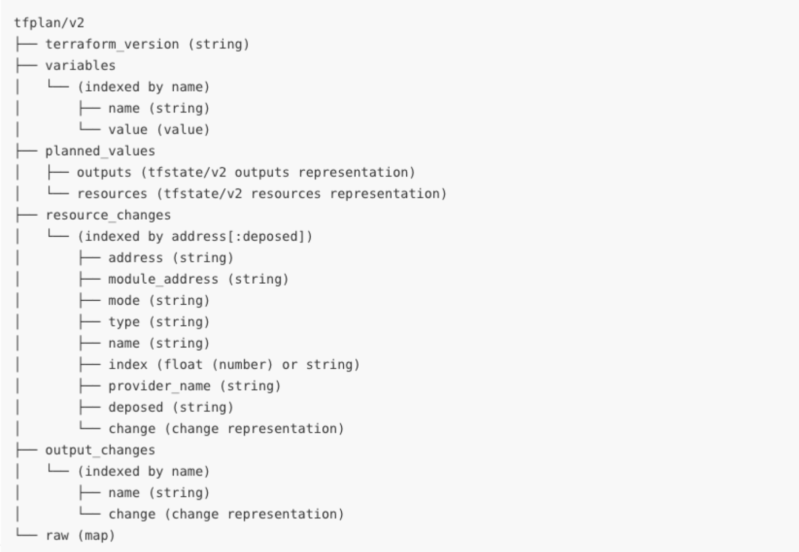
]

---
name: tfplan-import-2
# Using the tfplan/v2 Import

- The tfplan/v2 import includes two different collections, planned_values and resource_changes, that can be used to evaluate the expected values of resource and data source attributes (including both arguments and exported attributes) if an apply were run.
- Using the resource_changes collection is generally preferred because it includes more information about changes being made to new or existing resources.
- This data includes the actions being performed such as "create", "update", and "delete", the values of attributes before and after the change, and the after_unknown collection of booleans indicating if the values are computed (will not be known until after the apply).

---
name: example-tfplan
# Example of tfplan/v2 Resource Data (1)

- Recall the Terraform code we showed earlier that creates two instances of an "aws_instance" resource with name "ubuntu":

```
resource "aws_instance" "ubuntu" {
  count         = 2
  ami           = "${var.ami_id}"
  instance_type = "${var.instance_type}"
}
```

---
name: example-tfplan-2
class: compact
# Example of tfplan/v2 Resource Data (2)

- A changed resource instance will appear in the tfplan/v2 import like this:

```
resource_changes = {
    "aws_instance.ubuntu[0]": {
        "address": "aws_instance.ubuntu[0]",
        "change": {
            "after": {
                "instance_type": "t2.small",},
            },
        "mode": "managed",
        "name": "ubuntu",
        "type": "aws_instance",
    },
    "aws_instance.ubuntu[1]": {}
```

---
class: title, smokescreen, shelf
background-image: url(https://hashicorp.github.io/field-workshops-assets/assets/bkgs/HashiCorp-Title-bkg.jpeg)
count: false

# Workshop Challenge: Exercise 2 (parts a and b)


---
name: restrict-aws-keys
# Exercise 2: Restrict AWS IAM access keys

- Your task in these challenges is to complete and test 2 versions of a Sentinel policy that requires that all AWS IAM access keys provisioned by Terraform's AWS Provider include a PGP key that starts with "keybase:".
- The policy uses the tfplan/v2 import.
- The first version calls common functions to find and filter resources.
- The second version does the filtering inside the policy itself, requiring you to use for loops, if/else conditionals, and the strings import.

---
class: title, smokescreen, shelf
background-image: url(https://hashicorp.github.io/field-workshops-assets/assets/bkgs/HashiCorp-Title-bkg.jpeg)
count: false

# Workshop Challenge: Exercise 3 (parts a and b)


---
name: restrict-cert
# Exercise 3: Restrict AWS ACM Certificates

- Your task in these challenges is to complete and test two versions of a Sentinel policy that requires that all AWS Certificate Manager (ACM) Certificates referenced by a data source in Terraform's AWS Provider have domains that are subdomains of "hashidemos.io".
- Since we are restricting a data source, the policy uses the tfstate/v2 import instead of the tfplan/v2 import that we have used in previous policies.
- It also uses the matches operator.
- The first version of the policy uses filters both to find an initial list of resources and to find those that violate the policy.
- The second version of the policy has you write your own validation function.

---
name: tfstate-import
# The tfstate/v2 Import

.center[
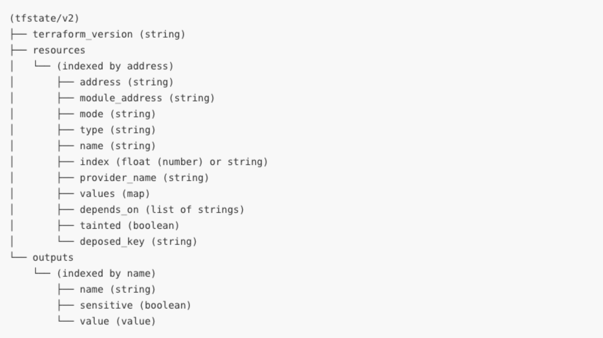
]

---
name: tfstate-import-2
# Using the tfstate/v2 Import

- The tfstate/v2 import gives the state of resources and data sources after a plan.
- Generally, this will be the same as the state before the plan, but it could include additional data for data sources that were evaluated during the refresh operation done by the plan.
  - Data sources that do not reference computed values are evaluated during the plan.
  - Data sources that reference computed values are not evaluated until the apply.
- As a consequence, the tfstate/v2 import is often more useful than the tfplan/v2 import when restricting data sources in policies.

---
class: title, smokescreen, shelf
background-image: url(https://hashicorp.github.io/field-workshops-assets/assets/bkgs/HashiCorp-Title-bkg.jpeg)
count: false

# Workshop Challenge: Exercise 4 (parts a and b)


---
name: restrict-google-compute
# Exercise 4: Restrict Google Compute Instances

- Your task in these challenges is to complete and test two versions of a Sentinel policy that requires Google compute instances provisioned by Terraform's Google Provider to use the public image "debian-cloud/debian-9".
- This policy uses the tfplan/v2 import.
- However, it requires you to evaluate an attribute that is inside a block that is itself inside another block of the resource.
- The first version will call common functions to do this.
- The second version requires you to write your own filter function and deal with the nested attribute more directly.
- You'll also be using the types import.

---
name: restrict-attributes
# Restricting Nested Attributes in a Policy (1)

- Some attributes of Terraform resource are "top-level" attributes that reside directly under the resource.
- Other "nested" attributes are inside blocks of the resource.
- Since blocks can be nested inside other blocks, an attribute can be nested many layers beneath the resource itself.
- When writing policies that restrict nested attributes, you can do this using Sentinel's native syntax or call special functions that use a slightly modified syntax.
- Recall that "attributes" includes both the "arguments" and "exported attributes" of resources.
  - In fact, all the arguments are actually exported.

---
name: restrict-attributes
# Restricting Nested Attributes in a Policy (2)

- Sentinel treats blocks as lists of maps. This is true even when a block cannot be repeated.
- The first index of a Sentinel list is always 0.
- The value of a nested attribute of a resource change, rc, derived from the resource_changes collection of the tfplan/v2 import can be directly referenced like this:
  - **rc.change.after.storage_image_reference[0].publisher**
- A nested attribute of a resource r derived from the resources collection of the tfstate/v2 import can be referenced like this:
  - **r.values.storage_image_reference[0].publisher**

---
name: restrict-attributes
# Restricting Nested Attributes in a Policy (3)

- The evaluate_attribute(r, attribute) functions in this workshop's Sentinel modules can evaluate all attributes of resources and data sources no matter how deeply they are nested.
- However, the evaluate_attribute functions expect nested attributes to be specified with a string delimited by "." in which each item of the string represents one of the following:
  - the name of a block above the attribute
  - an index of a block (0, 1, 2, etc.)
  - the name of the attribute itself.
- So, we would set the function's attribute parameter to something like:
  - "storage_image_reference.0.publisher"
- We don't include rc.change.after or r.values since that is set in r.

---
class: title, smokescreen, shelf
background-image: url(https://hashicorp.github.io/field-workshops-assets/assets/bkgs/HashiCorp-Title-bkg.jpeg)
count: false

# Workshop Challenge: Exercise 5 (parts a and b)


---
name: modules-from-pmr
# Exercise 5: Require Modules from a PMR

- Your task in these challenges is to complete and test two versions of a Sentinel policy that requires that all modules loaded by the root module come from the Terraform Private Registry of a HCP Terraform organization.
- This policy uses the tfconfig/v2 import.
- In the first version, you will write a custom validation function.
- In the second version, you will move this function into a Sentinel module.

---
name: tfconfig-import
# The tfconfig/v2 Import

.center[
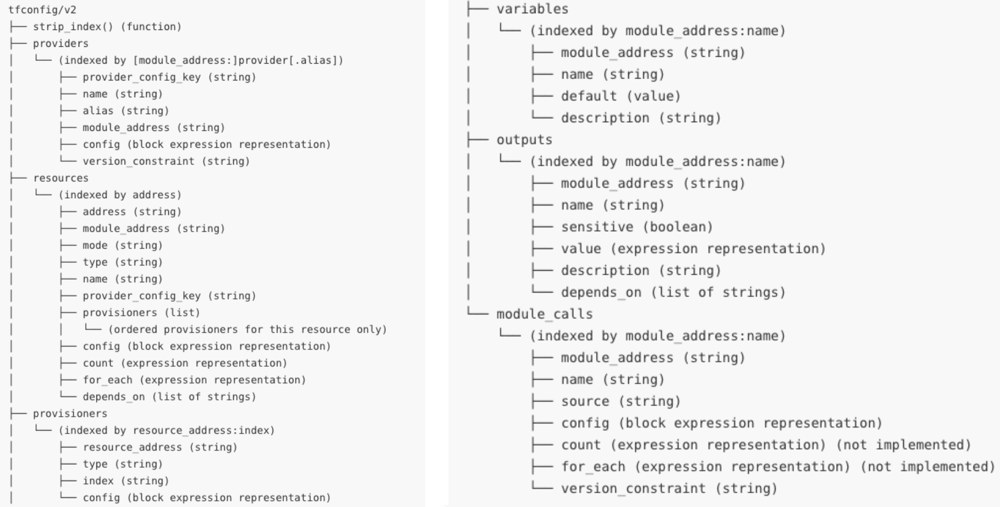
]

---
name: tfconfig-import-2
# The tfconfig/v2 Import Expressions

.center[
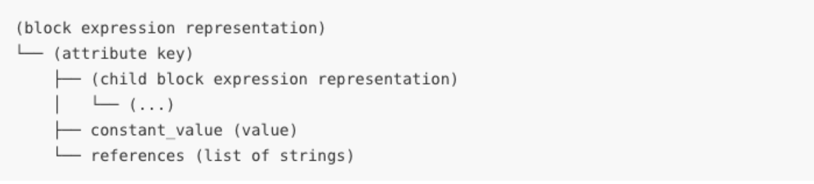
]

- Expressions in the tfconfig/v2 collections are ultimately represented by constant_value fields or by references lists, depending on whether they were constant or required evaluation.
- The latter must then be cross-referenced against the tfplan/v2 or tfstate/v2 imports.
- When constants are mixed with references, the constants are lost.

---
name: tfconfig-import-3
# Using the tfconfig/v2 Import

- The tfconfig/v2 import gives information about the Terraform configuration used by the run in which Sentinel policies are checked.
- It does NOT give all information about the Terraform configuration.
- It can be used to restrict the configuration of module calls, variables, resources, data sources, providers, provisioners, and outputs.
- It can also be used to compare attributes of different resources even if they are computed since it can compare the expressions the code used.
- It is useful for restricting things that the other imports don't cover.
- However, using it to restrict resources and data sources can be challenging because of the need to cross-reference references.

---
class: title, smokescreen, shelf
background-image: url(https://hashicorp.github.io/field-workshops-assets/assets/bkgs/HashiCorp-Title-bkg.jpeg)
count: false

# Solutions to Exercises


---
name: solutions
# Solutions to Challenges

- You will find solutions to Exercises all 10 challenges of the Sentinel for Terraform (v4) track here:
https://github.com/hashicorp/sentinel-training-solution


---
name: extra slides
# Extra Slides

Lorem ipsum placeholder
Lorem ipsum placeholder
Lorem ipsum placeholder


---
name: mocks-in-tf
# Sentinel Mocks in Terraform

- Sentinel **Mocks** simulate the data that is made available to the Terraform Sentinel imports from Terraform plans.
- They can be generated from recent plans using the HCP Terraform UI and API.
- They can also be copied and edited to simulate various combinations of resource and data source attributes.
- They enable testing of Terraform Sentinel policies with the Sentinel CLI.
- Using the Sentinel CLI with mocks speeds up development of new policies since additional plans do not need to be run.
---
name: find-what-you-need

- Sometimes, you might be asked to create a Sentinel policy to restrict particular things such as VMs or load balancers.
- But you might not know the exact Terraform resources that implement these.
- Fortunately, you can use the Terraform Provider documentation to identify resources that implement the things you want to restrict.
- Each resource and data source has its own documentation page.
- Looking at documentation from the underlying cloud service provider or other technology will also help.
  - For instance, you can determine valid values for VM size.

---
