name: d1m5-sentinel-policy-enforcement
class: title, smokescreen, shelf
background-image: url(https://hashicorp.github.io/field-workshops-assets/assets/bkgs/HashiCorp-Title-bkg.jpeg)
count: false

# Sentinel for Terraform Workshop (v5)
## <Instructor>


---
name: tf-section
class: title, smokescreen, shelf
layout: true


background-image: url(https://hashicorp.github.io/field-workshops-assets/assets/bkgs/HashiCorp-Title-bkg.jpeg)
background-size: cover

.footer[

- Copyright © 2020 HashiCorp
]

---
layout: true

background-image: url(../images/bkgs/HashiCorp-Content-bkg.png)
background-size: cover

.footer[

- Copyright © 2020 HashiCorp
]

---
name: slide-deck
exclude: true
class: img-left-full


<br><br><br>
.center[
Follow along at this link:

## https://git.io/JvSPW
]
---
name: agenda
class: cozy

# Workshop Adgenda

<b>
- Introduction to Sentinel Concepts
- *Lab Challenge 1:* Using Sentinel CLI
- *Lab Challenge 2:* Applying and Testing a Policy with the CLI
- The Sentinel Language
- Key Concepts
- Sentinel Imports and Modules
- Advanced Concepts
- Writing Sentiel Policies and Testing Them
- *Lab Excersise 3-4:* Write and Test more Policies
- Advanced Techniques
- Extra Credit

</b>

---
class: title, smokescreen, shelf
background-image: url(https://hashicorp.github.io/field-workshops-assets/assets/bkgs/HashiCorp-Title-bkg.jpeg)
count: false

# Chapter 1 - Introduction to Sentinel Concepts


---
name: sentinel-overview
# What is Sentinel

- Sentinel is a **Policy As Code** framework to enable fine-grained, logic-based policy

- *Sentinel is to a Policy Framework as Terraform is to Infrastructure as Code*


- It includes its own language and is embedded in HashiCorp’s Enterprise products.

- It supports fine-grained policies that use conditional logic. For example - "Is this image in the supported images list?"


- It includes a CLI that allows you to test and run policies.

---
name: sentinel-overview2
# What is Sentinel

- Sentinel is enabled as part of your provisioning workflow, ensuring that policies are checked each time Terraform runs
- Policy as Code takes your excel spreadsheets, legal, regulatory requirement documents and individual security best practice knowledge and turns it into Code.

.center[

]

- (allowed_types = [”350xlarge”,”289ssmall”,”101xssmall”])

---
name: benefits-of-policy
# Benefits of Policy as Code


- All the same benefits of Infrastructure as Code!
  - Version History, Change Control, Collaboration

- Easily share-able and consumable across multiple organizations and teams in Terraform Cloud

- Can be tested and iterated on in an automated fashion with real test data!*

???

Lorem ipsum dolor sit amet, consectetur adipiscing elit, sed do eiusmod tempor incididunt ut labore et dolore magna aliqua

---
name: customer-use-cases
# How Customers are Using Sentinel in Terraform

- HashiCorp customers are using Sentinel to enforce security standards:
  - Require all S3 buckets use the private ACL and be encrypted by KMS.
  - Restrict which roles the AWS provider can assume.
  - Prohibit specific resources, data sources, providers, or provisioners.

**# List of allowed providers** <br>
**allowed_list = ["aws", "local", "null", "random", "terraform", "tfe"]**

---
name: customer-use-cases2
# How Customers are Using Sentinel in Terraform

- HashiCorp customers are using Sentinel to avoid excessive costs:
  - Limit the sizes of VMs and Kubernetes clusters in public clouds
  - Limit the monthly spend of each Terraform workspace

- Other
  - Enforce mandatory tags on resources provisioned by Terraform
  - Mandate that all modules come from a Private Module Registry

**# List of allowed resources** <br>
**allowed_list = ["aws_instance", "azurerm_virtualmachine", "google_compute_instance"]**

---
name: what-does-sentinel-not-do
# What Sentinel Does Not Do in Terraform

- Continually check infrastructure to validate compliance
- Remove existing resources that violate policies
- Ensure that resource attributes are valid
  - For instance, Sentinel can validate that a KMS key is specified for an S3 bucket, but not that it is a valid key
  - Can’t check if “SuperLargeBigInstance” is a valid type
- Analyze or limit runtime actions of deployed applications

---
name: where-is-sentinel-used
# Where is Sentinel Used in Terraform?

- **Sentinel Policies** are checked between the standard **plan** and **apply** steps of Terraform runs.
- Policies have different enforcement levels
- Sentinel policies can evaluate the **attributes** of existing and new resources based on information from the current run:
  - the plan, the configuration, the current state, and other run data including cost estimates
- This ensures that resources comply with all policies **before** they are provisioned.

---
name: without-sentinel
# Terraform Without Sentinel

<br>
.center[

]

---
name: with-sentinel
# Terraform With Sentinel

.center[

]

---
name: policys-passed
# All Policy Checks Passed

.center[

]

---
name: policys-passed2
# All Policy Checks Passed

.center[

]

---
name: enforcement-levels
# Sentinel Policy Enforcement Levels

- **Advisory**
  - Only logs violations
- **Soft Mandatory**
  - Can be overriden by authorized users
- **Hard Mandatory**
  - Cannot be overriden by anyone

- Customers often create new Sentinel policies as Advisory, then transition to Soft Mandatory, and eventually to Hard Mandatory
- This gives Terraform coders time to adapt and modify their code

???

Fix later too annoying

---
name: soft-mandatory
# A Soft Mandatory Policy Check Was Overridden

.center[

]

---
name: policy-sets
# Sentinel Policy Sets and Policies

- **Policy Sets** are groups of **Sentinel Policies** (and optionally Sentinel Modules)
  - They can be enforced on all workspaces or only on selected workspaces within one or more organizations.
- They are usually created in VCS repositories and then registered with organizations using the Terraform Cloud UI or API.
- Additionally, **Parameters** can be added to policy sets allowing the secure introduction of credentials needed by API endpoints invoked with the Sentinel HTTP import.

---
name: chapter-summary
# Chapter Summary

- Sentinel is Policy as Code framework
- Terraform Cloud automatically runs Sentinel checks between **plan and apply**
- Sentinel has different enforcement levels, **Advisory, Soft and Hard Mandatory**

---
class: title, smokescreen, shelf
background-image: url(https://hashicorp.github.io/field-workshops-assets/assets/bkgs/HashiCorp-Title-bkg.jpeg)
count: false

# Chapter 1 - Complete


---
name: c1-references
# References

- <a href="https://docs.hashicorp.com/sentinel">Sentinel Documentation</a>
- <a href="https://www.terraform.io/docs/cloud/sentinel/index.html">Terraform Cloud with Sentinel</a>
- <a href="https://github.com/hashicorp/terraform-sentinel-policies">GitHub Repository with Sample Sentinel Policies for AWS, Azure, GCP, and VMware as well as useful common functions in modules</a>
- <a href="http://WritingAndTestingSentinelPoliciesForTerraform-v3.0.pdf">Guide to Writing and Testing Sentinel</a>

---

class: title, smokescreen, shelf
background-image: url(https://hashicorp.github.io/field-workshops-assets/assets/bkgs/HashiCorp-Title-bkg.jpeg)
count: false

# Workshop Challenge 1: Using the Sentinel CLI


---
name: challenge-one
# Challenge 1: Using the Sentinel CLI

- The hands-on lab exercises of this workshop are done in an interactive learning platform Instruqt

- For this workshop, please use links provided by your instructor for these tracks:
  - Sentinel CLI Basics
  - Sentinel for Terraform v4

- In the first challenge of the first track, you'll learn how to run Sentinel CLI commands.

---

name: intro-to-sentinel
class: compact
#Sentinel Code First Look
<br>
```code
import "tfplan-functions" as tfplan

# Get all S3 buckets
allS3Buckets = tfplan.find_resources("aws_s3_bucket")

# Filter to S3 buckets that do not have versioning enabled
versioningNotEnabled =
   tfplan.filter_attribute_is_not_value(allS3Buckets, "versioning.0.enabled", true)

# Main rule
main = rule {
  length(versioningNotEnabled) is 0
}

```
---
name: sentinel-main
#Sentinel - main rule

```code

main = rule {
  true
}
```

- Every Sentinel policy must have a main rule
- The main rule must evaluate to a true or false value
- Can't have statements in the main rule

```code
main = rule {
  foo = "bar" <-- not allowed
  foo is "bar"
}
```

---
name: sentinel-variable
#Sentinel - Variables & Parameters
```code
  day = "thursday"
```
Variables: Store values for use by rules and functions.
<br><br>
```code
  param supersecretpassword

```
Parameters: Supply parameters to help facilitate policy reuse and ensure sensitive values do not need to be hard-coded in a policy.

https://docs.hashicorp.com/sentinel/language/parameters/

---
name: sentinel-keywords
class:col-2
#Sentinel - Keywords

- all
- any
- as
- break
- case
- continue
- else
- for


- if
- is
- import
- param
- return
- rule
- when

---
name: sentinel-language-logic
# Sentinel Language - Operators

**Numerical and Logic Operators:**
<br>
<br>**Arithmetic:**   &emsp;`+, -, *, /, and % (remainder)`
<br>**p and q:** 	    &emsp;&emsp;p and q must both be true
<br>**p or q:**	      &emsp;&emsp;&emsp;at least one of them must be true
<br>**p xor q:**	    &emsp;&emsp;exactly one of them must be true
<br>**!p:**		        &emsp;&emsp;&emsp;&emsp;p is false
<br>**not p:**        &emsp;&emsp;&emsp;p is false
---
name: sentinel-language-operators
class: col-2
# Sentinel Language - Operators

**comparison operators**
  - `==`, `!=`, `<`, `<=`
  - `is` and `is not`

**set**
- `1 in [1, 2, 3]`
- `[1, 2, 3] contains 2`		
- `not in` and `not contains`


**matches**
- `"test" matches "^te"`		(true)
- `"1352" matches "[0-9]*"`		(true)
- `"123A" matches "[0-9]*"`		(false)
- `"xyz.com matches ".*\.com"`		(true)

---
name: sentinel-language-conditionals
# Sentinel Language - Conditionals (1/2)

**if/else** <br>
```code
if v else null is null {
  print("The value", v, "was null or not defined")
} else if v is not value {
  print(v, "is not equal to the required value", value)
} else {
  print(v, "is the desired value", value)
}
```
Note the use of  `v else null` - we will come back to this

---
name: sentinel-language-conditionals-cont
# Sentinel Language - Conditionals (2/2)

**case statements** <br>
```code
case day {
when "Saturday", "Sunday":
	print("Sorry, we are closed.")
else:
	print("We are open from 9am to 6pm.")
}
```

Branch operations depending on a value in a `case` statement

---
name: sentinel-language-else
#Sentinel Language - else operator

The else operator converts an `undefined` value to something else
Commonly used to avoid a runtime error

Examples:
- `(memory else 0) <= 2048`

- `keys(tfplan.resource_changes) else []`

- `allEC2Instances else {}`


???
example code:

```
x = undefined
if x  is 5 {
  print ("this errors out")
}

main = rule {
  true
}
```
Add x else null to pass
---
name: sentinel-language-forloop
#Sentinel Language - for loop

- Sentinel for loops iterate over a collection
- Each for loop uses the `as` keyword to define one or two iterator variables<br>
  `for myvalues as v`<br>
  `for myvalues as k,v`<br>
- Can iterator over lists and maps

.center[
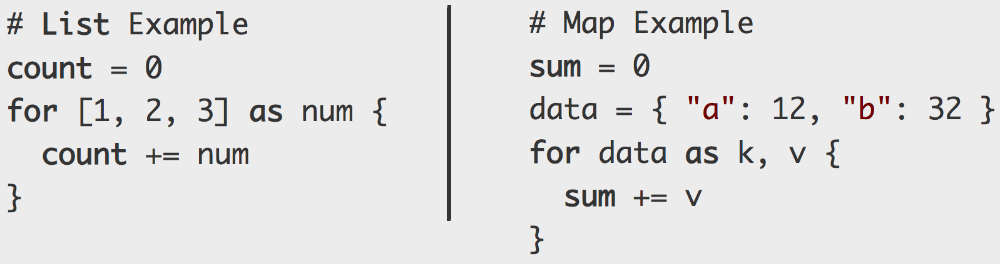
]

---
name: sentinel-language-expressions
#Sentinel Language - expressions

`all`, `any` and `filter` are like the `for` loop with conditions. Commonly used in functions to evaluate a list or set in one shot.

- `all`: universal qualifier quantifier boolean express must be true for all items of a collection. Returns true or false

- `any`: an existential quantifier asserting that a boolean expression must be true for at least one item in a collection. Returns true or false

- `filter`: also a quantifier, but instead of returning true or false, it returns a sub-collection of the original collection consisting of those items for which the boolean expression was true.

???
We'll see examples of using these functions later

---
name: sentinel-function
#Sentinel - Functions
```code
find_resources = func(resource_type) {
  # Do something and use the parameter
  return true
}

main = rule {
  find_resources("aws_s3_bucket")
}
```

Functions execute various statements and return a value

---
name: sentinel-function-cont
#Sentinel - Functions


A Sentinel Function is declared with the `func` keyword.

find_resources = <span style="color:red"> func </span> (resource_type)

- Each function has a name such as `find_resources`
- Each function can have zero or more parameters
- Every function must return a value such as true

Calling a function looks like:

`aws_instances = find_resources("aws_instance")`

---
name: sentinel-builtin
#Sentinel - Built in Functions

Sentinel includes some useful Builtin Functions:
<br>
<br>**append**: 	&ensp;Appends a value to the end of a list
<br>**delete**:	  &emsp;Deletes an element from a map
<br>**error**:		&emsp; Immediately exit with an error message
<br>**keys**:		  &emsp;Returns the keys of a map
<br>**length**:	  &emsp;Returns the length of a collection or string
<br>**print**:		&emsp;Prints what you tell it to.  Always returns true.
<br>**range**:	  &emsp;Returns a list of numbers in a range.
<br>**values**:   &emsp;Returns the values of a map.

https://docs.hashicorp.com/sentinel/functions/

---
name: intro-sentinel-language
# Sentinel Imports

Imports enable a Sentinel policy to access reusable libraries and external data and functions

Imports allow Sentinel policies to do more than look at only local context for making policy decisions

There are standard imports and specific Terraform imports

---
name: sentinel-standard-import
#Sentinel - Standard Imports


Terraform Enterprise also allows these standard imports:

- decimal
- http
- json
- runtime
- sockaddr
- strings
- time
- types
- units

---
name: sentinel-operations
class: compact
#Sentinel - Examples of Using Standard Imports

``` code
import strings
import http
import json
```
Check if a string has a prefix:
```code
strings.has_prefix(s, prefix)
```
Make external calls to API endpoints:
```code
response = http.get("https://example.hashicorp.com")
```
Convert a JSON object to a Sentinel structure:
```code
json.unmarshall(response.body)
```

---
name: intro-sentinel-language-cont
class: compact
# TFE Imports

In Terraform Enterprise there are essentially four types of Sentinel imports:

- tfplan
- tfconfig
- tfstate
- tfrun


In code, they are referenced as: `tfconfig/v2`, `tfplan/v2`, `tfstate/v2`, `tfrun/v2`
```code
import "tfplan/v2"
```

Note: `/v2` imports are available since Terraform v0.12.
They have a more robust data structure and allow for easier use in coding Sentinel policy.

For Terraform < 0.12, use `tfconfig`, `tfplan`, `tfstate`, `tfrun`


---
name: tfplan
# TFE Imports - tfplan

- Generated data from a Terraform plan
- A Terraform plan is a file created as a result of `terraform plan` and input to Terraform apply
- Represents changes Terraform needs to make to reach the desired state
- Most commonly used import

https://www.terraform.io/docs/cloud/sentinel/import/tfplan-v2.html

???
The tfplan/v2 import includes two different collections, planned_values and resource_changes, that can be used to evaluate the expected values of resource and data source attributes (including both arguments and exported attributes) if an apply were run.
Using the resource_changes collection is generally preferred because it includes more information about changes being made to new or existing resources.
This data includes the actions being performed such as "create", "update", and "delete", the values of attributes before and after the change, and the after_unknown collection of booleans indicating if the values are computed (will not be known until after the apply).

---
name: tfplan-usecases
# TFE Imports - tfplan Use Cases

Use cases for the `tfplan` import include:

Restrict the configuration of:
- Module calls
- Variables
- Resources
- Data sources
- Providers
- Outputs


---
name: intro-sentinel-language-cont-2
# TFE Imports - tfconfig

- Desired infrastructure state is written into Terraform configuration `.tf` files
- The `tfconfig` import provides insight to the configuration values of:
  - Providers
  - Resources
  - Data Sources
  - Modules
  - Variables

https://www.terraform.io/docs/cloud/sentinel/import/tfconfig-v2.html

???
The tfconfig/v2 import gives information about the Terraform configuration used by the run in which Sentinel policies are checked.
It does NOT give all information about the Terraform configuration.
It can be used to restrict the configuration of module calls, variables, resources, data sources, providers, provisioners, and outputs.
It can also be used to compare attributes of different resources even if they are computed since it can compare the expressions the code used.
It is useful for restricting things that the other imports don't cover.
However, using it to restrict resources and data sources can be challenging because of the need to cross-reference references.


---
name: intro-sentinel-language-cont-3
# TFE Imports - TF Config Use Cases

Some use cases for `tfconfig` include:

- Organizational naming conventions
  * requiring that configuration elements are named in a way that conforms to some organization-wide standard.
- Required inputs and outputs
  * organizations may require a particular set of input variable names across all workspaces or may require a particular set of outputs for asset management purposes.
- Enforce using only a set of approved modules
- Enforcing particular providers or resources


???
* organizations may provide a number of "building block" modules and require that each workspace be built only from combinations of these modules.
* an organization may wish to require or prevent the use of providers and/or resources so that configuration authors cannot use alternative approaches to work around policy restrictions.


---
name: intro-sentinel-language-cont-4
class: compact
# TFE Imports - tfstate

Terraform state is the data that Terraform has recorded about a workspace at a particular point in its lifecycle, usually after an apply.


`tfstate` use cases include;
Check whether any previously provisioned resources, data sources, or outputs have attribute values that are no longer allowed by your governance policies.

https://www.terraform.io/docs/cloud/sentinel/import/tfstate-v2.html

???
The tfstate/v2 import gives the state of resources and data sources after a plan.
Generally, this will be the same as the state before the plan, but it could include additional data for data sources that were evaluated during the refresh operation done by the plan.
Data sources that do not reference computed values are evaluated during the plan.
Data sources that reference computed values are not evaluated until the apply.
 As a consequence, the tfstate/v2 import is often more useful than the tfplan/v2 import when restricting data sources in policies.

---
name: tfrun
class: compact
# TFE Imports - tfrun

The `tfrun` import provides metadata for Terraform runs and their workspaces as well as cost estimate data.

https://www.terraform.io/docs/cloud/sentinel/import/tfrun.html

???
The tfrun import gives some useful information about a run and the workspace it was run in.
This includes the following:
The workspace's name, description, and other settings
Whether the plan was speculative or a destroy plan
A list of variables set for the run, indicating their names, their category (Terraform or Environment), and whether they were marked as sensitive.
Cost estimates calculated during the run's cost estimation phase.

There are two main use cases for the tfrun import:
Restricting the costs of cloud resources by evaluating cost estimates generated for AWS, Azure, and GCP between the plan and the running of Sentinel policy checks.
Selectively applying policy conditions to different workspaces based on their names:
For instance, don't allow Auto Apply to be set in workspaces with names starting in "prod-" or ending in "-prod".
But only do this if the governance team is controlling workspace names.
Checking that certain conditions are satisfied before allowing a destroy to be done against the entire workspace.

---
name: sentinel-mocks

# Sentinel Mocks

- Sentinel Mocks simulate the data that is made available to the Terraform Sentinel imports

- They can be generated from recent plans using the Terraform Cloud UI and API.

- They enable testing of Terraform Sentinel policies with the Sentinel CLI

- Sentinel CLI with mocks speeds up development of new policies to test and apply multiple test cases

???
Without Sentinel CLI and mocks, you would have to write TF code, write and checkin a policy, run a plan to trigger the sentinel test...
Any changes to the policy require checking in the new version and running a plan...very time consuming

---
name: sentinel-modules
# Sentinel Modules

In March 2020, Sentinel v0.15 introduced the ability to include modules within a Sentinel configuration

A Sentinel Module defines Sentinel functions and rules in a file that can be used by Sentinel policies with a single import statement.

Before modules, functions had to be copy/pasted into every policy that called them.

Modules improve reusability and maintenence. DRY principle

Sentinel modules are registered in Sentinel CLI configuration files and in TFC/TFE policy set configuration files.

???
TODO: Could go deeper into Sentinel modules, have a lab on setting them up in a mock, setting them up in a TFE config file

---
name: sentinel-playground
# Sentinel Playground
In September 2020, the [Sentinel Playground](https://www.hashicorp.com/blog/announcing-the-sentinel-playground) was released
.center[
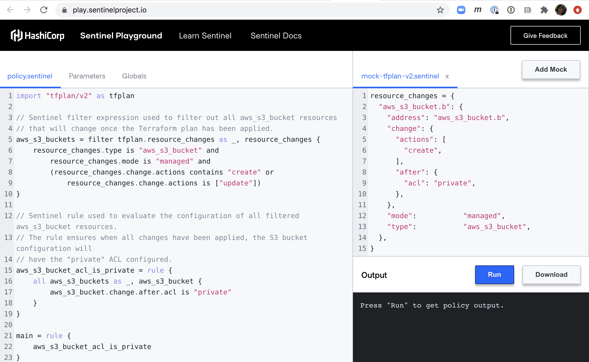
<br>https://play.sentinelproject.io/
]


---
name: section-writing-and-testing
template: tf-section
class: title
# Writing and Testing <br>Sentinel Policies for Terraform

---
name: writing-your-first-policy
# Basic Methodology for Writing Sentinel Policy

The eight steps of the recommended methodology are:
1. Create a Terraform configuration that creates the resource
2. Create a TFE workspace that uses your Terraform configuration
3. Run a plan against the workspace using the remote backend
4. Generate mocks against the plan in the Terraform Enterprise UI
5. Write a new Sentinel policy
6. Create test cases and use the Sentinel CLI to test your policy
7. Revise your policy and test cases until the latter all pass
8. Deploy your policy to a TFE organization

---
name: write-sentinel-img-1
# Writing Sentinel - Step 1. Terraform Code

.center[

]

---
name: write-sentinel-code-1
class: compact
# Writing Sentinel - Step 1. Terraform Code

The first step is we need something to test. Create a Terraform configuration in `main.tf`

```JSON
resource "google_compute_instance" "default" {
  name         = "web_vm"
  machine_type = "n1-standard-1"
  zone         = "us-central1-a"

  tags = ["finance", "prod"]

  boot_disk {
    initialize_params {
      image = "debian-cloud/debian-9"
    }
  }
```
`"google_compute_instance"` is the Type of the resource and `"default"` is its Name.
---
name: writing-sentinel-code-2
class: img-left, compact
# Writing Sentinel - Terraform Code


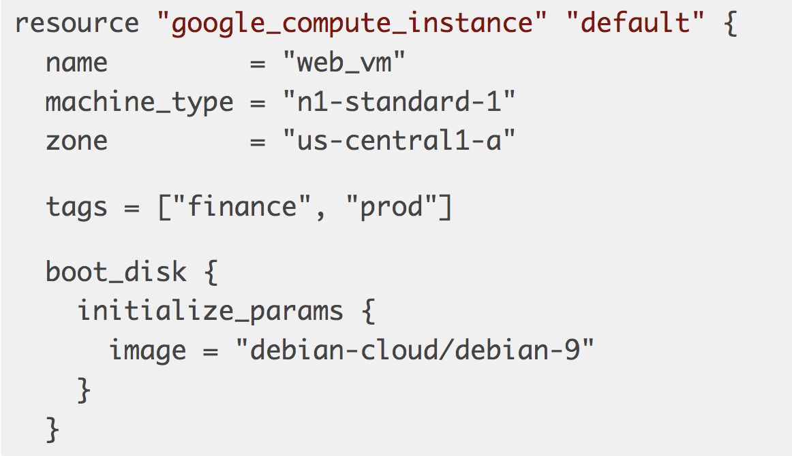

Terraform code we could test:

`name         = "web_vm"`

Enforce strict naming conventions, pre-fixes, post-fixes or appending business units for in-depth cost analysis

`machine_type = "n1-standard-1"`

Machine type is one of the most popular Sentinel checks, enforcing reasonable sized deployments is one of the best ways to ensure cost control in large organizations.

---
name: writing-sentinel-code-3
class: img-left, compact
# Writing Sentinel - Terraform Code


`zone         = "us-central1-a"`

Control location for legal, regulatory, or common best practices

`  tags = ["finance", "prod"]`

Enforce tagging standards such as cost centres, environment, app associations

`image = "debian-cloud/debian-9"`

Ensure  standardized images or gold images are used

---
name: write-sentinel-backend
class: compact
# Writing Sentinel - Configure a backend.tf

Use the local CLI workflow, by creating a `backend.tf` to configure the remote backend

```code
terraform {
  backend "remote" {
    hostname = "<your_TFE_server>"
    organization = "<your_org>"

    workspaces {
      name = "<your_workspace>"
    }
  }

}
```
Next, run `terraform login` to authenticate with Terraform Enterprise. Alternatively, you can [manually configure credentials in the CLI config file](https://www.terraform.io/docs/commands/cli-config.html#credentials)

---
name: write-sentinel-img-2
# Writing Sentinel - Create a Workspace

.center[
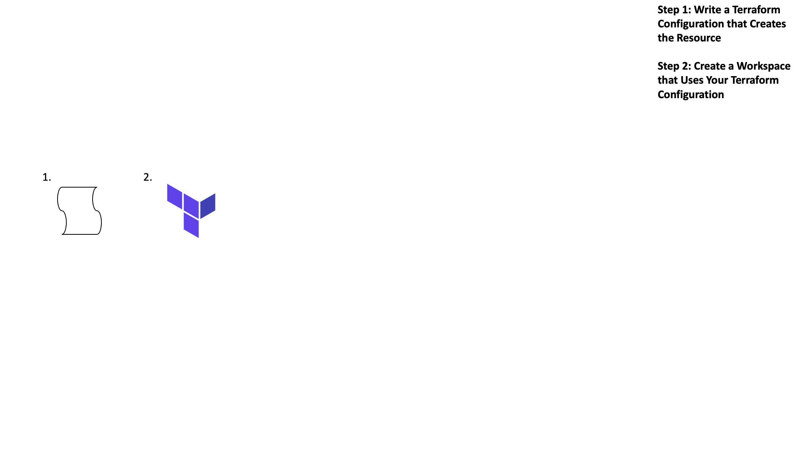
]

---
name: create-workspace
# Writing Sentinel - Create a Workspace

.center[
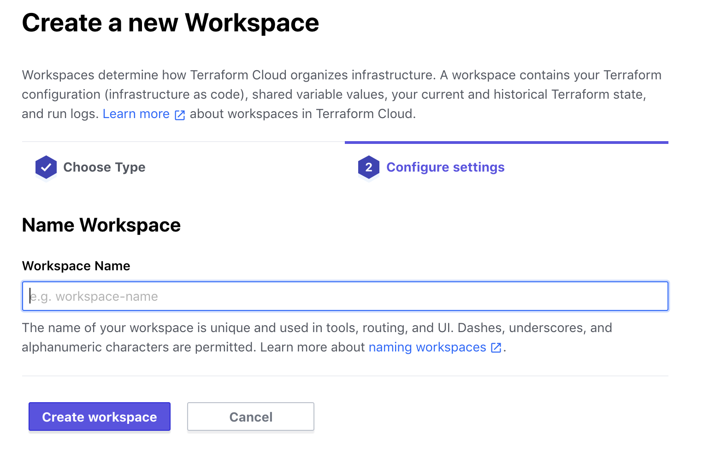
]

---
name: create-workspace-cont
# Writing Sentinel - Create a Workspace

- Click "No VCS connection" when creating your workspace when prompted to connect to a version control provider.

- If required, add environment variables such as cloud credentials

- Several tools can push Terraform and environment variables:
  - [set-variables.sh](https://github.com/hashicorp/terraform-guides/blob/master/operations/variable-scripts/set-variables.sh)
  - [tf-helper](https://github.com/hashicorp-community/tf-helper)
---
name: write-sentinel-img-3
class:compact
# Writing Sentinel - Run a Plan and Gather Mocks

.center[
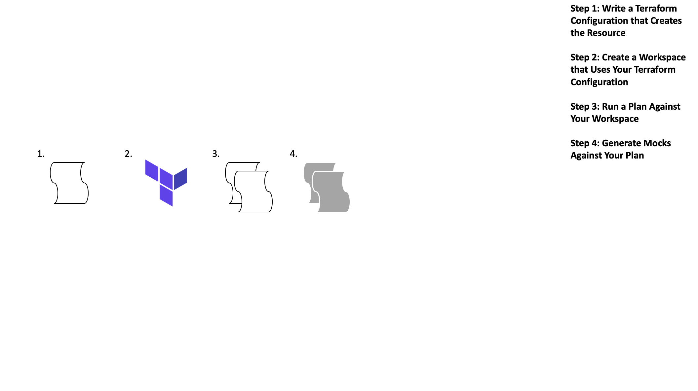
]

---
name: run-plan
class:compact
# Writing Sentinel - Run a Plan and Gather Mocks

`terraform init`, `terraform plan`

- The plan will run on the TFE server, but its results will be visible locally and in the TFE UI

- To see the run in the TFC UI, copy the URL displayed near the top of the local version of the plan and navigate to it with a browser

- Generate Sentinel mocks by clicking the "Download Sentinel mocks" button

- After a minute, a tar.gz file will be downloaded with 7 mocks

- Extract the mock files from the tar.gz file

- You now have `tfplan`, `tfconfig`, and `tfstate` and `tfrun` mocks for simulating Sentinel data

---
name: generate-mocks-img
# Writing Sentinel - Download Sentinel Mocks

.center[
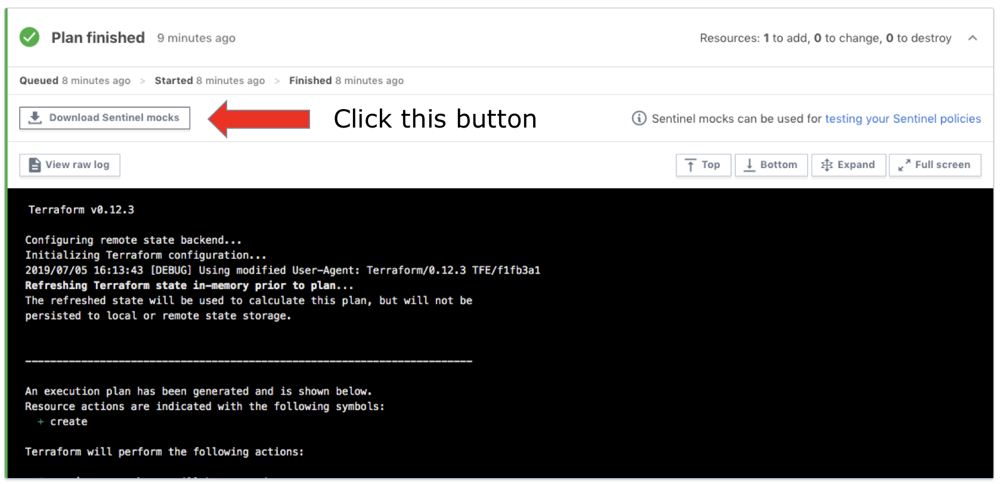
]

---
name: write-sentinel-img-4
# Writing Sentinel - Write a Sentinel Policy

.center[
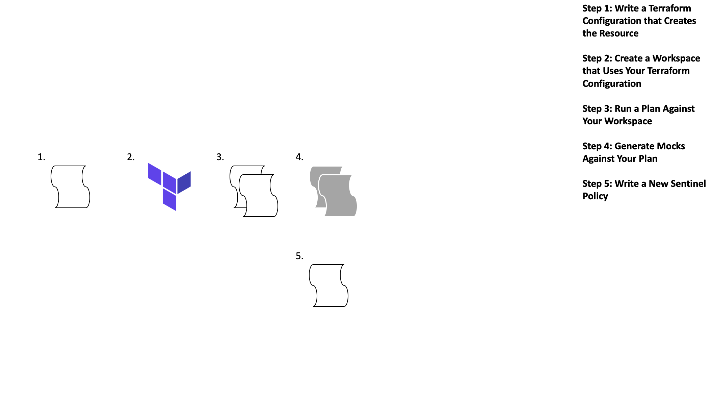
]

---
name: writing-sentinel-code-5
# Writing Sentinel - Write a Sentinel Policy

Now that we have a simulated run we can start to run both positive and negative tests against our data.

Remember in Step 1 we wrote some example Terraform code with a few values we could check? Now is the time to start writing Sentinel code to validate those fields.

The next set of slides walks you through a Sentinel policy step-by-step called "restrict-ec2-instance-type.sentinel" that restricts the allowed sizes of AWS EC2 instances

---
name: import-declaration
# Anatomy of Policy - import Declaration

Import tfplan-functions.sentinel with alias "plan"

```code
import "tfplan-functions" as plan
```

Note: `tfplan-functions` is a module that uses the `tfplan` import
---
name: allowed-values
# Anatomy of Policy - List Allowed Values

```code
# Allowed EC2 Instance Types
allowed_types = ["t2.small", "t2.medium", "t2.large"]
```

---
name: find-and-filter
# Anatomy of Policy - Parse Out Resources

`find_resources`, `filter_attribute_not_in_list`:
<br>Functions that return ec2-instances in the code that do not comply with list of allowed types (t2.small, t2.medium, t2.large)

```code
# Get all EC2 instances
allEC2Instances = plan.find_resources("aws_instance")

# Filter to EC2 instances with violations
# The called function prints warnings for all violations
violatingEC2Instances = plan.filter_attribute_not_in_list(
    allEC2Instances, "instance_type", allowed_types, true)
```

---
name: main-rule
# Anatomy of Policy - Set main Rule

```code
# Count violations
violations = length(violatingEC2Instances["messages"])

# Main rule
main = rule {
  violations is 0
}
```

---
name: all-together
class: compact
# Anatomy of a Policy - Full Policy

```code
#restrict-ec2-instance-type.sentinel
import "tfplan-functions" as plan

allowed_types = ["t2.small", "t2.medium", "t2.large"]

# Get all EC2 instances
allEC2Instances = plan.find_resources("aws_instance")

# Filter to EC2 instances with violations
# The called function prints warnings for all violations
violatingEC2Instances = plan.filter_attribute_not_in_list(
    allEC2Instances, "instance_type", allowed_types, true)

violations = length(violatingEC2Instances)

# Main rule
main = rule {
  violations is 0
}
```
---
name: common-functions
# Anatomy of Policy - Common Functions

Common functions can be found [here](https://github.com/hashicorp/terraform-guides/tree/master/governance/third-generation/common-functions)
- find_resources(type)
- filter_attribute_not_in_list(resources, attr, allowed, prtmsg)
- evaluate_attribute(r, attribute)

The Instruqt track in this workshop embeds two Sentinel modules with many common functions that can be used in policies

---
name: resources-examples
# Resources for Policies
.center[

]
Terraform Guides:
<br>https://github.com/hashicorp/terraform-guides/tree/master/governance/third-generation

Terraform Foundation Policy:
<br>https://github.com/hashicorp/terraform-foundational-policies-library

???
Truth time - Getting proficient in policy writing for Sentinel can be difficult, there is a learning curve.
Luckily you don't have to re-invent the wheel
These resources give you great starting points, examples, maybe the policy you need already exists

---
name: write-sentinel-img-6
# Writing Sentinel - Test your Sentinel Policy

.center[
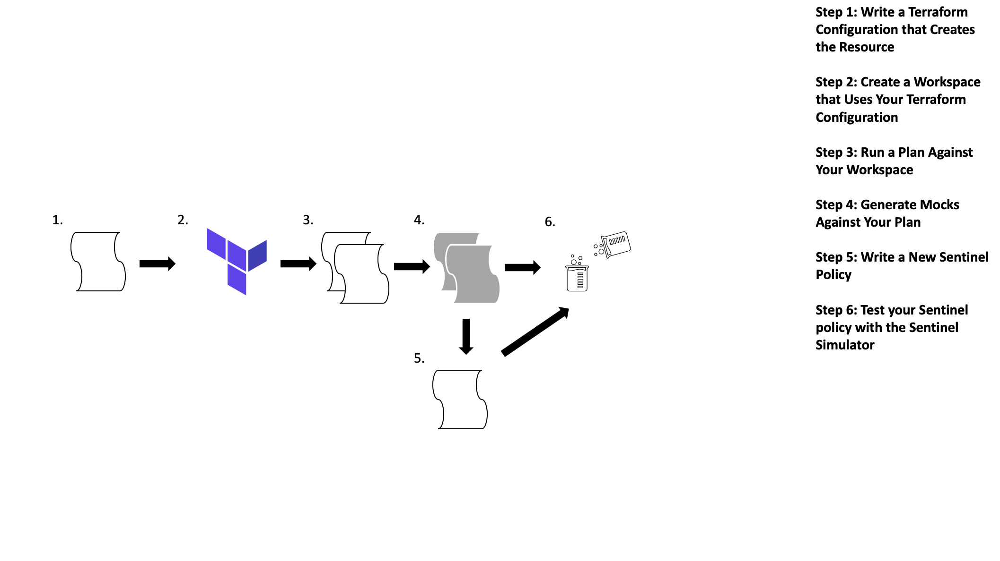
]

---
name: test-policy1
# Writing Sentinel - Test your Sentinel Policy

Testing Sentinel at the CLI requires a specific directory structure

```code
├── restrict-instance-name.sentinel
└── test
    ├── restrict-instance-name
    │   ├── fail.json
    │   └── pass.json
├── mock
    ├── mock-tfplan-fail.sentinel
    └── mock-tfplan-pass.sentinel
```


---
name: test-policy2
class: compact
# Writing Sentinel - Test your Sentinel Policy

#### pass.json Test Case

```code
{
  "modules": {
    "tfplan-functions": {
      "path": "../../../common-functions/tfplan-functions/tfplan-functions.sentinel"
    }
  },
  "mock": {
    "tfplan/v2": "mock-tfplan-pass.sentinel"
  },
  "test": {
    "main": true
  }
}
```

---
name: test-policy3
class: compact
# Writing Sentinel - Test your Sentinel Policy

#### fail.json Test Case

```code
{
  "modules": {
    "tfplan-functions": {
      "path": "../../../common-functions/tfplan-functions/tfplan-functions.sentinel"
    }
  },
  "mock": {
    "tfplan/v2": "mock-tfplan-false.sentinel"
  },
  "test": {
    "main": false
  }
}
```

---
name: test-policy4

# Writing Sentinel - Test your Sentinel Policy

Edit the mocks

The mock-tfplan-pass.sentinel should pass the test

Modify mock-tfplan-fail.sentinel mock file with a value that will cause the test to fail.
<br>Example: set instance_type to `"m5.large"`

Best Practice:
- You should always have at least 1 fail and 1 pass test case
- Sometimes, you will want multiple fail test cases and corresponding mocks

---
name: test-policy5
# Writing Sentinel - Test your Sentinel Policy

Run tests at the command line

- Navigate back to the directory containing your policy
- Run the following command:
```code
sentinel test –run=ec2
```

- To see the outputs of the print statements, use the verbose flag:
```code
sentinel test –run=ec2 –verbose
```

---
name: test-policy6
class: compact
# Writing Sentinel - Test your Sentinel Policy

Example output from `sentinel test`
.center[
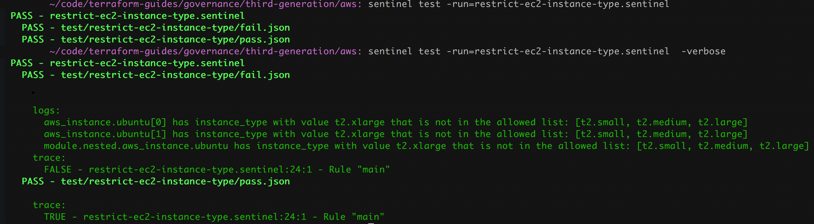
]

---
name: writing-sentinel-code-9
class: compact
# Writing Sentinel - Test your Sentinel Policy and infinity

Next comes the hard part, *iteration*. Iteration on both your Terraform code and Sentinel code until you've validated both the *positive* test cases and *negative* test cases.

Positive Test Cases;
 - Does my Sentinel check catch a bad machine types?

 Negative Test Cases;
 - Does my Sentinel check allow validate machine types?

Once you've validated both test cases you can move on to adding more Terraform entities and Sentinel checks!

---
name: write-sentinel-img-7
# Writing Sentinel - Revise Your Policy and Test Cases Until They All Pass

.center[
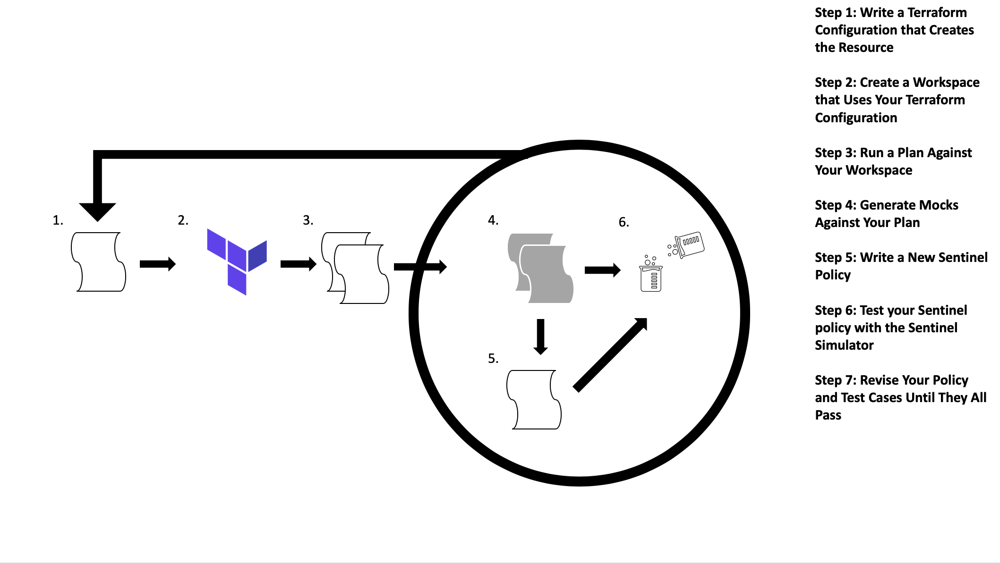
]

---
name: troubleshooting
class: compact
# Writing Sentinel - Debugging and Trouble Shooting

- Errors will give you line number and character <span style="color:red"> "An error occurred: <policy>.sentinel:34:10" </span>

- Use the <span style="color:red">`print`</span> function to debug.  Ex: `print("variable:", var)`

- Check for missing commas or braces
- An expression can fail to exist in multiple ways:
  - It could be absent from the data which gives undefined
  - It could be set to null or the empty string ("")
  - It could be an empty map, {}, or an empty list, []
- Verify an expression is not undefined or null: `x else null is not null`

- `length()` function can only be applied to strings, maps, and lists, check `type of` value before using it.
---
name: workshop-2
template: tf-section
class: title
# Lab: Sentinel for Terraform (v3)  

<br><br><br><br><br>

##Challenge Exercise 1, 2a and 2b

---
name: workshop-2-cont1
# Lab: Sentinel for Terraform (v3)

Most of each policy is written, all test cases and mocks have been provided to test

Finish each policy, save it and run `sentinel test`

You will need to replace placeholders like `<resource_type>`, `<attribute>`, and `<condition>` in each policy with suitable Sentinel expressions or values in order to complete the policies.

Keep any quotes around placeholders.

Remember that "attributes" includes "arguments" of resources.


---
name: workshop-2-cont2
# Lab: Sentinel for Terraform (v3)

### Exercise 1: Restrict Vault Auth Methods
Restricts the Vault authentication methods (backends) provisioned by Terraform's Vault Provider

### Exercise 2a&b: Restrict AWS IAM access keys
Ensure all AWS IAM access keys provisioned by Terraform's AWS Provider include a PGP key that starts with "keybase:"


https://play.instruqt.com/hashicorp/tracks/sentinel-for-terraform-v3

---
name: deploy
template: tf-section
class: title
# Deploying Policies to <br>Terraform Enterprise


---
name: writing-sentinel-code-9
# Writing Sentinel - Deploy Your Policy

After iterating you are done! You can finally deploy your tested Terraform code and Sentinel policies to production!

.center[
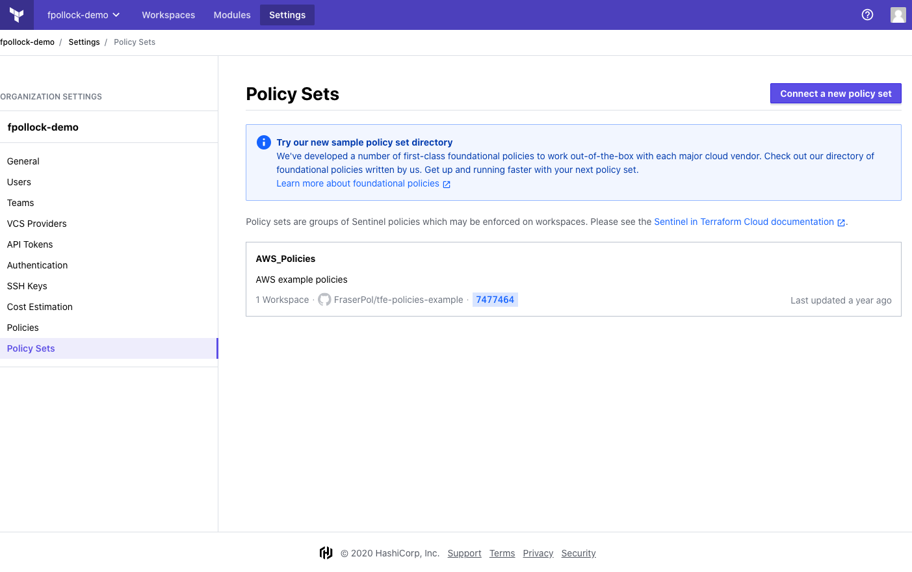
]

---
name: policies-v-policy-sets
# Writing Sentinel - Policy Sets

Policy Sets are stored in a VCS repository and defined in a file called `sentinel.hcl`
.center[

]

---
name: vcs-and-sentinel-1
# Version Control and Sentinel

As with the previous chapter where you configured your Version Control Solution to be connected to Terraform Enterprise this is also required for Sentinel.

.center[
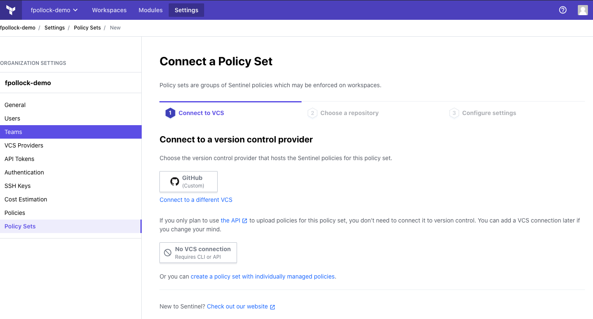
]

---
name: vcs-and-sentinel-2
# Version Control and Sentinel - Choose a Repo

After you've configured your version control solution and committed your Sentinel code you'll be required to choose the corresponding repository

.center[
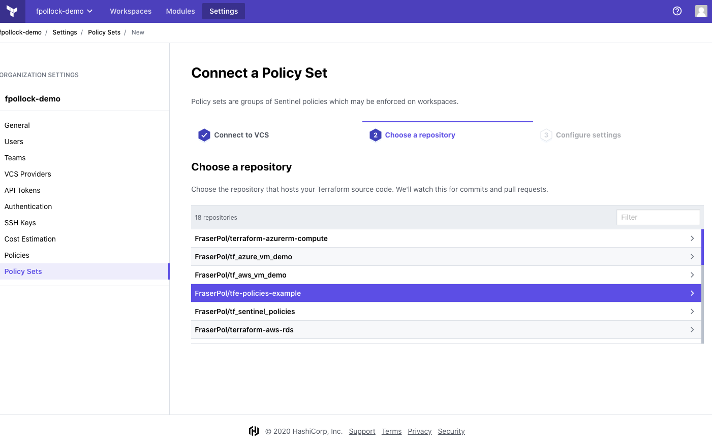
]

---
name: vcs-and-sentinel-3
class: compact
# Version Control and Sentinel - Configure Settings

The final step is to configure how your policies will be applied and consumed by Terraform Enterprise.
.center[
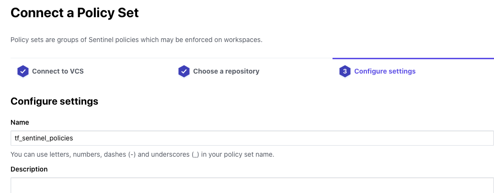
]
- Name the policy set
- Choose the workspaces the policy set should apply to
- Specify input parameters if necessary, including sensitive values

---
name: deploy-policy1
# Writing Sentinel - Deploy Your Policy

Start by testing the policy individually on a single workspace with the enforcement level set to **hard mandatory**

This will make your testing easier:
- You won't see results from other policies.
- You won't have to worry about overriding soft-mandatory failures.


---
name: workshop-3
template: tf-section
class: title
# Lab: Sentinel for Terraform (v3)  

<br><br><br><br><br>

##Challenge Exercise 3a and 3b

---
name: workshop-3-cont
# Lab: Sentinel for Terraform (v3)

Using the tfstate import

### Exercise 3a: Restrict AWS ACM Certificates v1
Uses filters both to find an initial list of resources and to find those that violate the policy

### Exercise 3b: Restrict AWS ACM Certificates v2
This second version of the policy has you write your own validation function

https://play.instruqt.com/hashicorp/tracks/sentinel-for-terraform-v3

---
name: workshop-4
template: tf-section
class: title
# Lab: Sentinel for Terraform (v3)  

<br><br><br><br><br>

##Challenge Exercise 4a and 4b

---
name: workshop-4-cont
class: compact
# Lab: Sentinel for Terraform (v3)

Accessing a nested attribute
<br>`use_aliases = rc.change.after.config[0].node_config[0].ip_allocation_policy[0].use_ip_aliases`

.center[
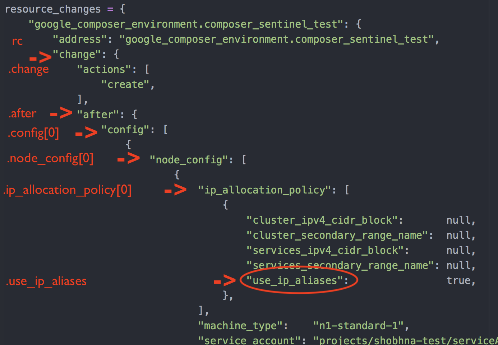
]

---
name: workshop-4-cont1
class: compact
# Lab: Sentinel for Terraform (v3)

If using the <span style="color:red">`evaluate_attr(r,attr)` </span> function, then the declaration is:
<br> `use_aliases = evaluate_attr(rc, "config.0.node_config.0.ip_allocation_policy.0.use_ip_aliases")`

.center[
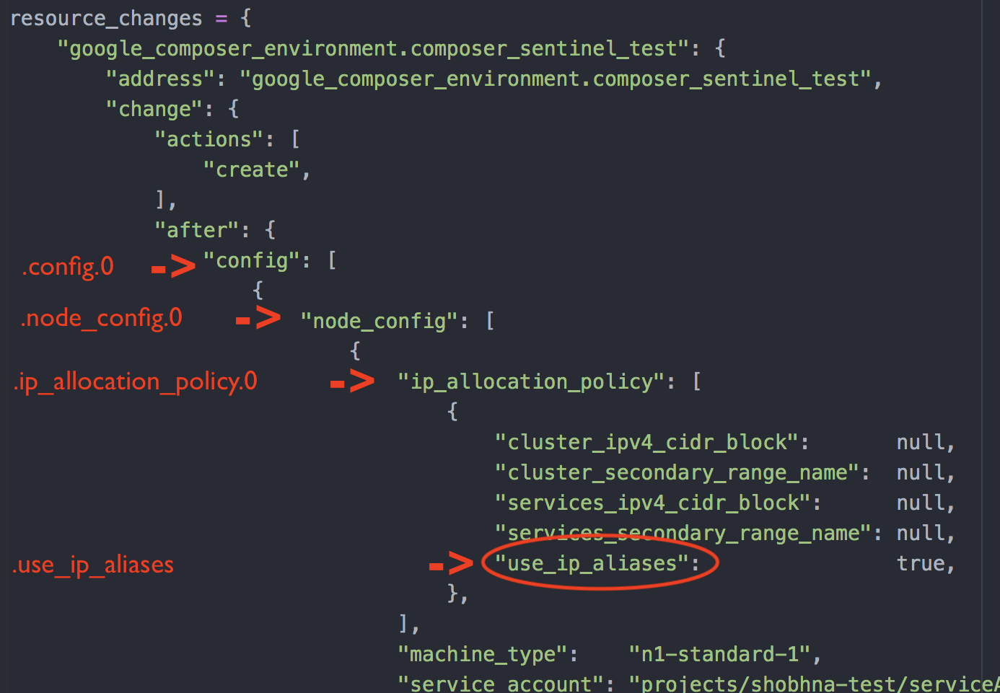
]

---

name: workshop-4-cont2
class: compact
# Lab: Sentinel for Terraform (v3)

Evaluating attributes inside nested blocks and using the `Types` import

### Exercise 4a: Restrict Google Compute Instances v1
Uses common functions to restrict Google Compute instances to use a public image

### Exercise 4b: Restrict Google Compute Instances v2
This second version of the policy has you write your own function

https://play.instruqt.com/hashicorp/tracks/sentinel-for-terraform-v3


---
name: workshop-5
template: tf-section
class: title
# Lab: Sentinel for Terraform (v3)  

<br><br><br><br><br>

##Challenge Exercise 5a and 5b

---
name: workshop-5-cont
class: compact
# Lab: Sentinel for Terraform (v3)

Requires all modules loaded by the root module come from the Private Module Registry (PMR) of a Terraform Cloud organization

### Exercise 5a: Require Modules from a PMR v1
First version, write a custom function


### Exercise 5b: Require Modules from a PMR v2
This second version you move this function to a module

https://play.instruqt.com/hashicorp/tracks/sentinel-for-terraform-v3

---
name: workshop-6
template: tf-section
class: title
# Lab: Sentinel for Terraform (v3)  

<br><br><br><br><br>

##Challenge Workshop: Extra Credit

---
name: workshop-6
# Lab: Sentinel for Terraform (v3)

Using the tfrun import

### Challenge Extra Credit: Restrict Production Workspaces
Prevent any workspace with a name starting with "prod-" or ending in "-prod" from having the Auto Apply property set to "true".


---
name: solutions
template: tf-section
class: title
# Solutions to Exercises

---
name: solutions2
# Solutions to Challenges
You will find solutions to Exercises all 10 challenges of the Sentinel for Terraform (v3) track here:
https://github.com/rberlind/sentinel-training-solution/tree/v3/sentinel-policies

Please refrain from looking at them until you've tried to solve the challenges on your own.

You won't learn as much by copying and pasting from the solutions as you will by reading relevant links and trying to complete the policies on your own.

---
name: summary-title
template: tf-section
class: title
# Summary

---
name: Summary
# Chapter Summary

- Sentinel is HashiCorp's policy as code language
- Its a robust logic based decision tool to evaluate *EVERYTHING* you can build in Terraform
  * Sentinel is also avalible across HashiCorp's entire product suite making integrations easy!
- Sentinel is code so it should be stored in a Version Control Solution
- We learned the Sentinel writing process

---
name: reference-links
# Reference links

- [Foundational Policies](https://github.com/hashicorp/terraform-foundational-policies-library)
- [Sentinel Guides](https://github.com/hashicorp/terraform-guides/tree/master/governance/third-generation/)
- [Sentinel Playground Blog](https://www.hashicorp.com/blog/announcing-the-sentinel-playground)
- [Sentinel Playground](https://play.sentinelproject.io/)
- [Managing Sentinel Policies](https://www.terraform.io/docs/cloud/sentinel/manage-policies.html)
- [Introducing Sentinel](https://www.hashicorp.com/sentinel/)
- [Writing and Testing Sentinel - An Indepth Guide](https://www.hashicorp.com/resources/writing-and-testing-sentinel-policies-for-terraform/)
- [Sentinel Imports](https://www.terraform.io/docs/cloud/sentinel/import/tfstate-v2.html)

---
name: slide-deck
class: img-left-full


<br><br><br>
.center[
# Day 1 - Module 5 Completed!

]
