name: Intro-to-Terraform-Enterprise
class: center,middle,title-slide
count: false
<div style="background-color: #5C4EE5;">

</div>
.titletext[
Intro to Terraform Enterprise  
On Microsoft Azure]

???
TODO: Pretty this slide up a bit.

Instructors - make sure you have read the instructor notes and setup instructions before presenting this workshop:

Classroom Lab Setup  
https://github.com/hashicorp/workshops/blob/master/INSTRUCTOR_NOTES.md

TFE Organization Setup  
https://github.com/hashicorp/workshops/blob/master/azure-tfe/README.md

---
name: Table-of-Contents
class: center,middle
Table of Contents
=========================

.contents[
1. Terraform Enterprise/Cloud Overview
2. Review the Basics
3. Terraform Enterprise
4. Remote State
5. Protecting Sensitive Variables
6. Version Control Systems (VCS) and Terraform
7. Sentinel Policy Enforcement
8. VCS Collaboration for Teams
9. Access Controls
10. Private Module Registry
]

???
**This workshop is meant to give you a basic introduction to all the major features of Terraform Enterprise. We'll start with an overview and brief demo, and then a review of basic Terraform usage. Then we'll cover topics like remote state, sensitive variables, policy enforcement, version control, collaboration and access controls, and the private module registry. I hope you're prepared for an action-packed day, because we've got a lot to cover.**

---
name: TFE-Chapter-1
class: center,middle
.section[
Chapter 1  
Terraform Enterprise - Built for Teams and Organizations
]

---
name: why-tfe-1
Terraform Enterprise
-------------------------
.center[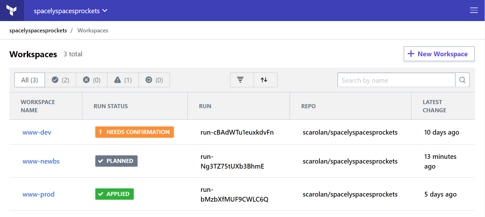]

Terraform Enterprise is a cloud-based or on-premise application that provides the following features:

???
**Until now we've been using only open source features. Sooner or later you'll reach a point where you want more tools for governance and collaboration. Terraform open source is great for small environments and developers, but when you need multiple people or teams to collaborate on the same infrastructure, Terraform Enterprise features can help.**

---
name: why-tfe-2
Terraform Enterprise
-------------------------
.center[]

Terraform Enterprise is a cloud-based or on-premise application that provides the following features:

* Easy Mode - UI integration with Version Control System

???
**As your organization begins to standardize on Terraform, you'll have different types of users. Most of you will become terraform experts, but there may be others who just want to build things. They can use the terraform code that folks like you have written. To make this process easy, we have a web application. You log on, click a button, and out pops your infrastructure.**

---
name: why-tfe-3
Terraform Enterprise
-------------------------
.center[]

Terraform Enterprise is a cloud-based or on-premise application that provides the following features:

* Easy Mode - UI integration with Version Control System
* Advanced Users - API driven workflow with CI/CD pipeline

???
**For our more advanced users we have a fully featured RESTful API. This is useful for programmatic access to terraform features. You can drive terraform plan and apply commands using an API interface. If you have a CI/CD pipeline you can automate your terraform builds as part of your process.**

---
name: why-tfe-4
Terraform Enterprise
-------------------------
.center[]

Terraform Enterprise is a cloud-based or on-premise application that provides the following features:

* Easy Mode - UI integration with Version Control System
* Advanced Users - API driven workflow with CI/CD pipeline
* Centralized Terraform state management

???
**Terraform enterprise also provides safe and secure storage for your state files. Instead of having that important state file stored on someone's laptop, now it is safely stored in the Terraform Enterprise application. Only those who need access to the state file can see it, and it is protected from being overwritten or corrupted.**

---
name: why-tfe-5
Terraform Enterprise
-------------------------
.center[]

Terraform Enterprise is a cloud-based or on-premise application that provides the following features:

* Easy Mode - UI integration with Version Control System
* Advanced Users - API driven workflow with CI/CD pipeline
* Centralized Terraform state management
* Private Module Registry for sharing code

???
**Eventually you'll have a library of Terraform code that you might like to share and publish for other users and teams in your company. The private module registry makes this easy. You build reusable modules that build infrastructure according to standards, and then publish them for your users. This can help with enforcing security policies and build standards.**

---
name: why-tfe-6
Terraform Enterprise
-------------------------
.center[]

Terraform Enterprise is a cloud-based or on-premise application that provides the following features:

* Easy Mode - UI integration with Version Control System
* Advanced Users - API driven workflow with CI/CD pipeline
* Centralized Terraform state management
* Private Module Registry for sharing code
* Sentinel policy enforcement

???
**TFE also comes with a policy enforcement engine that can ensure that your users don't build things they shouldn't build, or configure them in the wrong way. For example, you might wish to prevent users from opening network ports to the internet, or from building too many virtual machines. All of these types of rules can be expressed using our Sentinel policy enforcement engine. Sentinel policies prevent users from doing bad things, *before* they provision to the cloud.**

---
name: why-tfe-7
Terraform Enterprise
-------------------------
.center[]

Terraform Enterprise is a cloud-based or on-premise application that provides the following features:

* Easy Mode - UI integration with Version Control System
* Advanced Users - API driven workflow with CI/CD pipeline
* Centralized Terraform state management
* Private Module Registry for sharing code
* Sentinel policy enforcement
* Single Sign-On with SAML

???
**Terraform Enteprise also supports single sign-on using your own SAML provider. This allows you to quickly map users into your organization's teams and workspaces so they can become productive right away.**

---
name: why-tfe-8
Terraform Enterprise
-------------------------
.center[]

Terraform Enterprise is a cloud-based or on-premise application that provides the following features:

* Easy Mode - UI integration with Version Control System
* Advanced Users - API driven workflow with CI/CD pipeline
* Centralized Terraform state management
* Private Module Registry for sharing code
* Sentinel policy enforcement
* Single Sign-On with SAML
* Secure variable and API key management

???
**Terraform enterprise can store and encrypt your cloud credentials, passwords or any other sensitive data. These credentials are stored safely inside of a Vault instance that runs inside of TFE.**

---
name: TFE-Link-to-Slide-Deck
The Slide Deck
-------------------------
<br><br><br>
.center[
Follow along on your own computer at this link:

https://bit.ly/hashiazure
=========================
]

<br><br>
.center[We'll be using the Terraform Enterprise deck for training today.]

???
TODO:  Update this link.  May have to ask Andy to update the bit.ly links

---
name: TFE-Chapter-2
class: center,middle
.section[
Chapter 2  
Review the Basics
]

???
This chapter is meant to give a quick review of some Terraform basics.

---
name: tfe-workstation-setup-0
Terraform Workstation Requirements
-------------------------
<br><br>In order to proceed you'll need a Terraform workstation and valid Azure account credentials. You will also need a free [github.com](https://github.com) account, and have both git and terraform installed on your workstation.

**Option 1:** Use a cloud-based workstation. Your instructor will provide you with the address and RDP credentials.

**Option 2:** Bring your own Azure account and use Azure Cloudshell.

**Option 3:** [Generate a Service Principal](https://docs.microsoft.com/en-us/azure/virtual-machines/linux/terraform-install-configure#configure-terraform-environment-variables) - for advanced users.

???
**Today we'll be using cloud-based workstations that have all the software you need pre-installed. There are no firewalls, no ticketing systems and no blockers in the lab environment. It is your own personal Terraform playground. All the skills you learn here today can be applied to your own Terraform Enterprise server as well. All the exercises will be done in our Azure training account. Please be kind to our training account, no bittorrent or crypto mining please.**

The expectation here is that everybody starts the workshop with a workstation that can run `terraform apply` and build things in an Azure account. You should always default to Option 1.  If advanced students want to try options #2 and #3 tell them they are on their own for troubleshooting.

---
name: tfe-workstation-setup-1
Log Onto Your Workstation
-------------------------

Your instructor will provide you with a workstation URL that looks like this:

.center[.h1[myworkstation01.centralus.cloudapp.azure.com]]

.center[]

Use Remote Desktop (RDP) to access your workstation. Your instructor will provide the username and password.

???
Note to the instructor - outbound access on TCP port 3389 is required for this to work. Always have someone at the client check that they can access a test workstation *before* you go on site. You don't want to show up for training and find out that RDP access is blocked from the network you're using.

RDP is installed by default on almost all Windows corporate PCs and laptops. If your students are on Mac they can download the official Microsoft RDP client from the app store.

---
name: tfe-workstation-setup-2
Run the setup_azure.ps1 script
-------------------------
<br><br>
.center[]

Right click on the file called 'setup' on your desktop and select 'Run with Powershell'. Type Y for Yes when it asks about changing your execution policy.

**WARNING:** Do not skip this step. It is required to set up your connection to Azure Cloud.

???
**This handy script does some setup and fetches dynamic Azure credentials from our training Vault server. Right click on the setup_azure.ps1 file and select the "Run with Powershell" option. It may take a minute or two to finish.**

If anyone is curious what this powershell script does, it's disabling windows line endings for git clone. It also fetches dynamic Azure credentials that are good for 8 hours.

---
name: tfe-workstation-setup-3
Run the setup_azure.ps1 script
-------------------------
Answer Yes or Yes to All to the question about Execution Policy.
```tex
Execution Policy Change
The execution policy helps protect you from scripts that you do not trust. Changing the execution policy might expose you to the security risks described in the about_Execution_Policies help topic at https:/go.microsoft.com/fwlink/?LinkID=135170. Do you want to change the execution policy?
[Y] Yes  [A] Yes to All  [N] No  [L] No to All  [S] Suspend  [?] Help (default is "N"):
```

.center[]

You should see this banner if the script ran successfully. 

???
**Close the powershell window where you ran the setup script.**

---
name: tfe-workstation-setup-4
Open Visual Studio Code
-------------------------
.center[]

A web browser window will pop open with the latest Visual Studio Code release notes. You may close the web browser. Click the little gear icon in the lower left corner. Adjust your font size and color scheme to something comfortable.

???
**Let's take a moment to move in and get comfortable. You can click on this little gear icon in the lower left corner to access your settings. Pick a color theme and font size that are easy on the eyes. You can also adjust your icons. I like the vscode-icons set, which has an icon for almost every type of file you can imagine.**

I like to demo this part for the students. My personal favorites are Dracula and vscode-icons. Remember that some of these folks have never used Visual Studio Code before. Know where the font, color, and icon settings are and show them how to change these.

---
name: tfe-workstation-setup-6
Install the Terraform Extension
-------------------------
.center[]

Click the box shaped icon on the left side menu. This brings you to the Extensions Marketplace. Search for Terraform. Install the first one on the list. Click the 'Reload' button once it is done installing.

???
**The terraform extension gives you syntax highlighting, code completion, and the ability to run terraform commands right from the command palette.**

---
name: tfe-workstation-setup-7
Open the Integrated Terminal
-------------------------
.center[]

Open the integrated VSC terminal using the menu or keyboard shortcut. Powershell is set as your default shell.

You can change this anytime using the pulldown menu on the Terminal where it says **powershell**.

???
We've seen this popup sometimes take two tries to save properly. It might be a bug. In any case it shouldn't matter because the default is Powershell which is what we want. You can also try git bash although it hasn't been tested with *all* the exercises in the lab. YMMV.

---
name: tfe-workstation-setup-8
Fork the Application Repo
-------------------------
.center[]
Log onto your github account and navigate to this URL:

.center[https://github.com/hashicorp/hashicat-azure]

Click on the **Fork** button in the upper right corner. This will create an exact copy of the repo in your own account. Keep the new repo open in your web browser.

???
**You'll need your own copy of this repo for some of the labs we'll be doing today. It can be helpful to log onto your github account from inside your workstation. This way you never have to leave the lab environment.**

---
name: tfe-workstation-setup-9
Clone Your Training Repo
-------------------------
<br><br>
Run the following commands to clone the training repository from GitHub. Replace **GITUSER** with your own git username.

```powershell
cd ~/Desktop
git clone https://github.com/GITUSER/hashicat-azure
cd hashicat-azure
```

Now reload your text editor in the current directory with the code command:

```powershell
code -r .
```

???
`code -r .` means 'reload the editor in the current directory'.

---
name: tfe-workstation-setup-10
Optional - Install posh-git
-------------------------
If you'd like a fancy git-enabled shell prompt try the posh-git extension. This is an optional step. You may answer Yes to any prompts or security warnings.

Commands:
```powershell
Set-ExecutionPolicy Unrestricted
install-module posh-git
import-module posh-git
```

Output
```tex
Untrusted repository
You are installing the modules from an untrusted repository. If you trust this repository, change its InstallationPolicy value by running the
Set-PSRepository cmdlet. Are you sure you want to install the modules from 'PSGallery'?
[Y] Yes  [A] Yes to All  [N] No  [L] No to All  [S] Suspend  [?] Help (default is "N"): Y

C:\Users\hashicorp\Desktop\hashicat-azure [master ≡]>
```

???
**This extension helps you see at a glance the current status of a Git repository. This will only enable it for the current shell. If you want to make it permanent the import module command can be added to your Powershell profile. We're not going to cover that in this class.**

---
name: tfe-set-prefix
Set the Prefix Variable
-------------------------
<br><br>
Rename the **terraform.tfvars.example** file to **terraform.tfvars**.  

Change where it says "yourname" to your own name. No spaces or special characters please. **Keep it all lowercase.** Save the file.

```tex
# Rename or copy this file to terraform.tfvars
# Prefix must be all lowercase letters, no symbols please.

*prefix = "yourname"
```

The **terraform.tfvars** file is your own personal settings file. You can use it to set or override any of the default variables in the variables.tf file.

**Everyone must choose a unique prefix. 5-12 characters. All lowercase and/or numbers.**

???
**Let's go ahead and set this variable in a file so we don't have to type it in every time we run terraform commands. You're going to simply rename the terraform.tfvars.example file to terraform.tfvars. Terraform knows to look for files that end in .tf or .tfvars. You can right click the file right inside VSC to rename it. You may put any text you like here but be sure and avoid very common names and words, or add a number to the end to guarantee it is unique.**

NOTE TO INSTRUCTOR: If students have a very common name, they should add a number to the end of it to guarantee that it is available. The default Azure public 'cloudapp' DNS zone is a global namespace. If your student enters a very common word here, there's a chance it could be taken already. This will cause the Terraform run to fail.

---
name: tfe-terraform-init
Run Terraform Init
-------------------------
Run the **`terraform init`** command in your Terminal:

Command:
```powershell
terraform init
```

Output:
```tex
Initializing provider plugins...
- Checking for available provider plugins...
- Downloading plugin for provider "null" (terraform-providers/null) 2.1.2...
- Downloading plugin for provider "azurerm" (terraform-providers/azurerm) 1.32.1...

Terraform has been successfully initialized!
```

Terraform fetches any required providers and modules and stores them in the **.terraform** directory. You can take a peek inside that directory where you'll see the plugins folder.

???
**Terraform has an extendible architecture. You download the core program, terraform, then it fetches plugins and modules that are required for your code.**

---
name: dot-terraform-directory
The Dot Terraform Directory
-------------------------
.center[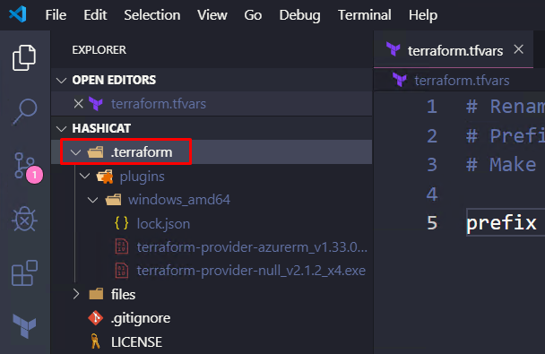]

Look in your file browser on the left side panel. You'll see a new directory called **`.terraform`**. Terraform stores its plugins and modules here.


---
name: tfe-terraform-apply
Run Terraform Apply
-------------------------
Run **`terraform apply -auto-approve`** in your terminal:

Command:
```powershell
terraform apply -auto-approve
```

Output:
```tex
azurerm_resource_group.myresourcegroup: Creating...
  location: "" => "centralus"
  name:     "" => "seanclab-workshop"
  tags.%:   "" => "<computed>"
azurerm_resource_group.myresourcegroup: Creation complete after 0s (ID: /subscriptions/14692f20-9428-451b-8298-...39c2a/resourceGroups/seanclab-workshop)
...

Outputs:
catapp_url = http://seanclab-meow.centralus.cloudapp.azure.com
```

???
**We've built some terraform here that you probably wouldn't use in the real world.  It's been customized so that you can finish a run in 15 seconds instead of five to ten minutes. Some of what we did here is a bit unorthodox, for the sake of speed.**

**Note**: There is a [known bug](https://github.com/hashicorp/terraform/issues/12596) with the null_provisioner that *may* cause your run to hang if you're using Terraform 0.11.x.

When this happens (terminal hangs for more than 30 seconds), have your student simply click on the little trash can icon in VSC, then reopen the terminal and run `terraform apply` again.  The problem should be gone, as the run did complete successfully.  

This issue appears to be fixed with Terraform 0.12

---
name: unleash-the-felis-catus
Kittens as a Service (KaaS)
-------------------------
.center[]
.center[Open your application in a web browser.]

???
**This application produces different images of cats, depending on the height and width variables.**

---
name: chapter-2-tfe-lab
.center[.lab-header[👩🏽‍🔬 Lab Exercise 2: Re-provision the App]]
<br><br><br>
The application has three variables that you can set to change the look and feel of your site.

They are **height**, **width**, and **placeholder**. 

Redeploy your app with a different height and width and reload the page.

If you need a refresher on variables visit the docs:

https://www.terraform.io/docs/configuration/variables.html#variables-on-the-command-line

HINT: Variables can be set in a config file or as command line flags.

---
name: chapter-2-tfe-lab-solution
.center[.lab-header[👩🏽‍🔬 Lab Exercise 2: Solution]]
<br><br><br>
Here's an example where we simply override variables on the command line:

Commands:
```powershell
terraform apply -var placeholder=www.fillmurray.com -var height=500 -var width=500
```

Try some different placeholder image sites. Here are some examples: [placedog.net](http://placedog.net), [placebear.com](http://placebear.com), [www.fillmurray.com](http://www.fillmurray.com), [www.placecage.com](http://www.placecage.com), [placebeard.it](http://placebeard.it), [loremflickr.com](http://loremflickr.com), [baconmockup.com](http://baconmockup.com), and [placeimg.com](http://placeimg.com).

???
Point out that we're doing some things here that you shouldn't do in production (like using null_resource for our provisioner.) You can also review the different ways to set variables:

https://www.terraform.io/docs/configuration/variables.html#variable-definition-precedence

It can be helpful to have your own lab workstation to demonstrate some of the solutions. You can flip back and forth between your lab workstation and the slide deck in full-screen mode.

---
name: tfe-chapter-2-review
📝 Chapter 2 Review
-------------------------
<br>
.contents[
In this chapter we:
* Forked the application repo
* Cloned the new git repo
* Deployed the Cat App into Azure Cloud
* Customized the application with variables
]

---
name: TFE-Chapter-3
class: center,middle
.section[
Chapter 3  
Terraform Enterprise and
Terraform Cloud
]

???
**In this chapter we'll sign up for a free Terraform Cloud account.**

---
name: tfe-terraform-cloud-enterprise
Terraform Cloud or Terraform Enterprise?
-------------------------
<br><br><br>
**[Terraform Cloud](https://app.terraform.io/signup)** is a hosted application that provides features like remote state management, API driven runs, policy management and more. Many users prefer a cloud based SaaS solution because they don't want to maintain the infrastructure to run it.

**[Terraform Enterprise](https://www.hashicorp.com/go/terraform-enterprise)** is the same application, but it runs in your cloud environment or data center. Some users require more control over the Terraform Enterprise application, or wish to run it in restricted networks behind corporate firewalls.

The feature list for these two offerings is nearly identical. We will be using Terraform Cloud accounts for our lab exercises today.*

???
**All the skills you learn today on our Terraform Cloud platform will translate directly to Terraform Enterprise because the feature set is the same.**

At the instructor's discretion, this course can also be taught with an on-prem Terraform Enterprise server. We highly recommend sticking to the cloud based training though, to avoid any blockers or issues in the enterprise...

---
name: tfe-terraform-cloud-signup
Sign Up for a Free Account
-------------------------
.center[]

.center[Visit the signup page for Terraform Cloud:]

.center[https://app.terraform.io/signup/account]

???
**Go ahead and sign up for a new account if you don't have one already. Once you've signed up wait for more instructions.**

**Instructor Note:** You'll want to gather a list of all your students TF cloud usernames. Make a spreadsheet or list on the whiteboard with their username, and the name of their sandbox organization. You'll be using both of these for lab setup.

---
name: tfe-create-an-org
Create an Organization
-------------------------
.center[]

Create a new organization for your own development work.

Your instructor will upgrade your organization to a trial which unlocks all the enterprise features.

Replace **yourname** with your own name please!

???
**Okay, now everybody should create a new sandbox organization. Write those down too so I can upgrade them to trial organizations. This will just take a moment.**

Instructors, have your students write their org names on a piece of paper or the whiteboard. You'll need to go into the admin console and upgrade them all to trial organizations.

---
name: tfe-chapter-3-review
📝 Chapter 3 Review
-------------------------
<br>
.contents[
In this chapter we:
* Looked at Terraform Enterprise and Terraform Cloud
* Signed up for a Terraform Cloud account
* Created a sandbox organization for our labs
]

???
Instructor, you should get a list of your users organizations and upgrade them to trial orgs.

---
name: TFE-Chapter-4
class: center,middle
.section[
Chapter 4  
Remote State
]

---
name: why-remote-state
Why Remote State?
-------------------------
<br>
```tex
  "primary": {
      "id": "/subscriptions/14692f20-9428-451b-8298-102ed4e39c2a/resourceGroups/seanclab-workshop/providers/Microsoft.Network/networkInterfaces/seanclab-catapp-nic",
      "attributes": {
          "applied_dns_servers.#": "0",
          "dns_servers.#": "0",
```


Terraform stores information about the resources it has built in a **state file**. This important file contains all of the data that terraform needs to change, update, and delete infrastructure. The local state file has some disadvantages:

* Sometimes contains secrets or sensitive data
* Can't collaborate because the file is on someone's laptop
* Risk of losing or deleting the state file
* No centralized record keeping

Let's migrate our local state file into Terraform Enterprise where it will be encrypted and protected from unauthorized access.

???
TODO: Maybe an image slide or more explanation about Remote State?

---
name: create-a-workspace-gui
Create a New Workspace
-------------------------
.center[]

You must create a workspace before migrating to remote state. You can skip the VCS step, because we aren't using our VCS system yet.

---
name: create-a-workspace-gui-2
Create a New Workspace
-------------------------
.center[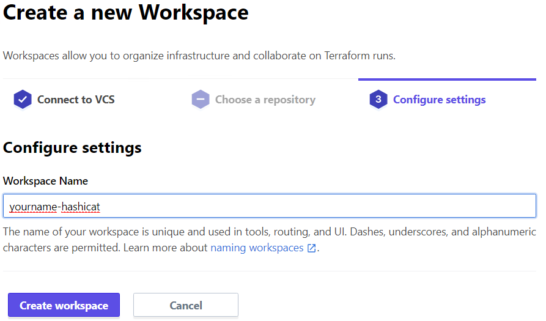]

Name your workspace **`yourname-hashicat`** and hit the **Create Workspace** button.

???
**Make sure you are in the shared workshop organization, not your personal sandbox org.**

---
name: change-to-local-exec
Change to Local Execution
-------------------------
.center[]

Go into the **General** settings for your workspace and change the execution mode to **Local**. Save your settings.

???
**This is important. All we want to do is store our state file remotely for now. Later on we'll learn about remote execution.**

---
name: tfcloud-remote-state
Terraform Remote State
-------------------------
Terraform Remote State requirements:

* Terraform Enterprise (or Cloud) account
* User access token stored in your config file
* A **.terraformrc** (Unix) or **terraform.rc** (Windows) file. Example:

```hcl
credentials "app.terraform.io" {
  token = "REPLACE_ME"
}
```
* Remote backend config file named **remote_backend.tf**. Example:

```hcl
terraform {
  backend "remote" {
    hostname = "app.terraform.io"
    organization = "ORGNAME"
    workspaces {
      name = "YOURWORKSPACE"
    }
  }
}
```

.center[We'll create these two files during the lab exercise.]

???
**You need two config files to get remote state working. First is your .terraformrc (or terraform.rc on Windows), and the second is a remote_backend.tf with the terraform block of code in it. The credentials file holds your token, while the config file tells terraform where to store your state file.  We'll be creating these two files in a moment.**

---
name: chapter-4-tfe-lab
.center[.lab-header[👩🏽‍🔬 Lab Exercise 4: Enable Remote State]]
<br><br>
In this lab exercise you will enable Terraform remote state on your workstation. There are three ingredients you'll need to make it work:

* A User Access Token for your config file
* A **terraform.rc** file located at `%APPDATA%\terraform.rc`
* A **remote_backend.tf** file in the hashicat-azure folder

Explore the Terraform Enterprise UI and find your user settings. From there, figure out how to generate a token.

Once you have a token, create your terraform.rc file. Here's an easy way to do that from your Powershell terminal:
```powershell
cd $env:APPDATA
code terraform.rc
```

Create a **remote_backend.tf** in the hashicat-azure folder.

Use the examples on the previous slide for reference.

???
%APPDATA% is a shortcut on Windows to your application data directory. You can also go directly to `C:\Users\hashicorp\AppData\Roaming`.

We've provided a sample remote_backend.tf file that you can use to get started. It's called remote_backend.tf.disabled.

---
name: chapter-4-tfe-lab-solution-1
.center[.lab-header[👩🏽‍🔬 Lab Exercise 4: Solution Part 1]]
* Create a **user token**: https://app.terraform.io/app/settings/tokens
* Edit your **`%APPDATA%\terraform.rc`** config file, replacing where it says REPLACE_ME with your token.

```powershell
code %APPDATA%/terraform.rc
```
```hcl
credentials "app.terraform.io" {
  token = "REPLACE_ME"
}
```

* Rename the **remote_backend.tf.disabled** file to **remote_backend.tf**. It should contain the following code. Replace ORGNAME and YOURWORKSPACE with your own settings.

```hcl
terraform {
  backend "remote" {
    hostname = "app.terraform.io"
    organization = "ORGNAME"
    workspaces {
      name = "YOURWORKSPACE"
    }
  }
}
```

---
name: chapter-4-tfe-lab-solution-2
.center[.lab-header[👩🏽‍🔬 Lab Exercise 4: Solution Part 2]]
<br><br>
Run a **`terraform init`** command to migrate to remote state.  You should see output similar to what's below. Answer **`yes`** to the confirmation prompt:

Command:
```powershell
cd ~/Desktop/hashicat-azure
terraform init
```

Output:
```tex
Initializing the backend...
Do you want to copy existing state to the new backend?
  Pre-existing state was found while migrating the previous "local" backend to the
  newly configured "remote" backend. No existing state was found in the newly
  configured "remote" backend. Do you want to copy this state to the new "remote"
  backend? Enter "yes" to copy and "no" to start with an empty state.

  Enter a value: yes

*Successfully configured the backend "remote"! Terraform will automatically
*use this backend unless the backend configuration changes.
```
???
Instructor note: You might want to walk through this with some or all of your students. Finding the right file path can be a little bit tricky on Windows machines.

---
name: chapter-4-tfe-lab-solution-3
.center[.lab-header[👩🏽‍🔬 Lab Exercise 4: Solution Part 3]]
<br><br>
Now when you run **`terraform apply`**, your state is automatically stored in your Terraform Enterprise/Cloud account.

.center[]

Enterprise users gain extra features like remote execution, secure variable storage, code reviews, and collaboration tools.

???
You might point out that we now offer free remote state to all users.

---
name: delete-state-file
Delete Your State File
-------------------------
<br><br><br>
**WARNING**: Make sure you have enabled remote state and confirmed that your state file is being stored in Terraform Enterprise.

Once you've confirmed that remote state is working, go ahead and delete the **terraform.tfstate** file from your local workspace directory.

Command:
```powershell
Remove-Item terraform.tfstate
```

You don't need to remove the backup copy of your state file.


???
**Now our state file is safely stored and encrypted in Terraform Enterprise. There's actually a small Vault instance running under the hood that handles all our encryption needs.**

---
name: tfe-chapter-4-review
📝 Chapter 4 Review
-------------------------
<br>
.contents[
In this chapter we:
* Learned about Remote State
* Generated a Terraform Enterprise Token
* Configured our terraform.rc file
* Enabled the remote state backend
* Migrated our state to TF Cloud
]

---
name: TFE-Chapter-5
class: center,middle
.section[
Chapter 5  
Protecting Sensitive Variables
]

---
name: where-are-your-creds
Where Are Your API Keys?
-------------------------
Terraform requires credentials in order to communicate with your cloud provider's API. These API keys should never, ever be stored directly in your terraform code. Config files and environment variables are a better option, but the credentials still live on your workstation, usually stored in plaintext.

Try this command on your workstation to see your API credentials:

Command:
```powershell
gci env:ARM*
```

Output:
```tex
Name                           Value
----                           -----
ARM_CLIENT_SECRET              3an0t438-63d8-ed89-225b-d0fv41ld70ab
ARM_SUBSCRIPTION_ID            14692f20-9428-451b-8298-102f4ke39c2a
ARM_TENANT_ID                  0e3e2e88-8caf-41ca-b4da-e3b33b6c52ec
ARM_CLIENT_ID                  91299f64-f951-4462-8e97-9efb1d215501
```

???
**Note how our API keys are just sitting there in plain text. This isn't the most secure way to build cloud resources.**

---
name: why-storing-creds-bad
Plain Text API Keys Are Dangerous!
-------------------------
.center[]

Sensitive credentials like Azure Service Principal API keys should always be protected. Storing admin-level credentials on employee laptops is a risky proposition. These credentials could accidentally be leaked or stolen. 

Instead of storing credentials locally you can encrypt them and store them safely in your Terraform Enterprise workspace. This feature is enabled when we turn on Remote Execution.

Remote execution runs in a secure container on the Terraform Enterprise server cluster. 

.tinytext[https://nakedsecurity.sophos.com/2019/03/25/thousands-of-coders-are-leaving-their-crown-jewels-exposed-on-github/]

???
**With Remote Execution enabled all terraform runs now happen on the TFE server inside of a secure container. Sensitive variables are provided to the container at runtime and never exposed in plain text.**

---
name: enable-remote-execution
Enable Remote Execution
-------------------------
<br><br>
.center[]

Before we migrate our sensitive API credentials into the application we need to enable remote execution. Under the **General** settings for your workspace, change the Execution Mode to **Remote**. Click the **Save Settings** button at the bottom of the page.

???
**When remote execution is enabled, all of your variables are stored in Terraform Enterprise, and the `terraform plan` and `terraform apply` commands now happen on the server instead of on your workstation. State is still stored remotely as before. Your command line simply becomes a tool for driving the remote execution.**

---
name: a-better-way-creds
A Better Way to Store Sensitive Data
-------------------------
.center[]

Terraform Enterprise can safely store your credentials and encrypt them for you. In the next lab we'll store your Azure credentials as sensitive TFE variables.

???
**This is our target state. When you are done all your credentials should be stored safely like this.**

---
name: chapter-5-tfe-lab
.center[.lab-header[👩🏻‍🏫 Lab Exercise 5a: Sensitive Variables]]
<br><br>
Create Terraform Enterprise **environment variables** for your Azure credentials. Make sure the `ARM_CLIENT_SECRET` is marked as **sensitive**. Here's the command to see your credentials:

Command:
```powershell
gci env:ARM*
```

Output:
```tex
Name                           Value
----                           -----
ARM_CLIENT_SECRET              3an0t438-63d8-ed89-225b-d0fv41ld70ab
ARM_SUBSCRIPTION_ID            14692f20-9428-451b-8298-102f4ke39c2a
ARM_TENANT_ID                  0e3e2e88-8caf-41ca-b4da-e3b33b6c52ec
ARM_CLIENT_ID                  91299f64-f951-4462-8e97-9efb1d215501
```

HINT: You'll need to find the **Environment Variables** section of your workspace settings.

---
name: chapter-5a-tfe-lab-solution
.center[.lab-header[👩🏻‍🏫 Lab Exercise 5a: Solution]]
<br><br>
.center[]
When you're done your **Environment Variables** section should look like this. Make sure you are not entering these as ordinary Terraform variables.

---
name: terraform-plan-remote
Run Terraform Plan
-------------------------
Run a **`terraform plan`** command and see what happens:

Command:
```powershell
terraform plan
```

Output:
```tex
Running plan in the remote backend. Output will stream here. Pressing Ctrl-C
will stop streaming the logs, but will not stop the plan running remotely.
Preparing the remote plan...
To view this run in a browser, visit:https://app.terraform.io/app/hashicorp-workshop/seanc-catapp/runs/run-f7oFdL4vyxC5L7Zg
Waiting for the plan to start...
...
*Error: Required variable not set: prefix
```

Looks like we need to set that prefix variable again. With remote execution *all* your variables and settings need to be stored in the app.

???
**You need to run at least one terraform apply on the command line to activate remote execution.  Don't jump to the GUI controls just yet...**

---
name: set-prefix-variable
Set Your Prefix Variable
-------------------------
.center[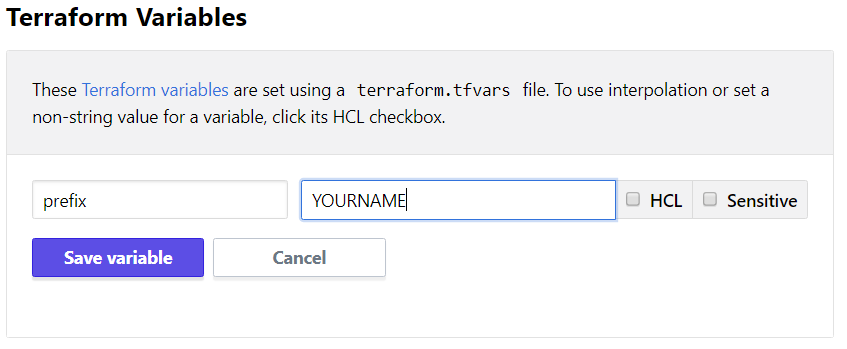]
Go back to the **Variables** settings again, this time create a regular Terraform variable called **prefix**. Replace YOURNAME with the prefix you stored in your terraform.tfvars file earlier.

???
**Note that this is a regular Terraform variable, not an environment variable. You can change any of the defaults found in variables.tf with these fields.**

---
name: terraform-apply-remote
Run Terraform Apply
-------------------------
Run **`terraform apply`**:

Command:
```powershell
terraform apply -auto-approve
```

Output:
```tex
Running apply in the remote backend. Output will stream here. Pressing Ctrl-C
will stop streaming the logs, but will not stop the plan running remotely.

Preparing the remote plan...

To view this run in a browser, visit:
https://app.terraform.io/app/hashicorp-workshop/seanc-catapp/runs/run-1F94Y1fTNsf8GhhH
```

Remote execution is now enabled. The results of your apply will still stream back into your console window, but Terraform is now running in the cloud. You can also watch the Terraform apply output in the GUI.

???
**Now you can run terraform either from the command line or from the GUI.**

---
name: chapter-5b-tfe-lab
.center[.lab-header[🖱️ Lab Exercise 5b: Terraform UI Runs]]
<br><br><br>
Configure three more variables in your workspace. These are the same **height**, **width**, and **placeholder** variables that we used before.

Now kick off a run in the using the **Queue Plan** button. Watch the results of your run in the UI.

---
name: chapter-5b-tfe-lab-solution
.center[.lab-header[🖱️ Lab Exercise 5b: Solution]]
<br><br>
.center[]
The local variables on your workstation are no longer used. Variables are now all stored in your workspace.

---
name: enable-workspace-destroy
Appetite for Destruction
-------------------------
For the next lab we'll need to destroy and recreate your lab environment. Terraform Enterprise requires a special environment variable to enable destruction of infrastructure.

.center[]

Create a new Environment Variable named **`CONFIRM_DESTROY`** and set the value to **`1`**.

???
**This is a safety switch, it's there to prevent us from shooting ourselves in the foot and deleting production.**

---
name: destroy-your-application
Destroy Your Application
-------------------------
Either from the command line, or the GUI, destroy your web application. We're going to rebuild it from our code repo in the next chapter.

Command Line:
```powershell
terraform destroy -auto-approve
```

GUI:
.center[]

Do not click the red Destroy from Terraform Enterprise button. This will delete your entire workspace. Remember to confirm the destroy action from within the UI.


---
name: remove-dot-terraform
Delete your Dot Terraform Directory
-------------------------
<br><br>
Let's remove the **`.terraform`** directory as well.

Command:
```powershell
cd ~/Desktop/hashicat-azure
Remove-Item -Recurse .terraform
```

You should no longer have a .terraform directory in the hashicat-azure repo.


---
name: delete-from-TFE
Delete Your Workspace from TFE
-------------------------
Now that all our infrastructure has been destroyed, we can delete our workspace.

.center[]

Click the red button and then type the name of your workspace to confirm.

???
Instructor - go to the main page of your organization and make sure there are *no* workspaces left there.

---
name: tfe-chapter-5-review
📝 Chapter 5 Review
-------------------------
.contents[
In this chapter we:
* Viewed our Azure Credentials
* Enabled Remote Execution
* Moved our Azure Creds to TF Cloud
* Created a prefix variable
* Ran Terraform Apply from the GUI
* Destroyed our application
* Deleted our workspace
]

---
name: TFE-chapter-6
class: center,middle
.section[
Chapter 6  
Version Control Systems and Terraform
]

---
name: whats-a-vcs
What is a Version Control System (VCS)?
-------------------------
.center[]
Version control systems are applications that allow users to store, track, test, and collaborate on changes to their infrastructure and applications. Terraform Enterprise integrates with most common Version Control Systems.

---
name: tfe-infra-as-code-workflow
Infrastructure as Code
-------------------------
<br><br>
Terraform Enterprise can directly integrate with source code repos in Github Enteprise, Gitlab, and Bitbucket. This allows you to build simple devops workflows with code reviews, testing and approvals.

Until now all our code changes have been done on our workstation. Let's upgrade our workspace to use the repository fork we created earlier. 

???
TODO: Add an image to this slide.

---
name: chapter-6a-tfe-lab
.center[.lab-header[👩🏼‍🔧 Lab Exercise 6a: Integrate with Github]]
<br><br>
.center[]
During this lab you'll follow the instructions on the Terraform docs site for connecting to Github. Visit the link below and carefully follow the instructions to integrate your Terraform Enterprise organization with your Github account.

.center[https://www.terraform.io/docs/enterprise/vcs/github.html]

---
name: chapter-6a-tfe-lab-solution
.center[.lab-header[👩🏼‍🔧 Lab Exercise 6a: Solution]]
<br><br>
.center[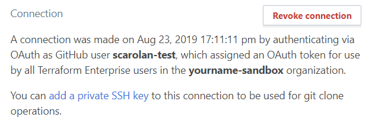]
If you successfully connected your Terraform Enterprise organization to Github, you'll see the above text in the VCS Providers section of your organization settings. 

Congratulations, you can now create repo-backed Terraform workspaces.

You do *not* need to configure a private SSH key for the rest of the labs.

---
name: create-new-workspace
Create a New Workspace
-------------------------
.center[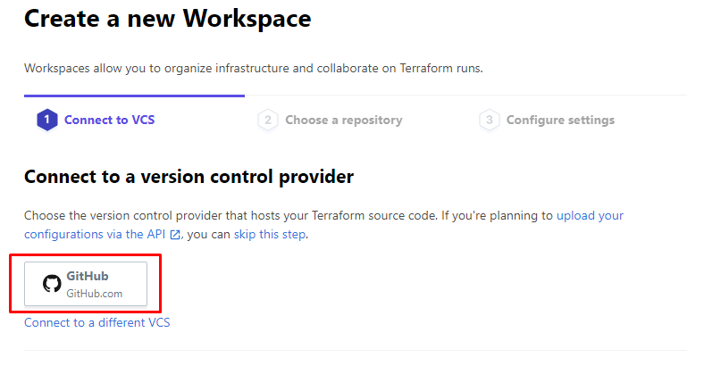]
Create a new workspace. Select the GitHub button to connect to your VCS.

---
name: create-new-workspace-2
Create a New Workspace
-------------------------
.center[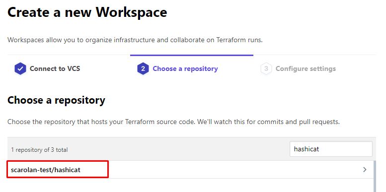]
Select the hashicat-azure repo that you forked earlier. You can filter the available repos with the text box in the upper right corner.

---
name: create-new-workspace-3
Create a New Workspace
-------------------------
.center[]
When you reach the Configure Settings tab you can simply click the **Create Workspace** button. You do not need to change any of the advanced options.

---
name: update-remote-backend
Update the Remote Backend
-------------------------
<br><br>
Update your **remote_backend.tf** file so that the workspace name and organization match your new settings:

```hcl
terraform {
  backend "remote" {
    hostname = "app.terraform.io"
    organization = "yourname-sandbox"
    workspaces {
      name = "hashicat-azure"
    }
  }
}
```
Note that the workspace name is now **hashicat-azure**. This is fine.

Save the **remote_backend.tf** file.

???
**Since we are all in different organizations now, we can all have the same workspace name.**

---
name: migrate-remote-backend
Migrate the State
-------------------------
Command:
```powershell
terraform init
```

Output:
```tex
Terraform has detected that the configuration specified for the backend
has changed. Terraform will now check for existing state in the backends.

...

*Successfully configured the backend "remote"! Terraform will automatically
*use this backend unless the backend configuration changes.
```

???
We're recreating our workspace from VCS, in our new organization.

---
name: switch-to-git-bash
Switch to Git Bash
-------------------------
<br>
For the next lab we're going to change our local shell to Git Bash.

Click on the pulldown menu at the top of your terminal where it says:

**`1: powershell`**

Click on **Select Default Shell**.

.center[]

---
name: switch-to-git-bash
Switch to Git Bash
-------------------------
.center[]

Change your default shell to Git Bash and launch a new Terminal window. The rest of the training commands will be run inside this shell. Note that your file paths look different under Git Bash:

Command:
```bash
pwd
```

Output:
```bash
/c/Users/hashicorp/Desktop/hashicat-azure
```

???
Terraform is a multi-platform tool and can be run on Mac or Windows, Bash or Powershell.

---
name: install-terraform-helper-0
Install the Terraform Helper Tool
-------------------------
Terraform Helper is a command line tool that makes it easier to manage Terraform Enterprise workspaces and variables. The source code can be found at the following URL:

https://github.com/hashicorp-community/tf-helper

**Step 1**: Run the **`install_tfh.sh`** script inside of the **hashicat-azure/files** directory. You may simply copy and paste the commands below:

```bash
cd ~/Desktop/hashicat-azure/files
./install_tfh.sh
source ~/.bash_profile
```

**Step 2**: Configure the required environment variables. _Replace with your own organization and workspace._

```bash
export TFH_org=ORGNAME
export TFH_name=WORKSPACENAME
```

_Instructions continue on the next slide..._

---
name: install-terraform-helper-1
Install the Terraform Helper Tool
-------------------------
**Step 3**: Auto-generate your curlrc file with the curl-config helper subcommand:

Command:
```bash
tfh curl-config -tfrc
```

Output:
```bash
/c/Users/hashicorp/.tfh/curlrc generated from /c/Users/hashicorp/.terraformrc
```

Now you are ready to use the **`tfh`** command line tool. Proceed to the next slide.

---
name: chapter-6b-tfe-lab
.center[.lab-header[⚗️ Lab Exercise 6b: Upload Variables]]
<br><br>
You'll need to recreate the environment variables and terraform variables in your workspace. This is fairly easy to do with the Terraform Helper tool. Run the following command, and _don't forget to change **yourprefix** to your own prefix_. The rest of the command can remain the same.

Command:
```bash
tfh pushvars -overwrite-all -dry-run false \
-senv-var "ARM_CLIENT_SECRET=$ARM_CLIENT_SECRET" \
-env-var "ARM_TENANT_ID=$ARM_TENANT_ID" \
-env-var "ARM_SUBSCRIPTION_ID=$ARM_SUBSCRIPTION_ID" \
-env-var "ARM_CLIENT_ID=$ARM_CLIENT_ID" \
-var "prefix=yourprefix"
```

Output:
```tex
Updating prefix type:terraform hcl:false sensitive:false value:hashicat-azure
Updating ARM_TENANT_ID type:env hcl:false sensitive:false value:0e3e2e88-8caf-41ca-b4da-e3b33b6c52ec
Updating ARM_SUBSCRIPTION_ID type:env hcl:false sensitive:false value:14692f20-9428-451b-8298-102ed4e39c2a
Updating ARM_CLIENT_ID type:env hcl:false sensitive:false value:91299f64-f951-4462-8e97-9efb1d215501
Updating ARM_CLIENT_SECRET type:env hcl:false sensitive:true value:REDACTED
```

???
Instructors: You must have the jq tool installed on your workstation to use the tfh tool.

---
name: chapter-6b-tfe-lab-solution
.center[.lab-header[⚗️ Lab Exercise 6b: Solution]]
<br><br>
.center[]
You should now see all your variables stored safely in the Terraform Enterprise console.

---
name: chapter-6c-tfe-lab-part-3
.center[.lab-header[🐱 Lab 6c: Add More Variables]]
<br><br><br>
**Extra Credit Lab:**

See if you can add your **height**, **width**, and **placeholder** variables to your workspace by editing the command we ran in on the last slide.

Read up on the **`-overwrite-all`** and **`-dry-run`** flags in the [TF Helper docs](https://github.com/hashicorp-community/tf-helper/blob/master/tfh/usr/share/doc/tfh/tfh_pushvars.md).

---
name: chapter-6c-tfe-lab-solution
.center[.lab-header[🐱 Lab 6c: Solution]]
<br><br><br>
Simply add more **`-var`** flags at the end of the command to update your variables.

Command:
```bash
tfh pushvars -overwrite-all -dry-run false \
-senv-var "ARM_CLIENT_SECRET=$ARM_CLIENT_SECRET" \
-env-var "ARM_TENANT_ID=$ARM_TENANT_ID" \
-env-var "ARM_SUBSCRIPTION_ID=$ARM_SUBSCRIPTION_ID" \
-env-var "ARM_CLIENT_ID=$ARM_CLIENT_ID" \
-var "prefix=yourprefix" -var "height=600" -var "width=800" \
-var "placeholder=www.fillmurray.com"
```

NOTE: The **`\`** characters indicate that the command should continue on the next line. This entire block of text should be copied and pasted into the terminal all at once.

---
name: run-terraform-apply-vcs
Run Terraform Apply
-------------------------
Command:
```bash
cd ~/Desktop/hashicat-azure
terraform apply -auto-approve
```

Output:
```tex
Error: Apply not allowed for workspaces with a VCS connection

A workspace that is connected to a VCS requires the VCS-driven workflow to
ensure that the VCS remains the single source of truth.
```

Now that we have migrated to a VCS-backed configuration, the **`terraform apply`** command no longer works. This is to ensure that the VCS is the single source of truth, and that all changes to your infrastructure must be recorded and approved.

You may still trigger runs on-demand via the GUI or API.

???

---
name: enable-auto-apply
Enable Auto Apply
-------------------------
<br><br>
.center[]
In some environments you may wish to enable auto apply.

This means that TFE will automatically apply changes when a plan is successful. Any push to the default branch of the source code repo will trigger a **plan** and **apply**.

Enable auto apply on your workspace now.

---
name: configure-git-bash
Configure Git Identity
-------------------------
<br><br><br>
Before you can push changes to your fork of the hashicat -azure repo, you'll need to configure your email and username settings. Run the commands below with your own email address and name:

Commands:
```bash
git config --global user.email "ada@example.com"
git config --global user.name "Ada Lovelace"
```

---
name: chapter-6d-tfe-lab
.center[.lab-header[💾 Lab Exercise 6d: Push Change to VCS]]
<br><br>
Your boss has asked you to update the content on the website. Edit the **files/deploy_app.sh** script and add your own content between the BEGIN and END tags.

```html
  <!-- BEGIN -->
  <center></img></center>
  <center><h2>Meow World!</h2></center>
  Welcome to ${PREFIX}'s app. Replace this text with your own. 
  <!-- END -->
```

When you are done editing the file save it and push the change to your remote repo. You can do this on the command line or via the VCS Branch button in Visual Studio Code. 

**Note:** You'll need to trigger the first run via the UI. Subsequent runs will trigger for every git merge to the master branch.

???
Instructor Note: You may need to trigger a new Terraform run from the UI. This may no longer be an issue?

---
name: chapter-6d-tfe-lab-solution-1
.center[.lab-header[💾 Lab Exercise 6d: Solution Part 1]]
<br>
You can click the source code button on the left side of VSC, enter a comment, commit your changes, then push them to the remote repo. You will be prompted on whether you wish to **stage** your changes first. This is part of the git workflow.

.center[]

Or via the command line:

```bash
git add .
git commit -m "Updated website."
git push origin master
```

???
Instructors:  Depending upon your students' familiarity with git, you may need to review some basic git commands here like `git add`, `git commit`, and `git push`.

---
name: chapter-6d-tfe-lab-solution-2
.center[.lab-header[💾 Lab Exercise 6d: Solution Part 2]]
<br>
.center[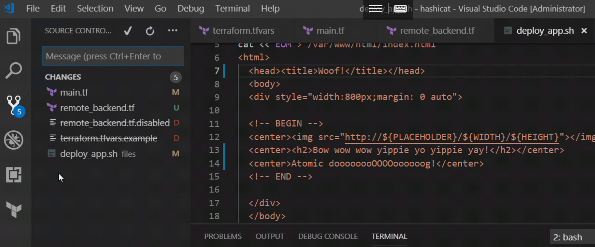]
 Most git commands can be run from the VSC menu. Click the branch icon and then click on the triple dot menu.

.center[]
You can see which git commit triggered the run in the Terraform Enterprise UI.

???
TODO: Add another lab exercise in here, give the students more experience with VCS-driven runs.

---
name: destroy-your-application
Destroy Your Application
-------------------------
Either from the command line, or the GUI, destroy your web application. We're going to rebuild it from our code repo in the next chapter.

Command Line:
```powershell
terraform destroy -auto-approve
```

GUI:
.center[]

Do not click the red Destroy from Terraform Enterprise button. This will delete your entire workspace. Remember to confirm the destroy action from within the UI.

---
name: tfe-chapter-6-review
📝 Chapter 6 Review
-------------------------
.contents[
In this chapter we:
* Connected our Organization to VCS
* Created a New Workspace
* Migrated Terraform State
* Installed the TFH Tool
* Uploaded Environment Variables
* Re-Deployed our Application from VCS
]

---
name: TFE-chapter-7
class: center,middle
.section[
Chapter 7   
Sentinel Policy Enforcement
]

---
name: what-is-sentinel
What is Sentinel?
-------------------------
```hcl
# Restricting region in AWS
aws_region_valid = rule {
  all region_values as rv {
	rv == "us-east-1"
  }
}
# Restricting machine types in GCP
allowed_machine_types = [
  "n1-standard-1",
  "n1-standard-2",
  "n1-standard-4",
]
# Restricting publisher in Azure
allowed_publishers = [
  "MicrosoftWindowsServer",
  "RedHat",
]
```

Sentinel is HashiCorp's policy enforcement language. Sentinel policies are checked after **`terraform plan`** is run. Sentinel will intercept bad configurations *before* they go to production, not after. 

Sentinel rules help enforce compliance and security requirements in the cloud. Sentinel is a feature of Terraform Enterprise.

???
**Think of all the dos and do-nots that you want to enforce in your cloud environments. Maybe you want to limit the sizes of virtual machines, or to force web applications to always use SSL. Sentinel rules can be customized for most common security and compliance requirements.**

Talk about Sentinel and some other things you can do with it.

---
name: policy-as-code
HashiCorp Sentinel - Policy As Code
-------------------------
<br>
```hcl
allowed_machine_types = [
  "n1-standard-1",
  "n1-standard-2",
  "n1-standard-4",
]
```

With programmatic policy as code, custom governance can be enforced at the same rate as infrastructure is provisioned.  
* Codifying policies automates guardrails around provisioning 
* Policy checks built into the provisioning workflow
* Use policy to enforce best-practices, security measures, or compliance  


Here are some example policies:
https://www.terraform.io/docs/cloud/sentinel/examples.html 

---
name: enable-sentinel-for-org
🤖 Enable Sentinel in Your Org
-------------------------
<br><br>
Let's implement a simple Sentinel policy Set for our organization. This will ensure that newly created workspaces will be compliant with our security policies.

We'll tackle this in two steps:

1. Fork a repo that contains a Sentinel Policy Set
2. Add the policy set from our new repo

---
name: fork-sentinel-repo
Fork the Sentinel Repo
-------------------------
.center[]

Visit this URL in your web browser:

https://github.com/scarolan/tfe-workshop-sentinel

Use the 'Fork' button in the upper right corner to create your own copy of the repo.

---
name: create-policy-set-1
Create a Policy Set
-------------------------
.center[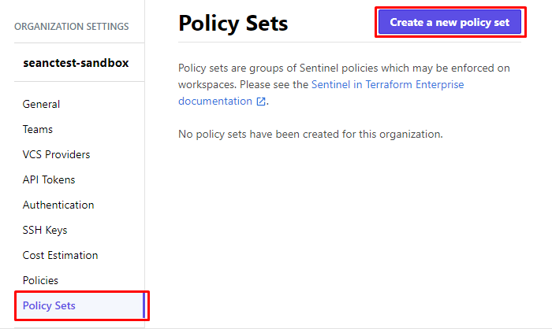]
Back in TFE, under your Organization Settings, click on **Policy Sets** and then **Create a New Policy Set**.

---
name: create-policy-set-2
Select the Sentinel Repo
-------------------------
.center[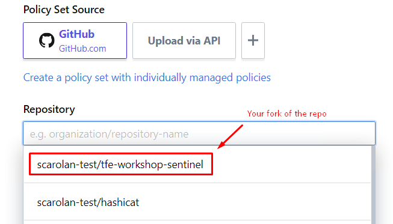]
Scroll down a bit to the **Repository** box. If you click on it you'll get a pulldown menu of available git repos. Select your fork of the tfe-workshop-sentinel repo.

---
name: create-policy-set-3
Select the Sentinel Repo
-------------------------
.center[]
Scroll down some more and click on the **Create Policy Set** button at the bottom. You can leave everything else with the default settings.

---
name: create-policy-set-4
Confirm Your Work
-------------------------
.center[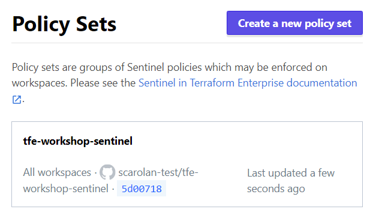]
You should now see a new policy set in the UI, along with the latest commit hash for the repository. Congratulations, you've configured policy enforcement as code!

---
name: instructor-enable-sentinel
.center[🤖 Sentinel Policy Enforcement 🤖 
-------------------------]
<br><br>
.center[]

You have now enabled Sentinel policy enforcement across the entire organization.  

A robot stands guard between your Terraform code and the Azure APIs.  

Are you ready for the next lab?

???
**Instructor Note:** Make sure everybody's workspace is done destroying before they proceed.

---
name: chapter-7-tfe-lab
.center[.lab-header[👮🏿‍♀️ Lab Exercise 7: Secure the App]]
<br><br>
The security team has a new requirement: All Azure VMs must be tagged with an **environment** tag. We have implemented a policy that disallows building any VMs that do not have this tag.

Figure out how to edit your Terraform code to add a tag to your virtual machine. The name of the tag should be **environment** and the value should be **production**.

When you are done you should see the failed enforce-mandatory-tags pass:

.center[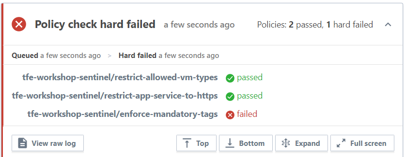]

???
Instructor Note: walk around and check on your students as they work through the lab.

---
name: chapter-7-tfe-lab-solution
.center[.lab-header[👮🏿‍♀️ Lab Exercise 7: Solution]]
<br><br>
Our new Sentinel policy looks through the Terraform plan output and searches for any VMs that do not have an environment tag. You can fix this by adding a tag block to your virtual machine, and then running **`terraform apply`**.

Note - this is *inside* the Virtual Machine block. It doesn't matter where you put it as long as it is nested in the azurerm_virtual_machine resource. Remember, you still need to commit your code to your VCS repo to trigger the change.

Solution:
```hcl
tags = {
  environment = "production"
}
```

Reference:  
https://www.terraform.io/docs/providers/azurerm/r/virtual_machine.html

???
Instructor Note: Review the basic git commands here if needbe:

```bash
git add .
git commit -m "Add tag to VM."
git push origin master
```

---
name: tfe-chapter-7-review
📝 Chapter 7 Review
-------------------------
<br>
.contents[
In this chapter we:
* Learned about HashiCorp Sentinel
* Created a Policy Set Repo
* Enabled a Sentinel Policy Set
* Watched our Terraform Code Fail
* Fixed the Code to Pass Sentinel Tests
]

---
name: TFE-Chapter-8
class: center,middle
.section[
Chapter 8  
VCS Collaboration for Teams
]

---
name: vcs-driven-workflow
Collaboration With VCS
-------------------------
.center[]

When your Terraform code is stored in a version control system, you unlock extra features like pull requests, code reviews and testing. Here's an example showing the tests that run on our training lab repo.

You can configure rules like requiring tests to pass, code reviews, approvals and more. Let's do a code collaboration exercise.

---
name: chapter-8a-tfe-lab
.center[.lab-header[👫 Lab Exercise 8a: VCS Collaboration]]
<br>
One of your team members needs to make a change to your shared dev environment. Break into pairs and exchange the URLs of your hashicat-azure repo forks. Take turns doing the steps below:

**Partner 1:**
1. Navigate to your partner's git repo URL.
2. Click on the **`files/`** directory then click on **`deploy_app.sh`**.
3. Click on the pencil ✏️ icon on the upper right side of the page.
4. Make some edits to your partner's webapp code.
5. Submit a pull request.

**Partner 2:**
1. Log onto github and view your new pull request.
2. Post a comment about the proposed changes.
3. Merge the pull request to the master branch.
4. Pull up the Terraform Enterprise UI and observe the git-triggered run.
5. Check your webapp and see the changes you approved.

Exchange roles and repeat the lab exercise.

---
name: chapter-8a-tfe-lab-solution
.center[.lab-header[👬 Lab Exercise 8a: Solution]]
<br>
.center[]

You can enable different pre-merge checks and options in your git repo settings. Explore the **Settings** >> **Branches** menu to learn more about Branch Protection Rules.

???
**In the real world we might run a bunch of automated tests, and require one or more approvers to do a code review before any changes are merged.**

---
name: tfe-chapter-8-review
📝 Chapter 8 Review
-------------------------
.contents[
In this chapter we:
* Edited a file on our partner's repo
* Created a fork and submitted a pull request
* Reviewed and discussed the pull request
* Merged changes into the code repo
* Triggered a Terraform run from a git merge
]

---
name: TFE-Chapter-9
class: center,middle
.section[
Chapter 9  
Access Controls
]

---
name: terraform-rbac
Role Based Access Controls (RBAC)
-------------------------
.center[]

In the previous chapter we made a change by merging a code change into the source code repo. Your users can also collaborate within the Terraform UI. 

Terraform Enterprise is a multi-tenanted application that supports fine-grained access controls. You can create multiple organizations, each containing its own teams and users.

???
TODO: Find a better image for this slide.

---
name: chapter-9a-tfe-lab
.center[.lab-header[👭 Lab Exercise 9a: Share the Sandbox]]
<br><br>
This is another partner exercise. In this lab you'll invite your partner to your organization.

**Partner 1**:
1. Go into your organization's team settings and create a new team called **developers**. 
2. Visit your workspace's **Team Access** menu and grant **write** access to your developers team.
3. Invite your partner to your organization's **developers** team.

**Partner 2**:
Verify that you are able to see your partner's organization and workspace.

Trade roles and repeat the lab exercise.

---
name: chapter-9a-tfe-lab-solution
.center[.lab-header[👭 Lab Exercise 9a: Solution]]
<br><br>
.center[]
Users can be members of multiple organizations, and multiple teams within each organization. Teams are granted different levels of access to workspaces within the organization depending on their role.

You can learn more about workspace permissions on the [Terraform Enterprise Docs](https://www.terraform.io/docs/enterprise/users-teams-organizations/permissions.html)

???
TODO: Put a better image on this slide.

---
name: chapter-9b-tfe-lab
.center[.lab-header[🔒 Lab Exercise 9b: RBAC Controls]]
<br><br><br>
One of your team members needs a larger virtual machine size for load testing. This is another partner exercise.

**Partner 1**:
In Partner 2's workspace, create a new variable called **vm_size** and set it to **Standard_A1_v2**. Click on the **Queue Plan** button to trigger a new terraform plan. What happens? Are you able to override the Sentinel failure and continue?

**Partner 2**:
Log onto your workspace and navigate to the current run. Have a discussion with Partner 1 about why they need a larger VM. Agree upon a solution and redeploy the application.

Exchange roles and repeat the lab exercise.

---
name: chapter-9b-tfe-lab-solution
.center[.lab-header[🔒 Lab Exercise 9b: Solution]]
<br><br>
.center[]
One of the Sentinel policies we enabled checks any Azure Virtual Machines that appear in the plan, and looks at the configured vm_size. This is compared to the list of approved types which includes only **Standard_A0** and **Standard_A1**. Anything outside of these two approved sizes of VM will be flagged by Sentinel.

There's no single correct answer to this lab. You may decide that partner 1 doesn't need such a large VM for their development work. Or partner 2 might grant an exception and use their admin powers to override the Sentinel failure. Or perhaps the new VM size could be added to the Sentinel rule to allow it as a new option.

---
name: reset-environment
Reset the Lab Environment
-------------------------
Before the next chapter we need to make some simple modifications to our **main.tf** and **outputs.tf** files. 

In **main.tf** delete everything below the first resource in the file:

```hcl
resource "azurerm_resource_group" "myresourcegroup" {
  name     = "${var.prefix}-workshop"
  location = "${var.location}"
}

# EVERYTHING BELOW HERE GETS DELETED
# resource "azurerm_virtual_network" "vnet" {
#   name                = "${var.prefix}-vnet"
```

Delete your entire **outputs.tf** file too. We don't need it anymore.

Save your changes, commit them to git, and push to your remote repository. This will reset your environment to an empty resource group.

---
name: reset-environment
Reset the Lab Environment - Continued
-------------------------
<br><br><br>Here are the git commands you'll need to run to reset your lab:

```bash
cd ~/Desktop/hashicat-azure
git pull
git add .
git commit -m "Reset lab."
git push origin master
```

NOTE: You'll need to do a **`git pull`** first to fetch the changes your partner made in the last exercise.

In the next chapter we'll deploy a containerized application instead of a VM.

---
name: tfe-chapter-9-review
📝 Chapter 9 Review
-------------------------
<br>
.contents[
In this chapter we:
* Created a new team for developers
* Granted devs write access to our workspace
* Added our partner to the devs team
* Tested our Sentinel policy
* Collaborated on an infrastructure change
]

---
name: TFE-Chapter-10
class: center,middle
.section[
Chapter 10  
Private Module Registry
]

---
name: private-module-registry
TFE Private Module Registry
-------------------------
.center[]

Terraform modules are reusable packages of Terraform code that you can use to build your infrastructure. Terraform Enterprise includes a Private Module Registry where you can store, version, and distribute modules to your organizations and teams.

---
name: chapter-10a-tfe-lab
.center[.lab-header[📚 Lab Exercise 10a: Install a Module]]
<br><br><br>
This is an individual lab. 

1. Visit the Terraform public module registry and navigate to the [Web App Container Module](https://registry.terraform.io/modules/innovationnorway/web-app-container/azurerm).
2. Find the github source code link on the page and click on it.
3. Fork the module repo into your own github account.
4. Back in your TFE organization, navigate to the **modules** section and add the Azure Compute module to your private registry.

???
Updated to deploy an arcade game in a container.

---
name: chapter-10a-tfe-lab-solution
.center[.lab-header[📚 Lab Exercise 10a: Solution]]
<br><br>
.center[]
If you have a valid VCS connection, the private module registry can find any git repositories that you have access to. These module repos can be imported into Terraform Enterprise, where your users can easily access them.

---
name: use-a-module
Use the Compute Module
-------------------------
Add the following code to your main.tf file, right below the resource group. Be sure to replace **`YOURORGNAME`** with your own organization name.

```terraform
module "web_app_container" {
* source              = "app.terraform.io/YOURORGNAME/web-app-container/azurerm"
  name                = "${var.prefix}"
  port                = "80"
  https_only          = "false"
  resource_group_name = "${azurerm_resource_group.myresourcegroup.name}"
  container_type      = "docker"
  container_image     = "scarolan/palacearcade"
}

output "container_app_url" {
  value = "http://${module.web_app_container.hostname}"
}
```

Commit your code and push your changes to the remote repo. This will trigger a terraform run. You should have a new application URL in the output:

```hcl
container_app_url = http://yourprefix.azurewebsites.net
```

???
At this point they should have the hang of this:

```bash
git add .
git commit -m "Deploy container."
git push origin master
```


---
name: shall-we-play-a-game
.center[🕹️ Shall We Play a Game? 👾
-------------------------]

.center[]

.center[**Congratulations! You made it to the end of the workshop.**]

???
The arcade games aren't playable from your cloud workstation. You need to open the URL on your laptop for them to load properly.

---
name: tfe-chapter-10-review
📝 Chapter 10 Review
-------------------------
<br>
.contents[
In this chapter we:
* Explored the public module registry
* Forked the container webapp module
* Added the module into our registry
* Used the module in our terraform code
* Pushed a change to the master branch
* Deployed a container application
]

---
name: before-you-go
Before You Go...
-------------------------
Please run **`terraform destroy`** command to delete your lab environment(s) before you go. This helps us keep our cloud costs under control.

Command:
```powershell
terraform destroy
```

Output:
```tex
Do you really want to destroy all resources?
  Terraform will destroy all your managed infrastructure, as shown above.
  There is no undo. Only 'yes' will be accepted to confirm.

  Enter a value: yes

Destroy complete! Resources: 15 destroyed.
```

---
name: Feedback-Survey
Workshop Feedback Survey
=========================
<br><br>
.center[
Your feedback is important to us! 

The survey is short, we promise:

http://bit.ly/hashiworkshopfeedback
=========================
]

---
name: additional-resources-tfe
Additional Resources
-------------------------
If you'd like to learn more about Terraform Enterprise visit the links below:

Terraform Enterprise Product Page
https://www.hashicorp.com/products/terraform/

Why Consider Terraform Enterprise Over Open Source?
https://www.hashicorp.com/resources/why-consider-terraform-enterprise-over-open-source

Terraform Enterprise Docs
https://www.terraform.io/docs/enterprise/index.html

Terraform Azurerm Provider Documentation  
https://www.terraform.io/docs/providers/azurerm/

Link to this Slide Deck  
https://bit.ly/hashiazure

---
name: TFE-Chapter-11
class: center,middle
.section[
⚔️   ~Chapter 11~   🐲   
The Gauntlet
]

---
name: chapter-11-tfe-lab-0
.center[.lab-header[🏆 Lab Exercise 11: The Gauntlet]]
<br>
This challenging lab brings together everything you learned in previous chapters. Each partner should complete the setup, then your instructor will start the clock for **The Gauntlet**.

**Setup Part 1: Create a UAT Branch**
1. Go into your fork of the hashicat-azure repo and create a new branch called **`uat`**:
.center[]
2. Click on the **Settings** menu then click on **Collaborators**. Add your partner's github username and click **Add Collaborator**.
3. Share the invite link with your partner. Accept your partner's invite link to join their repository as a collaborator.

.center[_Setup instructions continue on the next slide..._]

---
name: chapter-11-tfe-lab-1
.center[.lab-header[💎 Lab Exercise 11: The Gauntlet]]
<br>
**Setup Part 2: Enforce HTTPS Only Sentinel Policy**
1. Go into your fork of the tfe-sentinel-policy repo. You can do this in the github.com UI.
2. Browse to the **`sentinel.hcl`** file and click the pencil icon to edit it.
3. Change line 6 where it says **advisory** to **hard-mandatory**.

```hcl
policy "restrict-app-service-to-https" {
    enforcement_level = "hard-mandatory"
}
```

.center[_Setup instructions continue on the next slide..._]

---
name: chapter-11-tfe-lab-2
.center[.lab-header[🧙🏾‍♂️ Lab Exercise 11: The Gauntlet]]
<br>
**Setup Part 3: Protect the Master (production) Branch**

.center[]

1. Click on the **Branches** menu and click on the  **Add Rule** button.  
2. Type **master** into the **Branch name pattern** field.  
3. Check the following boxes:
```
☑️ Require pull request reviews before merging  
☑️ Require status checks to pass before merging  
 -  ☑️ sentinel/yourorghere/yourworkspacehere  
 -  ☑️ atlas/yourorghere/yourworkspacehere  
```
4. Click the **Create** button at the bottom of the page.  

---
name: chapter-11-tfe-lab-3
.center[.lab-header[🧝‍♀️ Lab Exercise 11: The Gauntlet]]
<br>
**Setup Part 4: Set Up UAT and Production**

1. Back in the TFE console, create a new workspace called **webapp-uat** and connect it to the **uat** branch of your repo.  
2. Use the tfh tool to upload all your variables into the new workspace.  **Pick a new prefix for UAT!**
```bash
export TFH_name=webapp-uat
tfh pushvars -overwrite-all -dry-run false \
-senv-var "ARM_CLIENT_SECRET=$ARM_CLIENT_SECRET" \
-env-var "ARM_TENANT_ID=$ARM_TENANT_ID" \
-env-var "ARM_SUBSCRIPTION_ID=$ARM_SUBSCRIPTION_ID" \
-env-var "ARM_CLIENT_ID=$ARM_CLIENT_ID" \
-var "prefix=yourprefix"
```
3. In Visual Studio Code clone a copy of your **partner's** repository:
```bash
cd Desktop
git clone https://github.com/mypartner/hashicat-azure uat-webapp
cd uat-webapp
git checkout uat
code -r .
```

---
name: chapter-11-tfe-lab-4
.center[.lab-header[💰 Lab Exercise 11: The Gauntlet]]
<br>
You are now ready to run **The Gauntlet**. 

**The Scenario**: You are a sysadmin at the Palace Arcade. The company has just been acquired by larger rival Pizza Planet. Pizza Planet management has asked your team to update the website to match the new company brand and logo. Pizza Planet's security team also requires that all public-facing websites run only in SSL (https only) mode.

**Your Mission**: Update the content of the website in UAT, make sure all Sentinel tests pass, and then submit a pull request to get your changes into production.

Change the **`container_image`** parameter in your Terraform code to **`scarolan/pizzaplanet`**.

Your instructor will start the timer once everyone is ready. How fast can you get through **The Gauntlet**?

---
name: before-you-go
Before You Go...
-------------------------
Please run **`terraform destroy`** command to delete your lab environment(s) before you go. This helps us keep our cloud costs under control.

Command:
```powershell
terraform destroy
```

Output:
```tex
Do you really want to destroy all resources?
  Terraform will destroy all your managed infrastructure, as shown above.
  There is no undo. Only 'yes' will be accepted to confirm.

  Enter a value: yes

Destroy complete! Resources: 15 destroyed.
```

---
name: Feedback-Survey
Workshop Feedback Survey
-------------------------
<br><br>
.center[
Your feedback is important to us! 

The survey is short, we promise:

http://bit.ly/hashiworkshopfeedback
-------------------------
]
