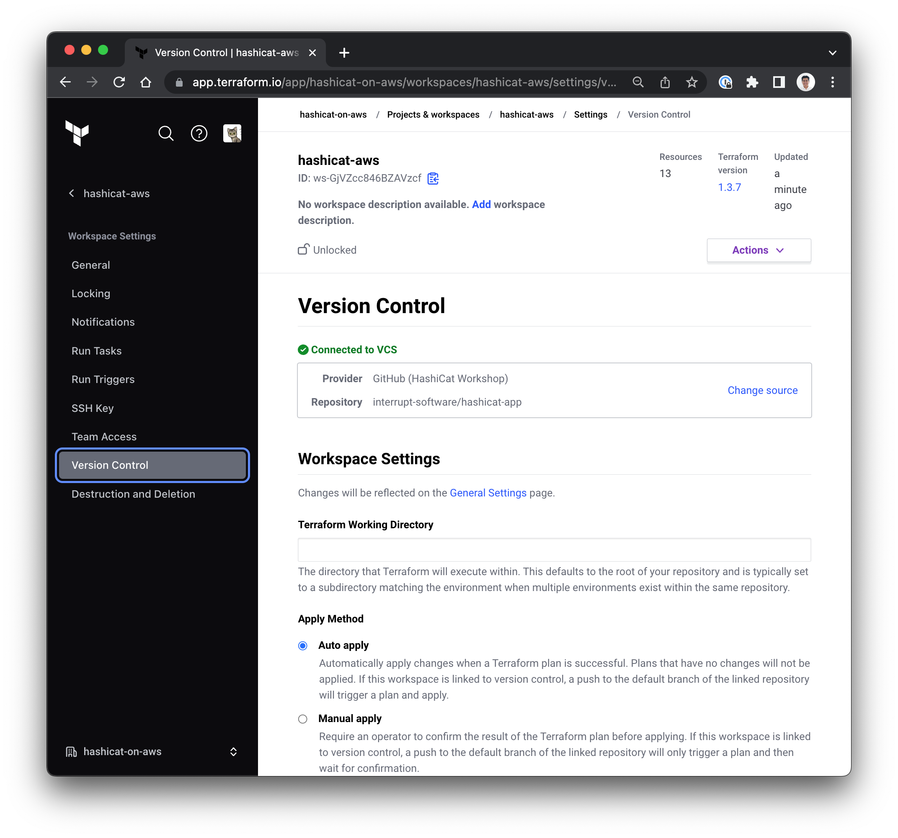

<style>
  v {
    display: inline-flex;
    color: white;
    background-color: rgb(17, 158, 111);
    align-items: center;
    justify-content: center;
    font-size: 14px;
    padding: 10px;
    border-radius: 2px;
    height: 24px;
  }

  r {
    display: inline-flex;
    color: white;
    background-color: #c73445;
    align-items: center;
    justify-content: center;
    font-size: 14px;
    padding: 10px;
    border-radius: 2px;
    height: 24px;
  }

  m {
    display: inline-flex;
    color: white;
    background-color: #584ED5;
    align-items: center;
    justify-content: center;
    font-size: 14px;
    padding: 10px;
    border-radius: 2px;
    height: 24px;
  }

  x {
    display: inline-flex;
    border-radius: 5px;
    border: 1px solid rgba(151,159,175,1);
    /* background-color: rgba(151,159,175,1); */
    /* background-color: rgba(30,38,55,1); */
    color: rgba(151,159,175,1);
    padding: 2px 10px 2px 10px;
    font-size: 14px;
    letter-spacing: 1.2px;
    align-items: center;
    justify-content: center;
    height: 24px;
  }

  t {
    display: inline-flex;
    border-radius: 5px;
    background-color: rgba(30,38,55,1);
    color: rgba(151,159,175,1);
    padding: 2px 10px 2px 5px;
    font-size: 14px;
    letter-spacing: 1.2px;
    align-items: center;
    justify-content: center;
    height: 24px;
    align-items: center;
  }

  t > a img {
    display: inline-block;
  }

lb {
  display: flex;
  color: #222;
  background-color: lightblue;
  padding: 10px;
  margin: 10px 10px 10px 1px;
  border-radius: 3px;
  box-shadow: 2px 2px 10px;
}

o {
  color: #ffcce6;
  padding: 0 5px;
  text-decoration: none;
  animation: blinker 2s linear infinite;
}

@keyframes blinker {
  50% {
    opacity: 0.6;
  }
  90% {
    color: #ff69b4;
    opacity: 1;
  }
}

</style>

The objectives of this challenge are to configure a VCS integration for your organization, and to create a GitHub repository with the contents of the <t>hashicat-aws</t> folder.

- Please visit your [GitHub Developer Settings](https://github.com/settings/tokens) to generate a Personal Access Token (classic).

- The scopes for the token should include:
    - [x] repo
    - [x] workflow
    - [x] write:packages
    - [x] delete: packages
    - [x] admin:repo_hook
    - [x] admin:org_hook
    - [x] notifications
    - [x] delete_repo

- <lb>Make sure to save your GitHub Personal Access Token. It will not be displayed again.</lb>

1- Create a GitHub Repository
===
To trigger HCP Terraform runs from changes to VCS, you first need to create a new repository in your personal GitHub account.

- In the <t>Terminal</t> tab run the helper script to cache your GitHub credentials temporarily.

```bash
cd /root/scripts
source configure_git.bash


```

- Use the Terraform utility code to build a new GitHub repository.

```bash
cd /root/terraform-github
terraform init
terraform apply -auto-approve


```

- Confirm that your GitHub repository exists by visiting the repository URL.

- On your browser, confirm that your GitHub repository is ready to accept a payload. Please see the example image below.


2- Populate the GitHub Repository
===
Upload the contents of the <t>hashicat-aws</t> folder to the GitHub repository.

- In the <t>Terminal</t> tab run the following commands. This sequence will prompt you for your GitHub username and password. <o>The password is your GitHub Personal Access Token.</o>

```bash
cd /root/hashicat-aws
git config --global credential.helper store
git config --global user.email $USER_EMAIL
git config --global user.name $USER_NAME
git init
git add .
git commit -m "first commit"
git branch -M main
git remote add origin https://github.com/$GITHUB_OWNER/$GITHUB_REPO.git
git push -u origin main


```

- Confirm that your GitHub repository is populated by refreshing your repository URL:

```bash
echo "" && \
echo "https://github.com/${GITHUB_OWNER}/${GITHUB_REPO}" && \
echo ""


```

- On your browser, your GitHub repository shows the payload. Please see the example image below.


3- Integrate HCP Terraform VCS
===
Version control (VCS) integration allows you to manually approve changes or automate a run as soon as a pull request is merged into a repository branch.

- In the <t>Terminal</t> tab, create a VCS connection to your GitHub organization, and link the HCP Terraform workspace to your GitHub repository.

```bash
cd /root/hcp-terraform

# 1. Create an OAuth Client as the connection
#    for your HCP Terraform organization and the
#    GitHub provider
terraform apply -auto-approve


```

- Use the <t>Code Editor</t> tab and open the <t>hcp-terraform</t> folder. Observe the updates to the file <t>main.tf</t> and review the OAuth Client configuration (Lines 286-299).

- On the HCP Terraform portal, navigate to the <x>[[ Instruqt-Var key="TF_ORG" hostname="workstation" ]]</x> organization and open <x>Settings</x>-<x>Version Control</x>-<x>Providers</x>

Please see the example image below.


- Note the `Callback URL` and the `OAuth Token ID`. These unique identifiers map to a unique payload URL and secret exchange with your GitHub repository.

---

- Use the <t>Code Editor</t> tab and open the <t>hcp-terraform</t> folder. Observe the updates to the file <t>main.tf</t> and review the VCS Configuration for your `[[ Instruqt-Var key="TF_WORKSPACE" hostname="workstation" ]]` workspace (Lines 67-70).

- On the HCP Terraform portal, navigate to the <x>[[ Instruqt-Var key="TF_ORG" hostname="workstation" ]]</x> organization and open <x>Projects & workspaces</x>-<x>[[ Instruqt-Var key="TF_WORKSPACE" hostname="workstation" ]]</x>-<x>Settings</x>-<x>Version Control</x>. Please see the example image below.



---

- In the <t>Terminal</t> tab run the following command to explore the WebHook configuration for your repository - This is a sensitive operation and you may need to authenticate on GitHub.

```bash
echo "" && \
echo "https://github.com/${GITHUB_OWNER}/${GITHUB_REPO}/settings/hooks" && \
echo ""


```

- HCP Terraform registers webhooks with your VCS provider, then automatically queues a Terraform run whenever new commits are merged to the branch of the linked repository.

- When GitHub registers a `Pull Request` or a `Push` succesfully to the repository, there is a secure sequence to push the code and trigger a run in HCP Terraform.

---
Congratulations, you have implemented a significant milestone to support code reviews.

1. Terraform changes must go through version control before they are used in your workspace.

2. Code reviews are required before any changes are pushed to production.

3. The workflow provides a valuable record of any and all changes made to the code that built your infrastructure. This can prevent configuration drift and undocumented changes.

Click the <v>Check</v> button to let Jane know she can clone the `hashicat-app` repo for QA testing.