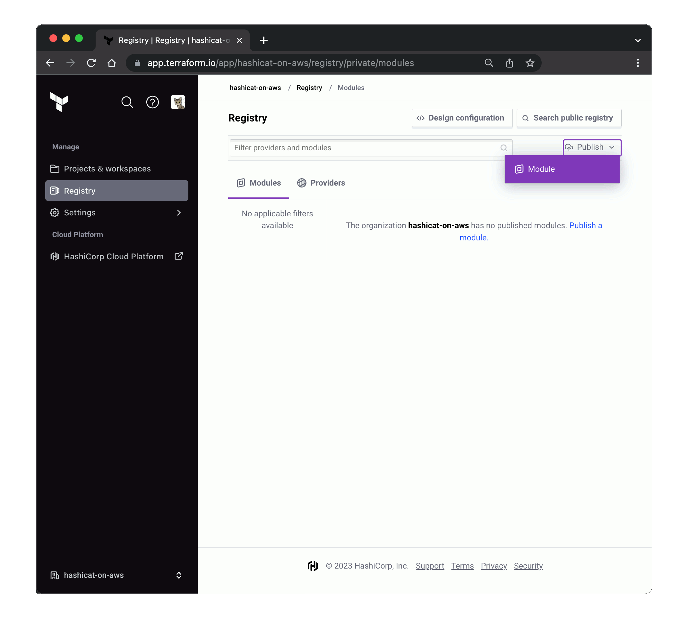
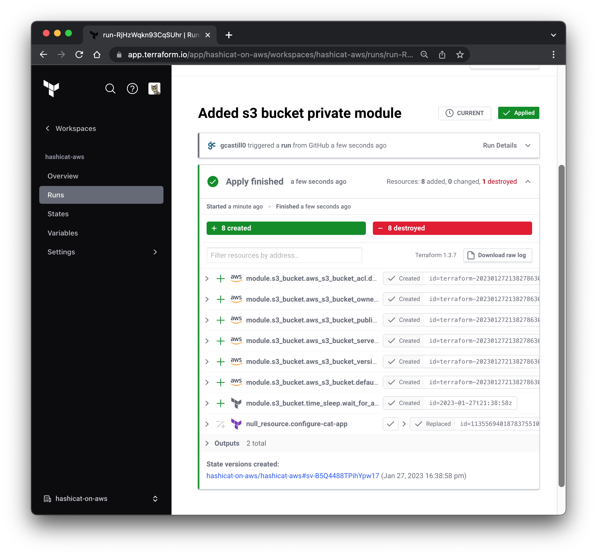

<style>
  v {
    display: inline-flex;
    color: white;
    background-color: rgb(17, 158, 111);
    align-items: center;
    justify-content: center;
    font-size: 14px;
    padding: 10px;
    border-radius: 2px;
    height: 24px;
  }

  r {
    display: inline-flex;
    color: white;
    background-color: #c73445;
    align-items: center;
    justify-content: center;
    font-size: 14px;
    padding: 10px;
    border-radius: 2px;
    height: 24px;
  }

  m {
    display: inline-flex;
    color: white;
    background-color: #584ED5;
    align-items: center;
    justify-content: center;
    font-size: 14px;
    padding: 10px;
    border-radius: 2px;
    height: 24px;
  }

  x {
    display: inline-flex;
    border-radius: 5px;
    border: 1px solid rgba(151,159,175,1);
    /* background-color: rgba(151,159,175,1); */
    /* background-color: rgba(30,38,55,1); */
    color: rgba(151,159,175,1);
    padding: 2px 10px 2px 10px;
    font-size: 14px;
    letter-spacing: 1.2px;
    align-items: center;
    justify-content: center;
    height: 24px;
  }

  t {
    display: inline-flex;
    border-radius: 5px;
    background-color: rgba(30,38,55,1);
    color: rgba(151,159,175,1);
    padding: 2px 10px 2px 5px;
    font-size: 14px;
    letter-spacing: 1.2px;
    align-items: center;
    justify-content: center;
    height: 24px;
    align-items: center;
  }

  t > a img {
    display: inline-block;
  }

  w {
    display: inline-flex;
    border-radius: 5px;
    background-color: rgba(250,250,250,1);
    color: #584ED5;
    padding: 2px 10px 2px 5px;
    font-size: 12px;
    font-weight: bold;
    align-items: center;
    height: 24px;
  }

  w > a img {
    display: inline-block;
  }

.tab {
  display: inline-block;
  margin-left: 30px;
}
</style>

In this challenge you'll learn to use the Terraform Private Registry, which allows you to store and version re-usable modules of Terraform code.

1- Terraform Registry
===

The Terraform Registry is an interactive resource for discovering a wide selection of integrations (providers), configuration packages (modules), and security rules (policies) for use with Terraform.

- Instead of writing this module from scratch, you can use a trusted AWS s3-bucket module from the public Terraform Registry.

- Visit this [Terraform AWS S3 bucket](https://registry.terraform.io/modules/cloudposse/s3-bucket/aws) to view a popular module.

- By default, we can use the module with the following code snippet:

```bash
module "s3-bucket" {
  source              = "cloudposse/s3-bucket/aws"
  version             = "3.1.0"
  s3_object_ownership = "BucketOwnerEnforced"
}
```

- Add the code snippet to your hashicat-aws deployment:

  - Use the <t>Code Editor</t> tab and expand the <t>hashicat-aws</t> folder.

  - Open the <t>main.tf</t> file and add the snippet to the end of the file.

  - Use the <t>Terminal</t> tab to update your deployment with the module settings.

```bash
cd /root/hashicat-aws
git add .
git commit -m "Added s3 bucket module"
git push origin main


```

- On the HCP Terraform portal, navigate to <x>Workspaces</x>-<x>hashicat-aws</x>-<x>Runs</x> and, on the <x>Current Run</x> note the application of the new **module**. Please see the example image below.


This provides an adequate technical solution. However, Gaurav and the development team need to lock down the attributes for the AWS S3 buckets, and the customization must be held privately to avoid vulnerable exposures.

2- Private Registry
===
HCP Terraform's private registry works similarly to the public Terraform Registry and helps you share Terraform providers and Terraform modules across your organization.

- Visit this [Terraform AWS S3 bucket](https://registry.terraform.io/modules/cloudposse/s3-bucket/aws) to work with the module. Complete the following steps:

<span class="tab"></span>1 - Follow the <x>Source Code</x> link
<br><span class="tab"></span>2 - <x>Fork</x> the repository
<br><span class="tab"></span>3 - Uncheck <x>Copy the master branch only</x>
<br><span class="tab"></span>4 - Use <x>Create Fork</x> to create a copy

- For reference, please see the example image below.


With a private copy of the module, you can customize the content to enforce business rules, technical requirements and security guidelines.

---

The private registry uses your configured Version Control System (VCS) integrations and defers to your VCS provider for most management tasks.

To implement this private module in your Private Registry do the following:

- Use the <t>Code Editor</t> tab and expand the <t>hcp-terraform</t> folder.

- Open the file <t>terraform.tfvars.tf</t> and ensure value for the variable `module_repo` matches your own module repository name.

- Open the file <t>main.tf</t> and note the code snippet to automate the integration on (lines 320-332).

- Use the <t>Terminal</t> tab to register your Private Registry with the following command:

```bash
cd /root/hcp-terraform
terraform apply -auto-approve


```

---

Your Terraform modules can be imported to your Terraform Private Registry using a workflow method in the HCP Terraform portal.

You do not need to perform these actions with the selected Terraform module, but you can experiment with your own Terraform modules.

- On the HCP Terraform portal, navigate to <x>Registry</x>-<x>Modules</x> and use <x>Publish</x>.

- Follow the workflow:

<w>Connect to VCS</w> - pick your GitHub VCS provider <x>HashiCat Workshop</x>

<w>Choose a repository</w> - select the repository with your copy of the <x>terraform-aws-s3-bucket</x>

<w>Confirm Selection</w> - with <m>Publish Module</m>.

- For reference, please see the example image below.



The main difference between these two methods is automation. In this workshop, we prefer to perform the operation with code to maintain automated control with code. Creating a Private Module entry manually means you have to maintain and document the process it manually.

3- Implement and Manage
===

- Use the <t>Code Editor</t> tab and expand the <t>hashicat-aws</t> folder.

- Revise the `module "s3-bucket"` code snippet in the file <t>main.tf</t> and update with a reference to your Terraform Private Registry. The code currently reads:

```bash
module "s3-bucket" {
  source              = "cloudposse/s3-bucket/aws"
  version             = "3.1.0"
  s3_object_ownership = "BucketOwnerEnforced"
}
```

- Update the code with the example below. Notice the update to the module reference with your HCP Terraform and your Organization name.

```bash
module "s3_bucket" {
  source              = "app.terraform.io/[[ Instruqt-Var key="TF_ORG" hostname="workstation" ]]/s3-bucket/aws"
  version             = "3.1.0"
  s3_object_ownership = "BucketOwnerEnforced"
}
```

- Use the <t>Terminal</t> tab to update your deployment with the module settings.

```bash
cd /root/hashicat-aws
git add .
git commit -m "Added s3 bucket private module"
git push origin main


```

- The end result is the implementation of a private module that supports your decision criteria.

- On the HCP Terraform portal, navigate to <x>Workspaces</x>-<x>hashicat-aws</x>-<x>Runs</x> to view the effective changes.

- For reference, please see the example image below.



- The logs reflect the change from the use a public module on the Terraform Registry, to a private module on `app.terraform.io/[[ Instruqt-Var key="TF_ORG" hostname="workstation" ]]`.

---
Fantastic work, Sysadmin! You are helping your team tremendously. You can share the following:

- Gaurav and the development team can use a standardized template for deploying Amazon S3 Buckets.

- The Amazon S3 module is held privately, with properties that match ACME's guidelines.

- Gaurav and the development do not need to code Terraform. They consume pre-approved artifacts only.

Use the <v>Check</v> button below to update the teams involved and your manager.