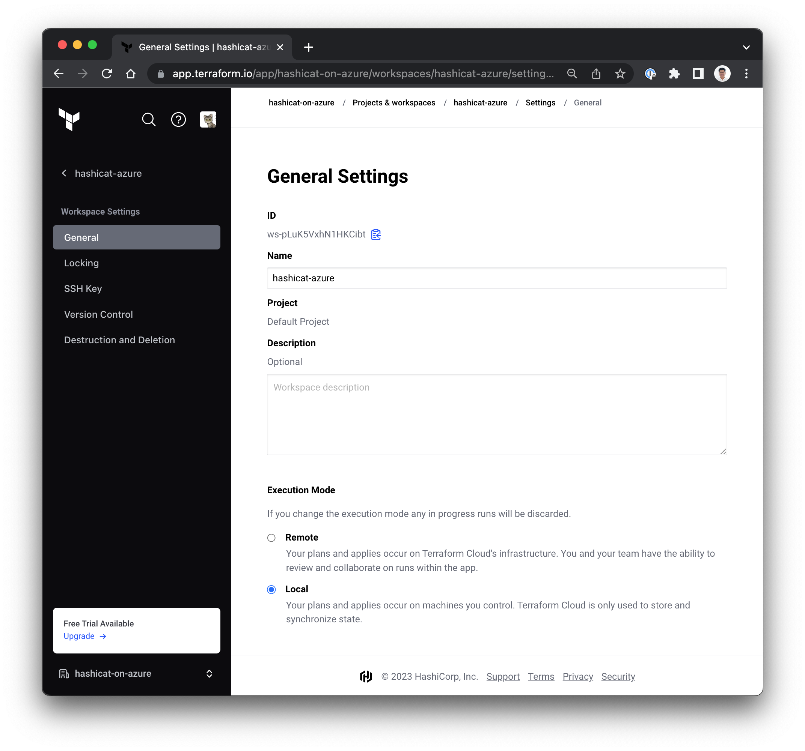

<style>
  v {
    display: inline-flex;
    color: white;
    background-color: rgb(17, 158, 111);
    align-items: center;
    justify-content: center;
    font-size: 14px;
    padding: 10px;
    border-radius: 2px;
    height: 24px;
  }

  r {
    display: inline-flex;
    color: white;
    background-color: #c73445;
    align-items: center;
    justify-content: center;
    font-size: 14px;
    padding: 10px;
    border-radius: 2px;
    height: 24px;
  }

  m {
    display: inline-flex;
    color: white;
    background-color: #584ED5;
    align-items: center;
    justify-content: center;
    font-size: 14px;
    padding: 10px;
    height: 24px;
    border-radius: 5px;
    border: 1px solid rgba(151,159,175,1);
  }

  x {
    display: inline-flex;
    border-radius: 5px;
    border: 1px solid rgba(151,159,175,1);
    /* background-color: rgba(151,159,175,1); */
    /* background-color: rgba(30,38,55,1); */
    color: rgba(151,159,175,1);
    padding: 2px 10px 2px 10px;
    font-size: 14px;
    letter-spacing: 1.2px;
    align-items: center;
    justify-content: center;
    height: 24px;
  }

  t {
    display: inline-flex;
    border-radius: 5px;
    background-color: rgba(30,38,55,1);
    color: rgba(151,159,175,1);
    padding: 2px 10px 2px 5px;
    font-size: 14px;
    letter-spacing: 1.2px;
    align-items: center;
    justify-content: center;
    height: 24px;
  }

  t > a img {
    display: inline-block;
  }

o {
  color:#BA55D3;
  padding: 0 5px;
  font-weight: bold;
  text-decoration: none;
}

o:hover {
  text-decoration: underline;
}

lb {
  display: flex;
  color: #222;
  background-color: lightblue;
  padding: 10px;
  margin: 10px 10px 10px 1px;
  border-radius: 3px;
  box-shadow: 2px 2px 10px;
}

w {
  display: inline-flex;
  border-radius: 5px;
  border: 1px solid rgba(88,78,213,1);
  background-color: rgba(250,250,250,1);
  color: #584ED5;
  padding: 2px 10px 2px 5px;
  font-size: 14px;
  /* font-weight: bold; */
  align-items: center;
  justify-content: center;
  height: 24px;
}

</style>
The first step to begin work with your deployment tasks is to set up your HCP Terraform resources.

1- HCP Terraform Organization
===
- Sign up for a free HCP Terraform account at https://app.terraform.io/signup/account.

- If you already have an account, sign in with your existing credentials.

2- HCP Terraform Trial Plan
===
- Click on [THIS](https://app.terraform.io/app/organizations/new?trial=workshop2023) link to create a HCP Terraform Organization for this workshop.

- Use the <m>Create organization & start 14 day trial</m> button to enable "Plus Tier" features in your organization. Please see the image below.


- If you have an existing account and already used a trial, please create a different organization and unlock the 14-day "Plus Tier" plan features.

3- HCP Terraform Token
===
- Use this <o>[link](https://app.terraform.io/app/settings/tokens?source=terraform-login)</o> to visit the <x>User Settings</x>-<x>Tokens</x> page in your HCP Terraform account.

- Use the <m>Create API token</m> button to generate a new **personal user token** to use in this workshop.

- <lb>Make sure to save your HCP Terraform token. It will not be displayed again.</lb>

- Move to the <t>Terminal</t> tab and store your HCP Terraform Token locally with the following command:

```bash
terraform login


```

4- HCP Terraform Workspace
===
Use local Terraform utility deployment code to create and configure a new HCP Terraform Workspace.

- Use the <t>Code Editor</t> tab and expand the <t>hcp-terraform</t> folder and open the file <t>terraform.tfvars</t>

- Replace the `YOUR_ORGANIZATION` placeholder with your HCP Terraform organization name.

- We default the name of your HCP Terraform workspace to `hashicat-azure`. You can choose a different name at this time.

---

- Move to the <t>Terminal</t> tab and execute the following commands:

```bash
cd /root/hcp-terraform
terraform init

# The following creates a workspace in
# HCP Terraform called "hashicat-azure"
# ... unless the default is changed.
terraform apply -auto-approve


```

- On the HCP Terraform portal, navigate to <x>Projects & workspaces</x>-<x>hashicat-azure</x>-<x>Settings</x>-<x>General</x>

- Note that your new workspace is configured for <x>Local</x> execution.

Please see the example image below.



---

Congratulations, you are ready to start working with Terraform on Azure. We will use the `hashicat-azure` example app in the rest of the challenges as you learn new Terraform skills.

Click the <v>Check</v> button to continue.

