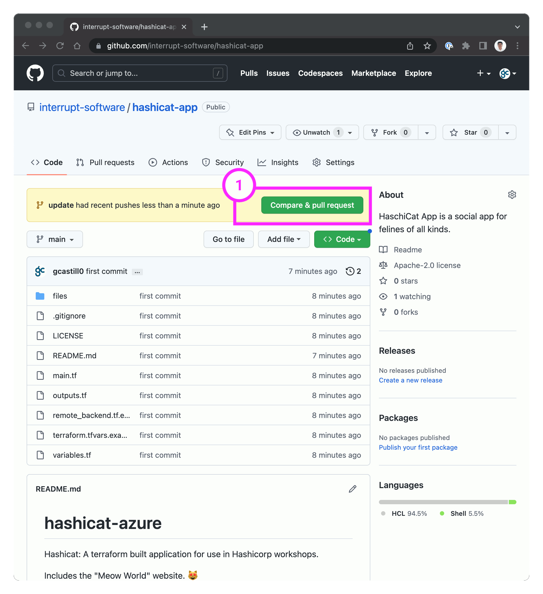

<style>
  v {
    display: inline-flex;
    color: white;
    background-color: rgb(17, 158, 111);
    align-items: center;
    justify-content: center;
    font-size: 14px;
    padding: 10px;
    border-radius: 2px;
    height: 24px;
  }

  r {
    display: inline-flex;
    color: white;
    background-color: #c73445;
    align-items: center;
    justify-content: center;
    font-size: 14px;
    padding: 10px;
    border-radius: 2px;
    height: 24px;
  }

  m {
    display: inline-flex;
    color: white;
    background-color: #584ED5;
    align-items: center;
    justify-content: center;
    font-size: 14px;
    padding: 10px;
    border-radius: 2px;
    height: 24px;
  }

  x {
    display: inline-flex;
    border-radius: 5px;
    border: 1px solid rgba(151,159,175,1);
    /* background-color: rgba(151,159,175,1); */
    /* background-color: rgba(30,38,55,1); */
    color: rgba(151,159,175,1);
    padding: 2px 10px 2px 10px;
    font-size: 14px;
    letter-spacing: 1.2px;
    align-items: center;
    justify-content: center;
    height: 24px;
  }

  t {
    display: inline-flex;
    border-radius: 5px;
    background-color: rgba(30,38,55,1);
    color: rgba(151,159,175,1);
    padding: 2px 10px 2px 5px;
    font-size: 14px;
    letter-spacing: 1.2px;
    align-items: center;
    justify-content: center;
    height: 24px;
  }

  t > a img {
    display: inline-block;
  }

    w {
    display: inline-flex;
    border-radius: 5px;
    background-color: rgba(250,250,250,1);
    color: #584ED5;
    padding: 2px 10px 2px 5px;
    font-size: 12px;
    font-weight: bold;
    align-items: center;
    justify-content: center;
  }

.tab {
  display: inline-block;
  margin-left: 30px;
}
</style>

In this challenge we make a small change to the code that deploys the hashicat application, and then create a "Pull Request".

- You can do this exercise on your own.

- Alternatively, find a partner, exchange github usernames, and share access to your repositories of the `hashicat-app` deployment.

1- Create a Branch Update
===
- Use the <t>Code Editor</t> tab and expand the <t>hashicat-azure</t> folder.

- Browse to the <t>files</t> folder, open the <t>deploy_app.sh</t> file, and update the following text with your own catchy marketing slogan for ACME (line 14).

> <w>Welcome to ${PREFIX}'s app. Replace this text with your own.</w>

- In the <t>Terminal</t> tab, submit the new code base. We use a new branch named `update` with the following sequence:

```bash
cd /root/hashicat-azure
git status
git branch update
git checkout update
git add .
git commit -a -m "Updated HTML payload"
git push --set-upstream origin update
git request-pull HEAD~1 $REPO_URL update


```

2- Manage a Pull Request
===
On your Web browser, open the page to your GitHub repository.

- Perform the following actions to accept the changes to your deployment code.

<span class="tab"></span>1 - Compare & pull request
<br><span class="tab"></span>2 - Create pull request
<br><span class="tab"></span>3 - Merge pull request
<br><span class="tab"></span>4 - Confirm merge
<br><span class="tab"></span>5 - Delete branch

- When you execute the <x>Create pull request</x> step, ensure you explore the HCP Terraform Check to review the changes to the deployment. For reference, please see the example image below.


- For reference on the entire sequence, please see the example image below.



- Clean up the local `update` branch

```bash
git checkout main
git branch -D update


```

- Ensure your local `main` branch is up to date

```bash
git pull origin main


```

3- See results in HCP Terraform
===
With an approved pull request/merge request to a branch, any HCP Terraform workspaces based on that branch will perform a speculative plan with the contents of the request and links to the results on the PR's page.

- On the HCP Terraform portal, navigate to <x>Projects & workspaces</x>-<x>[[ Instruqt-Var key="TF_WORKSPACE" hostname="workstation" ]]</x>-<x>Overview</x> and note that a new deployment is occuring. Please see the example image below.


- When a workspace is linked to a VCS repository, HCP Terraform runs start automatically when you merge or commit changes to version control.

---
Amazing! You have enabled your team to collaborate using GitHub as a VCS provider. You can report the following:

- With approved commits to a branch, any HCP Terraform workspaces based on that branch will begin a Terraform run.

- Although any contributor to the repository can see the status indicators for pull request plans, only members of your HCP Terraform organization with permission to read runs for the affected workspaces can click through and view the complete plan output.

Report to Lars with the <v>Check</v> button below and let him know that the updates are working through the VCS workflow process.