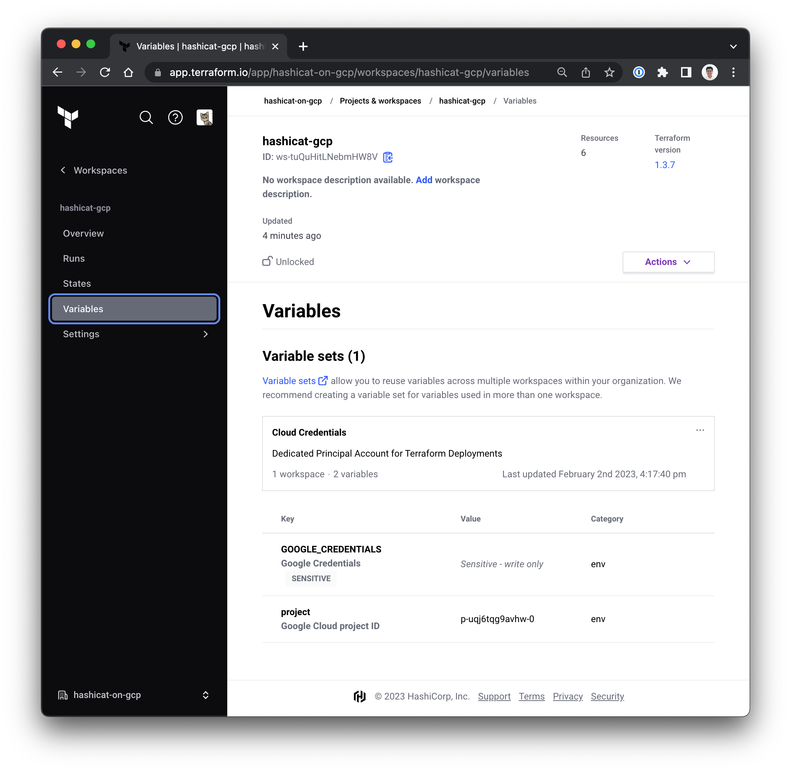

<style>
  v {
    display: inline-flex;
    color: white;
    background-color: rgb(17, 158, 111);
    align-items: center;
    justify-content: center;
    font-size: 14px;
    padding: 10px;
    border-radius: 2px;
    height: 24px;
  }

  r {
    display: inline-flex;
    color: white;
    background-color: #c73445;
    align-items: center;
    justify-content: center;
    font-size: 14px;
    padding: 10px;
    border-radius: 2px;
    height: 24px;
  }

  m {
    display: inline-flex;
    color: white;
    background-color: #584ED5;
    align-items: center;
    justify-content: center;
    font-size: 14px;
    padding: 10px;
    border-radius: 2px;
    height: 24px;
  }

  x {
    display: inline-flex;
    border-radius: 5px;
    border: 1px solid rgba(151,159,175,1);
    /* background-color: rgba(151,159,175,1); */
    /* background-color: rgba(30,38,55,1); */
    color: rgba(151,159,175,1);
    padding: 2px 10px 2px 10px;
    font-size: 14px;
    letter-spacing: 1.2px;
    align-items: center;
    justify-content: center;
    height: 24px;
  }

  t {
    display: inline-flex;
    border-radius: 5px;
    background-color: rgba(30,38,55,1);
    color: rgba(151,159,175,1);
    padding: 2px 10px 2px 5px;
    font-size: 14px;
    letter-spacing: 1.2px;
    align-items: center;
    justify-content: center;
    height: 24px;
  }

  t > a img {
    display: inline-block;
  }
</style>

The security team is looking to mitigate the exposure of Cloud credentials.

- The first task is to store Google Cloud Client ID, Client Secret, Subscrition ID and Tenant ID as shared resources with Variable Sets.

- The second task is to set up the non-sensitive, deployment-specific variables for the `hashicat-gcp` application with Workspace Variables.

---
- The utility code for HCP Terraform is pre-configured with examples for Variable Sets and Workspace Variables.

- In the <t>Terminal</t> tab, update your HCP Terraform resources with Variable Sets and Workspace Variables:

```bash
cd /root/hcp-terraform

# 1. Create global variable set with Cloud
#    credentials marked as sensitive
# 2. Load workspace variables
# 3. Set workspace to remote execution
terraform apply -auto-approve


```
- Please see the sections below for full details.

1- Variable Sets
===
Variable sets are a group of commonly used variables that you can apply to multiple workspaces in an organization.

- In our application deployment, the Terraform provider for Google Cloud uses four environment variables:

  - The Google Cloud Client ID,
  - a corresponding Google Cloud Client Secret,
  - an Google Cloud Organization Subscrition ID, and
  - an Google Cloud account Tenant ID

- Assume that these keys are sensitive and need to be protected. You can show the variable names and the values you need to set them to by running this in the <t>Terminal</t> tab:

```bash
echo "" && \
echo "GOOGLE_CREDENTIALS = $GOOGLE_CREDENTIALS" && \
echo "GOOGLE_PROJECT_ID = $INSTRUQT_GCP_PROJECT_GCPPROJECT_PROJECT_ID"


```

- Use the <t>Code Editor</t> tab and expand the <t>hcp-terraform</t> folder. Observe the updates to the file <t>main.tf</t>

- Note the update to configure a Variable Set named Cloud Crendentials (lines 51-95). These variables are sensitive and reflect a dedicated Google Cloud Service Principal to support infrastructure deployments.

- On the HCP Terraform portal, navigate to <x>Settings</x>-<x>Variable sets</x>. Please see the example image below.


- Explore the Variable Set and figure out how it links to your `[[ Instruqt-Var key="TF_WORKSPACE" hostname="workstation" ]]` workspace.

---

- On the HCP Terraform portal, navigate to <x>Projects & workspaces</x>-<x>[[ Instruqt-Var key="TF_WORKSPACE" hostname="workstation" ]]</x>-<x>Variables</x>-<x>Variable Sets</x> Please see the example image below.



- Note that Global variables are immutable at the `[[ Instruqt-Var key="TF_WORKSPACE" hostname="workstation" ]]` workspace level. You need administrative control of the variable set to make changes.

2- Workspace Variables
===
Workspace variables always overwrite variables from variable sets that have the same type and the same key.

- Use the <t>Code Editor</t> tab and expand the <t>hcp-terraform</t> folder. Observe the updates to the file <t>main.tf</t>

- The application uses two Terraform variables, `region` and `prefix`. We configure these workspace-specific variables (lines 96-119). These are _not_ sensitive and relate to the properties that you can define in your TERRAFORM code for deployment.

- On the HCP Terraform portal, navigate to <x>Projects & workspaces</x>-<x>[[ Instruqt-Var key="TF_WORKSPACE" hostname="workstation" ]]</x>-<x>Variables</x>-<x>Workspace Variables</x>. Please see the example image below.


3- Test Remote Execution
===
Your <x>[[ Instruqt-Var key="TF_WORKSPACE" hostname="workstation" ]]</x> workspace is updated to **Remote Execution** mode. This means plans and applies occur on HCP Terraform's infrastructure. You and your team have the ability to review and collaborate on runs within the app.

- Use the <t>Code Editor</t> tab and expand the <t>hcp-terraform</t> folder. Observe the updates to the file <t>main.tf</t> in lines 38-50.

- Test your application deployment with REMOTE execution. In the <t>Terminal</t> tab, perform an update to your <x>[[ Instruqt-Var key="TF_WORKSPACE" hostname="workstation" ]]</x> workspace.

```bash
cd /root/hashicat-gcp

# Use local apply command option to trigger
# a remote run in HCP Terraform
terraform apply -auto-approve


```

- The `terraform apply` command triggers your plans and applies to occur on HCP Terraform's infrastructure.

- To examine the results, on the HCP Terraform portal, navigate to <x>Projects & workspaces</x>-<x>[[ Instruqt-Var key="TF_WORKSPACE" hostname="workstation" ]]</x>-<x>Overview</x>. Please see the example image below.


---
Congratulations, you have accomplished a number of things:

1. The Google Cloud Service Principal keys are now safely encrypted and stored in an organization-wide Variable Set.

2. Your deployment properties are configured with your workspace-specific variables.

3. HCP Terraform manages your application deployments and you can trigger work remotely.

Report back to William with the <v>Check</v> button below once you've successfully deployed the hashicat application via HCP Terraform.