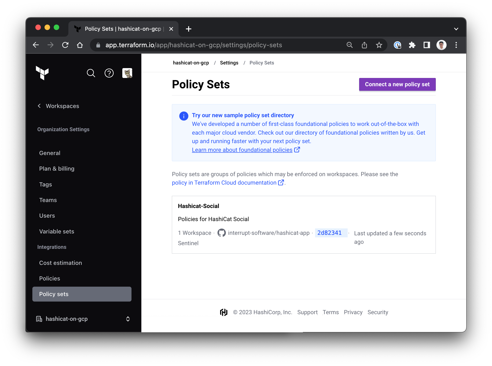
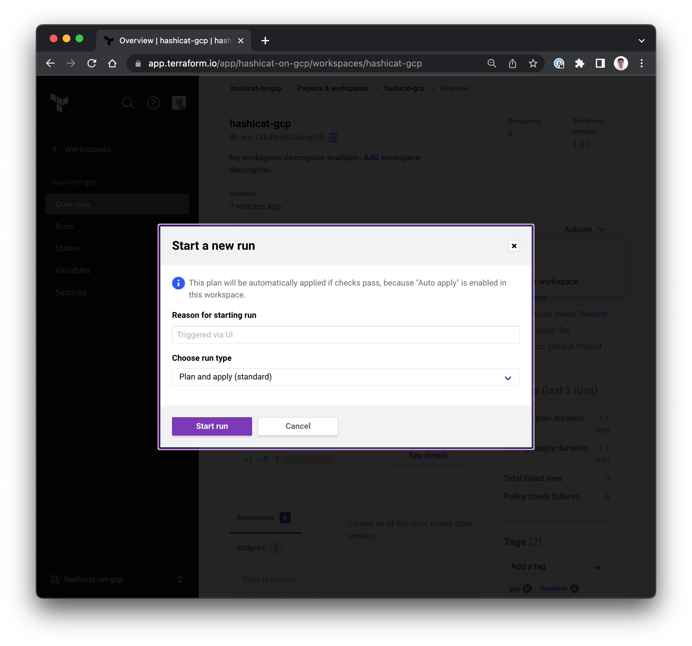

<style>
  v {
    display: inline-flex;
    color: white;
    background-color: rgb(17, 158, 111);
    align-items: center;
    justify-content: center;
    font-size: 14px;
    padding: 10px;
    border-radius: 2px;
    height: 24px;
  }

  r {
    display: inline-flex;
    color: white;
    background-color: #c73445;
    align-items: center;
    justify-content: center;
    font-size: 14px;
    padding: 10px;
    border-radius: 2px;
    height: 24px;
  }

  m {
    border-style: solid;
    border-color: #623596;
    display: inline-flex;
    color: white;
    background-color: #7B42B1;
    align-items: center;
    justify-content: center;
    font-size: 14px;
    padding: 10px;
    border-radius: 2px;
    height: 24px;
  }

  x {
    display: inline-flex;
    border-radius: 5px;
    border: 1px solid rgba(151,159,175,1);
    /* background-color: rgba(151,159,175,1); */
    /* background-color: rgba(30,38,55,1); */
    color: rgba(151,159,175,1);
    padding: 2px 10px 2px 10px;
    font-size: 14px;
    letter-spacing: 1.2px;
    align-items: center;
    justify-content: center;
    height: 24px;
  }

  t {
    display: inline-flex;
    border-radius: 5px;
    background-color: rgba(30,38,55,1);
    color: rgba(151,159,175,1);
    padding: 2px 10px 2px 5px;
    font-size: 14px;
    letter-spacing: 1.2px;
    align-items: center;
    justify-content: center;
    height: 24px;
  }

  t > a img {
    display: inline-block;
  }
</style>

In this challenge we use HashiCorp Sentinel policies to enforce two rules:

1. A rule that requires any Google Cloud vm instance created in your account to have  identifying tags for `Environment` and `Department`.

2. A rule to ensure that costs are maintained below an estimation of $100 USD prior to deployment.

To get started, use the <t>Terminal</t> tab to create a new Policy Set and assign it to the hashicat-gcp workspace with the following:

```bash
cd /root/hcp-terraform

# 1. Create a policy set from VCS.
# 2. Enable automated policy as code
# 3. Apply to hashicat-gcp workspace
terraform apply -auto-approve


```

1- Sentinel Policies
===

Sentinel policies define rules that restrict the provisioning of resources by Terraform configurations.

Terraform enforces Sentinel policies between the plan and apply phases of a run, preventing out of policy infrastructure from being provisioned.

- Use the <t>Code Editor</t> tab to expand the <t>hashicat-gcp</t> folder, and browse the <t>policies</t> folder.

- Open the <t>enforce-mandatory-tags.sentinel</t> file and read the structure of the Sentinel language. This rule checks for configuration properties in the Terraform plan prior to the "apply" stage.

- Open the <t>restrict-deployment-cost.sentinel</t> file and examine the rule syntax as it supports a logical check on the cost estimation.

For a comprehensive collection of Sentinel Policies, please visit this [HashiCorp Repo](https://github.com/hashicorp/terraform-sentinel-policies) and explore possible applications across multiple platforms.

2- Policy Sets
===
In our environment, HCP Terraform looks at your GitHub repo that contains the Sentinel Policy Sets to use in your own organization.

- Use the <t>Code Editor</t> tab and expand the <t>hcp-terraform</t> folder.

- Note the changes to the file <t>main.tf</t> which automatically configures a Policy Set and links it to the hashicat-gcp workspace (lines 300-319).

- On the HCP Terraform portal, navigate to <x>[[ Instruqt-Var key="TF_ORG" hostname="workstation" ]]</x>-<x>Settings</x>-<x>Policy Sets</x> and explore the <x>Hashicat-Social</x> policy set.



- To view the results of this new configuration, issue a manual run in the HCP Terraform UI.

- On the HCP Terraform portal, navigate to <x>Workspaces</x>-<x>hashicat-gcp</x>, choose <x>+ New run</x> and <x>Start run</x>. Please see the example image below.



- On the HCP Terraform portal, navigate to <x>Workspaces</x>-<x>hashicat-gcp</x>-<x>Runs</x> and, on the <x>Current Run</x> note the application of the policies AFTER the plan, but BEFORE the apply phase. Please see the example image below.


- Use the <m>Override & Continue</m> button, and then <m>Override Policy Check</m> to complete the sequence.

---

- Use the <t>Code Editor</t> tab to expand the <t>hashicat-gcp</t> folder, and browse the <t>policies</t> folder.

- Read the <t>sentinel.hcl</t> file. This file is used to direct HCP Terraform how to apply these policies.

- Notice that the policies are set to **soft-mandatory** - which implies that failed policies stop the run, and someone with authority can override a failed policy check during a run. Other possible values are:

  - **hard-mandatory** - Failed policies stop the run.
  - **advisory** - Failed policies produce a warning.

---

Wow, Sysadmin! Please let Karen, Lars, Hiro and Jane know that:

1. We can use Policy as Code with Sentinel and OPA to enforce business rules, technical rules, and security guidelines.

2. We have implemented rules to ensure each deployment is identified by its Cloud tagging for internal billing purposes.

3. The rules also include a cost control policy to ensure uses do not exceed a specific spending threshold.

4. Emphasize that each time you push a change to your Terraform code, you trigger a new run - which include policy checks.

Use the <v>Check</v> button below to share this important news.