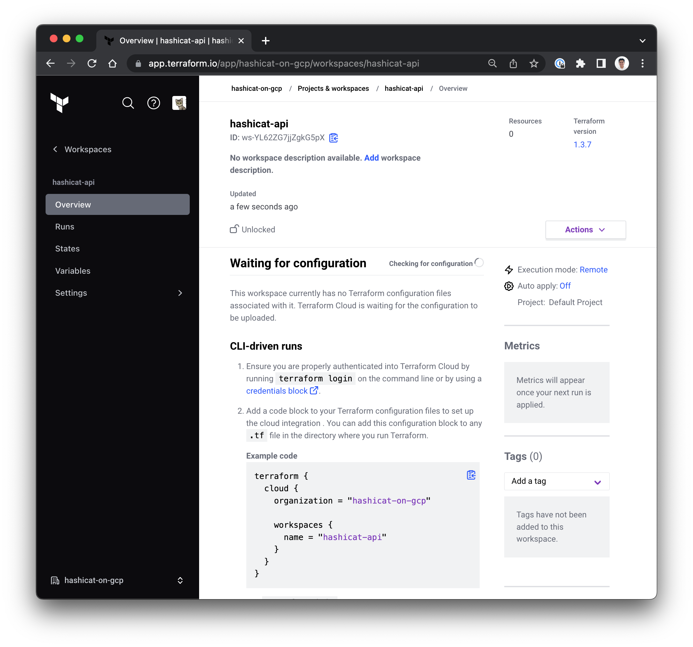
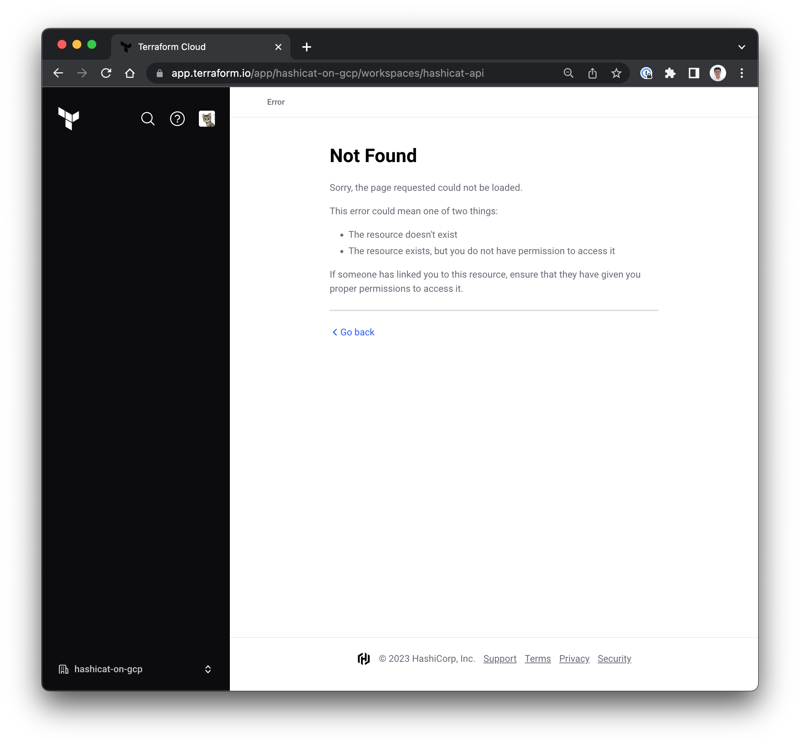

<style>
  v {
    display: inline-flex;
    color: white;
    background-color: rgb(17, 158, 111);
    align-items: center;
    justify-content: center;
    font-size: 14px;
    padding: 10px;
    border-radius: 2px;
    height: 24px;
  }

  r {
    display: inline-flex;
    color: white;
    background-color: #c73445;
    align-items: center;
    justify-content: center;
    font-size: 14px;
    padding: 10px;
    border-radius: 2px;
    height: 24px;
  }

  m {
    display: inline-flex;
    color: white;
    background-color: #584ED5;
    align-items: center;
    justify-content: center;
    font-size: 14px;
    padding: 10px;
    border-radius: 2px;
    height: 24px;
  }

  x {
    display: inline-flex;
    border-radius: 5px;
    border: 1px solid rgba(151,159,175,1);
    /* background-color: rgba(151,159,175,1); */
    /* background-color: rgba(30,38,55,1); */
    color: rgba(151,159,175,1);
    padding: 2px 10px 2px 10px;
    font-size: 14px;
    letter-spacing: 1.2px;
    align-items: center;
    justify-content: center;
    height: 24px;
  }

  t {
    display: inline-flex;
    border-radius: 5px;
    background-color: rgba(30,38,55,1);
    color: rgba(151,159,175,1);
    padding: 2px 10px 2px 5px;
    font-size: 14px;
    letter-spacing: 1.2px;
    align-items: center;
    justify-content: center;
    height: 24px;
  }

  t > a img {
    display: inline-block;
  }

  w {
    display: inline-flex;
    border-radius: 5px;
    background-color: rgba(250,250,250,1);
    color: #584ED5;
    padding: 2px 10px 2px 5px;
    font-size: 12px;
    font-weight: bold;
    align-items: center;
    justify-content: center;
    height: 24px;
  }

  w > img {
    display: inline-block;
    max-height: 20px;
  }

  .tab {
    display: inline-block;
    margin-left: 30px;
  }
</style>
In the final challenge you'll directly interact with the HCP Terraform API.

- HCP Terraform has a rich API that lets you do everything you can do in the GUI and more.

- Intermediate and advanced users utilize the API to create complex integrations that work with external systems.

1. API Subsets
===

The HCP Terraform API will continue to evolve, but we consider it stable for general use, and HashiCorp will maintain all stable API endpoints in a backwards compatible manner.

### 1.1 HTTP API Core
This is the most straight-forward method to access the HCP Terraform API. All requests must include the following:

<w>Authentication</w> All requests must be authenticated with a bearer token.

<w>Request Type</w> A valid HTTP operation such as GET, POST, etc. that is supported by the API endpoint.

<w>API Endpoint</w> The URL for the operation. The baseline for the URL is <x>https://app.terraform.io/api/v2</x>.
---
Examples:

- Use the <t>Terminal</t> tab to test the API with the following:
```bash
# Shows details for a given user account.
# GET /account/details
curl -s \
  --header "Authorization: Bearer $TFC_TOKEN" \
  --header "Content-Type: application/vnd.api+json" \
  --request GET \
  https://app.terraform.io/api/v2/account/details


```

- Operations normally require a data transformation utility to filter the response payload. For instance, we use the `jq` utility to read and manage the response:
```bash
# Shows the entitlements for an organization.
# GET /organizations/:organization_name/entitlement-set
curl -s \
  --header "Authorization: Bearer $TFC_TOKEN" \
  --header "Content-Type: application/vnd.api+json" \
  https://app.terraform.io/api/v2/organizations/$ORG/entitlement-set \
  | jq


```

### 1.2 TFE Terraform Provider

Before planning an API integration, it is important to consider whether the [TFE Terraform provider](https://registry.terraform.io/providers/hashicorp/tfe/latest/docs) meets your needs.

 It can't create or approve runs in response to arbitrary events, but it's a useful tool for managing your organizations, teams, and workspaces as code.

 - In the workshop we assumed **producer** and **consumer** roles. The producer code is in the <t>hcp-terraform</t> folder as it helps create, read, update and delete the resources in HCP Terraform.

### 1.3 CDK for Terraform

The Cloud Development Kit for Terraform (CDKTF) allows you to use familiar programming languages to define cloud infrastructure and provision it through HashiCorp Terraform.

- This gives you access to the entire Terraform ecosystem without learning HashiCorp Configuration Language (HCL) and lets you leverage the power of your existing toolchain for testing, dependency management, etc.

It currently supports TypeScript, Python, Java, C#, and Go.

[Cloud Development Kit for Terraform](https://github.com/hashicorp/terraform-cdk)

2. CRUD Operations
===
For most fundamental target operations, the best practice is to employ create, read, update and delete methods to maintain control.

- In this example, the target object is a `workspace`, and, although the API supports more than a dozen operations, our API integration planning considers basic CRUD operations first.

### 2.1 - Create
- Create a workspace.

```bash
cd /root/terraform-api

# Create a workspace in the given organization
# POST /organizations/:organization_name/workspaces
# This POST endpoint requires a JSON object
curl -s \
  --header "Authorization: Bearer $TFC_TOKEN" \
  --header "Content-Type: application/vnd.api+json" \
  --request POST \
  --data @create_payload.json \
  https://app.terraform.io/api/v2/organizations/$ORG/workspaces


```

- On the HCP Terraform portal, navigate to <x>Workspaces</x>-<x>hashicat-api</x>-<x>Overview</x>. Please see the example image below.



### 2.2 - Read
- Read the properties of the workspace.

```bash
cd /root/terraform-api

# Retrieve details on a workspace
# GET /organizations/:organization_name/workspaces/:name
curl -s \
  --header "Authorization: Bearer $TFC_TOKEN" \
  --header "Content-Type: application/vnd.api+json" \
  https://app.terraform.io/api/v2/organizations/$ORG/workspaces \
  | jq '.data|.[]|select(.attributes.name | contains("hashicat-api"))'


```

### 2.3 - Update
- Update the workspace.

```bash
cd /root/terraform-api

# Update a workspace in the given organization
# PATCH /organizations/:organization_name/workspaces/:name
# This PATCH endpoint requires a JSON object
curl \
  --header "Authorization: Bearer $TFC_TOKEN" \
  --header "Content-Type: application/vnd.api+json" \
  --request PATCH \
  --data @update_payload.json \
  https://app.terraform.io/api/v2/organizations/$ORG/workspaces/hashicat-api


```
- On the HCP Terraform portal, navigate to <x>Workspaces</x>-<x>hashicat-api</x>-<x>Overview</x>. Please see the example image below.


### 2.4 - Delete
- Delete the workspace.

```bash
cd /root/terraform-api

# Delete a workspace in the given organization
# DELETE /organizations/:organization_name/workspaces/:name
curl \
  --header "Authorization: Bearer $TFC_TOKEN" \
  --header "Content-Type: application/vnd.api+json" \
  --request DELETE \
  https://app.terraform.io/api/v2/organizations/$ORG/workspaces/hashicat-api


```
- On the HCP Terraform portal and reload your page. Please see the example image below.



3. Automation with wrappers
===
HCP Terraform's main unit of organization is a workspace. A workspace is a collection of everything Terraform needs to run: a Terraform configuration (usually from a VCS repo), values for that configuration's variables, and state data to keep track of operations between runs.

Automation of Terraform can come in various forms, and to varying degrees. The Vending Machine simulates how teams continue to run Terraform locally but use wrapper scripts to prepare a consistent working directory for Terraform to run in, while other teams run Terraform entirely within an orchestration tool such as Jenkins.

### 3.1 - Vending Machine (self-service)

- Simulate a basic business request for new infrastructure. Use the <t>Terminal</t> tab to run the following:

```bash
cd /root/scripts
bash vending_macheen.bash


```
- There is an assumption that the infrastructure deliverables are supported with tested and secure code modules.

- The workflow manager is responsible for picking the appropriate implementation of those modules and allocating HCP Terraform resources.

- On the HCP Terraform portal, navigate to <x>Projects & workspaces</x> and pick <x>Vending_Macheen</x> to see your resources. Please see the example image below.


- You can run the script as many times as desired. When satisfied, remove the resources with the following:

```bash
cd /root/terraform-api
terraform destroy -auto-approve


```

4. Automation with CI/CD
===

While HCP Terraform offers version control system integrations, including GitHub, using CI/CD tasks in your workflow enables you to add status checks before or after HCP Terraform remote runs are triggered, better adapting HCP Terraform to your use case.

To illustrate, set up GitHub Actions for your deployment.

- Use the <t>Terminal</t> tab to update your <x>[[ Instruqt-Var key="TF_WORKSPACE" hostname="workstation" ]]</x> workspace configuration. In this case, we are removing the VCS setup:

```bash
cd /root/hcp-terraform
terraform apply -auto-approve


```

- Create a secret to access HCP Terraform from your GitHub deployment repo.

```bash
# Move to /root/hashicat-gcp which has
# a proper .git and GitHub credentials
cd /root/hashicat-gcp

# Configure the HCP Terraform Token so Github Actions
# can interact with HCP Terraform
gh secret set TF_API_TOKEN \
  --body "$TFC_TOKEN"


```

- Use the <t>Code Editor</t> tab and expand the <t>hashicat-gcp</t> folder and open the <t>.github/workflows</t> folders.

- Open the file <t>terraform.yaml</t> to preview the actions peformed by the GitHub worker.

- Use the <t>Terminal</t> tab and update the deployment.

```bash
# We're working on /root/hashicat-gcp
cd /root/hashicat-gcp

git add .
git commit -a -m "Adding GitHub Actions"
git push -u origin main


```
- On your Web browser, navigate to your GitHub repository page. On the top menu look for <x>Actions</x> and expand the <x>Terraform</x> job. Please see the example image below.


- Expand and explore any of the job steps. This example showcases how the work is triggered from the CICD workflow, but the permissions for users, Cloud identity authorization, deployment policies and private module resources are all managed in HCP Terraform.

---

Congratulations, Senior Cloud Admin. With this exercise we conclude that:

- HCP Terraform provides a fundamental and secure API to manage its features.

- The [HCP Terraform/Terraform Enterprise Provider](https://registry.terraform.io/providers/hashicorp/tfe/latest/docs) meet most of our needs to support prescriptive workflows.

- You can use the API endpoints to create your own CRUD operations wrappers to integrate into your workflows.

- The Terraform CLI can be used across headless operations to support automation with CI/CD operations across different engines.

When ready, use the <v>Check</v> button below to complete this challange.