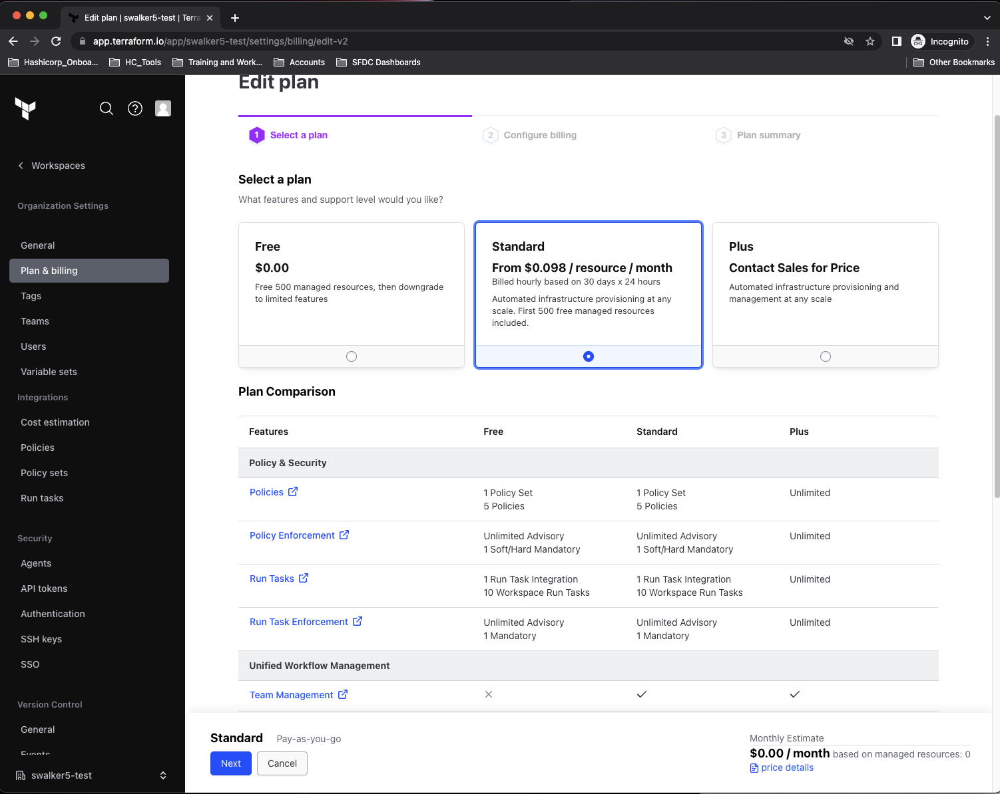
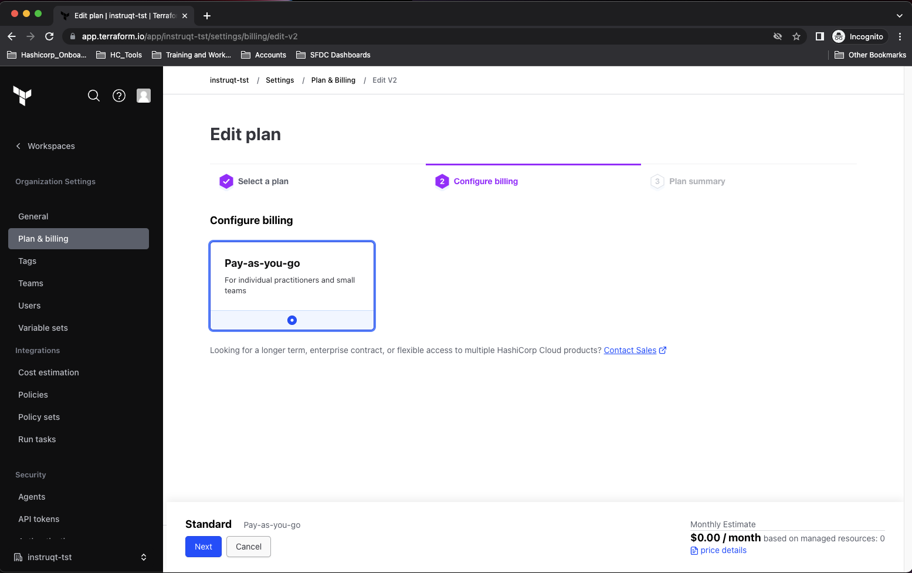
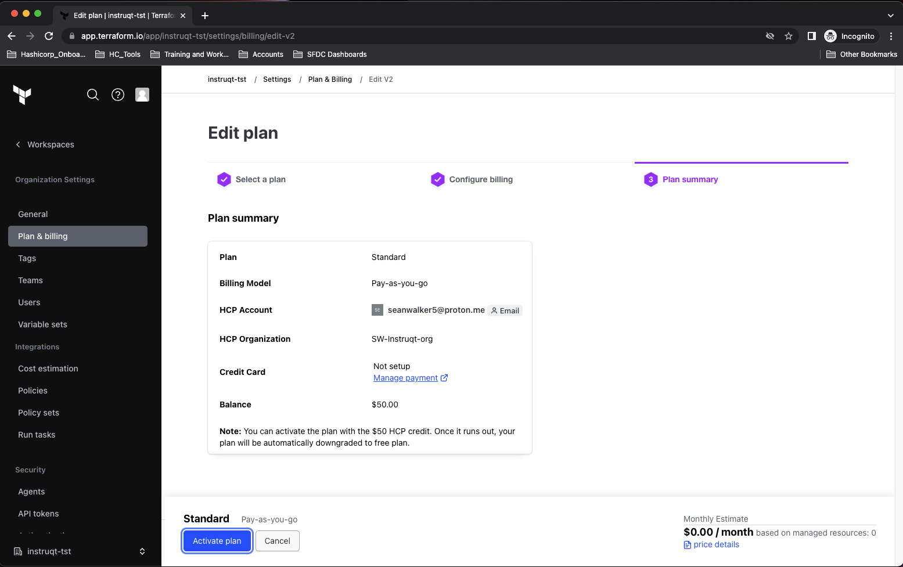

<style>
  v {
    display: inline-flex;
    color: white;
    background-color: rgb(17, 158, 111);
    align-items: center;
    justify-content: center;
    font-size: 14px;
    padding: 10px;
    border-radius: 2px;
    height: 24px;
  }

  r {
    display: inline-flex;
    color: white;
    background-color: #c73445;
    align-items: center;
    justify-content: center;
    font-size: 14px;
    padding: 10px;
    border-radius: 2px;
    height: 24px;
  }

  m {
    display: inline-flex;
    color: white;
    background-color: #584ED5;
    align-items: center;
    justify-content: center;
    font-size: 14px;
    padding: 10px;
    height: 24px;
    border-radius: 5px;
    border: 1px solid rgba(151,159,175,1);
  }

  x {
    display: inline-flex;
    border-radius: 5px;
    border: 1px solid rgba(151,159,175,1);
    /* background-color: rgba(151,159,175,1); */
    /* background-color: rgba(30,38,55,1); */
    color: rgba(151,159,175,1);
    padding: 2px 10px 2px 10px;
    font-size: 14px;
    letter-spacing: 1.2px;
    align-items: center;
    justify-content: center;
    height: 24px;
  }

  t {
    display: inline-flex;
    border-radius: 5px;
    background-color: rgba(30,38,55,1);
    color: rgba(151,159,175,1);
    padding: 2px 10px 2px 5px;
    font-size: 14px;
    letter-spacing: 1.2px;
    align-items: center;
    justify-content: center;
    height: 24px;
  }

  t > a img {
    display: inline-block;
  }

o {
  color:#BA55D3;
  padding: 0 5px;
  font-weight: bold;
  text-decoration: none;
}

o:hover {
  text-decoration: underline;
}

lb {
  display: flex;
  color: #222;
  background-color: lightblue;
  padding: 10px;
  margin: 10px 10px 10px 1px;
  border-radius: 3px;
  box-shadow: 2px 2px 10px;
}

w {
  display: inline-flex;
  border-radius: 5px;
  border: 1px solid rgba(88,78,213,1);
  background-color: rgba(250,250,250,1);
  color: #584ED5;
  padding: 2px 10px 2px 5px;
  font-size: 14px;
  /* font-weight: bold; */
  align-items: center;
  justify-content: center;
  height: 24px;
}

</style>
The first step to begin work with your deployment tasks is to set up your Terraform Cloud resources.


1- HashiCorp Cloud Platform Account
===
- Sign up for a free HCP Account at https://portal.cloud.hashicorp.com/sign-in

- If you already have an account, sign in with your existing credentials.

- Create a new organization. Your organization can be named anything you want.

- Click on Terraform Cloud and follow the link to https://app.terraform.io

- Click the button to sign in with your HCP credentials


2- Terraform Cloud Trial Plan
===
- Enable a free 30-day Trial Plan of the "Standard" plan features.

- On the Terraform Cloud portal, click <m>Start from Scratch</m> and create an organization

- navigate to <x>Settings</x>-<x>Plan & Billing</x>, click <w>Edit plan</w> in the middle of the page

- Choose the radio button for **Standard Plan** and click on <m>Next</m> in the bottom left corner

- On the next screen click the radio button for **Pay-as-you-go**, then click <m>Next</m> in the bottom left corner

- On the next screen just click <m>Activate plan</m> (Do not enter any CC information).

Please see the example images below.







#- If you have an existing account and already used a trial, please create a different organization and unlock the "Standard" plan features.

 - If you have an existing account and see an upgrade message at the top of the screen, please upgrade your account to the new Free Tier in order to continue with the workshop.

- If you get an error message about your TFC account not being linked to HCP, please create an HCP account and link it to Terraform Cloud. 

- Please ask your workshop leader for assistance if you have any problems.

- **IMPORTANT**: Once you activate the trial, sign out of Terraform Cloud, then sign back in so your account can access the new features.


3- Terraform Cloud Token
===
- Use this <o>[link](https://app.terraform.io/app/settings/tokens?source=terraform-login)</o> to visit the <x>User Settings</x>-<x>Tokens</x> page in your Terraform Cloud account.

- Use the <m>Create API token</m> button to generate a new **personal user token** to use in this workshop.

- <lb>Make sure to save your Terraform Cloud token. It will not be displayed again.</lb>

- Move to the <t>Terminal</t> tab and store your Terraform Cloud Token locally with the following command:

```bash
terraform login


```

4- Terraform Cloud Workspace
===
Use local Terraform utility deployment code to create and configure a new Terraform Cloud Workspace.

- Use the <t>Code Editor</t> tab and expand the <t>terraform-cloud</t> folder and open the file <t>terraform.tfvars</t>

- Replace the `YOUR_ORGANIZATION` placeholder with your Terraform Cloud organization name.

- We default the name of your Terraform Cloud workspace to `hashicat-azure`. You can choose a different name at this time.

---

- Move to the <t>Terminal</t> tab and execute the following commands:

```bash
cd /root/terraform-cloud
terraform init

# The following creates a workspace in
# Terraform Cloud called "hashicat-azure"
# ... unless the default is changed.
terraform apply -auto-approve


```

- On the Terraform Cloud portal, navigate to <x>Projects & workspaces</x>-<x>hashicat-azure</x>-<x>Settings</x>-<x>General</x>

- Note that your new workspace is configured for <x>Local</x> execution.

Please see the example image below.


---

Congratulations, you are ready to start working with Terraform on Azure. We will use the `hashicat-azure` example app in the rest of the challenges as you learn new Terraform skills.

Click the <v>Check</v> button to continue.

