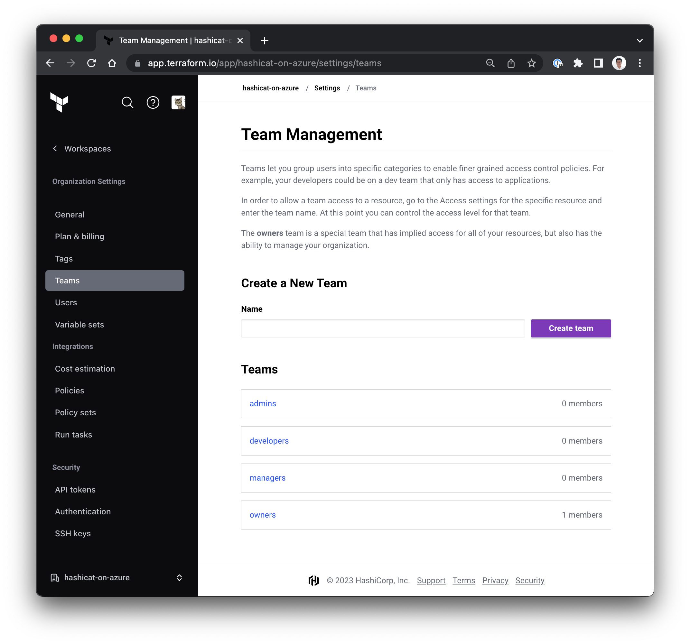

<style>
  v {
    display: inline-flex;
    color: white;
    background-color: rgb(17, 158, 111);
    align-items: center;
    justify-content: center;
    font-size: 14px;
    padding: 10px;
    border-radius: 2px;
    height: 24px;
  }

  r {
    display: inline-flex;
    color: white;
    background-color: #c73445;
    align-items: center;
    justify-content: center;
    font-size: 14px;
    padding: 10px;
    border-radius: 2px;
    height: 24px;
  }

  m {
    display: inline-flex;
    color: white;
    background-color: #584ED5;
    align-items: center;
    justify-content: center;
    font-size: 14px;
    padding: 10px;
    border-radius: 2px;
    height: 24px;
  }

  x {
    display: inline-flex;
    border-radius: 5px;
    border: 1px solid rgba(151,159,175,1);
    /* background-color: rgba(151,159,175,1); */
    /* background-color: rgba(30,38,55,1); */
    color: rgba(151,159,175,1);
    padding: 2px 10px 2px 10px;
    font-size: 14px;
    letter-spacing: 1.2px;
    align-items: center;
    justify-content: center;
    height: 24px;
  }

  t {
    display: inline-flex;
    border-radius: 5px;
    background-color: rgba(30,38,55,1);
    color: rgba(151,159,175,1);
    padding: 2px 10px 2px 5px;
    font-size: 14px;
    letter-spacing: 1.2px;
    align-items: center;
    justify-content: center;
    height: 24px;
  }

  t > a img {
    display: inline-block;
  }
</style>

The purpose of this challenge is to create an access strategy with Team Management and multiple levels of privileges to your workspaces. The following table reflects the desired alignment.

|    Team    | Grants | Members |
| :--------: | :----: | :-----: |
|   admins   | admin  |  Lars   |
| developers | write  |  Aisha  |
|  managers  |  read  |  Hiro   |

- With Team Management you can invite other users to collaborate on code changes, approvals, and Terraform runs.

- If you are on an instructor-led training, you can invite your fellow students to your Terraform Cloud organization and place them on your teams, using the email address attached to their Terraform Cloud account.

- In the <t>Terminal</t> tab, configure your teams, workspace permissions and users with the following:

```bash
cd /root/terraform-cloud

# 1. Create admin, developers and
#    managers teams.
# 2. Align teams to workspace permissions
# 3. Invite individual to teams
terraform apply -auto-approve


```

1- Team Management
===
Teams let you group users into specific categories to enable finer grained access control policies.

- On the Terraform Cloud portal, navigate to <x>Settings</x>-<x>Teams</x>. Please see the example image below.



- Review each of your teams and their assigned Organization Access.

- Use the <t>Code Editor</t> tab and open the <t>terraform-cloud</t> folder. Observe the updates to the file <t>main.tf</t> and review the assignment for your teams (Lines 118-161).

2- Workspace Permissions
===
Terraform Cloud's access model is team-based. There are two ways to choose which permissions a given team has on a workspace: fixed permission sets, and custom permissions.

- On the Terraform Cloud portal, navigate to <x>Projects & workspaces</x>-<x>[[ Instruqt-Var key="TF_WORKSPACE" hostname="workstation" ]]</x>-<x>Settings</x>-<x>Team Access</x>. Please see the example image below.


- Fixed permission sets are bundles of specific permissions on a workspace, designed for basic patterns of delegated access.

- Use Edit Permissions to review the permissions assigned for each team on the hashicat-azure workspace.

- Use the <t>Code Editor</t> tab and open the <t>terraform-cloud</t> folder. Observe the updates to the file <t>main.tf</t> and review the association between the hashicat-azure workspace and your teams (Lines 162-218).

3- Assign Users
===
User accounts belong to individual people. Each user can be part of one or more teams, which are granted permissions on workspaces within an organization. A user can be a member of multiple organizations.

- On the Terraform Cloud portal, navigate to <x>Settings</x>-<x>Users</x>-<x>Invited</x>. Please see the example image below.


- When a user sends you an invitation to join an existing Terraform Cloud organization, the email includes a sign-up link.

- With existing accounts, you can automatically join that organization and can begin using Terraform Cloud.

- Use the <t>Code Editor</t> tab and open the <t>terraform-cloud</t> folder. Observe the updates to the file <t>main.tf</t> and review how users invited to an organization and added to a team (Lines 220-261).

---
Excellent work. You have a foundational access strategy for teams, workspaces and users. You can write the following notes in your report:

1. Team Management is configured with appropriate assignments for TFC admins, developers and managers. The next step is to configure SSO and map TFC teams to ACME teams. Then we need to configure 2FA to comply with corporate security policies.

2. Workspace permission grants are aligned with TFC Teams based on specific roles, not individual identities.

3. Users can join the organization with their corporate account. Admins can grant team privileges manually or through automated utilities triggered by onboarding workflows.

Send your report to Hiro with the <v>Check</v> button below.
